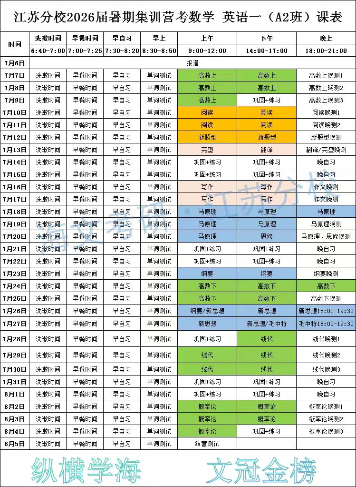

# 25考研-目录页

我该如何规划我的宏观计划以及具体时间？思考之后，我将按照 进化方法论（顶层设计）-> 宏微观安排（具体落实）的不变方法论进行整体微观统筹。

## 进化方法论

1. 关于不变方法论

    这是一个关于如何实现一段时间内的学习目标的不变的方法论。

    （1）进化方法论（顶层设计）：基于我将要实现的学习目标，将不断涌现出来的可能可行的方法记录下来，并等待付诸实践；

    （2）宏微观安排（具体落实）：宏观上，将实现目标所需要的 时间/方法 阶段论；微观上，基于进化方法论，形成能够体现方法论精神的各项任务；这分为两方面：1.生成当前阶段需要完成的任务；2.按照阶段性任务，对每天的时间进行规划，应该做什么；3.每隔一段时间检查，自己是否对所有的任务都有时间倾斜。

2. 学习目标：考研上岸 -> 指标化：政治70分，英语80分，数学130分，普物130分；总分410分/500分

3. 关于学习目标。学习目标的制定最好能够指标量化，或者细化。

4. 阶段论

    （1）3-6月第一阶段：预热

        夯实基础，普物、量子我分模块攻破，完成80%习题；
        每日完成词汇背诵和政治考点熟悉；
        量化考察：专业课刷题量达到80%，进入下一阶段；
        监督机制：每周刷题量、错题本更新公式

    （2）7-8月第二阶段：集训公共课

        政治70分

        英语80分

        数学130分

        普物看看就好

    （3）8-9月第三阶段：上班专业课

5. 时间规划方法论：

    （1）留有空闲

        如果完成一件任务的最佳时间是10天后，将计划结束时间放到9天后；
        如果完成这个任务的时间计划是在10点前，计划在9点完成这个计划

    （2）准确评估

        根据量级：
        将完成一件任务的时间从 x 天 准确评估 到 x' 小时
        将以 x 小时规划的时间 准确评估 到 x' 分钟

    （3）减法

        做好一个任务规划后，去除1个最没必要的任务，保留转化率最高的计划

    （4）习惯化

        将“习惯在某个时间做的任务”计划在这个时间段内

    （5）减小阻力

    （6）深度学习

        不断完善和发展，多进行思考，提高产出，避免无效输入

    （7）一些经验

        将考研相关的事情放到图书馆、教室做，课堂、作业、科研放到寝室零碎时间做

6. 关于任务生成

    可以按照这样的思路进行任务生成：

    （1）连续型：每天都做一点，就可以很好地完成

    （2）离散型：投入一段时间进行密集型攻克就可完成

    可以按照另外的思路进行任务生成：有哪几个科目，每个科目分别需要做什么？

    对英语进行思考：英语分为阅读-翻译-写作，每个题型有什么方法提高？

## 宏微观安排

### 第二阶段

1. 课表：

    

2. 任务生成

    （1）英语

        阅读 - 1）背单词；2）每次有机会做一套英语阅读，都要进行精析，将 生词、写作同义替换、阅读同义替换、题型 进行4维度剖析

        写作 - 1）每天背写作词汇，以及范文；2）对每个应用文类型、议论文主题都有一个框架；3）形成一个通用高分框架（词汇、语法、句式）

        **连续型：每天背单词，并且将当天生词加入到小单词册里；学烦了，就练字，练英文字体**

    （2）数学

        第一遍阶段 - 1）在老师上课前预习，形成基本框架；2）形成完整的高数笔记

        第二遍阶段 - 3）形成题型认知与解题方法；4）形成珍贵的错题本

        老师：数学每天做10道题，不管什么题

        **无连续型**

    （3）政治

        该学学，无连续型

<!-- ## 第四轮：11.12 - 12.1

1. 目标：过完所有知识

    - 政治：冲刺课程（所有知识点）+二刷

    - 英语：每天刷套卷，整理真题词汇

    - 普物：力热光电过一遍

    - 量子：所有知识点过一遍

2. 重点：普物、量子

3. 时间规划：

    - 早上：先读记一遍政治知识，再读记一遍整理单词，做量子力学

    - 下午：做英语套卷 + 普通物理

    - 晚上：看政治冲刺课程，整理真题词汇

## 第三轮：10.1 - 11.1

目标：完成政治1000题第一轮（还剩8*2 h） + 英语选择题（一年 2h * 20年） + 量子力学（一天10题 1.5h + 整理30min） + 普通物理（一天10题 1.5 h + 整理30min） 物理穿插真题

每天投入8h于考研

- 每天完成任务：英语选择题（2h） + 量子力学（2h） + 普通物理（2h） 物理穿插真题

- 隔天完成任务：政治1000题（2h） - 16天完成

## 第二轮：9.1 - 9.10

| 学科  | 任务名称           | 内容               | 时间             | 时间段     | 状态   |
|-------|--------------------|--------------------|------------------|------------|--------|
| 英语  | 背单词         | 背新词：超低频词一页+加分宝 | 10天 9.1-9.10    | 上午    | 🟨 完成    |
|       |                    |        搞定中频词            |                  |    上午+晚上     | 🟨 完成   |
|       |                    |        复习低频词            |                  |    上午+晚上     | 🟨 完成   |
|       | 方法论             | 所有题型方法论     | 10天 8.1-8.10    | 下午 1 h   | 🟨 完成    |
|       | 刷题         | 每天刷一套题     | 持续 10 天       | 晚上 3 h  | 🟨 完成    |
|       | 10大范文         | 每天背一个范文     | 持续 10 天       | 早上 0.5 h  | 🟨 完成    |
|       |          |      | 持续  天       | 睡前 0.5 h  | 🟨 完成    |
|       | 练字-英语         | 每天一页     | 任何时候       | 每天 0.5 h | 🟨 完成    |
| 政治  | 刷题 + 对答案 + 看讲解视频 + 总结知识导图              | 知识               |  10天         |      上午 1.5h      | 🟨 完成    |
|    | 每一篇结束后二刷             |               |           |           | 🟨 完成    |
| 其他  | 整理               | 晚上               |                  |            | 🟨 完成    |

1. 搞定中频词：早上创建新记忆曲线，并复习当天的记忆计划

2. 复习低频词：在乐词上将低频词（Unit 1-7）过完，将生词收集为第三轮复习词

## 第一轮：8.01 - 8.31

| 学科  | 任务名称           | 内容               | 时间             | 时间段     | 状态   |
|-------|--------------------|--------------------|------------------|------------|--------|
| 英语  | 核心词第一轮         | 每天 1 unit + 复习之前 | 21天 8.1-8.21    | 上午 1 h（先10min复习之前，后50min新unit）   | 🟨 完成    |
|       |                    |                    |                  | 晚上 0.5 h（检测法） | 🟨 完成   |
|       | 方法论             | 所有题型方法论     | 10天 8.1-8.10    | 下午 1 h   | 🟨 完成    |
|       | 刷题         | 每天刷一套题     | 持续 10 天       | 晚上 3 h  | 🟨 完成    |
|       | 10大范文         | 每天背一个范文     | 持续 10 天       | 早上 0.5 h  | 🟨 完成    |
|       |          |      | 持续  天       | 睡前 0.5 h  | 🟨 完成    |
|       | 练字-英语         | 每天一页     | 任何时候       | 每天 0.5 h | 🟨 完成    |
| 政治  | 马原               | 知识               |  10天         |      上午 1.5h      | 🟨 完成    |
|       |  史纲     | 知识点     | 10天       | 下午 1.5 h | 🟨 完成    |
| 其他  | 整理               | 晚上               |                  |            | 🟨 完成    | -->
