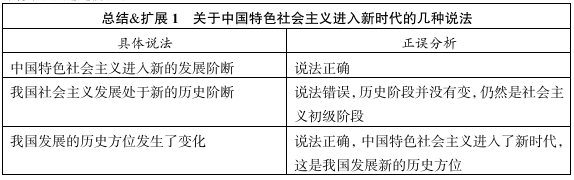
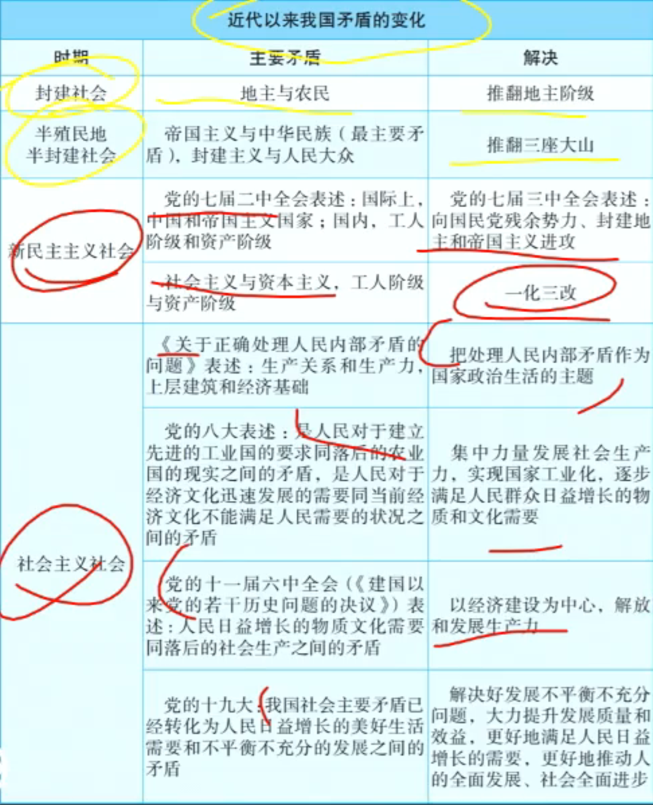
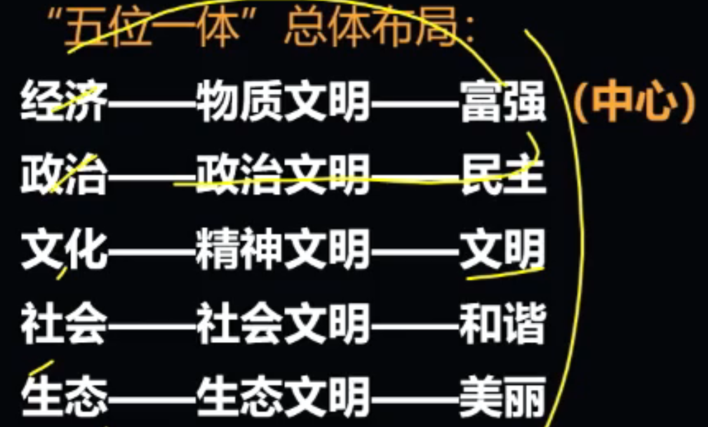

# 第一章 新时代坚持和发展中国特色社会主义

## 考点1：中国特色社会主义概念

方向决定道路，道路决定命运

1. 中特 基本概念

    - 中特是历史和人民的选择

    - 中特是社会主义而不是其他什么主义

    - 坚定 **四个自信**：道路自信、理论自信、制度自信、文化自信

        改革开放以来我们取得一切成绩和进步的根本原因，归结起来就是：

        1. 开辟了中国特色社会主义道路
    
        2. 形成了中国特色社会主义理论体系
        
        3. 确立了中国特色社会主义制度

        4. 发展了中国特色社会主义文化。
        
        其中
        
        1. 道路是实现途径
        
        2. 理论体系是行动指南
        
        3. 制度是根本保障
        
        4. 文化是精神力量
        
        四者统一于中国特色社会主义伟大实践。 

## 考点2：中特进入新时代

1. 新时代的含义

    新的历史方位

2. 进入新时代的意义（十九大表述）

    （1）从中华民族复兴的历史进程看：站起来、富起来到强起来的伟大飞跃

    （2）从科学社会主义发展进程看：伟大旗帜

    （3）从人类文明进程看：为解决人类问题贡献了中国智慧和中国方案

3. 新时代的变化

    （1）主要矛盾

    （2）主要任务
    
    （3）中国和世界关系

    注意：新时代中国的基本国情仍然没变，还是社会主义初级阶段。

4. 新时代的矛盾

    1981十一届六中全会：人民日益增长的物质文化需要同落后的社会生产之间的矛盾

    十九大：人民日益增长的美好生活需要和不平衡不充分的发展之间的矛盾

    主要方面：不平衡不充分发展

5. 两个没有变

    （1）没有改变我国社会主义处于初级阶段的历史阶段

    （2）我国仍处于并长期处于社会主义初级阶段的基本国情没有变

    （3）我国是世界上最大发展中国家的国际地位没变

## 考点3：新时代如何坚持中特

1. 贯彻党的基本理论、基本路线、基本方略

    - 基本理论：马克思主义科学理论 - 行动指南

    - 基本路线：领导和团结全国各族人民，以经济建设为中心，坚持四项基本原则，坚持改革开放，自力更生，艰苦创业，为把我国建设成为富强民主文明和谐美丽的社会主义现代化强国而奋斗 - 国家的生命线、人民的幸福线

    - 基本方略：十四个坚持

2. 统筹推进“五位一体”总体布局和协调推进“四个全面”战略布局

    - 五位一体 总体布局：

        

    - 四个全面 战略布局：

        全面建设社会主义现代化国家 - 战略目标、引领地位

        全面深化改革、全面依法治国、全面从严治党 - 重要保障

3. 推动中国特色社会主义不断开拓前进