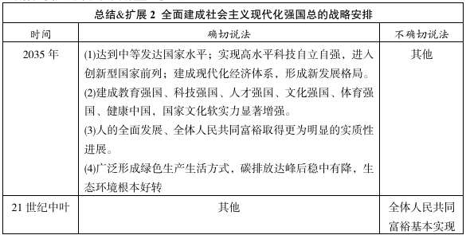
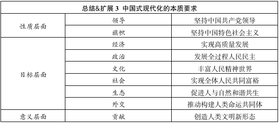

# 第二章 以中国式现代化全面推进中华民族伟大复兴

## 考点1：中国梦

1. 中国梦：实现中华民族伟大复兴

    - 实现中华民族伟大复兴是近代以来最伟大的梦想

    - 全面建成小康社会是关键一步

    - 全面建成社会主义现代化强国，分两步走：

        （1）第一步，基本实现社会主义现代化。到2035年

        （2）第二步，到21世纪中叶，把我国建设成为富强民主文明和谐美丽的社会主义现代化强国

    

## 考点2：中国式现代化

1. 中国式现代化是强国建设、民族复兴的唯一正确道路

2. 中国式现代化是中国共产党领导人民长期探索和实践的重大成果

    （1）孙中山的《建国方略》：近代中国谋求现代化的第一份蓝图

    （2）建立新中国：创造根本社会条件

    （3）社会主义革命建设时期：奠定根本政治前提和制度基础，提供宝贵经验、理论准备、物质基础

    （4）改革开放：开启中国式现代化新的长征

    （5）新时代：

    - 认识上深化：习思想 - 提供了 **根本遵循**

    - 战略上完善：五位一体、四个全面战略布局 - 提供坚实战略支撑

    - 实践上丰富：一系列成果提供制度保证、物质基础、精神力量

3. 中国式现代化的中国特色

    （1）是人口规模巨大的现代化

    （2）是全体人民共同富裕的现代化 - **显著标志**

    （3）是物质文明和精神文明相协调的现代化 - **根本要求**

    （4）是人与自然和谐共生的现代化

    （5）走和平发展道路的现代化

4. 中国式现代化的本质要求

    

    - 对中国式现代化的定性：中国式现代化是中国共产党领导的社会主义现代化，是管总、根本的

5. 中国式现代化的世界意义

    中国式现代化创造了人类文明新形态：

    （1）提供了一种全新的现代化模式

    （2）是对西方式现代化理论和实践的重大超越

    （3）为广大发展中国家提供了全新选择

## 考点3：如何推进

1. 重大原则

    （2）坚持和加强党的全面领导（**领导力量**）

    （2）坚持中国特色社会主义道路（**旗帜方向**）

    （3）坚持以人民为中心的发展思想（**价值立场**） 

    （4）坚持深化改革开放（**根本动力**）

    （5）坚持发扬斗争精神（**精神状态**）

2. 重大关系

    （1）正确处理顶层设计与实践探索的关系

    （2）正确处理战略与策略的关系

    （3）守正与创新

    （4）效率与公平

    （5）活力与秩序

    （6）自立自强与对外开放。**独立自主是中华民族精神之魂，是我们立党立国的重要原则**

