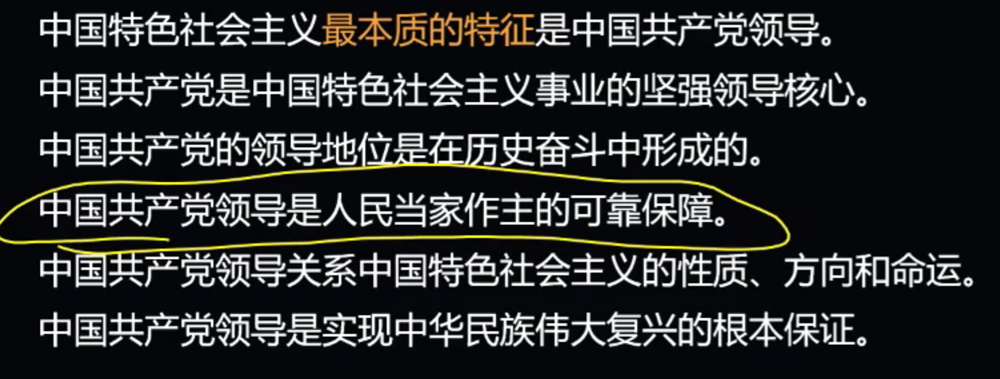

# 第三章 坚持党的全面领导

## 考点1：中特最本质的特征

1. 中国最大的国情就是中国共产党的领导 

    

2. 中国共产党领导是中国特色社会主义制度的最大优势

3. 加强党的全面领导为新时代党和国家事业发展提供了坚强保证

## 考点2：坚持党对一切工作的领导

1. 中国共产党是最高政治领导力量

2. 党的领导是全面的、系统的、整体的

3. 维护党中央权威和集中统一领导

## 考点3：健全和完善党的领导制度体系

1. 党的领导制度是我国根本领导制度

2. 健全党中央对重大工作的领导体制

3. 健全党的全面领导制度