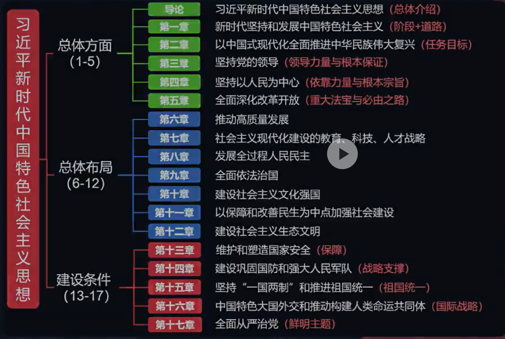

# 序言 - 习近平新时代中国特色社会主义思想概论

最重要的：书本之外，新开的会议，新推出的政策

## 学科特点

1. 内容特点：有难度，难在复习方法；找准方向，复习简单

2. 命题特点

    - 总分：22%

    - 选择题：
    
        重点知识点复现多

        与时政牵连多
        
        超纲理解类题目广泛存在

    > 按照真题看，并不是考固定搭配和帽子

    - 分析题：

        紧跟时政，12月再背就行

## 逻辑构架

