# 第一章 进入近代后中华民族的磨难与抗争

旧民主主义革命时期 考点：

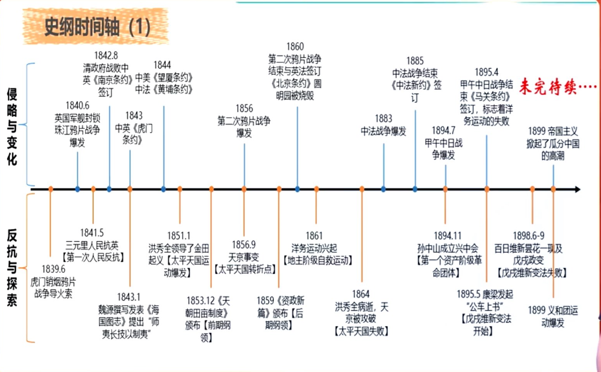

## 侵略与变化

### 考点1：鸦片战争

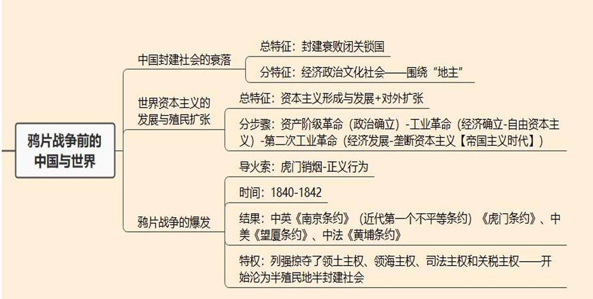

1.1 ==**中国封建社会的衰落**==：封建社会的 - 经济、政治、社会、思想文化

1.2 鸦片战争：导火索、爆发/结束标志、不平等条约、主权沦丧、鸦片战争的影响

### 考点2：四大侵略 + 考点3：四大变化

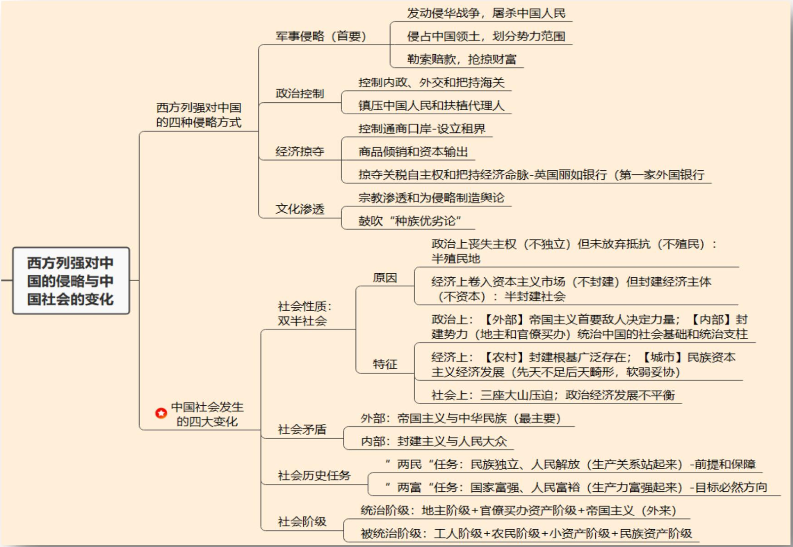

2 四种侵略方式

==**3 四大变化**==：近代中国的 - ==**社会性质【半殖民+半封建】**==、社会矛盾、历史任务、==**社会阶级**==

## 反抗与探索

### 考点4：概述 - 民族意识的觉醒

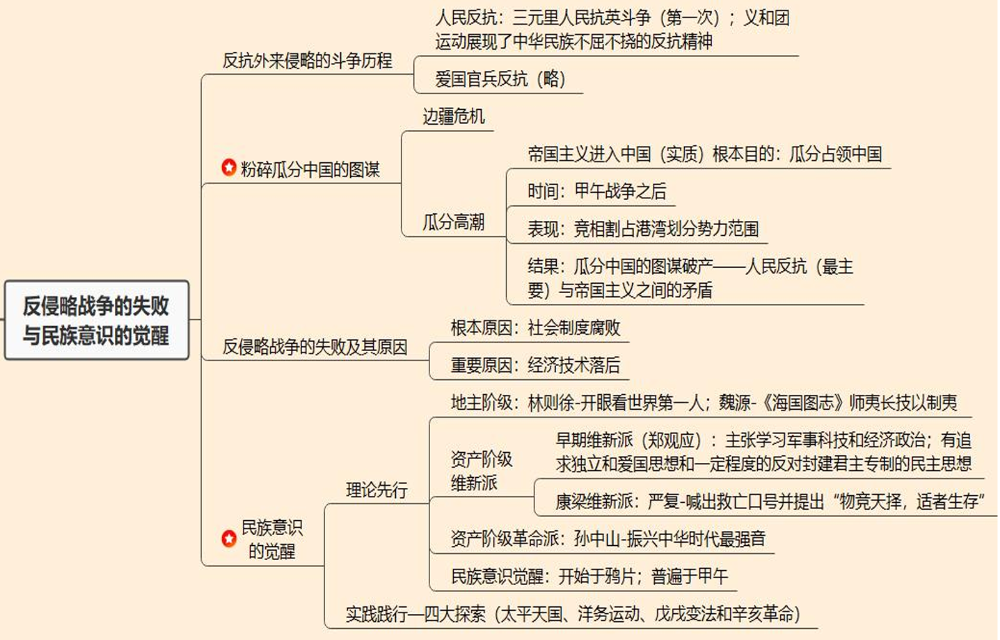

4.1 反抗侵略斗争：三元里人民抗英斗争、义和团

4.2 边疆危机与瓜分高潮：甲午战争、==**瓜分危机**==

4.3 民族意识的觉醒：理论【《海国图志》、维新派（早期派、康梁派）、资产阶级革命派】+ 实践【太平天国、洋务运动、戊戌变法、辛亥革命】、反侵略斗争失败原因

### 考点5：太平天国

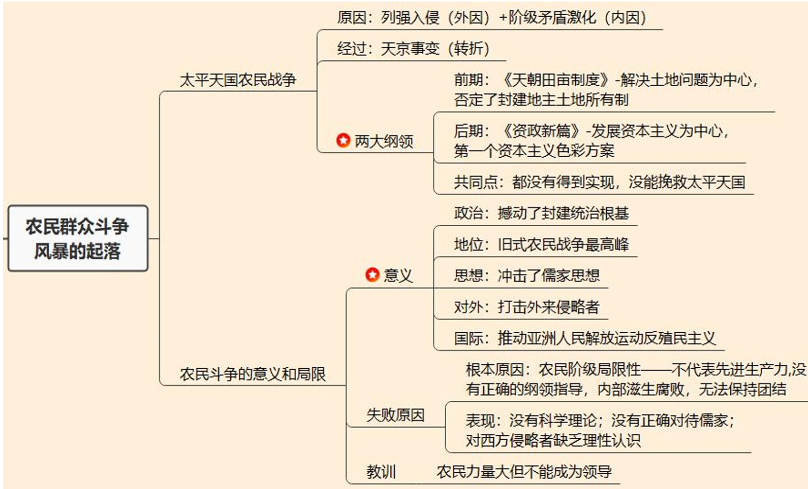

5.1 太平天国事件本身：原因、转折点【天京事变】

5.2 太平天国两大纲领：《天朝田亩制度》、《资政新篇》

5.3 农民斗争的意义和局限：意义、失败原因

### 考点6：洋务运动

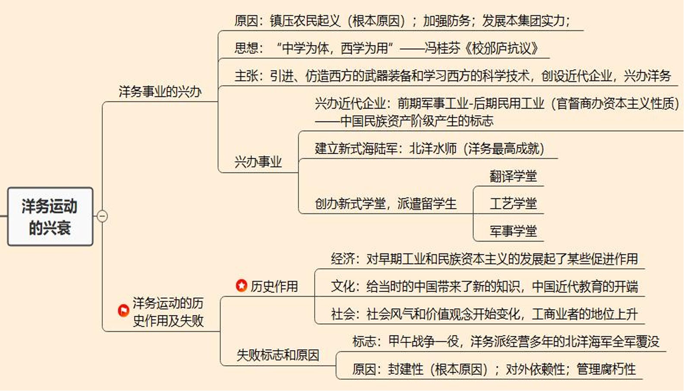

6.1 ==**洋务运动本身：原因、思想纲领、主张、目标与口号**==

6.2 洋务事业

6.3 失败与历史作用：失败标志、失败原因、历史作用

### 考点7：维新运动 戊戌变法

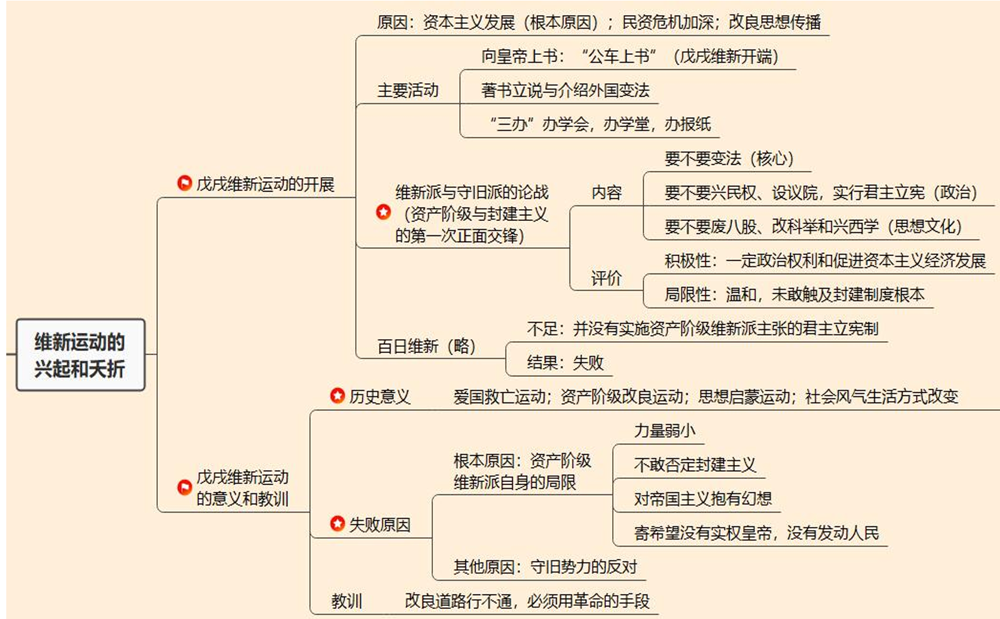

7.1 戊戌维新：背景、==**戊戌维新运动**==、维新派与洋务派（守旧派）的论战

7.2 百日维新：结果、不足、评价

7.3 意义和教训：失败原因、意义和教训

### 考点8：辛亥革命

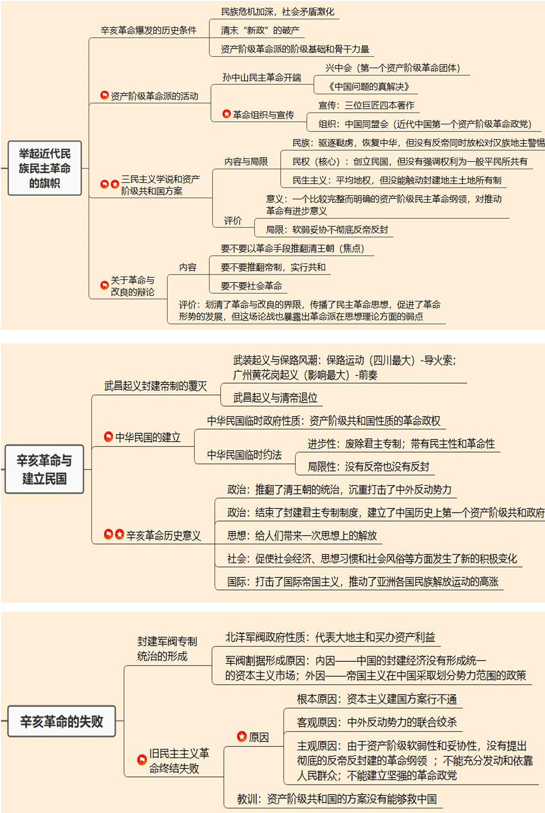

8.1 近代民族主义革命：辛亥革命爆发的历史条件、资产阶级革命派、三民主义、革命派与改良派的辩论

8.2 辛亥革命：武昌起义、中国民国建立、辛亥革命的历史意义

8.3 辛亥革命失败：封建军阀专制统治、旧民主主义革命失败原因

## 第一节 鸦片战争前[5]

1. ==**中国封建社会的主要特点 - 中国封建社会的衰落**==

    - 经济： **封建地主所有制经济** 占主导地位  
    地主：土地所有者  
    农民：自给自足的自然经济

    - 政治：高度中央集权的 **封建君主专制制度**（封建帝制）  
    皇帝：地主的代表（最大的地主）  
    权力：至高无上

    - 社会：族权和政权相结合的 **封建宗法等级制度**  
    政权：县以上，皇帝直接委派  
    族权：县以下，家族长直接管理

    - 思想文化：儒家思想为核心，**外儒内法**  
    对外宣传：儒家思想“三纲五常”  
    对内统治：法家思想“严刑酷法”

    - 总结：维护地主的利益

    清朝中叶，道光年间，随着长期闭关锁国，故步自封，中国逐步落后于西方。

2. 资本世界发展的三部曲 - 世界资本主义的发展与殖民扩张

    1. 政治制度确立：1640英国资产阶级革命

    2. 经济制度确立：1760-1820工业革命（自由资本主义）

        > 结果：新资本主义制度确立，生产力高速发展，要求对外扩张，倾销商品（商品输出：打开大门）

    3. 经济制度发展：1870第二次工业革命(垄断资本主义/帝国主义时代)

        > 结果：生产力进一步发展，寻求更大的殖民扩张（资本输出：瓜分世界）

3. 鸦片战争的爆发

    - **导火索：1839.6 虎门销烟**

    - **正式爆发：1840.6 英国侵华舰队封锁珠江海口和广东海面**

    - 结束标志：1842.8 清政府投降

4. 鸦片战争的结果

    - 不平等条约的签订

        > 会考哪些条约，哪些国家

        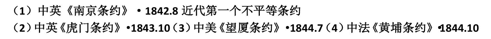
    
    - 一系列主权的沦丧：**领土领海司法关税**

        > 会考有哪些主权沦丧了

        1. **领土主权：割地赔款**

        2. **领海主权：内河航运权**

        3. **司法主权：领事裁判权**

        4. **关税主权：协定关税**

    - 结果：中国的社会性质开始发生质的变化，中国由完整独立的封建社会逐步变成了 **半殖民地半封建国家** ，成为 **中国近代史的起点**。

## 第二节 侵略与变化[80]

#### 1 四大侵略

1. **军事侵略**： **首先和主要的侵略方式** 。表现：

    （1）发动侵略战争，屠杀中国人民

    （2）侵占中国领土，划分势力范围

    （3）勒索赔款，抢掠财富

2. **政治控制**：把中国当权者变成自己的 **代理人和驯服工具** （目的）。表现：

    （1）控制中国内政、外交：英国人长期把持中国海关

    （2）镇压中国人民的反抗

    （3）扶植、收买代理人

3. **经济控制**：卷入资本主义市场，成为资产主义经济附庸。 表现：

    （1）控制中国的租界口岸：设立租界

    （2）剥夺中国的关税自主权

    （3）实行商品倾销和资本输出

    （4）操纵中国的经济命脉：英国丽如银行（第一家外国银行）

    （5）勒索战争赔款（军事侵略+经济掠夺）

4. **文化渗透**：美化侵略摧毁中国扽的民族自尊心和自信心。 表现：

    （1）披着宗教外衣，进行侵略活动

    （2）为侵略中国制造舆论，大肆宣扬“种族优劣论”

> 1.知道哪四大侵略方式  
> 2.知道各侵略方式对应的解释项和表现

- 总结：

    **资本-帝国主义侵略中国的最终目的：将中国变成其政治上的殖民地或势力范围，经济上的附庸。**

    **资本-帝国主义侵略是造成中国近代一切贫穷落后的根源**

#### 2 四大变化

1. ==**社会性质（首要变化） - 半殖民地半封建社会**==

    - 政治上：半殖民地

        （1）不是独立国家：丧失大量主权和领土，不再主权独立

        （2）不是殖民地：
    
        1. 中国自古是一个统一的国家，有形式上统一的中央政权；
        
        2. 人民不屈不挠的反抗；

        3. 帝国主义之间的矛盾。

    - 经济上：半封建社会

        （1）不再是封建地主土地所有制+自然经济：
    
        1. 被卷入资本主义经济体系，出现了商品经济；

        2. 岐然经济逐步解体，出现了资本家

        （2）不是资本主义社会：封建经济仍然是经济基础，没有成为资本主义社会

    - 半殖民地半封建社会特征

        1. 政治上

            （1）外部：资本-帝国主义 - 日益成为支配中国的决定性力量

            （2）内部：封建势力 - 奴役中国人民的社会基础和统治支柱

            （3）三座大山：资本-帝国主义、地主和官僚买办成为奴役和压迫中国人民的 **三座大山**

        2. 经济上
        
            （1）农村：自然经济遭到破坏，但封建根基仍然存在

            （2）城市：民族资本主义经济得到发展，但软弱不足

            总结：经济上要废除封建地主土地所有制，资本主义经济弱小，资产阶级软弱无法担负起革命领导重任

        3. 社会上

            （1）被压迫者：中国无产阶级、工人阶级 与 压迫者：帝国主义-封建主义压迫（三座大山）

            > 推论：工人阶级受压迫最深，革命性最强，应该成为革命的领导。工人阶级是最先进的阶级

            （2）多种因素导致政治、经济和文化发展极不平衡

            多种因素：内-封建经济+外-帝国主义干预 导致军阀割据

            军阀割据导致政治经济文化发展不平衡

            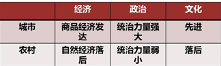

            > 推论：走农村包围城市，武装夺取政权的革命道路

            注：任意一个小点都可能考选择题

2. 社会主要矛盾的变化

    （1）外部：帝国主义和中华民族的矛盾（主要矛盾） - 政治半殖民

    （2）内部：**封建主义** 和 **人民大众** 的矛盾 - 经济半封建

    农村：地主 vs 农民

    城市：官僚买办 vs 工人

3. 历史任务的变化

    （1）两“民”任务：民族独立、人民解放 "站起来" - 前提和基础

    （2）两“富”任务：国家富强、人民富裕 "富起来" - 目的和要求

    > 注意两大任务的关系

4. ==**社会阶级关系的变动**==

    - 7类人：

        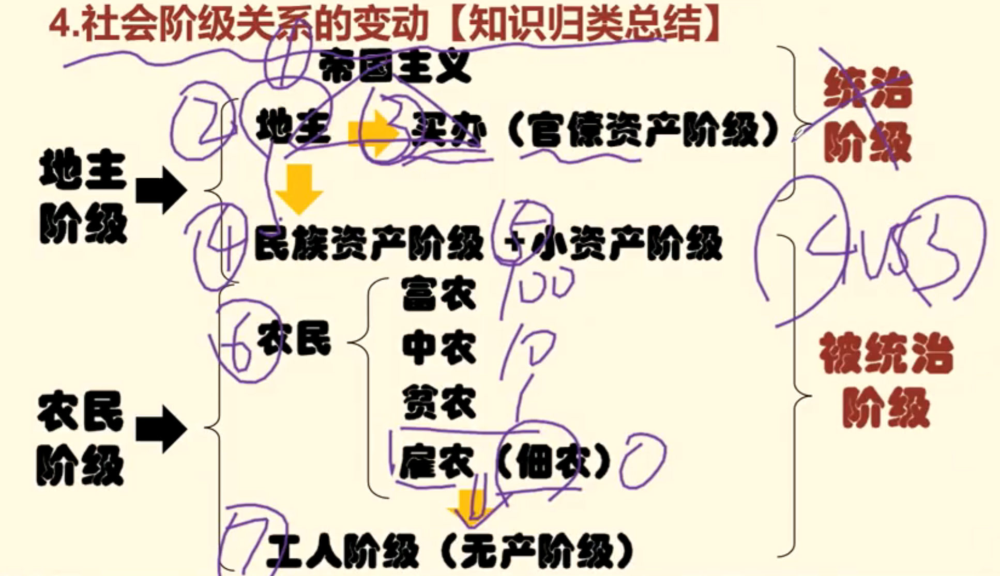{:height="70%" width="70%"}

        （1）解释民族资产阶级的软弱性

        （2）解释为什么工人阶级是受压迫最深的阶级，是最先进的阶级

        

    - 七类人和我们的态度：

        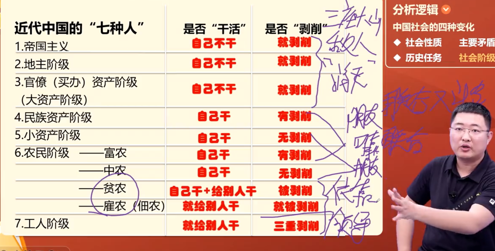{:height="70%" width="70%"}

        1-2-3 ： 三座大山，需要消灭

        4-5-6(1) ： 朋友，联合和又斗争限制

        5-6(1)-6(2) ： 可靠的朋友，联合

        6(3)-6(4)-7 ： 我们的依靠，领导

        （1）三座大山：帝国主义、地主阶级、官僚买办资产阶级

        （2）资产阶级：官僚买办资产阶级、民族资产阶级。 小资产阶级不是资产阶级！！！

        （3）无产阶级

    - 补充总结

        1. **帝国主义是造成中国一切贫穷落后的总根源，是首要敌人，是半殖民地半封建社会中国的实际统治者**

        2. **封建地主阶级（农村）和官僚买办阶级（城市）是帝国主义统治中国的社会基础和通知支柱**

        3. 符合资产阶级属性（带资本+剥削工人）的是：2-3，官僚买办资产阶级和民族资产阶级

        4. 近代新兴的两个阶级：民族资产阶级 和 工人阶级（革命领导者-最革命的阶级）。工人阶级产生早于民族资产阶级[中国特色]

        5. 要区分对待农民阶级（革命主力军）：对富农既要联合又要斗争，对中农要联合，对贫农和雇农要紧紧依靠

    

        
<strong>知识总结（归类补充）：何为中国近代史？</strong>

        
在资本-帝国主义的侵略之下，在半殖民地-半封建社会的国情之上，为了解决帝国主义-中华民族与封建主义-人民大众的基本矛盾，为了实现民族独立、人民解放与国家繁荣富强、人民共同富裕的两大历史人物，中国社会的各个阶级自发进行的 抗争史、探索史、革命史。

        

            
        

        
这个过程的两条线索是侵略与变化，反抗与探索

        
这个过程证明了：马克思主义好 中国共产党好 社会主义好

    

## 第三节 反抗与探索[15]

### 1 反抗外来侵略的斗争历程

1. 人民群众的反抗斗争

    （1）三元里抗英斗争： **第一次大规模反侵略斗争**

    （2）太平天国：重创“常胜军”、“长捷军”

    （3）义和团：抗击八国联军

2. 爱国官兵（略）

    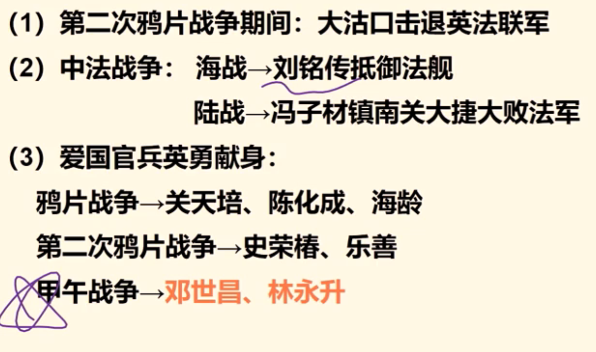{:height="70%" width="70%"}

    甲午战争130周年

### 2 粉碎瓜分中国的图谋

1. 边疆危机

    1870年之后（第二次工业革命），帝国主义侵略中国的最终目的是要瓜分中国、灭绝中国

2. ==**列强瓜分危机**==

    > 甲午战争130周年

    - 甲午战争

        时间：1894-1895

        结果：清政府战败，签署《马关条约》

        影响（重要）：

        - 日本：割让澎湖列岛、台湾给日本，赔偿白银2亿多两

        - 清政府： **洋务运动失败**（清政府近代化）

        - 帝国主义：**掀起帝国主义瓜分中国的高潮**

        - 中国：中华民族普遍民族意识觉醒；提出了“救亡”口号，掀起 **爱国救亡运动**

    - 瓜分高潮

        开始：1894年中日甲午战争后

        表现：德、俄、英、法、日于1898-1899年竞相 **租界港湾和划分势力范围**。

    - **结果：瓜分阴谋破产**

        原因：

        - 根本原因（内因）：

            **中华民族进行的不屈不挠的反侵略斗争** （义和团）

        - 重要原因（外因）：

            帝国主义列强之间的矛盾和相互制约

### 3 反侵略战争失败

1. 反侵略斗争的结果及失败的原因

    结果：屡战屡败

    原因：

    - **根本原因**：社会制度腐败

    - 重要原因：经济技术落后

### 4 民族意识的觉醒

1. ==**学习之风的开始和新思想的提出**==

    （1）地主阶级（开明的士大夫）

    - 林则徐：**睁眼看世界第一人**；编成《四洲志》

    - 魏源：在《四洲志》的基础上编写 **《海国图志》，“师夷长技以制夷”**

    （2）民族资产阶级（维新派）

    - 时间：19世纪70年代以后

    - 派别与代表：维新派，王韬、薛福成、马建忠、邓观应

    - 主张：学习西方科学技术，同时学习西方的政治（君主立宪制）、经济学说

        > 不是民主共和国

    - 特点：反对侵略，追求独立爱国，一定程度反对封建君主专制的民族思想，但是自上而下的改革。

2. 救国图存和振兴中华的口号

    - 鸦片战争后（1840） - 少数精英开始又朦胧的民族意识觉醒

    - 甲午战争后（1895） - 全民族开始有普遍的民俗意识的觉醒

    （1）严复：原创《救亡绝论》 - **喊出“救亡”口号**

    翻译《天演论》（进化论） - **“物竞天择”、“适者生存”**
    
    （2）《时局图》：表现了当时面临的瓜分危局

    （3）孙中山：1894年11年创立兴中会； **喊出了“振兴中华”的时代强音**

