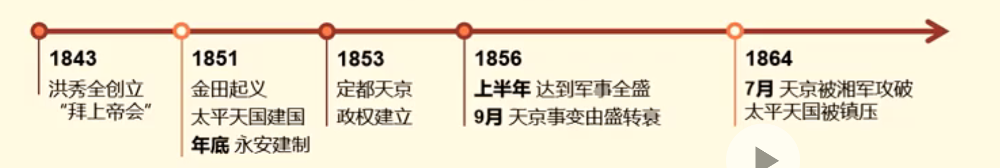

# 第二章 不同社会力量对国家出路的早期探索

## 第一节 太平天国运动的起落

### 1 太平天国

1. 爆发的原因（背景）

    （1）内因：清政府加重赋税，导致阶级矛盾激化

    （2）外因：西方列强入侵，导致自然经济解体，大量战争赔款，激化内部矛盾

2. 主要过程

转折点：天京事变由盛转衰

3. 天朝田亩制度和资政新篇

    ==**《天朝田亩制度》**== - 前期

    - **地位：最能体现太平天国社会理想和起义特色的纲领性文件**

    - **原则：“凡天下田，天下人同耕”；以解决土地问题为中心的比较完整的社会改革方案**

    - 目标：“有田同耕，有饭同食，有衣同穿，有钱同使，无处不均匀，无人不饱暖”。 - **简单的平均主义**

    - 评价：

        1. 进步：以解决土地问题问中心的比较完整的社会改革方案；从根本上否定了封建地主的土地所有制（第一个）

        2. 局限：没有超出小生产者的狭隘视界，具有不切实际的空想的性质，并未付诸实行。

    ==**《资政新篇》**== - 后期

    - 地位：后期纲领性文件

    - **原则：发展资本主义**（第一个）

    - 评价：

        1. 进步：具有鲜明资本主义色彩的方案，代表历史发展的方向

        2. 局限：限于当时历史条件，未能付诸实施，也没有得到农民的支持

### 2 历史意义和局限

    

        
<strong>历史意义类问题</strong>

        
<strong>对内：唯物史观的分析法</strong>

        
经济基础与上层建筑（经济 政治 文化 社会）

        
<strong>对外：国际地位，世界形势</strong>

    

<space>

    

        
<strong>原因类问题（失败原因）</strong>

        
<strong>内因：根本原因</strong>

        
自己不行：自身阶级/指导思想/纲领等局限性

        
<strong>外因：其影响的原因</strong>

        
别人不让：敌人反对/朋友不支持

        
<strong>原因类问题（成功原因）</strong>

        
<strong>内因：根本原因</strong>

        
自己行：自身阶级/指导思想/纲领等先进性

        
<strong>外因：其影响的原因</strong>

        
别人帮：敌人不反对/朋友支持

    

1. 历史意义

    **对内：**

    （1）政治：沉重打击封建统治阶级，强烈撼动清政府的统治根基

    （2）政治：旧式农民战争的最高峰（思想）

    > 旧式：农民领导的农民战争

    （3）文化：冲击了孔子和儒家经典的正统权威，削弱了封建统治的精神支柱

    **对外：**
    
    （4）国际地位：打击外国侵略势力

    （5）世界形式：鼓舞和推动亚洲民族解放运动

2. 局限

    （1）**阶级局限性（根本原因）：不是新的生产力和生产关系的代表**

    表现在：  
    1. 无法从根本上提出完整正确的政治纲领和社会改革方案  
    2. 腐败滋长  
    3. 无法长期保持团结

    （2）没有科学理论的指导

    （3）未能正确的对待儒学

    （4）对西方侵略者缺乏理性认识

3. 教训

    农民不能担负起领导反帝反封建斗争取得胜利的重任；

    农民阶级使革命的主要力量，主力军。 - 新式农民战争

## 第二节 洋务运动的兴衰

### 1 洋务运动

1. ==**洋务运动**==  

    - **时间：19世纪60-90年代**  
    前期：1861-1870  
    后期：1870-1895

    - 洋务运动的原因：
    
        1. **镇压农民起义 - 首要原因**

        2. 加强防务

        3. 发展本集团实力

    - **人物：地主阶级洋务派官员** 如 奕訢 + 四大臣（曾国藩、李鸿章、左宗棠、张之洞）；

    - **思想：中学为体，西学为用** ——冯桂芬·《校邠庐抗议》+张之洞·《劝学篇》

    - **主张：引进、仿造西方的武器装备和学习西方的科学技术**，创设近代企业，兴办洋务；

    - 性质根本目的： **地主阶级洋务派所发动的，为了维护封建统治的自救运动；**

    - **目标与口号：自强、求富**

2. 洋务事业

    （1）兴办近代企业：（前期）军用工业 -> （后期）民用工业（**官督商办/资本主义性质**）

    （2）建立新式海陆军：福建水师，广东水师，南洋水师和北洋水师（**洋务运动最高成就**）

    （3）创办新式学堂，派遣留学生

    - 新式学堂：翻译学堂、工艺学堂、军事学堂

    - 派遣留学生1872-1875四批留美学生及赴欧留学生

### 2 历史作用与失败

1. 历史作用

    （1）**经济**：集中力量优先发展军事工业，同时发展民用企业， **客观上对早期工业和民族资本主义的发展起了促进作用**

    （2）**文化**：开办新式学堂，派出留学生，给当时的中国带来了新的知识，中国近代教育的开端

    （3）**社会**：社会风气和价值观念开始改变，工商业者的地位上升，有利于资本主义经济发展，也有利于社会风气改变。

2. 失败原因

    - 失败标志：甲午战争，北洋海军全军覆没，标志以“自强”、“求富”为目标的洋务运动失败

    - 失败原因：

    （1）阶级：阶级和指导思想的封建性

    （2）对外具有依赖性，缺乏理性认识

    （3）自己不行：洋务企业自身管理腐朽性

## 第三节 维新运动的兴起和夭折

### 1 戊戌变法

1. 兴起的原因（背景）

    - 经济：中国民族资本主义有了初步发展

    - 政治：内忧外患的冲击和中西文化的碰撞

    - 思想：资产阶级改良思想迅速传播

2. ==**戊戌维新运动**==

    维新四干将“康有为、梁启超、谭嗣同和严复” （身份：民族资产阶级）

    （1）向皇帝上书：“公车上书”（戊戌维新的开端）

    （2）著书立说与介绍外国变法

    （3）三办：

    1. 第一办学会： **强学会、南学会和保国会**

    2. 第二办学堂：万木草堂、时务学堂

    3. 第三办报纸：《时务报》、《国闻报》、《湘报》

3. 维新派与守旧派的论战（维新派与洋务派）

    - 争论问题：

    （1）要不要变法（核心）

    （2）要不要兴民权、设议院，实行君主立宪（政治）
    
    （3）要不要废八股、改科举和兴西学（思想文化）

    - 评价：

    （1）资产阶级思想与封建主义思想的第一次正面交锋

    （2）开阔眼界，解放思想

    （3）西方资产阶级社会政治学说进一步传播

4. 百日维新

    - 时间：1898年 6.11-9.21  
    103天

    - 不足： **并没有实施资产阶级维新派主张的君主立宪制**

    - 结果：失败。光绪皇帝被软禁，维新派被杀害，政策大部分被掀翻

    - 评价：

    （1）积极性：开放一定程度的言论、出版、结社自由，使资产阶级享受一定程度的政治红利，促进资本主义工商业发展

    （2）局限： **并没有触及封建制度的根本**

### 2 意义和教训

1. 意义

    （1）政治： **第一次爱国救亡运动**

    （2）政治：一次资产阶级性质的政治改良运动

    （3）思想：一次思想启蒙运动

    （4）社会：改革社会风气，提出"剪辫易服"倡导"讲文明，重卫生"

2. 失败原因

    **内因**

    （1）阶级：民族资产阶级力量弱小

    （2）纲领：维新派的局限性。表现为：

    1. 不敢否定封建主义

    2. 对帝国主义抱有幻想

    3. 惧怕人民群众，没有发动人民群众，寄希望于没有实权的皇帝

    **外因**

    （3）守旧势力的反对

3. 教训

    改良道路行不通，必须用革命的手段