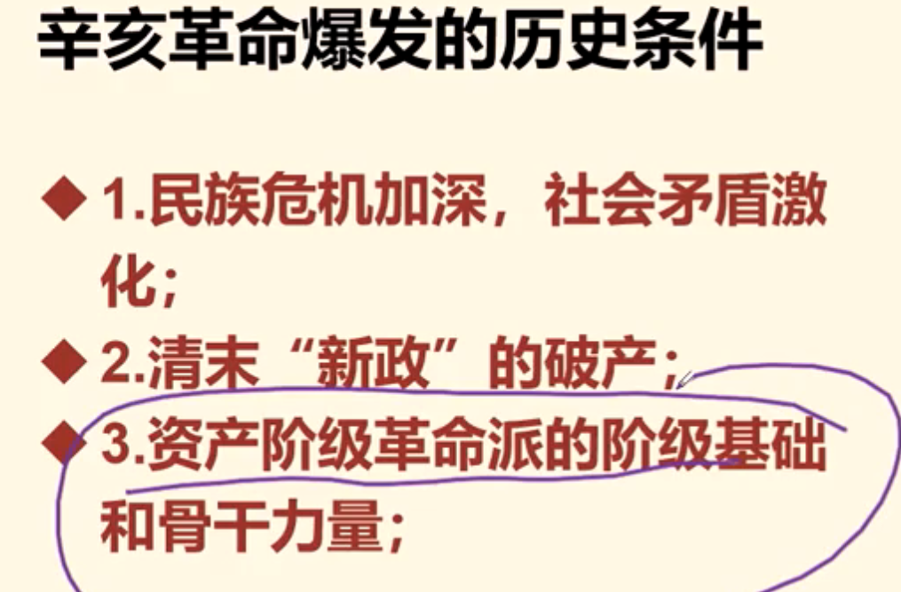
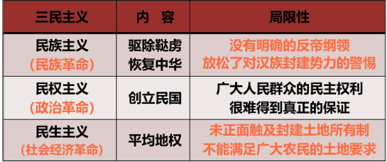
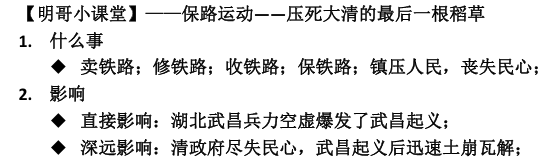
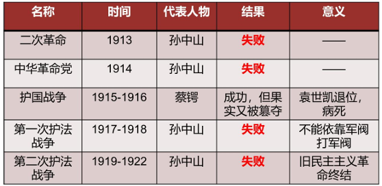

# 第三章 辛亥革命与君主专制制度的终结

## 第一节 背景

### 1 历史条件

1. 民族危机加深，社会矛盾激化

    （1）外患："日俄战争"政府卖国

    （2）内忧：社会矛盾激化，民变四起

2. 清末"新政"的破产

    （1）新政内容

    - 政治：设立商部和学部

    - 经济：奖励工商

    - 文化：废除科举

    - 军事：建立新军

    （2）根本目的： **维护自身阶级统治（反动的封建统治秩序）**

    （3）立宪阴谋三部曲

    - 1906 - "预备仿行宪政"

    - 1908 - 颁布《钦定宪法大纲》

    - 1911 - 皇族内阁成立

3. 资产阶级革命派的阶级基础和骨干力量

    （1）阶级基础：民族资产阶级

    （2）骨干力量：资产阶级和小资产阶级知识分子

**总结 - 辛亥革命爆发的历史条件**

{:height="50%" width="50%"}

### 2 资产阶级革命派

**第一阶段（1894-1904）：孙中山一个人进行革命：举起革命的大旗**

1. 孙中山与资产阶级民主革命的开始

    （1）1894年初，上书李鸿章失败 - 从改革转向革命

    （2）1894年11月，创立兴中会（**第一个资产阶级革命团体**）

    （3）1904年发表《中国问题的真解决》 - **明确武装革命的方式**

**第二阶段（1905-1912）：孙中山与盟友一起进行革命**

2. 资产阶级革命派的宣传与组织工作

    （1）宣传工作 - 三位巨匠四本著作

    章炳麟：《驳康有为论革命书》——论证了革命的必要性；

    邹容：《革命军》——描绘了中华共和国的蓝图，号召青年加入革命军；

    陈天华：《警世钟》《猛回头》——第一次揭示了清政府沦为了“洋人的朝廷”；

    （2）组织工作 - 革命团体与政党

    团体：华兴会、科学补习所、光复会、岳王会

    政党： **中国同盟会（近代中国第一个资产阶级革命政党）** ，标志着中国资产阶级民主革命进入到了新阶段

### 3 三民主义

1. 三民主义内容与局限性

    

2. 评价

    - 进步：一个比较完整而明确的资产阶级民主革命纲领，对推动革命有进步意义

    - 局限：由于其阶级的局限性和软弱性不能提出彻底的反帝反封建的革命纲领

### 4 革命与改良的辩论

1. 时间：1905-1907

2. 论战派别：资产阶级内部两个派别

    革命派 （孙中山） vs 改良派（康有为）

3. 核心问题

    （1）**论战的焦点和核心问题**：要不要以革命手段推翻清王朝 - 民族

    （2）要不要推翻帝制，实行共和 - 民权

    （3）要不要社会革命 - 民生

4. 评价

    - 进步：划清了革命与改良的界限，传播了民主革命思想，促进了革命形势的发展

    - 局限：这场论战也暴露出革命派在思想理论方面的弱点

        民族主义：不敢反帝！

        民权主义：没有强调权力为一般平民所共有！

        民生主义：不反封建地主土地所有制，反对“夺富人之田为己有”！

    

        
<strong>近代"论战"总结</strong>

        
<strong>这张图考了7分了</strong>

        

            
        

    

## 第二节 爆发

### 1 辛亥革命

1. 武装起义与保路运动

    （1）影响最大起义：1911广州黄花岗起义 - 辛亥革命的前奏

    （2）保路运动：使清政府尽失民心，辛亥革命的导火索

    

2. 武昌首义（辛亥革命）与各地响应

    - 封建帝制覆灭：1912年2月12日，清帝退位

    - 结局：政权落到了立宪派或旧官僚、旧军官的手里

    - 原因：资产阶级的两面性（革命性与软弱、妥协性）

### 2 中华民国

1. 中华民国临时政府宣告成立

    - 时间：1912年1月1日，南京

    - 性质：资产阶级共和国性质的革命政权

    - 局限性：同"三民主义"

2. 中华民国临时约法

    - 性质： **第一步具有资产阶级共和国宪法性质的法典**

    - 进步性：

        （1）革命性：废除了两千年来的封建君主专制制度，确认了资产阶级共和国的政治制度

        （2）民主性：规定了一些人民的民主权利 （如请愿、陈诉、考试、选举与被选举等民主权利）

    

        
<strong>中华民国（1912-1949）的三个时期</strong>

        

            
        

    

### 3 辛亥革命的历史意义[主观题考点]

1. 历史意义

    **对内**

    （1）政治：推翻了清王朝的统治，沉重打击了中外反动势力，使中国反动统治势力在政治上乱了阵脚

    （2）政治：结束了2000多年的封建君主专制制度，建立了中国历史上第一个资产阶级共和政府，民主共和观念深入人心

    （3）文化：给人们带来一次思想上的解放

    （4）经济社会：促进社会经济、思想习惯和社会风俗等方面发生了新的积极变化

    **对外**

    （5）在一定程度上打击了帝国主义的侵略势力，推动了亚洲各国民族解放运动的高潮

    **总结**：辛亥革命是资产阶级领导的以反对君主专制制度、建立资产阶级共和国为目的的革命，是一次比较完全意义上的资产阶级民主革命。

## 第三节 失败

### 1 封建军阀专制统治的形成

1. 袁世凯窃国，辛亥革命流产

2. 北洋军阀的专制统治

    - 统治时间：1912年北洋政府建立 - 1928年张学良东北易帜
    
    - **性质：封建的、买办的反动政治武装集团（三座大山的代理人）**

    - 阶级：大地主阶级和买办资本阶级

    - 靠山：外国帝国主义

3. 北洋军阀割据的形成及原因

    - 军阀割据：1916年袁世凯死后，中国陷入了军阀割据的局面

    - 原因

        （1）内因：中国的封建经济没有形成统一的资本主义市场

        （2）外因：帝国主义在中国采取划分势力范围的政策

### 2 旧民主主义革命的失败

1. 挽救共和的努力及其受挫

    

    结果：

    - 一方面，“屡败屡战，屡战屡败”：英勇不屈的救国之心，爱国之情

    - 另一方面，“屡战屡败，屡战屡败”：由于资产阶级软弱妥协，资本主义道路走不通；

2. ==**辛亥革命失败的原因和教训[主观题考点]**==

    - **失败的根本原因：中国资本主义建国方案行不通**

    - **客观原因：中外反动势力的联合绞杀**

    - **主观原因：资产阶级软弱性和妥协性，表现为：**

        （1）没有彻底提出反帝反封建的革命纲领

        （2）不能充分发动和依靠人民群众

        （3）不能建立坚强的革命政党

    - **教训：资产阶级共和国方案不能救中国**

    

        
<strong>历次救国救亡探索失败的原因总结</strong>

        

            
        

        
三件事：

        
先进的阶级/政党领导

        
有同盟者支持

        
找到敌人并进行彻底的斗争

        
<strong>新民主主义革命</strong>

        

            
        

    

