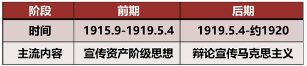
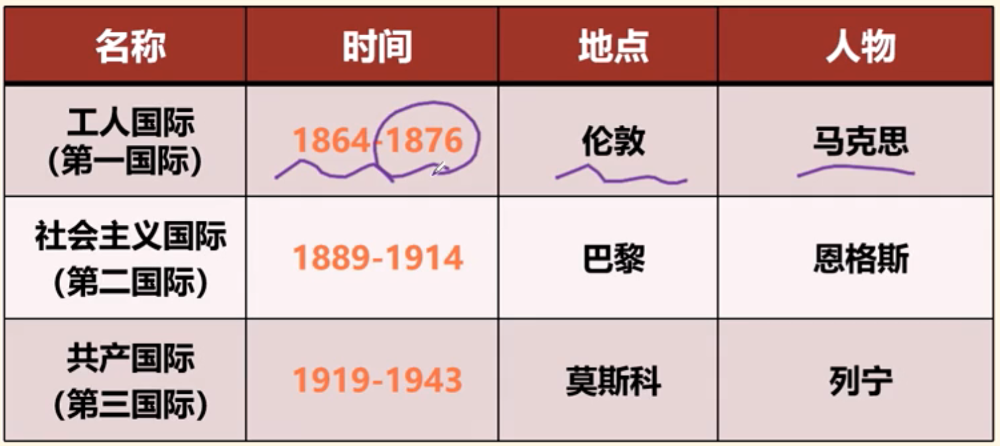
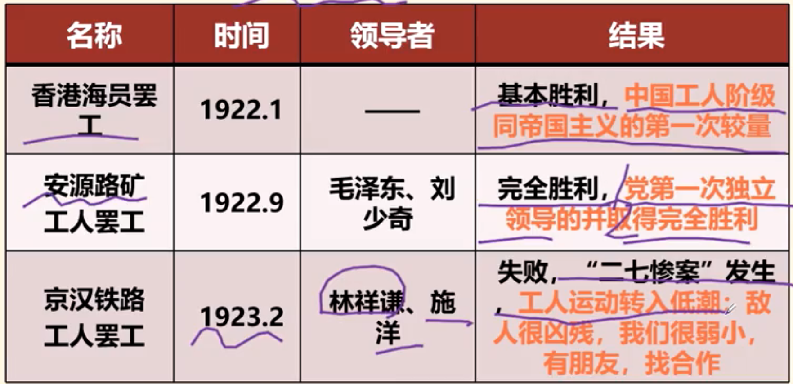
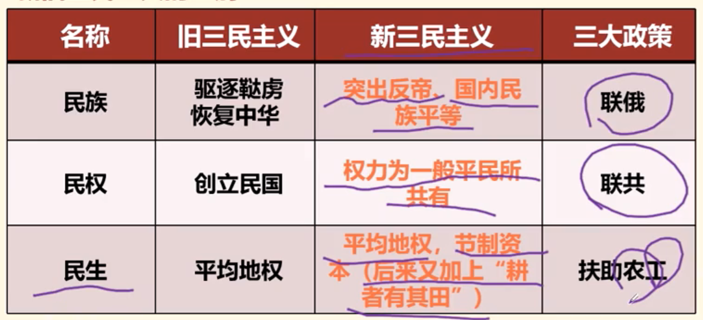

# 第四章 中国共产党的成立和中国革命新局面(1915-1927)

## 第一节 新文化运动和五四运动

### 1 新文化运动

1. 新文化运动

    - 背景原因：：历次探索失败，要改造中国，必须进行一场思想启蒙运动，使人们从封建思想的束缚中即蒙昧状态中解放出来

    - ==**开始标志：1915年9月陈独秀在上海创办《青年》杂志（后改名《新青年》）**==

    - 阶段划分：新文化运动两个时期(1915-1920，五四运动前-后)

        
    
    - 两大阵地：《新青年》杂质和北京大学

2. 前期新文化运动的基本内容

    - **内容：**

        （1）第一，提倡民主和科学，反对专制和迷信盲从；

        （2）第二，提倡个性解放（新道德），反对封建礼教（旧道德）；

        （3）第三，提倡新文学，反对旧文学，实行文学革命。

        > 鲁迅第一篇白话小说《狂人日记》

    - **口号：民主（德先生）和科学（赛先生）**

3. 五四以前的新文化运动的历史意义

    （1）新文化运动的倡导者提倡民主、反对专制，提倡科学、反对迷信盲从，是 **切中时弊** 的；

    （2）带来了新的思想。

    关键词：“切中时弊” “振聋发聩”

4. 局限性

    （1）新文化运动的倡导者批判孔学，是为了给中国发展资本主义扫清障碍， **但没有看到资本主义道路是走不通的** - 本末倒置

    （2）把改造国民性置于优先地位，没有看到应该首先改造经济基础 - 本末倒置

    （3）没有马克思主义方法的批判精神，容易造成形式主义（全盘否定一刀切）

    关键词：“宏观本末倒置” “微观本末倒置” “方法片面”

### 2 十月革命与马克思主义在中国的传播

0. 十月革命

    - 背景：国际 - 第一次世界大战两大帝国主义集团的混战

        西方列强崛起：

        （1）第一批：英法美俄

        （2）第二批:德意日奥

        国内 - "二月革命"爆发及资产阶级政府建立

    - 过程：两大权力中心 ： 资产阶级政府 vs 工人士兵苏维埃（俄国社会主义民主工党领导）

        俄国社会主义民主工党内部分歧：

        （1）孟什维克（少数） - 理论依据 "同时胜利论" ： 拒绝再革命

        （2）布尔什维克（多数） - 理论依据 "首先胜利论" ： 继续革命

    - 结果：1917.11 布尔什维克领导工人士兵苏维埃攻占圣彼得堡（冬宫），建立了第一个社会主义国家——苏维埃俄国

1. 十月革命对中国的影响

    （1）经济文化落后的国家也可以用社会主义思想指引自己走向解放之路 （**革命方向 - 社会主义**）

    （2）俄国号召反对帝国主义，以平等的态度对待中国，推动了社会主义思想在中国的传播（**革命思想 - 马克思主义**）

    （3）新的革命方法（群众路线） - 工人、农民和士兵群众的广泛发动 （**革命方法 - 群众路线**）

2. 李大钊

    - 地位：在中国大地上 **率先举起马克思主义旗帜（第一个马克思主义者，五四运动前信仰马克思主义的个别人物）**

    - 著作

        1. 五四运动前：

            （1）**《法俄革命之比较观》** - 第一次正确地阐述了十月革命的性质

            （2）**《庶民的胜利》《Bolshevism的胜利》**（布尔什维） - 深刻揭露了一战的本质，强调坚持新的革命方法——群众路线；

        2. 五四运动后(1919.5.4)

            （3）**《我的马克思主义观》** - **第一次** 比较系统介绍了马克思主义，比较系统介绍唯物史观、剩余价值学说和阶级斗争理论。 ==**标志了马克思主义在中国进入比较系统的传播阶段并开始在知识界广泛传播**==

### 3 五四运动

1. 背景

    （1）**群众基础**：新的社会力量的成长、壮大（即资产阶级和工人阶级的成长壮大）；

    （2）**思想启蒙**：新文化运动掀起的思想解放潮流，影响了年轻一代知识界；

    （3）**外部影响**：

    积极影响：俄国十月革命对中国的影响；

    消极影响：巴黎和会上中国外交的失败 - **直接导火线**。

2. 过程

    - 时间：1919年5月4日

    - 行动：北京大学等十几所学校的学生三千余人在天安门前集会，后举行示威游行

    - 口号：**“外争主权，内除国贼”； “废除二十一条”； “还我青岛”**

    - 主张：惩办亲日派官员，拒绝在合约上签字

    - **转折：6月5日，上海工人罢工，中国工人阶级开始以独立的姿态登上政治舞台**

    - 参与者：先学生、知识分子，后加入了 **工人阶级、小资产阶级和资产阶级**

    - 主力军：先学生，后 **工人**

    - 中心：先北京，后上海

    - 结果：释放被捕学生，罢免曹、章、陆，没有出席凡尔赛和约签字仪式（**直接斗争目标实现**）

3. 历史特点

    （1）一场以先进青年知识分子为先锋、广大人民群众参加的彻底反帝反封建的 **伟大爱国革命运动**

    （2） 一场中国人民为拯救民族危亡、捍卫民族尊严、凝聚民族力量而掀起的 **伟大社会革命运动**

    （3）一场传播新思想、新文化、新知识的 **伟大思想启蒙运动和新文化运动**

4. 历史意义

    （1）五四运动是中国 **旧民主主义革命走向新民主主义革命的转折点，历史进程的里程碑**。表现在：

    - 彻底的反帝反封建的革命性；（对西方达到了理性认识）

    - 追求救国强国真理的进步性；（促进了马克思主义在中国的广泛传播）

    - 各族各界群众积极参与的广泛性；（是一次真正的群众运动【工、小、民三个阶级参加，注意农民没参加】）

    - 为党的成立做出了阶级、思想和干部上的准备

        ==**五四运动是中国新民主主义革命的开端**==

    （2）五四运动孕育了以 **爱国、进步、民主、科学** 为主要内容的伟大 **五四精神**，其 **核心是爱国主义**

    （3）鸦片战争以来中国民族的第一次 **全面觉醒**

    

        
<strong>近代中国"民族觉醒"历程</strong>

        

            
        

    

## 第二节 马克思进一步传播与共产党的诞生

### 1 中国早期马克思主义思想运动

1. 早期马克思主义者的队伍

    （1） **五四以前新文化运动的精神领袖**：其代表除李大钊以外，就是陈独秀； - **先驱者和擎旗人**

    （2）**五四爱国运动的左翼骨干**：其代表为毛泽东、周恩来等； - **主力和主体**

    （3）一部分 **原中国同盟会会员、辛亥革命时期的活动家** ：如董必武、吴玉章、林伯渠（林祖涵）等

2. 早期马克思主义思想运动特点

    （1） **理论学习上** ：重视对马克思主义基本理论的学习，从一开始就坚持马克思主义的革命原则和正确方向，与第二国际的社会民主主义划清了界限

    （2） **实践运用上** ：从中国的实际出发，学习、运用马克思主义的理论

    （3） **方法探索上** ：开始提出知识分子应当同劳动群众相结合的思想

    **补充：国际共运史上的三个"国际"**

    {:height="50%" width="50%"}

    第二国际：出现工人贵族，出现工党、工会、工贼，抛弃了马克思主义

3. 新文化运动的发展

    - **五四运动以后的新文化运动，科学和民主的新含义**：

        （1）民主，不再是指狭隘的资产阶级民主，而是指多数人的民主、以劳动群众为主体的民主

        （2）科学，除自然科学外，对社会研究来说，主要指马克思主义的科学世界观和社会革命论

    - **克服了以往启蒙者的弱点，继续有力推动了反封建的启蒙运动**：

        （1）以唯物史观为武器 ，从反对封建思想，进而提出必须反对产生封建思想的社会制度 - **由上层建筑转向经济基础**

        （2）从争取个人的个性解放，扩展到争取人民群众的解放的高度 - **由个人到人民**

        （3）从少数人进行的思想，逐步发展为人民群众的革命实践 - **由认识到实践**

    “自从中国人学会了马克思列宁主义以后，中国人在精神上就由被动转入主动。从这时起，近代世界历史上那种看不起中国人，看不起中国文化的时代应当完结了”。——毛泽东，于新文化运动之后

### 2 马克思主义与中国工人运动的结合

1. 中国共产党的早期组织

    （1）**最早学习和研究马克思主义的团体/理论组织**：**马克思学说研究会·北京大学（1920.3）** - 李大钊

    （2）**第一个共产党早期组织（党小组）**：**上海共产党（中国共产党上海共产主义小组）**（1920.8） - 陈独秀

    （3）其他早期组织：1920年10月后，北京、武汉、长沙、济南、广州、日本、法国

2. 中国共产党早期组织的活动

    （1）研究和宣传马克思主义；

    （2）到工人中进行宣传和组织工作；

    （3）进行有关建党问题的研究和实际组织工作；如建立 **社会主义青年团**，成为党的后备力量。

    口诀：**宣传理论；组织工人；成立后备；相约建党**

### 3 中国共产党的成立与意义

1. 中国共产党第一次全国代表大会

    - 时间：1921.7.23

    - 地点： **上海** 法租界望志路106号

    - 人物：12个代表，1名特别代表，2个共产国际代表

    - 内容：

        （1）确定党名

        （2）明确纲领：社会主义革命性质，以无产阶级军队推翻资产阶级政府，建立社会主义国家

        （3）工作中心：组织领导工人运动

        （4）确定领导：陈独秀为书记

2. 中国共产党创立的历史特点

    （1）所接受的是列宁主义 - **“根正苗红”**

    （2）中国工人阶级深受帝国主义者、本国资产阶级和封建势力的三重压迫，具有坚定的革命性 - **“革命最强”**

3. ==**中国共产党成立的伟大意义[主观题考点]**==

    **总意义：中国共产党的成立，是中华民族发展史上一个开天辟地的大事变。**

    **历史意义：**

    **（1）一个领导核心：中国人民有了一个先进的坚强的政党作为凝聚自己力量的领导核心**

    **（2）两个历史任务：踏上了争取民族独立、自身解放的光明的道路，开启了实现国家富强、人民富裕的历史征程**

    **（3）三个深刻改变：深刻改变了近代以后中华民族发展的方向和进程，深刻改变了中国人民和中华民族的前途和命运，深刻改变了世界发展的趋势和格局**

    **（4）四句建党精神——精神之源：坚持真理，坚守理想；践行初心，担当使命；不怕牺牲，英勇斗争；对党忠诚，不负人民**

4. 共产党人的初心使命与"红船精神"

    - 初心与使命：为中国人民谋幸福、为中华民族谋复兴

    - 红船精神：

        （1）开天辟地、敢为人先的首创精神；

        （2）坚定理想、百折不挠的奋斗精神；

        （3）立党为公、忠诚为民的奉献精神。

## 第三节 中国革命新局面

### 1 民主革命纲领的制定和工农运动的发动

1. 制定反帝反封建的民主革命纲领

    （1）找到首要敌人：中共二大 - 1922.7

    （2）最低纲领（民主革命纲领）：打倒军阀、推翻国际帝国主义的压迫、统一中国为真正民主共和国

    （3）最高纲领：实现社会主义、共产主义

    （4）要交朋友：必须联合全国一切革命党派， 联合资产阶级民主派，组成民主联合战线

    （5）**地位：近代以来第一次提出了反帝反封建的民主革命的纲领**。

2. 发动工农群众开展革命斗争 - 第一次罢工高潮(1922.1-1923.2)

    {:height="70%" width="70%"}

### 2 国共合作与大革命

1. 国共合作的形成

    - 社会背景：帝国主义卷土重来，国内军阀纷争扩大→“打倒列强，除军阀”（**社会共识**）

    - **共产党方面 - 中共三大**(1923)：决定共产党员以个人身份加入国民党，同国民党实行党内合作，保持党的独立性

    - **国民党方面 - 国民党一大(1924)与新三民主义纲领**

        国民党一大召开提出新三民主义和联俄、联共、扶助农工三大革命政策，新三民主义纲领与中共二大纲领基本一致；

    - 合作标志：：1924年1月， **中国国民党第一次全国代表大会召开**（此时的国民党为国共合作的国民党，包括工、农、小、民四个阶级）

    - 政治基础：新三民主义

        新旧三民主义对比：新三民主义 - 反帝反封 联俄联共

        {:height="70%" width="70%"}

2. 大革命的准备与进行

    （1）1924年，国共合作创办了黄埔陆军军官学校

    （2）1925年1月中共四大 提出了无产阶级在民主革命中的领导权，提出了工农联盟问题

    > 1925.3.12 孙中山去世

    （3）1925年5月30日，**五卅运动**，掀起了全国范围的 **大革命高潮**

    （4）1925年6月 **省港大罢工**（广东+香港）：前后共坚持了16个月，这是 **中国工人运动史上持续时间最长的一次政治大罢工**

3. 北伐战争的胜利进展

    - 大革命内涵

        1924年至1927年中国反帝反封建的革命，比之以往任何一次革命，包括辛亥革命和五四运动，**群众动员程度更为广泛，斗争规模更加宏伟，社会内涵更其深刻**，因此被称作大革命。也被称为 **第一次国内革命战争**

    - 大革命内容

        （1）北伐运动：打倒北洋军阀

        （2）成就：三大军阀消灭两个，基本上推翻了北洋军阀统治

4. 大革命中的中国共产党 - **"独特且不可代替"**

    - **口号的提出者（中共二大第一个反帝反封建纲领）**

        （1）大革命是在反对帝国主义、反对军阀的政治口号下进行的。而提出这个口号的，正是中国共产党

    - **统一战线的倡导者和组织者**

        > 不是领导者

        （2）大革命是在以国共合作为基础的统一战线的组织形式下进行的。而中国共产党正是国共合作的倡导者和统一战线的组织者

    - **群众的发动者和组织者（领导工会和农会）**

        （3）大革命是近代中国历史上空前广泛而深刻的群众运动。而中国共产党正是人民群众的主要发动者和组织者

    - **协助建立军队，做好政治工作并身先士卒**

        （4）大革命的主要斗争形式是革命战争。

### 3 大革命的失败与教训

1. 大革命失败

    - 失败前奏

        （1）帝国主义干预革命

        （2）统一战线发生分化（国民党右派的破坏），如1926.3 **中山舰事件——共产党失去军权**；1926.5 **整理党务案——共产党失去党权**

    - 失败标志

        1927 年 4月12日，蒋介石在上海“清党”；7月15日，国民政府主席汪精卫在武汉召开“分共”会议，国共合作全面破裂。

        **“四一二”反革命政变和“七一五”反革命政变成为大革命失败的标志**

2. 大革命失败原因

    （1）表象：中共中央领导机关在大革命后期犯了 **右倾机会主义错误**，放弃了无产阶级对于农民群众、城市小资产阶级和民族资产阶级的领导权，尤其是对武装力量的领导权。

    （2）本质：这时的中国共产党还处在 **幼年时期**，缺乏应对复杂环境的政治经验，**缺乏对中国社会和中国革命基本问题的深刻认识，还不善于将马克思列宁主义基本原理同中国革命的具体实际结合起来** - 没有做到实事求是，将马克思理论与实践结合

    ---
    
    **补充：左倾与右倾的内涵**

    左倾：认识超前于实践，过于激进；

    左倾：认识落后于实践，过于保守。

    ---

3. 大革命失败的5大经验教训

    - 对自己

        加强党的建设：加强思想建设“马克思主义中国化”、加强组织队伍建设

    - 对朋友

        统一战线：抓住统一战线领导权、抱住农民真大腿

    - 对敌人

        武装斗争-抓住枪杆子对敌人坚决武装斗争 （最直接的经验）

4. 大革命的历史意义

    （1）开始探索马克思主义中国化的途径，初步提出了新民主主义革命的基本思想，并从大革命的失败中汲取了深刻的历史教训，开始懂得进行土地革命和掌握革命武装的重要性；

    （2）中国人民的觉悟程度和组织程度有了明显提高，中国共产党开始掌握了一部分革命武装。

    （3）总之，为土地革命奠定了基础

    > 选择题技巧：承上启下  
    > 承上：反帝反封建，军阀  
    > 启下：之后的革命