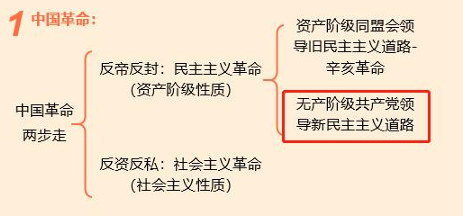
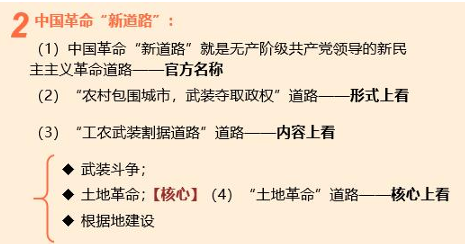

# 第五章 中国革命的新道路

## 第一节 中国共产党对革命新道路的探索

### 1 国民党在全国统治的建立与性质

---

补充：什么是中国革命“新道路”

{:height="70%" width="70%"}

{:height="70%" width="70%"}

---

1. 南京国民政府的成立

    （1）短暂的三个政府时期
    
    武汉国民政府；南京国民政府；北洋军阀政府

    1928 年 12月29日东北易帜，国民党在全国建立统治（实现了形式上的“统一” ）

2. 国民党政权的实质

    （1）政党性质：由“工农小民”四个阶级的政党转变为代表地主阶级、买办性的大资产阶级利益的反动集团控制的政党

    （2）**统治性质：代表地主阶级、买办性的大资产阶级利益的一党专政和军事独裁统治**

    （3）实质：：三座大山统治的半殖民地半封建社会

### 2 土地革命

1. 大革命失败后的中国共产党——八七会议“统一思想”

    > 党生死攸关的转折点之一（三次之第一）

    （1）名称：八七会议

    （2）时间地点：1927.8.7 武汉汉口

    （3）内容：

    - **确定了土地革命和武装反抗国民党反动统治的总方针**

    - 毛泽东：“以后要非常注意军事。须知政权是由枪杆子中取得的。”

    （4）意义：给正处在思想混乱和组织涣散中的中国共产党指明了新的出路，这是由大革命失败到土地革命战争兴起的历史性转变

2.  南昌起义、秋收起义和广州起义——“落实行动”

    - 南昌起义

        （1）时间：1927.8.1

        （2）**武装反抗国民党反动统治的第一枪**

        （3）**是中国共产党独立领导革命战争、创建人民军队和武装夺取政权的开端（建军）**。

        （4）结果：失败

    - 秋收起义

        （1）湘赣边界；1927.9.9；毛泽东

        （2）内容：

        1. 起义军公开打出了“**工农革命军**”的旗帜

        2. 进行了著名的 **三湾改编**，**从组织上确立了党对军队的领导——建设无产阶级领导的新型人民军队的重要开端**；

        3. 开创了井冈山农村革命根据地

    - 广州起义

        失败

    - 三次起义总结：（归类补充）

        （1）最初目的：攻打和占领城市；

        （2）最终结果：失败；

        （3）结论：**农村包围城市，武装夺取政权**。

### 3 农村包围城市，武装夺取政权 - 井冈山

1. 对中国革命新道路的探索 - 井冈山

    （1）实践探索：毛泽东率领起义军到井冈山后，全力进行党、军队和政权的建设。1927年11月，成立 **湘赣边界第一个红色政权——茶陵县工农兵政府**。

    （2）==**理论研究[非常重点]**== 四篇著作

    - **《中国的红色政权为什么能够存在？》** (1928.10)：论证了红色政权能够长期存在并发展的主客观条件。

    - **《井冈山的斗争》** (1928.11)：提出了工农武装割据的思想的具体三个内容“武装斗争，土地革命，根据地建设”。

    - **《星星之火，可以燎原》**(1930.1)：

        （1）回答了红旗能够打多久

        （2）农村包围城市道路是半殖民地中国在无产阶级领导之下的农民斗争的最高形式，和半殖民地农民斗争的最高形式和必然结果。 **进一步阐明了中国革命只能走与资本主义国家不同的道路**。

    - **《反对本本主义》**（原名：调查工作 1930.5）：

        （1）阐明了 **坚持辩证唯物主义的思想路线即坚持理论与实际相结合的原则的极端重要性**；

        （2）提出了“**没有调查，没有发言权**”；

        （3）“**中国革命斗争的胜利要靠中国同志了解中国情况**”的重要思想。

        （4）**意义：表现了毛泽东开辟新道路、创造新理论的革命首创精神**。

    （3）**一次会议：红四军党的第九次代表大会（古田会议）**

    - 时间地点：1929年12月 - 福建上杭县古田村

    - **核心：确立思想建党、政治建军原则**

    - 主要内容：

        （1）**阐述了加强党的思想建设的极端重要性**

        （2）规定 **红军是一个执行革命的政治任务的武装集团，必须绝对服从共产党的领导；提出红军必须担负打仗、筹款和做群众工作的任务**

    - 历史意义：

        （1）确立马克思主义建党建军原则，解决了在农村以农民为主要成分的红军如何保持无产阶级性质和建设党领导的新型军队重大问题

        （2）党对军队的绝对领导，是人民军队永远不变的军魂，是区别于一切旧军队的政治特质和根本优势

    （4）理论研究的意义
    
    - 农村包围城市、武装夺取政权道路理论的提出，**指明了中国革命胜利的唯一正确道路**，**标志着中国化的马克思主义即毛泽东思想的初步形成**。
    
    - **从进攻大城市转为向农村进军对中国革命具有决定意义的新起点**

    ---

    **补充：党与军队**

    （1）南昌：党开始领导军队

    （2）三湾改编：组织上确立领导军队

    （3）古田会议：政治思想上确立党对军队的绝对领导

    ---

2. 反围剿战争与土地革命

    - 指导思想：消灭封建地主的土地私有制，实行农民的土地私有制

    - 阶级路线：依靠贫农、雇农，联合中农，限制富农，保护中小工商业者，消灭地主阶级

    - 土地分配法：以乡为单位，按人口平分土地，在原耕地的基础上，实行抽多补少、抽肥补瘦

    - 作用影响：
    
    （1）农民被广泛发动起来纷纷“参军保田”，让党赢得了深厚的群众基础。

    （2）在大革命失败、白色恐怖极其严重的条件下，中国革命之所以能够得到坚持和发展，**根本原因就是中国共产党紧紧地依靠农民，领导农民进行土地制度的革命**

## 第二节 中国革命在曲折中前进

### 1 土地革命战争的发展及其挫折

1. 农村革命根据地的建设

    1931 年 11月成立中华苏维埃共和国·瑞金

    （1）政府：中华苏维埃共和国临时中央政府 毛泽东主席

    （2）法律：《中华苏维埃共和国宪法大纲》

    （3）制度：**实行工农兵代表大会制度**

    （4）意义： **中华苏维埃共和国是中国历史上第一个全国性的工农民主政权，是中国共产党在局部地区执政的重要尝试**

    > 第一个全国性的：中华苏维埃共和国  
    > 第一个地方性的：湘赣边界第一个红色政权——茶陵县工农兵政府

2. **土地革命战争的严重挫折**

    - 党中央领导机关的三次左倾错误(1927-1935)

        （1）1927年11月至1928年4月，“左”倾盲动错误（略）

        （2）1930 年 6月至9月，以李立三为代表的“左”倾冒险主义

        （3）**1931年1月至1935年1月，以王明为代表的“左”倾教条主义。（持续时间最久、危害最大）**

    - **王明“左”倾教条主义的表现——四面大旗（归类补充）**

        （1）**政治上**：“一步走”，“一次革命论”打击资产阶级，破坏统一战线

        （2）**军事上**：排斥毛泽东军事指挥权，瞎指挥。集中攻打大城市

        （3）**组织上**：排斥毛泽东领导，宗派主义无情打击

        （4）**思想上**：主观教条主义，照搬照抄

    - 三次“左”倾错误的出现原因

        （1）内因：八七会议以后党内一直存在着的浓厚的“左”倾情绪，始终没有得到认真的清理

        （2）外因：共产国际对中国共产党内部事务的错误干预和瞎指挥

        （3）**根本原因：不善于把马克思列宁主义与中国实际全面地、正确地结合起来。** - 没能做到实事求是

    - 王明“左”倾教条主义错误的危害

        其最大恶果，就是使红军在第五次反“围剿”中遭到失败，不得不退出南方根据地实行战略转移——长征

        > 长征出发90周年，重要

### 2 遵义会议

1. 遵义会议内容及意义

    （1）背景：王明“左”倾错误在长征初期造成巨大损失
    
    （2）时间：1935年1月15日至17日

    （3）**内容：集中解决了军事问题和组织问题 （军事：毛泽东指挥；组织：毛泽东领导）**

    （4）**意义**：

    - **开始确立以毛泽东为代表的马克思主义的正确路线在中共中央的领导地位**

    - **在极其危急的情况下挽救了中国共产党、挽救了中国工农红军和挽救了中国革命**

    - **党历史上一个生死攸关的转折点**

        > 党第二次转折点(2/3)

    - **开启了中国共产党独立自主解决中国革命实际问题的新阶段，党开始走向成熟**

### 3 红军长征 四篇著作

1. 中央红军长征结束及意义

    - 结束标志（两次会师）

        （1）第一次会师：毛泽东同志领导的红军：1935年10月19日，到达陕北 ==**吴起镇**==，主力红军长征结束； - **标志两万五千里长征结束**

        （2）第二次会师：1936年10月，红二、四方面军先后同红一方面军在 **甘肃会宁、静宁将台堡**（今属宁夏回族自治区）会师 - **标志全部长征结束**

    - 意义

        （1）**长征粉碎了国民党消灭红军的企图，实现了中国共产党和中国革命事业从挫折走向胜利的伟大转折**

        （2）**长征是一部伟大的革命英雄主义的史诗**

        （3）**铸就了伟大的长征精神**

        （4）**长征一结束，中国革命的新局面就开始了**

    - 长征精神

        （1）**把全国人民和中华民族的根本利益看得高于一切，坚定革命的理想和信念，坚信正义事业必然胜利的精神**

        （2）**为了救国救民，不怕任何艰难险阻，不惜付出一切牺牲的精神**

        （3）**坚持独立自主、实事求是，一切从实际出发的精神**

        （4）**顾全大局、严守纪律、紧密团结的精神**

        （5）**紧紧依靠人民群众，同人民群众生死相依、患难与共、艰苦奋斗的精神**

        （6）**长征精神为中国革命不断从胜利走向胜利提供了强大精神动力**

        > 长征意义、长征精神 两个选择题

2. 总结历史经验，迎接全民族抗日战争（三个方面四篇著作）

    - 政治方面

        （1）时间：1935.12

        （2）**地点：瓦窑堡会议**

        （3）**著作：《论反对日本帝国主义的策略》的报告——毛泽东**

        （4）**内容：批判党内的关门主义和对于革命的急性病，阐明党的抗日民族统一战线的新政策**

        > 解决王明政治上：一步走的问题

        （5）**意义：系统地解决了党的政治路线的问题**

    - 军事方面

        （1）1936年12月

        （2）《中国革命战争的战略问题》——毛泽东

        （3）说明了中国革命战略方面的诸多问题

    - 思想方面

        （1）时间：1937年夏

        （2）地点：延安抗日军政大学

        （3）**著作：《实践论》《矛盾论》——毛泽东**

        （4）**内容：从马克思主义认识论的高度，揭露和批评党内的主观主义尤其是教条主义错误**

        > 解决王明的思想问题：教条主义

        （5）**意义：科学地阐明了党的马克思主义的思想路线**