# 第六章 中华民族的抗日战争(1931-1945)

## 考点

### 考点1：日本发动侵华战争

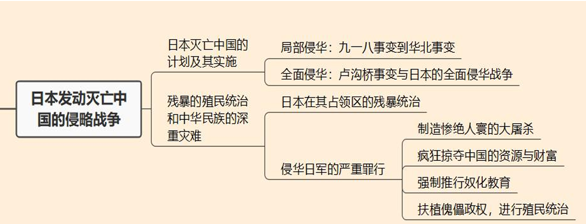

1.1 日本侵华运动：九一八事变、华北事变、卢沟桥事变

1.2 日本的罪行

### 考点2：抗日救亡运动

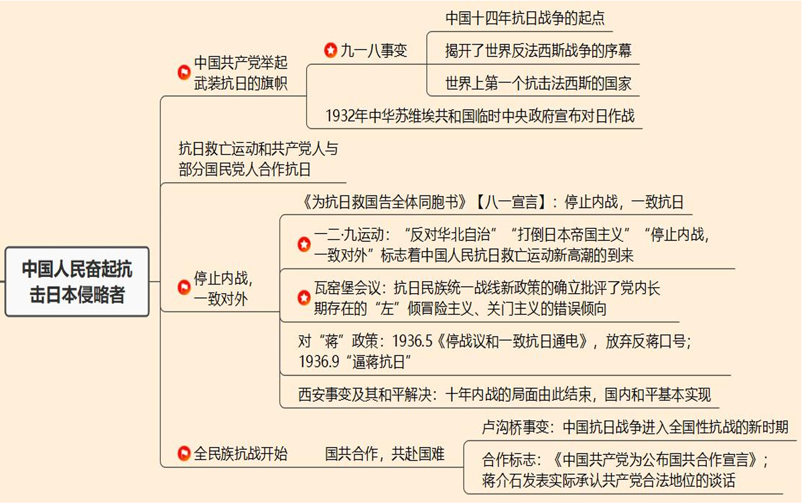

2.1 共产党宣战：九一八事变、共产党宣战

2.2 停止内战，一致对外：八一宣言、一二九运动、瓦窑堡会议【抗日民族统一战线】、西安事变

2.3 全民族抗战：卢沟桥事变【开始标志】、合作标志

### 考点3：国民党与正面战场

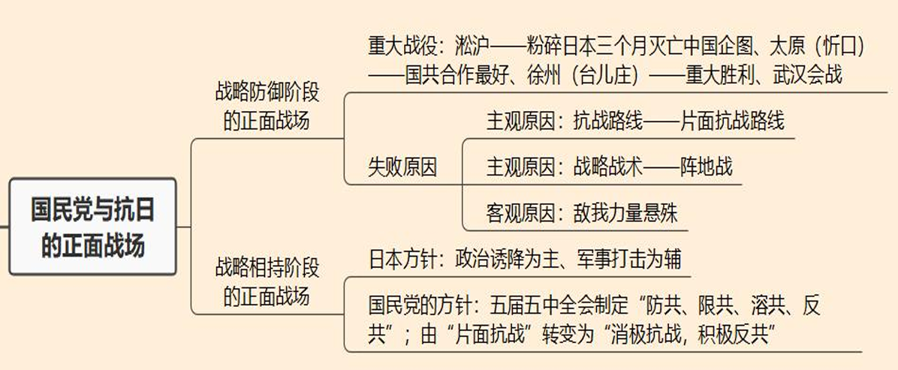

3.1 战略防御阶段：淞沪战役【粉碎】、太原（忻口）战役【合作】、台儿庄（徐州）战役【重大胜利】

3.2 战略相持阶段

### 考点4：共产党与敌后战场

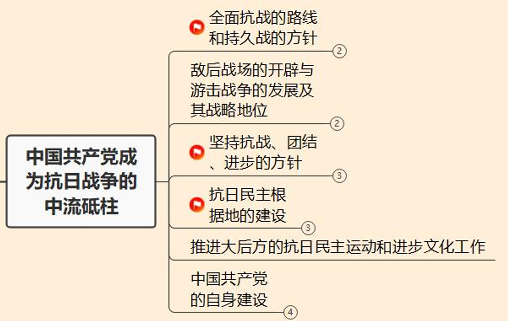

#### 1 + 2 战略上和战术上

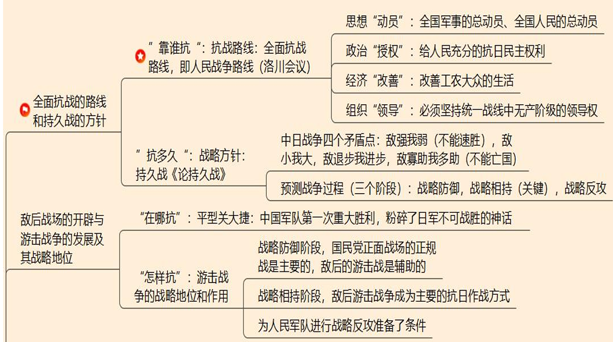

4.1 洛川会议：抗战路线

4.2 《论持久战》

4.3 战术：平型关大捷、游击战

#### 3 方针

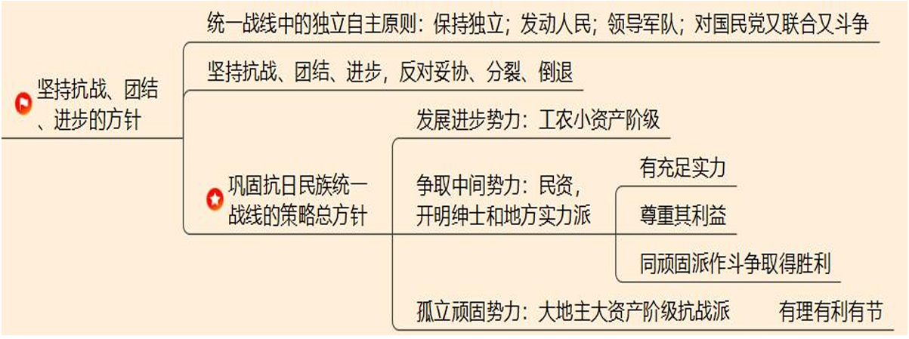

4.4 方针：独立自主原则、抗日民族统一战线方针【三种势力】

#### 4 根据地

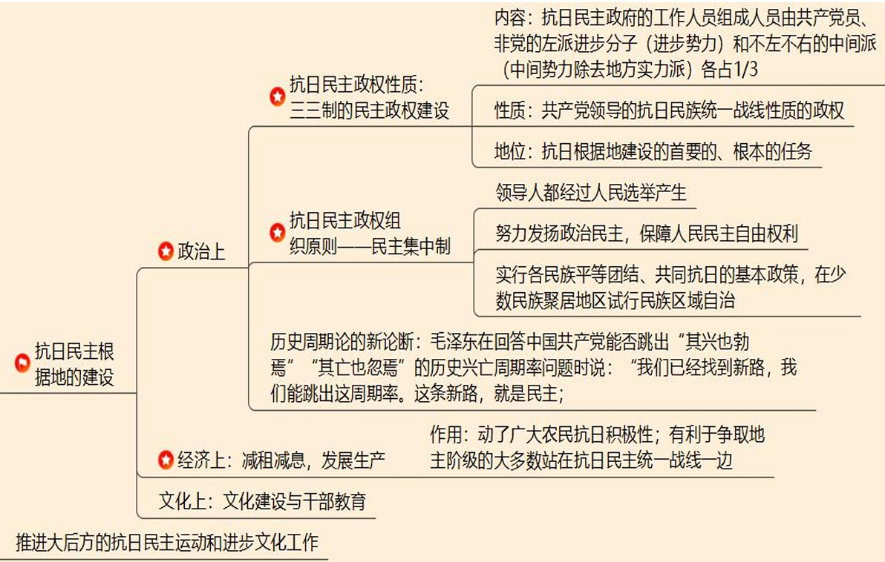

4.5 三三制民主政权

4.6 民主集中制

4.7 减租减息，发展生产

#### 5 党的自身建设

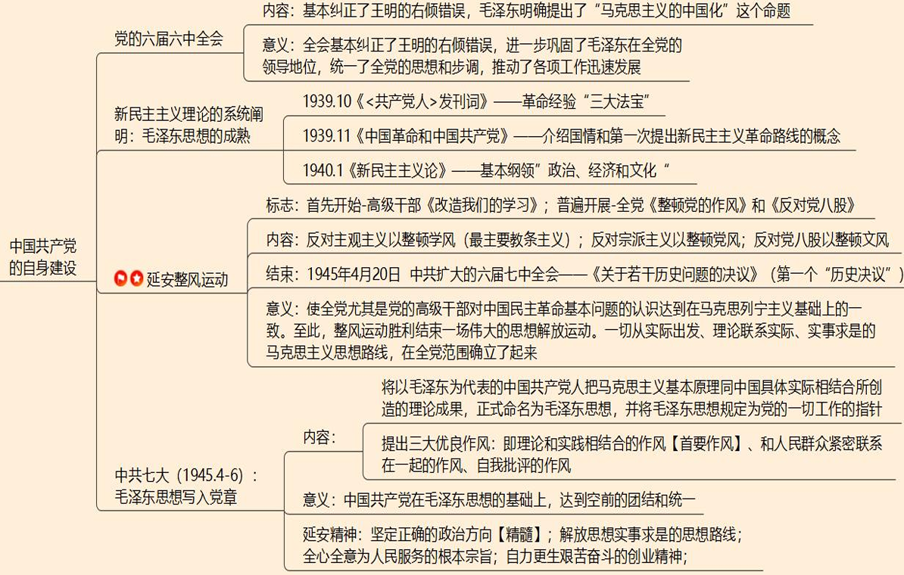

4.8 六届六中全会

4.9 新民主主义理论

4.10 延安整风运动：开始标志、三大整风、历史决议

4.11 中共七大：中共七大内容、毛泽东思想、三大优良作风、延安精神

### 考点5：抗战胜利

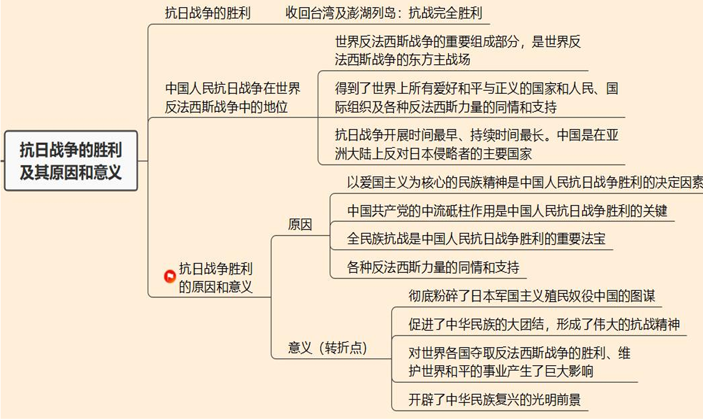

## 1 日本发动侵略战争

1. 日本灭亡中国的计划与实施

    （1）蓄谋已久：东方会议和大陆政策

    （2）**开始侵华：1931 九一八事变（局部抗战开始）**

    （3）逐步蚕食：1935 华北事变

    （4）**全面侵华：1937.7.7 卢沟桥事变（全国抗战开始）**

    **时间轴**

    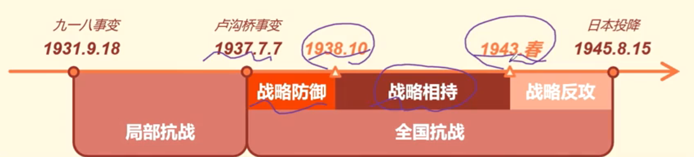

2. 日本帝国主义的残暴统治：侵华日军的罪行

    （1）制造惨绝人寰的大屠杀（1937.12，南京大屠杀）

    （2）疯狂掠夺中国的资源与财富

    （3）强制推行奴化教育

    （4）扶植傀儡政权，进行殖民统治

## 2 抗日民族统一战线[15]

### 1 共产党率先抗日

1. 九一八事变

    （1）时间：1931.9.18

    （2）意义：**中国十四年抗日战争的起点，揭开了世界反法西斯战争的序幕。中国也是世界上第一个抗击法西斯的国家**

2. 中国共产党率先举起抗日大旗

    1932年4月15日，中华苏维埃共和国临时中央政府宣布对日作战。中国共产党不仅积极参加和推动各地的抗日救亡运动，而且 **直接领导** 了东北人民的抗日武装斗争。

### 2 抗日救亡运动

1.  抗日救亡运动和中国共产党人与部分国民党人合作抗日（略）

    （1）中国共产党及其领导的工农红军和广大的工人、农民是抗日救亡运动的中坚力量

    （2）**东北抗日义勇军**

    （3）十九路军的 **淞沪抗战和福建事变**

    （4）**察哈尔民众抗日同盟军**

### 3 抗日民族统一战线

1. 一二·九运动与中共的抗日民族统一战线新政策

    - 《八一宣言》

        （1）背景：华北事变（1935年夏）民族危机加深

        （2）内容：1935年8月1日，中共驻共产国际代表团草拟《中国苏维埃政府、中国共产党中央为抗日救国告全体同胞书》（八一宣言）

        （3）主张：**停止内战，一致抗日** 等五项要求

    - ==**一二·九运动（抗日救亡高潮）**==

        （1）**内容**：在中共地下党组织的领导下，1935年12月9日，北平学生举行声势浩大的抗日游行

        （2）**三大口号：喊出“反对华北自治”“打倒日本帝国主义”“停止内战，一致对外”等口号，遭到国民党军警镇压**

        （3）意义：它促进了中华民族的觉醒， **标志着中国人民抗日救亡运动新高潮的到来**

        > 与日本有关的三次高潮：甲午战争、五卅运动、一二九运动 

    - **瓦窑堡会议（抗日民族统一战线新政策提出）**

        （1）**内容**：1935年12月，中共中央在陕北瓦窑堡召开政治局会议

        （2）**主张**： 《论反对日本帝国主义的策略》

        - 提出了在抗日的条件下与民族资产阶级重建统一战线的新政策 （理论）

        - 批评了党内长期存在的“左”倾冒险主义、关门主义的错误倾向 （思想）

        （3）**意义：中国共产党在新的历史时期即将到来时掌握了政治上的主动权**

    - 对“蒋”政策改变

        （1）1936 年 5月，毛泽东、朱德联名发布《停战议和一致抗日通电》，放弃反蒋口号

        （2）1936 年 9月1日，中共中央明确提出党的总方针是“逼蒋抗日”

2. **西安事变**

    （1）爆发：1936年12月初，蒋介石到达西安逼迫张学良、杨虎城攻打陕甘的红军。12日凌晨，**张学良、杨虎城** 在屡次劝谏无效的情况下，发动了西安事变

    （2）调节：中国共产党从民族大义出发，确定促成事变和平解决的基本方针，并派 **周恩来** 等到西安，参加谈判，迫使蒋介石做出了 **停止“剿共”、联合红军抗日等六项承诺**

    （3）**意义：西安事变的和平解决成为时局转换的枢纽，十年内战的局面由此结束，国内和平基本实现**
    
    > 标志内战结束，不标志合作形成

3. 国共合作

    - 背景：1937 年 7月7日，**卢沟桥事变爆发**，中国抗日战争进入全国性抗战（全民族抗战，战略防御）的新时期

    - 军事准备：红军主力改变为八路军；南方游击队改变为新编陆军第四军

    - 政治承认

        （1）1937 年 9月22日，国民党中央通讯社发表《中国共产党为公布国共合作宣言》 - 一个宣言

        （2）23 日，蒋介石发表实际承认共产党合法地位的谈话。 - 泸州谈话

        ==**标志了以国共两党第二次合作为基础的抗日民族统一战线正式形成**==

        > 第二次合作形成标志

    - 意义：抗日民族统一战线的巩固、发展和壮大，是夺取抗日战争最后胜利的根本保证

---

**国共两次合作对比**

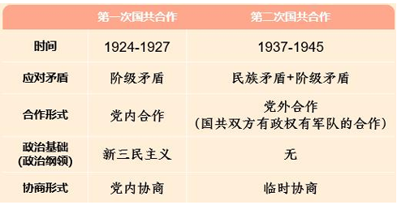

---

## 3 正面战场

### 1 战略防御阶段(1937.7-1938.10)

1. 地位

    1937 年卢沟桥事变到1938年10月广州、武汉失守，是中国抗日战争的战略防御阶段。在这个阶段，**以国民党军队为主体的正面战场，担负了抗击日军战略进攻的主要任务**。

2. 重大战役

    （1）淞沪会战 - **粉碎了日军三个月灭亡中国的企图**

    （2）太原会战（忻口会战） - **国共合作最好的战役**

    （3）徐州会战（台儿庄战役） - **国民党自全面抗战以来第一次重大胜利**

    （4）武汉会战 - **大量杀伤敌军，从战略防御进入到战略相持**

3. 失败原因

    （1）客观原因：敌我力量悬殊

    （2）主观原因：

    - 宏观上 - **抗战路线：片面抗战路线 不合理**

    - 微观上 - **战略战术：阵地战 的失败**

### 2 战略相持阶段(1938.10-1943)

1. 开始时间：1938年10月广州、武汉失守后

    - 日本的方针：政治诱降为主、军事打击为辅

    - 国民党的方针：

        （1）**五届五中全会制定“防共、限共、溶共、反共”**

        （2）**政策转变：由“片面抗战”转变为“消极抗战，积极反共”**

        （3）反法西斯联盟的建立：1942年元旦，美、英、苏、中四国领衔，26个国家签署《联合国家宣言》，决心互相合作，结成反法西斯联盟。

## 4 抗日战争的中流砥柱[80]

### 1 全面抗战路线和持久战(战略上)

1. 实行全面的全民族抗战的路线 - 回答 "靠谁抗"：人民

    - **时间地点**：1937.8 洛川会议

    - **路线**：全面抗战的路线（全民族抗战路线），即人民战争路线

    - **内容**：《抗日救国十大纲领》 - 毛泽东

        （1）**思想上**：全国军事的总动员、全国人民的总动员，鼓人民抗战；

        （2）**政治上**：改革政治机构，给人民充分的抗日民主权利；

        （3）**经济上**：适当改善工农大众的生活；

        （4）**组织上**：必须坚持统一战线中无产阶级的领导权

2. 采取持久战的战略方针——回答“抗多久”：时间

    - **背景**：“速胜论”与“亡国论”的破产

    - **提出**：**《论持久战》**

        1938 年 5-6 月，毛泽东发表《论持久战》的演讲。系统地阐明了持久抗战的方针

    - **内容**

        （1）**论点**：中日战争是半殖民地半封建的中国和帝国主义的日本之间在20世纪30年代进行的一个决死的战争。依靠中国人民，经过持久作战，最后胜利又将是属于中国的

        （2）**论据**：中日之间的四个矛盾点

        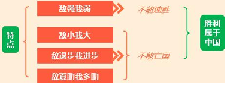

        （3）**阶段**：科学的预测了抗日战争要经历三个阶段，即：战略防御阶段；战略相持阶段（最关键的阶段）；战略反攻阶段

### 2 敌后战场与游击战（战术上）

1. 敌后战场的开辟和发展 - 回答"在哪抗"：地点

    - **抗日战争的两个战场**

        （1）**国民党**：正面战场 - **战略防御阶段 主力**（1937.7-1938.10）

        （2）**共产党**：敌后战场 - **战略相持和反攻阶段 主力**（1938.10-1945.8）

    - **平型关大捷**

        （1）内容：1937 年 9 月，八路军第一一五师在晋东北平型关附近伏击日军，歼敌 1000 余人

        （2）**意义：平型关大捷取得全民族抗战以来中国军队主动寻歼敌人的第一次重大胜利，打破了日军不可战胜的神话**

2. 游击战争的战略地位和作用 - 回答"怎么抗"：方法

    - 游击战在不同阶段的作用：

        （1）在战略防御阶段，从全局看，国民党正面战场的正规战是主要的，敌后的游击战是辅助的

        （2）在战略相持阶段，敌后游击战争成为主要的抗日作战方式

        （3）为战略反攻准备条件

### 3 坚持抗战、团结、进步的方针

1. 统一战线中的独立自主原则

    （1）必须保持在思想、政治和组织上的独立性，放手发动群众，壮大人民力量

    （2）必须坚持对人民军队的绝对领导，努力发展人民武装和抗日根据地

    （3）必须对国民党采取又团结又斗争、以斗争求团结的方针 

2. 口号：坚持抗战、团结、进步，反对妥协、分裂、倒退

    - 背景：相持阶段到来以后，由于国民党亲英美派开始消极抗日、积极反共，出现了中途妥协和内部分裂的危险

    - 对策（三大口号）

        1939 年 7 月，中国共产党明确提出：

        “坚持 **抗战** 到底，反对中途 **妥协**”
        
        “巩固国内 **团结**，反对内部 **分裂**”
        
        “力求全国 **进步**，反对向后 **倒退**”

    - 结果

        国民党先后制造三次反共高潮：

        （1）第一次反共高潮：1939年冬至1940年春；

        （2）第二次反共高潮：1941年1月，皖南事变。

        （3）第三次反共高潮：1943年春（未遂）。

3. 巩固抗日民族统一战线的策略总方针

    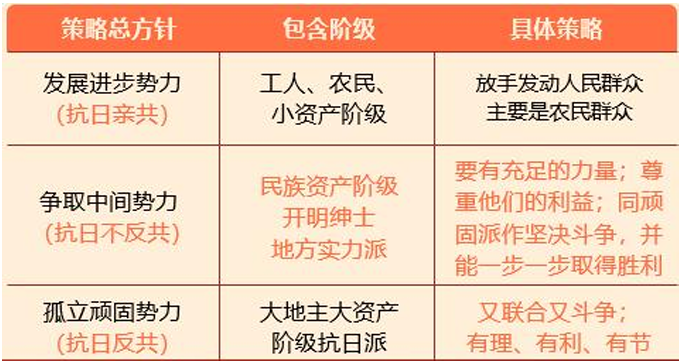{:height="70%" width="70%"}

### 4 抗日民主根据地

1. 国共两个政权

    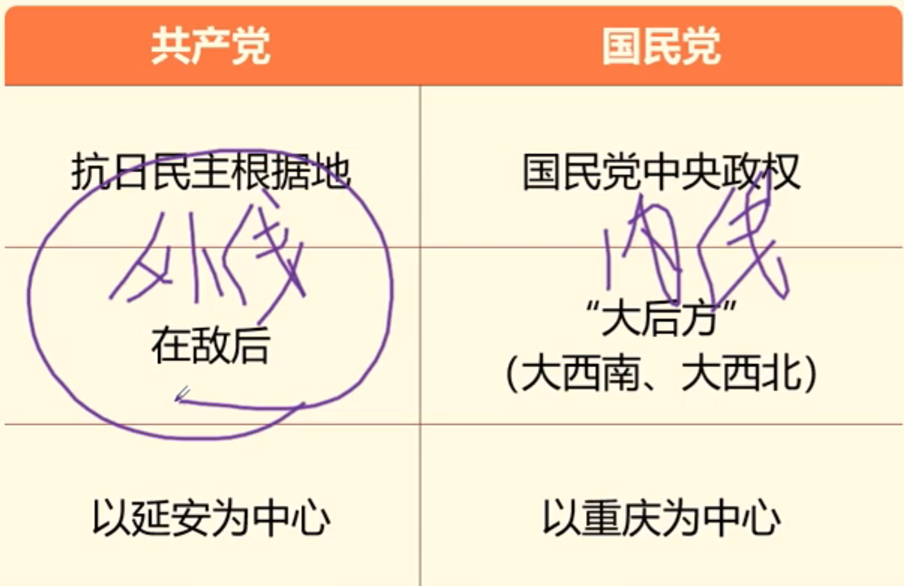{:height="50%" width="50%"}

2. 政治方面 - 政权建设

    - **三三制的民主政权建设**

        （1）内涵：抗日民主政府在工作人员分配上实行“三三制”原则： 
        
        - 共产党员（工农）
        
        - 非党的左派进步分子（小资）
        
        - 不左不右的中间派（除 地方实力派的中间势力）

        （2）性质：是共产党领导的抗日民族统一战线性质的政权

        （3）地位：抗日根据地建设的首要的、根本的任务

    - **抗日民主政权组织原则 - 民主集中制**

        （1）领导人都经过人民选举产生

        （2）努力发扬政治民主，保障人民民主自由权利

        （3）实行各民族平等团结、共同抗日的基本政策，在少数民族聚居地区试行民族区域自治

    - 历史周期论的新论断

        （1）内容：毛泽东在回答中国共产党能否跳出“其兴也勃焉”“其亡也忽焉”的历史兴亡周期率问题时说：“我们已经找到新路，我们能跳出这周期率。这条新路，就是 **民主**

3. 经济方面 - 减租减息，发展生产

    - 抗战时期土地政策 - 减租减息

        （1）**内涵：地主减租减息+农民交租交息**

        （2）目的：主要减租减息以改善农民的生活；农民要交租交息以照顾地主富农的利益

        （3）作用：调动了广大农民抗日积极性；有利于争取地主阶级的大多数站在抗日民主统一战线一边

4. 文化方面：文化建设与干部教育

    （1）创办院校：中国人民抗日军事政治大学（简称“抗大”）、鲁迅艺术学院（简称“鲁艺”）

    （2）中国共产党历史上第一个开展自然科学教学与研究的专门机构：延安自然科学院

    （3）中国的希望在延安：“延安作风”打败“西安作风”

### 5 大后方的抗日民主运动和进步文化工作

1. 废除国民党一党专政呼声

### 6 中国共产党自身的建设

1. 马克思主义中国化命题的提出

    - 背景：抗战初期王明右倾思想错误

    - 时间地点：1938年9月至11月 **中共六届六中全会**

    - 内容：基本纠正了王明的右倾错误，**毛泽东明确提出了“马克思主义的中国化”这个命题**

    - 意义：全会基本纠正了王明的右倾错误，进一步巩固了毛泽东在全党的领导地位

    --- 

    **补充：新民主主义革命与革命理论**

    - 新民主主义革命：中国共产党领导的反帝反封的资产阶级民主革命。

    - 革命理论：革命的指导思想

        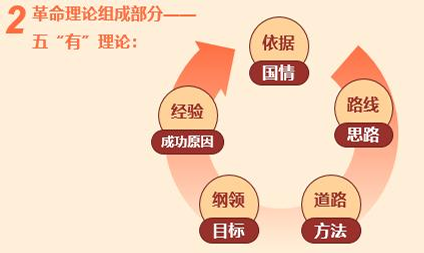

    ---

2. 新民主主义理论的系统阐明 - 三部著作

    （1）1939.10《<共产党人>发刊词》 - 总结了中国共产党成立以来的历史经验，指出 **统一战线、武装斗争、党的建设是中国共产党在中国革命中战胜敌人的三个主要的法宝**

    （2）1939.11《中国革命和中国共产党》 - 揭示了中国半殖民地半封建社会的性质和主要特征，近代中国社会的主要矛盾和中国革命发生和发展的原因。**第一次提出新民主主义革命路线的概念**

    （3）1940.1《新民主主义论》  - **阐明了中国共产党在新民主主义革命阶段的基本纲领**

    - 意义：新民主主义理论的系统阐明，标志着毛泽东思想得到多方面展开而达到成熟

3. 延安整风运动 - 整顿思想作风(1941-1945)

    - 开始

        （1）党的高级干部首先进行

        1941年5月，**《改造我们的学习》的报告 - 反对主观主义以整顿学风**

        （2）全党普遍展开

        1942年2月，**《整顿党的作风》 - 反对宗派主义以整顿党风**
        
        **《反对党八股》 - 反对党八股以整顿文风**

    - 内容

        （1）最主要的任务：反对主观主义

        （2）主观主义：实质是理论脱离实际具体表现为：只强调理论的教条主义和只强调实际经验的

        （3）结论：必须“实事求是”

    - 结束标志

        （1）时间地点：1945年4月20日 **中共扩大的六届七中全会**

        （2）内容：《关于若干历史问题的决议》（第一个“历史决议”）对党的若干重大历史问题作出结论。

        （3）意义：使全党尤其是党的高级干部对中国民主革命基本问题的认识达到在马克思列宁主义基础上的一致。至此，整风运动胜利结束

    - 历史意义

        （1）整风运动是一场伟大的思想解放运动

        （2）一切从实际出发、理论联系实际、实事求是的马克思主义思想路线，在全党范围确立了起来

        （3）彻底清除了王明错误思想的影响

4. 中共七大和毛泽东思想指导地位的确立

    - 时间地点：**1945年4月召开的中共七大**；

    - 内容：将以毛泽东为代表的中国共产党人把马克思主义基本原理同中国具体实际相结合所创造的理论成果，正式命名为 **毛泽东思想**，并将毛泽东思想规定为党的一切工作的指针

    - 成就：三大作风

        （1）理论和实践相结合的作风【首要作风】

        （2）和人民群众紧密联系在一起的作风

        （3）自我批评的作风

    - 历史意义

        （1）提出了马克思主义中国化的第一个理论成果 - 毛泽东思想

        （2）中国共产党在毛泽东思想的基础上，达到空前的团结和统一

    - 延安精神

        （1）坚定正确的政治方向【精髓】

        （2）解放思想实事求是的思想路线

        （3）全心全意为人民服务的根本宗旨【宗旨】

        （4）自力更生艰苦奋斗的创业精神

## 5 抗战胜利与意义[5]

1. 抗战胜利四部曲

    （1）1945年8月15日，日本天皇以广播“终战诏书”的形式宣布接受《波茨坦公告》；

    （2）1945年9月2日，日本签署投降书：抗战胜利结束；世界反法西斯战争胜利结束。

    （3）1945年9月3日，中国人民抗日战争胜利纪念日；

    （4）1945 年10月25日，根据《开罗宣言》《波茨坦公告》和《日本投降书》等文件，被日本占领 50 年之久的台湾以及澎湖列岛，由中国收回：抗战完全胜利的重要标志

2. 中国人民抗日战争在世界反法西斯战争中的地位

    （1）中国的抗日战争是世界反法西斯战争的重要组成部分，是世界反法西斯战争的东方主战场；——世界离不开中国

    （2）中国人民抗日战争得到了世界上所有爱好和平与正义的国家和人民、国际组织及各种反法西斯力量的同情和支持。——中国离不开世界

    总之，中国是全世界参加反法西斯战争的五个最大的国家之一。中国人民的抗日战争开展时间最早、持续时间最长。中国是在亚洲大陆上反对日本侵略者的主要国家

3. 抗日战争胜利的原因

    第一，以爱国主义为核心的民族精神是中国人民抗日战争胜利的决定因素；

    第二，中国共产党的中流砥柱作用是中国人民抗日战争胜利的关键；

    第三，全民族抗战是中国人民抗日战争胜利的重要法宝；

    第四，中国人民抗日战争的胜利，同世界所有爱好和平和正义的国家和人民、国际组织以及各种反法西斯力量的同情和支持也是分不开的。

4. 抗日战争胜利的意义

    中国人民抗日战争是20世纪中国和人类历史上的重大事件，为中华民族由近代以来陷入深重危机走向伟大复兴确立了历史转折点

    （1）彻底粉碎了日本军国主义殖民奴役中国的图谋；

    （2）促进了中华民族的大团结，形成了伟大的抗战精神；

    （3）对世界各国夺取反法西斯战争的胜利、维护世界和平的事业产生了巨大影响；

    （4）开辟了中华民族复兴的光明前景