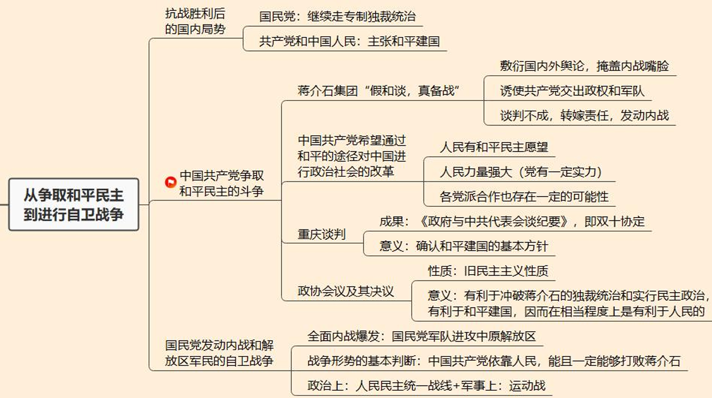
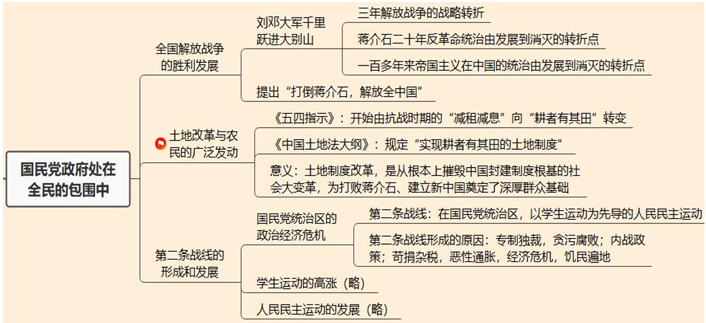
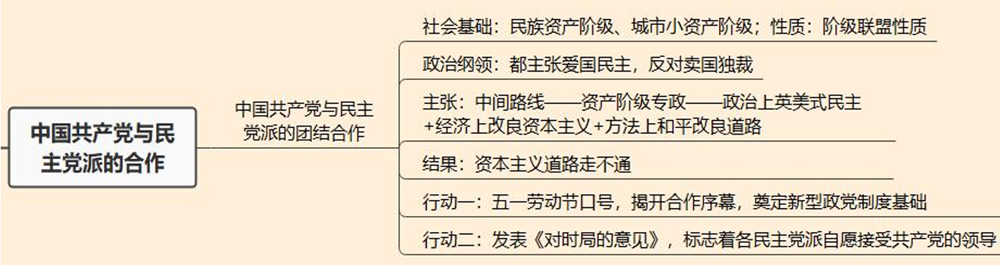
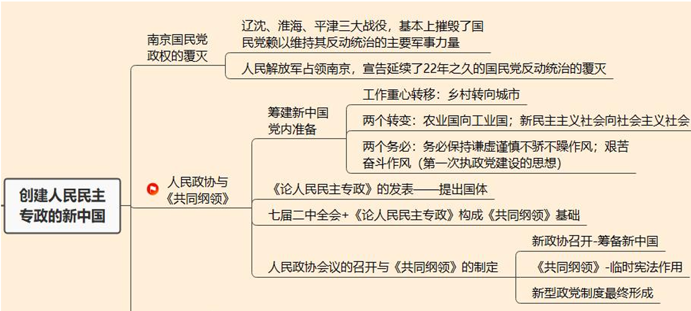
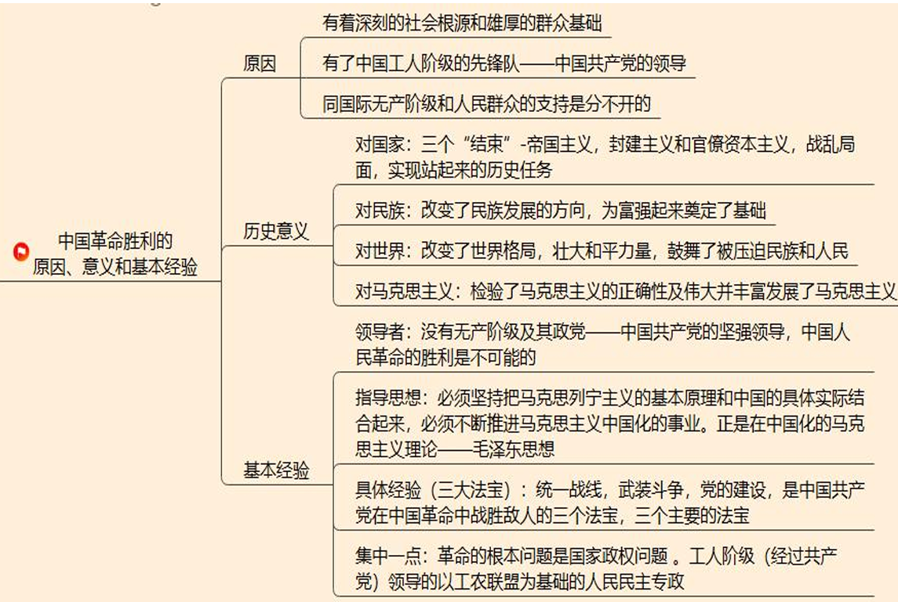
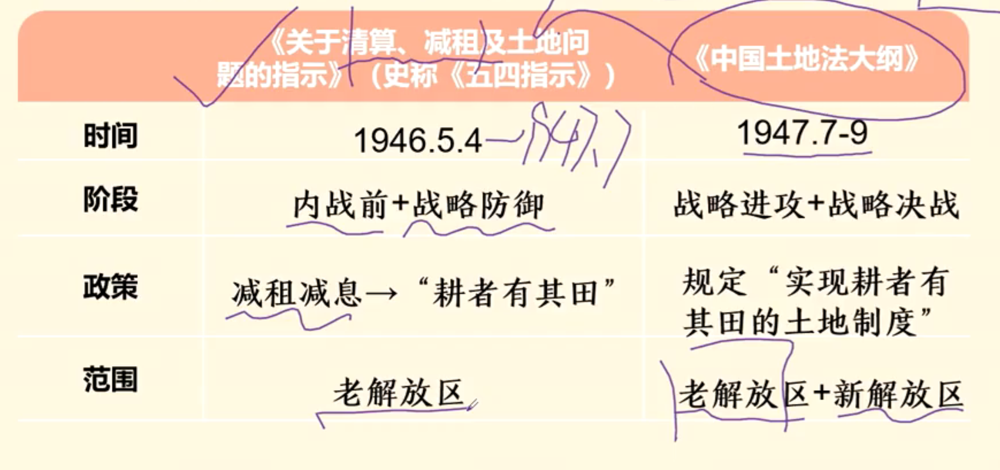

# 第七章 为建立新中国而奋斗(1945-1949)

## 考点

### 考点1：争取和平与全面内战

1.1 抗战胜利后国内局势

1.2 共产党-争取和平：蒋介石集团策略、共产党和平原因、重庆谈判、政协会议

1.3 国民党-内战：全面内战标志

### 考点2：解放战争与土改

2.1 解放战争：刘邓挺进大别山【转折点】【战略进攻的开始】

2.2 土地改革：《五四指示》《中国土地法大纲》

2.3 第二条战线

### 考点3：共产党与各民主党派

3 共产党与各民主党派的合作：==**社会基础【民资+小资+爱国知识分子】**==、阶级性质、政治纲领、各民主党派主张【中间路线】、==**五一劳动节口号、《对时局的意见》**==

### 考点4：建立新中国

4.1 南京国民党的覆灭：三大战役【辽沈、淮海、平津】

4.2 人民政协与《共同纲领》：两个转变、两个务必、《论人民民主专政》、七届二中全会、《共同纲领》

### 考点5：中国革命的胜利

5.1 中国革命胜利原因

5.2 中国革命胜利历史意义

5.3 胜利经验：领导者、指导思想、三大法宝、集中一点

## 第一节 从争取和平民主到击退国民党的军事进攻

### 1 中国共产党争取和平民主的斗争

1. 蒋介石集团的方针

    - 方针：**既定方针** 是以武力消灭共产党及其领导的人民军队和解放区政权。**现实政策**：一方面准备内战，另一方面又表示愿意和谈

    - **目的**

        （1）敷衍国内外舆论，掩盖内战嘴脸

        （2）诱使共产党交出政权和军队

        （3）谈判不成，转嫁责任，发动内战

2. 中国共产党的方针

    - 方针：通过和平的途径对中国进行政治社会的改革

    - 原因：

        （1）人民有和平民主愿望；

        （2）人民力量强大（党有一定实力）；

        （3）各党派合作也存在一定的可能性。

3. 重庆谈判和政治协商会议

    - 重庆谈判

        （1）准备：1945年8月25日，中共中央在在《对目前时局的宣言》中明确提出“和平、民主、团结”的口号

        （2）过程：从8月28日到10月10日结束

        （3）成果意义：10月10日，双方签署 **《政府与中共代表会谈纪要》** ，即 **双十协定**，确认 **和平建国的基本方针，同意“长期合作，坚决避免内战”**。

    - 重庆政协会议（旧政协）及其决议

        （1）时间地点：1946年1月10日 重庆

        （2）参与人员：共产党，国民党及民主党派

        （3）成果：五项协议

        （4）性质：非新民主主义性质（旧民主主义性质）

        （5）意义：（三个有利于）

        - 有利于冲破蒋介石的独裁统治和实行民主政治

        - 有利于和平建国

        - 有利于人民的（如保障共产党地位和根据地人民权利等）

    - 国共两党对待政协会议及其决议的态度

        （1）共产党：严格履行。同时明确“**练兵、减租与生产**”解放区三件中心工作

        （2）国民党：所代表的是大地主、大资产阶级的利益，其统治的社会基础极其狭隘，国民党统治集团从来没有准备去履行政协协议

### 2 全面内战

1. 全面内战爆发

    - **爆发标志：1946 年 6月26日，国民党军队进攻中原解放区**

    - 解放战争三大阶段：

        （1）战略防御：1946.6-1947.6

        （2）战略进攻：1947.6-1948.9

        （3）战略决战：1948.9-1949.10

2. 战争形势的基本判断

    - 论断：中国共产党依靠人民，能且一定能够打败蒋介石

    - 原因：经常性/决定性因素 - 人心向背

        （1）蒋介石发动的战争：反人民性质

        （2）人民解放军的战争：爱国+正义+革命

    - 方法：

        （1）政治上：党领导的人民民主统一战线（对朋友好）

        （2）军事上：**运动战**，集中优势兵力、各个歼灭敌人（对敌人狠）

## 第二节 全国解放战争与第二条战线

### 1 解放战争

1. 人民解放军转入战略进攻

    - **标志：1947年6月底 晋冀鲁豫野战军主力千里跃进大别山** - 大别山

    - 意义

        （1）微观：三年解放战争的战略转折

        （2）中观：蒋介石二十年反革命统治由发展到消灭的转折点

        （3）宏观：一百多年来帝国主义在中国的统治由发展到消灭的转折点

    - 延伸影响：1947年10月10日，中国人民解放军总部发表宣言，提出“打倒蒋介石，解放全中国”

### 2 土地改革运动

1. 从《五四指示》到《中国土地法大纲》

    {:height="70%" width="70%"}

2. 土地改革运动的热潮

    （1）广大农民分得土地并在政治上获得翻身，其政治觉悟和组织程度空前提高，农村生产力得到极大解放，工农联盟进一步巩固和加强

    （2）土地制度改革，是从根本上摧毁中国封建制度根基的社会大变革，为打败蒋介石、建立新中国奠定了深厚群众基础

### 3 第二条战线

1. 国民党统治区的政治经济危机

    - **第二条战线**：在国民党统治区，以学生运动为先导的人民民主运动也迅速地发展起来，成为配合人民解放战争的第二条战线。

    - **形成原因**

        （1）**政治**：专制独裁，贪污腐败

        （2）**军事**：内战政策

        （3）**经济**：苛捐杂税，恶性通胀，经济危机，饥民遍地

2. 学生运动的高潮（略）

    - 一二·一运动：1945年底，昆明学生，“反对内战，争取自由”

    - 五二〇运动：1947年5月20日，南京、北平等地爆发的反饥饿、反内战运动

3. 人民民主运动的发展（略）

## 第三节 共产党与各民主党派的团结合作

### 1 各民主党派的历史发展

1. 历史沿革

    - 大革命时期时：中国国民党（工农小民四大阶级）

    - 大革命时期后：

        （1）国民党：大地主，大资产阶级“**三座大山**”：**专制独裁**

        （2）共产党：工人、农民和小资产阶级（大多数）：**和平民主，新民主主义国家**

        （3）民主党派：民族资产阶级（主要）、城市小资产阶级、同这些阶级相联系的知识分子、其他爱国分子：**和平民主，旧民主主义资产阶级共和国**

2. 性质与纲领主张

    - 性质：阶级联盟性质

    - 成立时期（主要）：多数成立于抗日战争和全国解放战争时期

3. 第三条道路的幻灭

    - **各民主党派的目标：中间路线 - 资产阶级专政**

    - **各民主党派的主张**：

        （1）政治上：必须实现英美式的民主政治，不准地主和官僚资本家操纵

        （2）经济上：实行改良的资本主义，不允许官僚买办资本横行

        （3）方法上：走和平改良道路，实质就是旧民主主义道路

### 2 共产党与各民主党派的合作

1. 合作基础

    - 敌人：民主党派的政治纲领同中国共产党的新民主主义革命政纲基本上是一致的 - **敌人一致**

    - 政治纲领：主张爱国、反对卖国，主张民主、反对独裁 - **纲领一致**

    - **目标：不一致！不一致！不一致！**（重要的事情说三遍） - **目标不一致**

### 3 共产党领导的多党合作和政治协商格局的形成

1. 合作形成过程

    - **五一劳动节口号** - 揭开了中国共产党同各党派、各团体、各族各界人士协商建国的序幕，奠定了中国共产党领导的多党合作和政治协商制度的基础 - **揭开序幕** （但是各民主党派并没有主动接受共产党领导）

    - **《对时局的意见》** - **自愿地接受了中国共产党的领导，决心走人民革命的道路，拥护建立人民民主的新中国** - **接受领导**
    
    **民主党派参加新政协并将在新中国参政，标志着民主党派地位的根本变化**

2. 合作意义

    （1）为中国共产党领导的多党合作和政治协商制度奠定基础

    （2）资产阶级共和国的方案在中国是行不通的

## 第四节 建立人民民主专政的新中国

### 1 南京国民政权的覆灭

1. 辽沈、淮海、平津 **三大战役**

    - **时间**：1948.9，三大战役开始 - 标志 **战略决战** 开始

    - **意义**：

        （1）基本上摧毁了国民党赖以维持其反动统治的主要军事力量

        （2）无论是战争的规模还是取得的成果，在中国战争史上是空前的，在世界战争史上也是罕见的。这是人民战争的胜利，是毛泽东军事思想的胜利

2. 人民解放军向全国进军

    - 北平谈判（略）

    - 渡江战役（百万雄师过大江）：1949 年 4 月 21 日，毛泽东、朱德发布《向全国进军的命令》

    - 解放南京：人民解放军占领南京，**宣告延续了 22 年之久的国民党反动统治的覆灭**

### 2 人民政协与《共同纲领》

1. 筹建新中国 - 党内准备（做好自己+明确国体）

    - **中共七届二中全会** - 1949.3 - 西柏坡

        （1）提出了 **胜利后的基本政策**，指出了 **中国由农业国转变为工业国、由新民主主义社会转变为社会主义社会**的发展方向 - **基本政策与发展方向** - 基本政策

        （2）明确指出 **党的工作重心要从乡村转向城市** - 工作重心 - 工作重心

        > 进驻北平 **香山**，**标志着中国革命重心从农村转向城市**

        （3）告诫全党“两个务必”的思想。毛泽东指出，在胜利面前必须警惕资产阶级“糖衣炮弹”的攻击 - 两个务必

        > 两个务必：务必使同志们继续地保持谦虚、谨慎、不骄、不躁的作风，务必使同志们继续地保持艰苦奋斗的作风

    - 《论人民民主专政》 - 毛泽东 - 1949.6 - 北京香山

        （1）新中国国体：人民民主专政

        （2）人民民主专政的基础：是工人阶级、农民阶级和城市小资产阶级的联盟，而主要是工人和农民的联盟

        （3）对于民资：团结民族资产阶级。但民族资产阶级不能充当革命的领导者，也不应当在国家政权中占主要的地位。（参政党而不是执政党）

    - 历史意义

        **中共七届二中全会的决议** 和毛泽东的 **《论人民民主专政》**，构成了《中国人民政治协商会议共同纲领》的基础

2. 人民政协会议的召开——党外准备

    - 中国人民政治协商会议（新政协） - 1949.9北京

        （1）通过了《中国人民政治协商会议共同纲领》

        （2）选举毛泽东为主席的中央政府

        **意义**：创建中华人民共和国的筹备工作胜利完成，也 **标志** 着中国共产党领导的 **多党合作与政治协商制度的形成**

    - 《中国人民政治协商会议共同纲领》（《**共同纲领**》）

        （1）规定“中华人民共和国为新民主主义即人民民主主义的国家，实行工人阶级领导的、以工农联盟为基础的、团结各民主阶级和国内各民族的人民民主专政”

        （2）规定经济和外交方针

        地位：当时是全国人民的大宪章，起着临时宪法的作用

### 3 中国革命胜利原因、意义与经验

1. 中国革命胜利的原因

    （1）中国革命的发生不是偶然的，它有着深刻的 **社会根源和雄厚的群众基础**。（内部）随着斗争发展，民族资产阶级也逐步向共产党靠拢，这种现象被称作“**开万国未有之奇**”

    （2）中国革命之所以能够走上胜利发展的道路，是由于有了中国工人阶级的先锋队——中国共产党的领导。（领导）

    （3）中国革命之所以能够赢得胜利，同国际无产阶级和人民群众的支持是分不开的。（外部）

2. 中国革命胜利的意义

    （1）对国家：中国革命的胜利，结束了 100 多年来中华民族遭受资本-帝国主义侵略和中国各族人民遭受资本-帝国主义同封建统治阶级联合压迫与剥削的历史，结束了国家战乱频仍、四分五裂的局面，实现了中国人民梦寐以求的民族独立和人民解放

    （2）对民族：中国革命的胜利，从根本上改变了中国社会的发展方向，为实现由新民主主义到社会主义的转变和建立社会主义制度、进行社会主义现代化建设，扫清了主要障碍，创造了政治前提；为实现国家富强和人民幸福，实现中华民族伟大复兴，开辟了广阔道路

    （3）对世界：中国革命的胜利，是继十月社会主义革命和世界反法西斯战争胜利后世界历史中最重大的事件。极大改变了世界的政治格局，壮大了世界和平、民主和社会主义的力量，鼓舞了世界被压迫民族和被压迫人民争取解放的斗争

    （4）对马克思主义：中国人民革命的胜利，是在马克思列宁主义的指导下取得的。中国共产党创造性地运用马克思列宁主义的基本原理，把它同中国革命具体实际结合起来，形成了伟大的毛泽东思想，找到了夺取中国革命胜利的正确道路。这对于马克思列宁主义的发展是一个重大的贡献

3. 基本经验

    （1）领导者：没有无产阶级及其政党——中国共产党的坚强领导，中国人民革命的胜利是不可能的

    （2）指导思想：必须坚持把马克思列宁主义的基本原理和中国的具体实际结合起来，必须不断推进马克思主义中国化的事业。正是在中国化的马克思主义理论——毛泽东思想 【大革命最深刻的经验】

    （3）具体经验（三大法宝）：统一战线，武装斗争，党的建设

    （4）归结为一点：革命的根本问题是国家政权问题。工人阶级（经过共产党）领导的以工农联盟为基础的人民民主专政