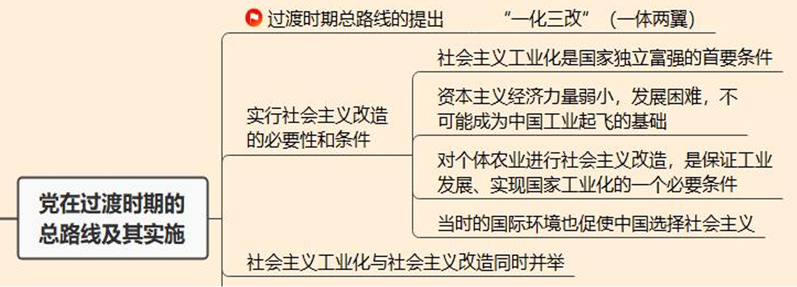

# 第八章 中华民族共和国的成立与中国社会主义建设道路的探索

## 考点

### 考点1：中华人民共和国成立

1.1 新中国成立与初期的考验

1.2 民主革命遗留任务

1.3 ==**维护国家主权和安全**==：三大外交政策【另起炉灶、打扫干净屋子再请客、一边倒】、抗美援朝、中国共产党的自身建设【三反、五反运动】

### 考点2：过渡时期

2.1 过渡时期总路线

2.2 社会主义改造的必要性和条件性

2.3 三大改造

### 考点3：社会主义基本制度

3.1 社会主义经济制度

3.2 社会主义政治制度

3.3 意义

### 考点4：良好开端

4.1 全面建设社会主义的开端

4.2 《论十大关系》

4.3 中共八大

4.4 《正确处理人民内部矛盾》

4.5 新经济政策

### 考点5：成果与成就

5 探索成就

## 第一节 中华人民共和国的成立与新生人民政权的巩固

### 1 中国人民站起来了

1. 新中国的成立

    - **内容**：1949年10月1日下午，首都北京30万军民在天安门广场隆重举行开国大典。毛泽东庄严宣告：“中华人民共和国中央人民政府今天成立了

    - **历史意义**

        （1）对国家：彻底结束了旧中国半殖民地半封建社会的历史，彻底结束了旧中国一盘散沙的局面，彻底废除了列强强加给中国的不平等条约和帝国主义在中国的一切特权，中国人从此站立起来了！中华民族发展进步从此开启了新纪元！ - 两个结束，一个废除，人民站立，民族崛起

        （2）对世界：冲破了帝国主义的东方战线，极大地改变了世界的政治格局，壮大了世界和平民主和社会主义的力量，对世界历史进程产生了深远的影响

        （3）对马克思主义：是马克思列宁主义在中国的胜利，是马克思列宁主义基本原理和中国革命具体实际相结合的思想 - 毛泽东思想的胜利。这个胜利，使马克思列宁主义、毛泽东思想在中国人民中获得很高的威信，被接受为人民共和国各项事业的指导思想，在世界范围内也扩大了它的影响

    ---

    **总结：新民主主义社会（1949-1956） - “过度社会”**

    - **背景**：反帝反封建的新民主主义革命完成后

    - **社会性质：过度社会**

    - **社会形态基本特征（骨骼+血肉）**

        **（1）经济上：五种经济成分并存**

        1. 国营经济（社会主义性质）——主导作用

        2. 个体经济（“十字路口”）——主体数量

        3. 私人资本主义经济（资本主义性质）

        4. 合作社经济（过渡性质）

        5. 国家资本主义经济（过渡性质）

        **（2）政治上：**

        1. 工人阶级（中国共产党）领导、以工农联盟为基础的，各革命阶级联合专政

        2. 新民主主义社会三种基本的经济成分及与之相应的四种基本的阶级力量（工人阶级、农民阶级、小资产阶级、资产阶级）之间的矛盾，就集中地表现为无产阶级与资产阶级的矛盾、社会主义与资本主义的矛盾

        **（3）文化上：**

        马克思主义指导下的民族的、科学的、大众的新民主主义的文化

        **（4）两大阶段：**

        1. 完成历史遗留任务恢复发展时期（1949-1952）

        2. 社会主义革命（改造）时期（1953-1956）

    ---

2. 面临的考验（四大考验）

    （1）政治方面：能不能保卫住革命胜利的成果，巩固新生的人民政权

    （2）经济方面：能不能战胜严重的经济困难，迅速恢复和发展国民经济

    （3）外交方面：能不能巩固民族独立，维护国家主权和安全

    （4）党建方面：能不能经受住全国执政的新考验，继续保持优良传统和作风

### 2 巩固新政权的伟大斗争

1. 完成民主革命的遗留任务

    （1）军事上：追缴残敌，肃清土匪，镇压反革命；

    （2）政治上：普遍召开地方各级各界人民代表会议，人民开始行使当家作主的民主权利

    （3）妇女解放上：1950年5月制定《中华人民共和国婚姻法》，废除封建婚姻制度，使广大妇女获得婚姻自由的权利；**【新中国第一部法律】**

    （4）经济方面（土地政策）：继续进行废除封建土地制度的改革，截止到1952年底彻底废除了封建地主土地所有制，转变为 **农民土地私有制**

2. 领导国民经济恢复工作

    没收官僚资本，在企业内部开展民主改革和生产改革，确立起 **社会主义性质的国营经济** 在国民经济中的领导地位，使人民政权拥有了相当重要的 **经济基础**

3. 教育科学文化卫生事业除旧布

    随着国民经济恢复和经济建设的开展，其他各方面的建设都有相应的发展。在宣传思想工作方面，党和政府掌握舆论工具，确立马克思主义在全国的指导地位

4. 巩固民族独立，维护国家主权和安全

    - **废除一切不平等条约和新中国三大外交政策：**

        （1）新中国废除了帝国主义国家依据不平等条约在中国享有的一切特权

        （2）明确三大外交方针：**“另起炉灶”“打扫干净屋子再请客”“一边倒(苏联)”** 及建立了平等互助的新型中苏同盟关系

    - **抗美援朝，保家卫国**

        （1）起因：1950年6月，朝鲜战争爆发，美国宣布武装援助南朝鲜，同时命令其第七舰队开入台湾海峡，公然干涉中国内政

        （2）经过结果：1953年7月迫使美国代表在停战协定上签字

        （3）性质：抗美援朝战争是一场抗击美国侵略者的正义战争。

        （4）意义：打出了新中国的国威和人民军队的军威，创造了以弱胜强的范例，打破了美军不可战胜的神话。抗美援朝战争的伟大胜利 ，是中国人民站起来后屹立于世界东方的宣言书， 是中华民族走向伟大复兴的重要里程碑。

5. 加强中国共产党的自身建设

    - 三反运动

        （1）背景：新中国成立后部分党政干部出现官僚主义，腐败现象

        （2）时间：1951-1952

        （3）范围：党政机关干部

        （4）内容：反贪污、反浪费、反官僚主义

    - 五反运动

        （1）背景：整顿经济秩序，打击不法资本家

        （2）时间：1952

        （3）范围：不法资本家

        （4）内容：反行贿、偷税漏税、盗窃国家财产、偷工减料、盗窃经济情报

## 第二节 党在过渡时期的总路线与实施措施(1953-1956)

### 1 过渡时期总路线

1. 过渡时期总路线

    - 背景：经过三年左右的时间（1949-1952），民主革命的遗留任务已经解决，社会主要矛盾开始逐步转变

    - 时间：1953

    - **内容：在一个相当长的时期内，逐步实现国家的社会主义工业化，并逐步实现国家对农业、对手工业和对资本主义工商业的社会主义改造。** - 一化三改 或者 一体（工业化）两翼（三大改造）

2. 过渡时期总路线反映了历史的必然性（为什么提出过渡时期总路线）

    （1）社会主义工业化是国家独立富强的首要条件

    （2）资本主义经济力量弱小，发展困难，不可能成为中国工业起飞的基础

    （3）对个体农业进行社会主义改造，是保证工业发展、实现国家工业化的一个必要条件

    （4）当时的国际环境也促使中国选择社会主义（苏联）

### 2 社会主义工业化起步

1. 极具中国特色的过度道路

    生产力 - 社会主义工业化与生产关系 - 社会主义三大改造同时并举。

2. “一五”计划的制定与实施（1953-1957）

    - 地位：完成过渡时期总路线规定的工业化主体任务的重要步骤

    - **指导方针：突出了集中主要力量发展重工业，建立国家工业化和国防现代化的初步基础的核心要点，同时要求相应地发展交通运输业、轻工业、农业和商业。** - 重工业第一

    - 意义：为我国建立独立完整的工业体系奠定了基础，为社会主义建设积累了宝贵经验

### 3 改造个体农业和手工业（三大改造之一）

1. 农业合作化任务的提出

    - 土改后（1952年）提出合作化的原因

        （1）农村生产发展，农民生活显著提高

        （2）农民生产经营仍困难，小农经济不稳定，农村中的贫富分化也开始了

    - 农民两大积极性

        个体经济的积极性和劳动互助的积极性

2. 农村合作化的基本方针

    - 政策依据：《关于发展农业生产合作社的决议》

    - 形式：**互助组 → 初级农业生产合作社 → 高级农业生产合作社**

    - 道路：先合作化，后机械化

    - 方针：积极发展、稳步前进、逐步过渡

    - 原则：自愿互利

    - 方法：典型示范、逐步推广

    - 标准：是否增产

    - 完成：1956年年底，农业合作化基本完成

    - 意义：中国农村完成了从几千年的分散个体劳动向集体所有、集体经营的历史性转变。这是中国历史上一次伟大的社会变革、社会进步 - **私有制到公有制的转变**

3. 手工业合作化的实现

    （1）方针：积极领导、稳步前进

    （2）形式：手工业生产合作小组 → 手工业供销合作社 → 手工业生产合作社

    （3）步骤：从供销入手，由小到大，由低到高

    （4）时间：1956年底基本完成

### 4 资本主义工商业改造（三大改造之二）

1. 资本主义工商业改造

    - 定义：把民族资本主义工商业改造成为社会主义性质的企业，并对民族资产阶级实行 **赎买政策**

    - 原因：民族资产阶级在社会主义时期的 **两面性（剥削和愿意接收改造）**

    - 作用：增加产品供应、扩大商品流通、维持工人就业、为国家提供税收；有利于争取民族资产阶级及其知识分子

    - **形式：国家资本主义** 是我们利用和限制工业资本主义的主要形式

    - 步骤：**初级形式的国家资本主义**（工业中的收购、加工、订货、统购、包销；商业中经销、代销、代购代销、公私联营） - **高级形式的国家资本主义**（公私合营：个别企业；全行业）

    - 利润分配办法：个别企业的公私合营，企业利润采取“四马分肥”的办法，即分为国家所得税、企业公积金、工人福利费、股金红利四个部分

**总结：三大改造的形式/时间及三步走过程**

## 第三节 社会主义基本制度的确立

### 1 社会主义经济制度

1. 经济制度的确立

    - 社会主义经济制度特征：**以生产资料公有制、按劳分配和计划经济体制** - 《三大改造》
    
    - 意义：
    
        **（1）社会主义经济制度确立，是中国进入社会主义社会最主要的标志**

        **（2）全面建设社会主义时期**

        **（3）社会主义初级阶段开启**

### 2 社会主义政治制度

1. 政治制度确立标志

    1954年9月，中华人民共和国第一届全国人民代表大会第一次会议在北京召开。大会讨论并通过了 **《中华人民共和国宪法》** 。这是一部社会主义类型的宪法，体现了人民民主原则和社会主义原则

### 3 社会主义基本制度确立的意义

1. 总意义

    中华人民共和国成立、社会主义制度的建立，是中华民族有史以来最为广泛而深刻的社会变革，为当代中国一切发展进步奠定了根本政治前提和制度基础，为中国发展富强、中国人民生活富裕奠定了坚实基础，实现了中华民族由不断衰落到根本扭转命运、持续走向繁荣富强的伟大飞跃。

2. 具体意义

    （1）社会主义基本制度的确立极大地提高了工人阶级和广大劳动人民的积极性、创造性，为社会生产力的大发展开辟了广阔道路。

    （2）社会主义基本制度的确立为当代中国的一切发展进步提供了根本政治保障

    （3）社会主义基本制度的确立为社会主义先进文化的发展指明了前进方向

    （4）社会主义制度的确立标志着中国这个占世界 1/4 人口的东方大国进入了社会主义社会

## 第四节 社会主义建设的良好开端

### 1 全面建设社会主义的开始

1. 全面建设社会主义的背景

    - 国内

        三大改造的初步完成，我们进入社会主义的初级阶段，开始了全面建设社会主义的新时期

    - 国际

        西方封锁松动，中国外交初见成效，为国内和平建设提供了保证；苏共二十大的经验和教训

    - 结论：

        **要独立自主探索中国特色社会主义发展道路**

2. "第二次结合"的提出

    1956 年4月毛泽东提出的关于实行马克思主义同中国实际的“第二次结合”的任务，为探索适合中国情况的社会主义建设道路，提供了基本的指导原则

    第二次结合：提出于毛泽东，开始于邓小平，进行与习近平

### 2 早期探索的积极进展

1. 《论十大关系》的发表 - 1956.4

    - 方针：调动国内外一切积极因素，为社会主义服务

    - **核心内容：处理好农轻重比例关系**

    - 历史意义：以毛泽东为主要代表的中国共产党人开始探索中国自己的社会主义建设道路的标志，它在新的历史条件下从经济方面（这是主要的）和政治方面提出了新的指导方针，为中共八大的召开作了理论准备

2. 中共八大路线的制定 - 1956.9

    - 主要矛盾：人民对于经济文化迅速发展的需要同当前经济文化不能满足人民需要的状况之间的矛盾

    - 主要任务：集中力量发展社会生产力，实现国家工业化，逐步满足人民日益增长的物质和文化需要

    - 经济建设：既反保守又反冒进即在综合平衡中稳步前进

    - 政治建设：既要扩大社会主义民主、健全社会主义法制，使党和政府的活动做到"有法可依"和"有法必依"

    - 执政党建设：健全党内民主集中制，坚持集体领导制度，反对个人崇拜

    - 陈云提出"三个主体、三个补充"思想

    八大后新提法：1956年12月毛泽东提出可以消灭资本主义，又可以搞资本主义，这叫“新经济政策”

3. 《关于正确处理人民内部矛盾的问题》的发表

    - 背景

        国内三大改造的过急与党和政府存在着一些官僚主义作风；国际波匈事件的影响

    - 提出

        1957 年2 月，毛泽东在扩大的最高国务会议上发表《关于正确处理人民内部矛盾的问题》的讲话，阐明社会主义社会的重大理论问题

    - 内容

        （1）第一，矛盾是普遍存在的，社会主义社会也充满着矛盾，正是这些矛盾推动着社会主义社会不断地向前发展。 - （社会主义有矛盾）
        
        > 社会主义社会的基本矛盾：生产关系和生产力之间的矛盾、上层建筑和经济基础之间的矛盾；非对抗性；可以通过社会主义制度本身的自我调整和自我完善不断地得到解决。

        （2）社会主义制度下还存在着 **敌我矛盾** 和 **人民内部矛盾**，把正确处理人民内部矛盾作为国家政治生活的主题； - （社会主义两类矛盾）

        （3）解决两类矛盾的方法各不相同。一方面，对待敌我矛盾要采用专政的手段；另一方面，对待人民内部矛盾使用民主和说服教育的方法。具体表现为：

        - 在政治思想领域，实行“团结—批评—团结”的方针；

        - 在物质利益、分配方面，实行“统筹兼顾、适当安排”的方针

        - 对科学文化领域里的矛盾，实行“百花齐放，百家争鸣”的方针

        - 对于共产党和民主党派的矛盾，实行在坚持社会主义道路和党的领导前提下的“长期共存，互相监督”的方针

4. 整风运动和反右派斗争（略）

## 第五节 受挫与改正(1958-1976)

### 1 大跃进

不能体现四个好

### 2 四个现代化

略

### 3 文化大革命

不能体现四个好

### 4 全面建设社会主义的成就

1. 独立的、比较完整的工业体系和国民经济体制的建立

    - 成就：

        从根本上解决“从无到有”的问题，基本建立了独立的、比较完整的工业体系和国民经济体系，使中国在经济上赢得了独立，为中国以后的发展奠定了物质技术基础

    - 现实：
        
        **并没有完成工业化**

2. 人民生活水平的提高与文化、教育、医疗、科技事业的发展

    两弹：核弹 + 导弹

    一星：人造卫星

3. 形成历久弥坚的时代精神

    大庆精神：没有条件制造条件也要上

    红旗渠精神：不怕吃苦，挑战自然

    雷锋精神：舍己为人，为人民服务

4. 国际地位的提高与国际环境的改善

    万隆会议：发展中国家

    恢复联合国合法席位

    中美关系正常化

5. 探索中形成的建设社会主义的若干重要原则

    宝贵经验、理论准备、物质基础