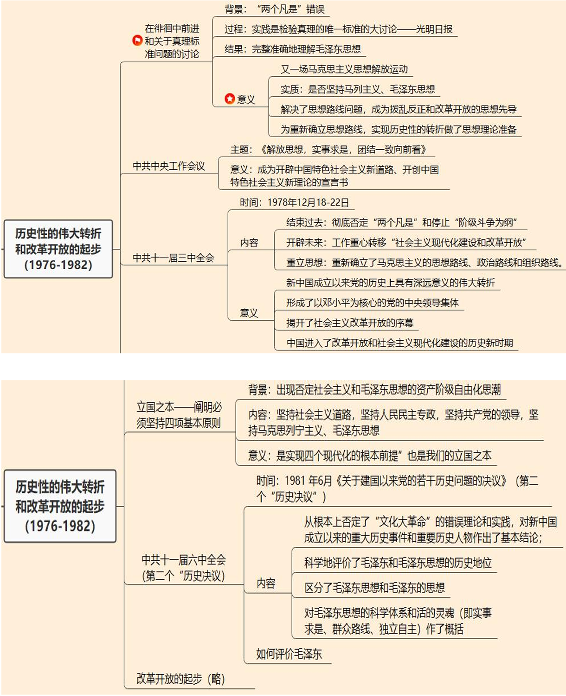
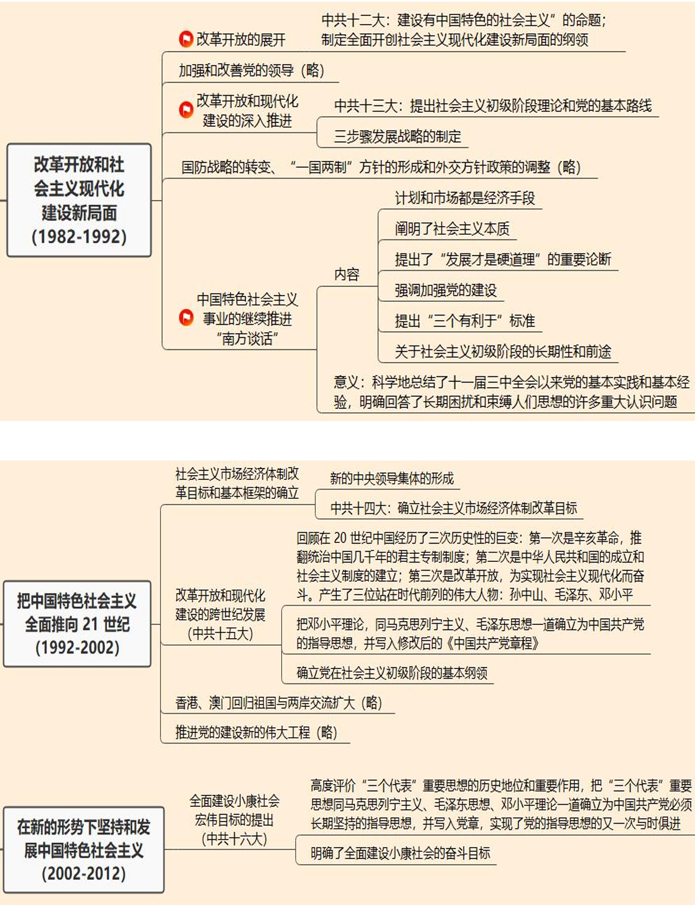
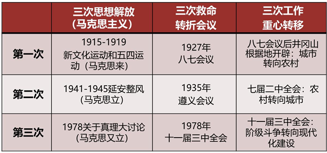

# 第九章 改革开放与中国特色社会主义的开创和发展(1976-2012)

## 考点

1 关于真理标准的讨论：“两个凡是”错误、时间是检验真理的唯一标准

2 《解放思想，实事求是，团结一致向前看》

3 一系列会议：十一届三中全会、十一届六中全会（第二个历史决议）、中共十二大【中国特色社会主义】、中共十三大【社会主义初级阶段理论和基本路线】、中共十四大【社会主义市场经济】、中共十五大【基本纲领】、中共十六大

4 四项基本原则

5 南方谈话：社会主义本质理论

## 第一节历史性的伟大转折和改革开放的起步（1976-1982）

### 1 历史性的伟大转折和中国特色社会主义的开创

> 关注邓小平：诞辰120周年

1. 在徘徊中前进和关于真理标准问题的讨论

    - 背景：

        （1）凡是毛主席作出的决策，我们都坚决维护

        （2）凡是毛主席的指示，我们都始终不渝地遵循

    - 过程：

        实践是检验真理的唯一标准的大讨论1978年5月11日，光明日报发表了《实践是检验真理的唯一标准》一文，引发全国讨论

    - 结果：

        完整准确地理解毛泽东思想

    - 意义：

        （1）又一场马克思主义思想解放运动

        （2）实质：是否坚持马列主义、毛泽东思想

        （3）解决了思想路线问题，成为拨乱反正和改革开放的思想先导

        （4）为重新确立思想路线，实现历史性的转折做了思想理论准备

2. 中共中央工作会议

    - 时间：1978年11月10日至12月15日

    - 主题：

        邓小平做了题为《解放思想，实事求是，团结一致向前看》的重要讲话

    - 意义：

        （1）把解放思想、实事求是，坚持实践标准提到党的思想路线的高度

        （2）为重新确立党的思想路线奠定了基础

        **（3）成为开辟中国特色社会主义新道路、开创中国特色社会主义新理论的宣言书**

        （4）为十一届三中全会实现具有划时代意义的伟大转折奠定了重要基础

3. 中共十一届三中全会

    - 时间：1978年12月18-22日

    - 内容：

        （1）彻底否定了“两个凡是”的错误方针，高度评价了关于真理标准问题的讨论

        （2）停止使用“以阶级斗争为纲”的口号

        **（3）做出了把工作重点转移到社会主义现代化建设上来和实行改革开放的战略决策**

        （4）重新确立了马克思主义的思想路线、政治路线和组织路线

    - 意义

        **（1）新中国成立以来党的历史上具有深远意义的伟大转折**

        > 新中国成立后唯一一次转折

        （2）形成了以邓小平为核心的党的中央领导集体

        （3）揭开了社会主义改革开放的序幕

        （4）中国进入了改革开放和社会主义现代化建设的历史新时期

        （5）"拨乱反正"的开始

---

**总结：三次思想解放/三次救命转折会议/三次工作重心转移**

---

### 2 拨乱反正的完成

1. 大规模平反冤假错案和调整社会关系

2. 阐明必须坚持四项基本原则

    - 背景：

        十一届三中全会后，有的人对解放思想加以曲解，肆意夸大中国共产党和毛泽东所犯的错误，企图否定中国共产党的领导，否定社会主义制度，否定毛泽东和毛泽东思想

    - 内容：

        1979 年 3 月 30 日，邓小平在理论工作务虚会上作了题为《坚持四项基本原则》的讲话，首次提出“四项基本原则”这一概念。

        （1）坚持社会主义道路

        （2）坚持人民民主专政

        （3）坚持共产党的领导

        （4）坚持马克思列宁主义、毛泽东思想

    - 意义

        这四项基本原则，“是实现四个现代化的根本前提”也是我们的立国之本

3. 《关于建国以来党的若干历史问题的决议》（第二个“历史决议”）的通过

    - 时间地点：

        1981 年6月 党的十一届六中全会

    - 内容：

        （1）从根本上否定了“文化大革命”的错误理论和实践，对新中国成立以来的重大历史事件和重要历史人物作出了基本结论

        （2）科学地评价了毛泽东和毛泽东思想的历史地位

        （3）区分了毛泽东思想和毛泽东的思想

        （4）对 **毛泽东思想的科学体系和活的灵魂（即实事求是、群众路线、独立自主）** 作了概括，强调毛泽东思想是我们党的宝贵的精神财富，它将长期指导我们的行动

    - 如何评价毛泽东同志

    - 意义

        **第二个“历史决议”的通过标志着拨乱反正的完成**

---

总结：几个名词

毛泽东思想活的灵魂：实事求是、独立自主、群众路线

中国革命胜利的三大法宝：武装斗争、统一战线、党的建设

工农武装割据内容：武装斗争、土地革命、根据地建设

---

## 第二节 改革开放和社会主义现代化建设新局面（1982-1992）

### 1 两个会议

1. 中共十二大

    - 时间：1982年9月

    - 内容：

        主要内容：邓小平同志提出“**建设有中国特色的社会主义**”的命题；制定全面开创社会主义现代化建设新局面的纲领

2. 中共十三大

    - 时间：1987

    - 内容：

        系统阐述了社会主义初级阶段理论，明确概括了党在社会主义初级阶段的基本路线

### 2 一次谈话

1. 南方谈话

    - 时间：1992

    - 内容：邓小平先后视察武昌、深圳、珠海、上海等地，发表重要谈话

        （1）计划和市场都是经济手段

        **（2）阐明了社会主义本质**：社会主义是 解放生产力、发展生产力；生产关系上消除剥削、消除贫富两极分化，达到共同富裕

        （3）提出了“发展才是硬道理”的重要论断

        （4）提出“三个有利于”标准

        （5）强调加强党的建设

        （6）关于社会主义初级阶段的长期性和前途

    - 历史意义

        科学地总结了十一届三中全会以来党的基本实践和基本经验，明确回答了长期困扰和束缚人们思想的许多重大认识问题。

## 第三节 把中国特色社会主义全面推向 21 世纪（1992-2002）

1. 中共十三届四中全会：新的中央领导集体的形成

    - 时间：1989

    - 内容：

        形成了以江泽民同志为核心的党的第三代中央领导集体，中央领导集体顺利实现了新老交替。这对于保证党的政策的稳定性、连续性，实现党和国家的长治久安，具有极为重大的意义

    > 江泽民去世，关注一下

2. **中共十四大：确立社会主义市场经济体制改革目标**

    - 时间：1992

    - **内容：确定我国经济体制改革的目标是建立社会主义市场经济体制。**

3. 中共十五大：提出邓小平理论

    - 时间：1997

    - 内容：

        （1）回顾在 20 世纪中国经历了三次历史性的巨变：第一次是辛亥革命，推翻统治中国几千年的君主专制制度；第二次是中华人民共和国的成立和社会主义制度的建立；第三次是改革开放，为实现社会主义现代化而奋斗。产生了三位站在时代前列的伟大人物：孙中山、毛泽东、邓小平

        （2）把邓小平理论，同马克思列宁主义、毛泽东思想一道确立为中国共产党的指导思想，并写入修改后的《中国共产党章程》

        （3）确立党在社会主义初级阶段的基本纲领

## 第四节 在新的形势下坚持和发展中国特色社会主义（2002-2012）

1. **中共十六大：全面建设小康社会目标的提出**

    - 时间：2002

    - 内容：

        （1）高度评价“三个代表”重要思想的历史地位和重要作用，把“三个代表”重要思想同马克思列宁主义、毛泽东思想、邓小平理论一道确立为中国共产党必须长期坚持的指导思想，并写入党章，实现了党的指导思想的又一次与时俱进

        （2）明确了全面建设小康社会的奋斗目标