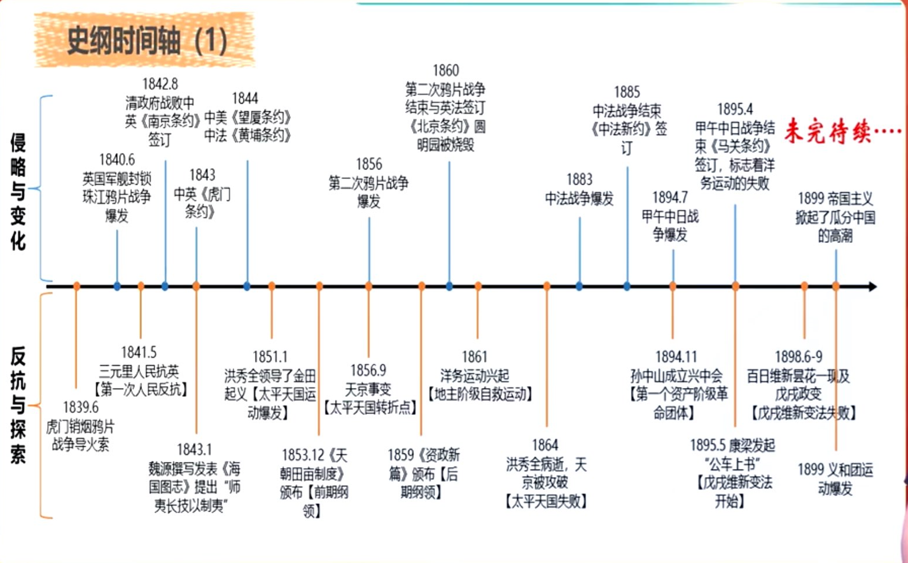

# 序言 - 史纲

## 史纲概况与方向

### 是什么

1. 史纲：中国近现代史的：基础知识，基本线索和发展规律

2. 史纲是什么

    - 一场战争，一个社会

        鸦片战争；双半社会

    - 两大矛盾，两大任务

        两大矛盾：帝国主义&中华民族；封建主义&人民大众

        一大任务：站起来 打倒帝国主义，求得民族独立；推翻封建主义，实现人民解放（前提保障） - 近代史

        二大任务：富起来 国家富强；人民富裕（目标方向） - 现代史

    - 三大阶段

        一大阶段：旧民主主义革命时期(1840-1919)

        > 旧：资产阶级领导  
        > 民主主义:反帝反封建的资产阶级性质革命  
        > 革命：由革命的对象决定革命的性质

        二大阶段：新民主主义革命时期(1919-1949)

        > 新：工人阶级领导

        三大阶段：社会主义主义革命、建设、改革和新时代(1949-)

    - 四大主旨

        马克思主义

        中国共产党

        社会主义

        改革开放

### 为什么

所有的问题都指向回答四个问题：为什么

1. 马克思主义好

2. 中国共产党好

3. 社会主义好

4. 改革开放好

考研政治的史纲里的所有的知识点、考点都与这四个问题有关。

### 怎么考

1. 考核形式与分值

    - 单项选择题：4个，4分（10，11，12，13题）

    - 多项选择题：3个，6分（27，28，29）

    - 材料分析题：1个，两小问，每题10分，共4-10分（36）

    - 总共20分

2. 命题特点：内容多，涉及广，时政化

    1. 全都考重大历史事件

    2. 至少有14分和时政新闻密切相关

    3. 整数纪念历史事件

    4. 难题不考记忆（经常不考教材原话），重于理解推理

## 史纲线索与框架

### 两大线索

1. 侵略与变化 - 提供国情

2. 反抗与探索 - 方向目标

### 框架

重点在1-7章（17分），重中之重在4-7章

## 复习方法和课程

### 四大方法

1. 时间轴梳理法

2. 图表对比法

3. 故事引入归类总结法

4. 谐音/口诀总结法

