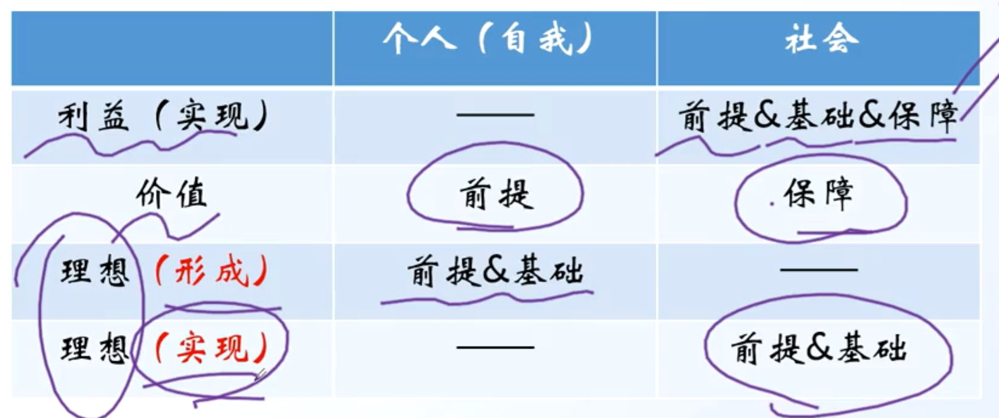

# 第二章 追求远大理想 坚定崇高信念

## 第一节 理想信念

### 1 理想信念是什么

1. 理想的内涵与特征

    - 理想的内涵

        理想是人们 **在实践中形成的、有实现可能性的、对未来社会和自身发展目标的** 向往与追求

    - 理想的分类

        （1）根据范围不同：个人理想和社会理想；

        （2）根据实现时间不同：近期理想和远期理想；

        （3）根据内容不同：生活理想、职业理想、道德理想和政治理想（社会理想）

    - 理想的特征

        （1）超越性：源于现实，超越现实

        （2）实践性：在实践中产生，在实践中发展与实现

        （3）时代性：带有历史时代的烙印

        注意：理想一定能实现（需要努力）。不能实现的不是理想

2. 信念的内涵与特征

    - 信念的内涵

        信念是人们在一定的认识基础上确立的对某种思想或事物坚信不疑并身体力行的精神状态。

    - 信念的特征

        （1）执着性：不会轻易改变

        （2）支撑性：个人，社会，国家发展的精神动力

        （3）多样性：不同的人会形成不同的信念；同一个人也会形成不同类型和层次的信念

        高层次的信念决定低层次的信念

        信仰是最高层次的信念，具有最大的统摄力。信仰有盲目和科学之分。

3. 理想与信念的关系

    （1）理想和信念总是相互依存

    （2）理想是信念所指的对象，信念则是理想实现的保障

### 2 理想信念的作用[主观题考点：背诵]

1. 理想信念是精神之“钙”[主观题考点：背诵]

    理想指引方向，信念决定成败。理想信念是人生发展的内在动力。

    （1）理想信念昭示奋斗目标；

    （2）理想信念催生前进动力；

    （3）理想信念提供精神支柱；

    （4）理想信念提高精神境界。

    （5）理想信念凝聚着家国情怀

## 第二节 正确的理想信念

1. 增强对马克思主义、共产主义的信仰

    - 为什么要信仰马克思主义

        （1）马克思主义是科学的理论，创造性地揭示了人类社会发展规律。——科学性

        （2）马克思主义是人民的理论，第一次创立了人民实现自身解放的思想体系。——人民性

        （3）马克思主义是实践的理论，指引着人民改造世界的行动。——实践性

        （4）马克思主义是不断发展的开放的理论，始终站在时代前沿。——发展开放性

        中国共产党为什么能，中国特色社会主义为什么好，归根到底是因为马克思主义行！

    - 胸怀共产主义远大理想

        ==**远大理想、最总理想只有一个：共产主义**==

2. 增强对中国特色社会主义的信念

    - 共同理想：中国特色社会主义

        （1）新时代坚持和发展中国特色社会主义，**总任务**： 是实现社会主义现代化和中华民族伟大复兴，在全面建成小康社会的基础上，分两步走，**总目标**： 在 21 世纪中叶建成富强民主文明和谐美丽的社会主义现代化强国

        （2）中国共产党的领导是中国特色社会主义最本质的特征

3. 增强对实现中华民族伟大复兴的信心

    （1）实现中华民族伟大复兴，是中华民族近代以来最伟大的梦想。

    （2）实现中华民族伟大复兴的中国梦是一项光荣而艰巨的事业。

## 第三节 如何实现理想信念

### 1 科学把握理想与现实的辩证统一

1. 辩证看待理想与现实的矛盾（理想与现实是对立统一的）

    - 对立（区别）：属于“应然”和“实然”的矛盾

    - 统一（联系）：

        （1）现实中包含着理想的因素，孕育着理想的发展

        （2）理想中也包含着现实，既包含着现实中必然发展的因素，又包含着由理想转化为现实的条件

        （3）在一定条件下，理想就可以转化为未来的现实。——重要途径“实践”

2. 实现理想的长期性、艰巨性和曲折性

3. 艰苦奋斗是实现理想的重要条件

    - 地位：艰苦奋斗是我们的传家宝

    - 要求：

        （1）艰苦奋斗永不过时

        （2）为了理想吃大苦耐大劳

4. **总结：如何科学把握理想与现实的关系**[主观题考点]

    （1）辩证看待理想与现实的矛盾

    “应然”和“实然”的相互区别、但是相互包含，可以通过实践实现

    （2）实现理想需要长期、艰巨和曲折的奋斗

    （3）艰苦奋斗是实现理想的重要条件

    艰苦奋斗是我们的传家宝、艰苦奋斗永不过时，要为了理想吃大苦耐大劳。

    梦在前方，路在脚下。自胜者强，自强者胜。实现我们的发展目标，需要广大青年锲而不舍、驰而不息的奋斗，不断书写奉献青春的时代篇章

### 2 坚持个人理想与社会理想的有机结合

1. 坚持个人理想与社会理想的有机结合/个人理想与社会理想的关系

    （1）**个人理想以社会理想为指引**。在整个理想体系中，社会理想是最根本、最重要的，而个人理想则从属于社会理想

    （2）**社会理想是对个人理想的凝练和升华**。强调个人理想要符合社会理想，并不是要排斥和抹杀个人理想。**当社会理想同个人理想有矛盾冲突的时候，有志气、有抱负的人可以作出最大的自我牺牲，使个人的理想服从于全社会的共同理想**

    （3）**在实现社会理想的过程中努力实现个人理想**

---

总结：利益、价值和理想从两个维度看谁是“前提”

---

### 3 为实现中国梦注入青春能量

1. 怎么做/如何实现理想信念

    （1）立鸿鹄志，做奋斗着 （立志当高远）

    （2）心怀“国之大者”，敢于担当

    “要立志做大事，不要立志做大官”——孙中山；

    （3）自觉躬身实践，知行合一

    “空谈误国，实干兴邦”——顾炎武；