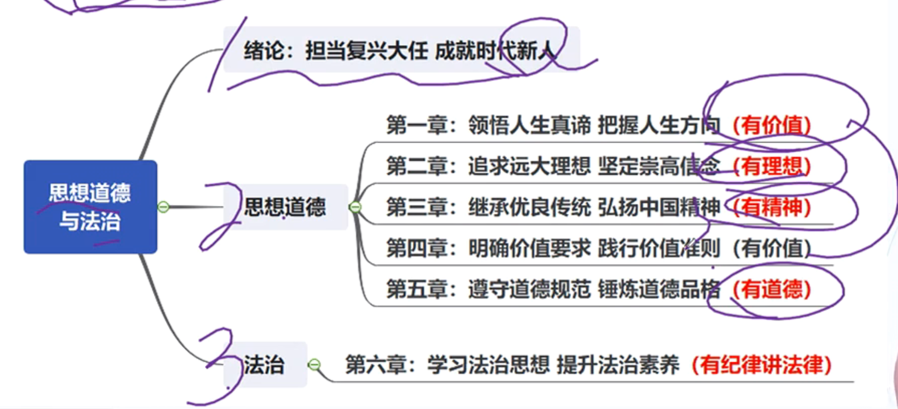

# 导学：思想道德与法制

## 学科概况与命题特点

1. 学科概况

    内容：**思想教育、道德教育 + 法律教育**，帮助学生树立正确的世界观、人生观和价值观

    - 一个目标：培养社会主义合格建设者和可靠接班人

    - 两大素养：思想道德素养和法律素养

    - 三观建设：世界观、人生观和价值观

    - 五有新人：有理想、有价值、有精神、有道德、有纪律（懂法律）

2. 题型与分值

    - 单选：1个，1分 - 14题

    - 多选：2个，4分 - 30、31题

    - 材料分析题：1个，两笑纹，10分 - 37题

    共：15分

3. 命题特点

    - 选择题：思想道德部分在单选；法律部分在多选

    - 分析题：侧重考察 思想教育+道德教育

        1. 怎么看（...是什么；...的内涵）

        2. 怎么办（如何...相关的知识点）

    - 关注社会热点事件，尤其是习近平重点表扬的道德模范、时代先锋等优秀代表

    - 整体考察侧重记忆

## 脉络与框架

1. 两大线索

    新的时代 - 国情与任务

    时代新人 - 方向与目标

2. 知识框架

    

## 复习方法

1. 两种思路

    - 思路一：是什么、怎么看

    - 思路二：怎么做、怎么办

2. 复习战略方向

    - 战略上重视

    - 有很多文言、诗词名句，需要读懂与知识点对应

    - 总结大题背诵模板，懂得运用