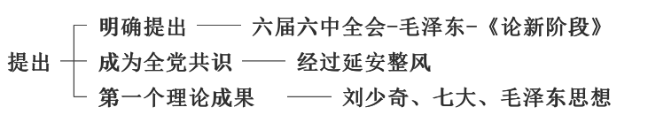

# 导论：马克思主义中国化时代化

## 考点

## 考点1：马克思主义中国化

1.1 马克思主义中国化的含义

1.2 马克思主义中国化的提出

## 考点2：飞跃

1.1 第一次飞跃

1.2 新的飞跃（第二次飞跃）

1.3 新的飞跃

## 考点3：两个结合

## 1 内涵

1. 中国共产党能够把握历史主动的根本原因

    **拥有马克思主义科学理论指导** 是中国共产党坚定信仰信念、把握历史主动的 **根本所在**，是中国共产党鲜明的政治品格和强大的政治优势

2. 马克思主义中国化时代化的内涵

    （1）运用马克思主义的立场、观点和方法，观察时代、把握时代、引领时代，解决中国革命、建设、改革中的实际问题 - **用它的理论解决我的问题**

    （2）总结和提炼中国革命、建设、改革的实践经验并将其上升为理论，不断丰富和发展马克思主义的理论宝库，赋予马克思主义以新的时代内涵 - **用我的问题丰富它的理论**

    （3）运用中国人民喜闻乐见的民族语言来阐述马克思主义，使其植根于中华优秀传统文化的土壤之中，具有中国特色、中国风格、中国气派 - **将马克思理论与中国文化融合起来**

    > 选择题方法：考研政治选择题不会出现书上的原文表述，经常是理解性的转述。左边是原文表述，右边是自己的概括，需要理解表述之后，记忆自己的的概括。

3. 马克思主义中国化的命题

    - **提出标志**：毛泽东在 **党的六届六中全会** 上作了 **《论新阶段》** 的报告

    - **第一次历史性飞跃**：在 **党的七大上**，**刘少奇** 代表党中央作了《关于修改党章的报告》，对马克思主义中国化从理论上作了进一步的阐述，并指出毛泽东思想是“中国化的马克思主义”。

    - 第二次结合：《论十大关系》 
    
    - 第二次飞跃：改革开放

    - 新的飞跃：习近平新时代中国特色社会主义

    > 考研政治特点：时间不重要

4. 推进马克思主义中国化时代化的 **必要性**

    （1）**理论的发展本身有需要**：推进马克思主义中国化时代化，是马克思主义理论本身发展的内在要求

    （2）**实际/中国有需要**：推进马克思主义中国化时代化，是解决中国实际问题的客观需要

5. 推进马克思主义中国化时代化的可能性

    （1）必要性：理论需要+实际中国需要

    （2）**可能性**：马克思理论与中国传统文化有相融性

6. 怎样推进马克思主义中国化时代化

    根本途径是“**两个结合**”，即**坚持和发展马克思主义，必须同中国具体实际相结合、同中华优秀传统文化相结合**

    > 重要：新概念- 习

## 2 过程与理论结果

后面详细论述：毛泽东思想、邓小平理论、“三个代表”重要思想、科学发展观、习近平新时代中国特色社会主义思想