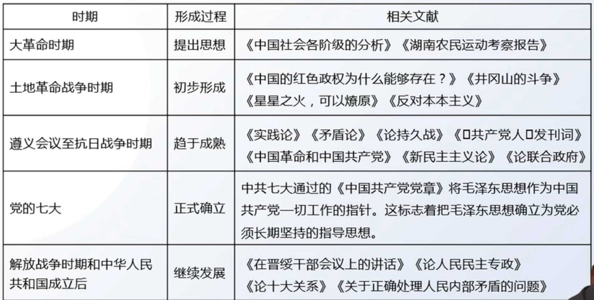

# 第一章 毛泽东思想及其历史地位

## 第一节 形成和发展

### 1 形成和发展的历史条件

1. 时代背景

    （1）战争与革命

    （2）19世纪末20世纪初，世界进入帝国主义和无产阶级革命时代

2. 实践基础

    中国共产党领导人民进行 **革命和建设**

3. 毛泽东思想与中国特色社会主义理论体系的对比

    - 相同点：

        （1）都是马克思主义中国化的理论成果

        （2）都以"实事求是"为精髓

    - 不同点：

        （1）时代背景：革命与战争 v.s. 和平与发展

        （2）实践基础：革命和建设 v.s. 建设、改革与发展(**后者没有革命**)

### 2 形成发展的过程

**总结 1 ：毛泽东思想形成和发展的过程**

## 第二节 活的灵魂

1. 毛泽东思想活的灵魂

    - 提出：1981党的 **十一届六中全会** 通过的《中国共产党中央委员会关于建国以来党的若干历史问题的决议》(以下简称 **《历史决议》**) 指出

    - 内容：

        **（1）实事求是**

        - 含义：一切从实际出发，理论联系实际，坚持在实践中检验真理和发展真理

        - **地位：是毛泽东思想的基本点，是毛泽东思想的精髓，是中国共产党的思想路线**

        **（2）群众路线**

        - 群众路线：就是一切为了群众，一切依靠群众，从群众中来，到群众中去

        - **地位：我党的工作路线**

        **（3）独立自主**

        - 含义：坚持独立思考，走自己的路

        - **地位：党的根本政治原则**

        > 帽子类题型 - 需要总结各种帽子

---
**总结 2 ：十一届六中全会的成就**

1. 毛中特：提出毛泽东思想活的灵魂

2. 第一次使用"社会主义初级阶段"的说法

3. 科学地评价了毛泽东和毛泽东思想

4. 完成了拨乱反正

---

## 第三节 毛泽东思想的历史地位

1. 对毛泽东思想的评价

    （1）马克思主义中国化时代化的第一个重大理论成果

    （2）中国革命和建设的科学指南

    （3）中国共产党和中国人民宝贵的精神财富

2. 对毛泽东的评价

    功绩是第一位的，错误是第二位的。应该将毛泽东晚年的错误同经过长期历史检验形成科学理论的毛泽东思想区别开来