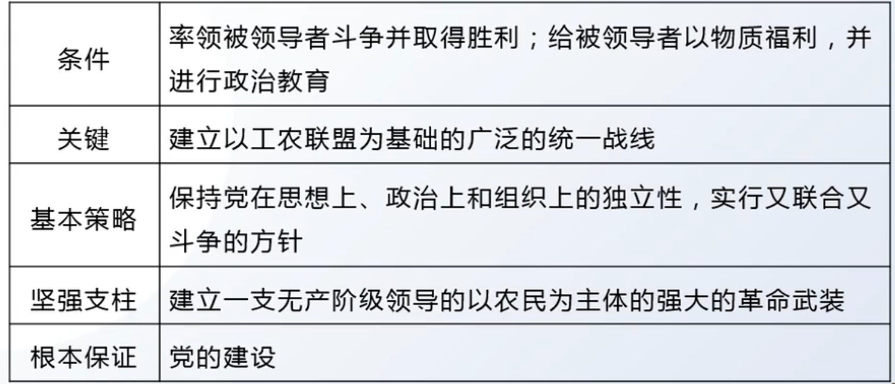
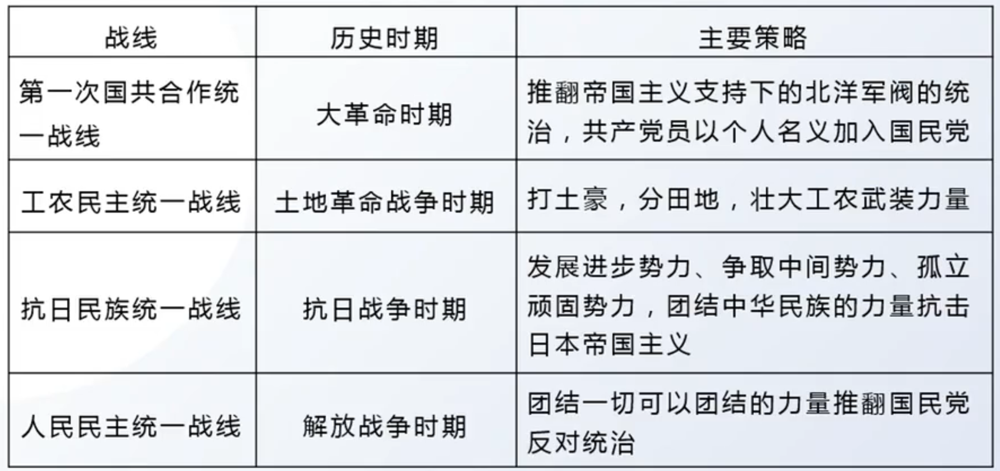

# 第二章 新民主主义革命理论(1919-1949)

## 考点

### 考点1：近代中国国情 + 中国革命特征

1.1 近代中国国情：社会性质、主要矛盾、根本任务、革命性质

1.2 中国革命特征：旧民主主义革命、新民主主义革命、社会主义革命对比

### 考点2：总路线和基本纲领

2.1 总路线：提出【新民主主义革命概念的提出、新民主主义革命的完整表述与总路线的提出】、总结、内容（对象，动力，领导）、中国革命三大问题【首要问题、基本问题、中心问题】、中国革命“两步走”与左倾右倾错误

2.2 基本纲领：提出、政治纲领、经济纲领、文化纲领

### 考点3：道路 + 法宝

3.1 革命道路：提出、内容、道路形成的必然性、可能性、怎么走【土地革命（基本内容）、武装斗争（主要形式）、农村革命根据地（依托）】

3.2 三大法宝：提出、统一战线【必要性、可能性、两个联盟、经验】、武装斗争【人民军队、党对军队的领导、为人民服务的军队】、党的建设【三大建设、思想建设（三大建设的首位）、组织建设、作风建设】、三大法宝的关系

## 第一节 新民主主义革命理论形成依据

### 1 近代中国国情和中国革命的时代特征

1. 近代中国国情、社会性质  

    （1）一个半殖民地半封建性质的社会（最主要、最重要）

    （2）近代中国政治、经济、文化发展极不平衡

2. 主要矛盾

    帝国主义和中华民族的矛盾（主）、封建主义和人民大众的矛盾

3. 根本任务

    推翻帝国主义、封建主义和官僚资本主义的统治（三座大山）

4. 近代中国革命性质

    资产阶级民主革命，经历了从旧民主主义革命向新民主主义革命的转变

---

**总结 3 ： 旧民主主义革命 vs 新民主主义革命**

1. 领导者：资产阶级 - 无产阶级（共产党）

2. 任务 ： 反帝反封建 - 反帝反放封建

3. 对象： 三座大山 - 三座大山

4. 性质： 资产阶级革命 - 资产阶级革命

    > 决定革命性质的是革命的任务与对象

    > 几类社会：奴隶社会 - 封建社会 - 资本主义社会 - 社会主义社会（无剥削）

    > 剥削者：奴隶主 - 封建地主 - 资本家 - 无

    > 受剥削者：奴隶 - 农民 - 工人 - 无

    > 革命的历史任务承担者：封建地主 - 资本家 - 工人 - 无革命

    > 革命者推翻剥削者，称为下一个社会的剥削者；除了工人（无产阶级）

5. 新民主主义革命：本该由资产阶级完成反帝反封建的革命任务，让无产阶级完成（中国资产阶级的弱小）。

6. 所属范围（中国革命与世界革命的关系）：世界资产阶级革命（由于发生在世界资产阶级革命阶段） - 世界无产阶级社会主义革命（由于发生于世界无产阶级社会主义革命的新时代）

7. 旧民主主义革命与新民主主义革命的区别与联系

    - 区别：领导者、指导思想、所属范围

    - 联系：任务、对象、性质

8. 新民主主义革命与无产阶级社会主义革命的对比

    - 区别：对象、任务；性质

    - 联系：领导者；指导思想；前途；所属范围

9. **旧民主主义革命、新民主主义革命与社会主义革命的革命理论区别与联系**

| 革命理论   | 旧民主主义革命   |新民主主义革命    | 社会主义革命
| ---------- | ------------ | ---------- | ---------- |
| 领导者   | 资产阶级/资本家      | 无产阶级/中国共产党 | 无产阶级 |
| 主要任务   | 反帝反封建                  | 反帝反封建 | 推翻资产阶级，去除私有化 |
| 革命对象   | 封建地主         | 封建地主 | 资本家 |
| 革命性质   | 资产阶级革命               | 资产阶级革命 | 社会主义革命 |
| 所属范围   | 世界资产阶级革命                   | 世界无产阶级社会主义革命 | 世界无产阶级社会主义革命 |
| 指导思想     | 未知 | 马克思主义| 马克思主义 |
| 前途   | 建立资本主义社会        | 建立社会主义社会 | 建立社会主义社会 |

---

**总结 4 ：新民主主义革命**

| 革命理论   | 新民主主义革命                          |
| ---------- | ------------------------------------------- |
| 社会性质   | 半殖民地半封建社会                          |
| 主要矛盾   | 帝国主义和中华民族的矛盾，封建主义和人民大众的矛盾 |
| 根本任务   | 推翻“三座大山”                            |
| 革命性质   | 资产阶级民主革命                           |
| 总路线     | 无产阶级领导的，人民大众的，反帝、反封建、反官僚资本主义的革命 |
| 基本纲领   | 新民主主义的政治、经济、文化纲领            |

### 2 新民主主义革命的实践基础

1. 实践基础：

    （1）旧民主主义革命没有为中华民族找到出路

    （2）新民主主义革命的实践需要，以及对中国革命经验教训的概括和总结

## 第二节 新民主主义革命的总路线和基本纲领

### 1 总路线

1. 新民主主义革命的总路线

    - 提出

        （1）1939 年，毛泽东在《中国革命和中国共产党》一文中，第一次提出了“新民主主义革命”的科学概念

        （2）1948年，毛泽东在《在晋绥干部会议上的讲话》中完整地总结和概括了新民主主义革命总路线的内容

    - 总路线内容

        无产阶级领导的，人民大众的，反对帝国主义、封建主义和官僚资本主义的革命 - **领导者、动力、对象**
    
    - 对象：帝国主义、封建主义和官僚资本主义

        （1）分清敌友，这是 **革命的首要问题**

        （2）帝国主义：**中国革命的首要对象**。帝国主义是中国社会进步和发展的最大障碍，是近代中国贫困落后和一切灾难祸害的总根源

        （3）封建主义：封建地主阶级是帝国主义统治中国和封建军阀实行专制统治的社会基础。阻碍中国社会前进，**没有丝毫进步作用的阶级**。是中国经济现代化和政治民主化的主要的、直接的障碍

        （4）官僚资本主义：也是对象

        （5）不同时期的不同革命对象

        1. 大革命时期：北洋军阀

        2. 土地革命时期：国民党新军阀

        3. 抗日战争时期：日本帝国主义

        4. 解放战争时期：国民党反动派

    - 动力：人民大众的 - 无产阶级、农民阶级、城市小资产阶级和民族资产阶级

        （1）无产阶级：**中国革命最基本的动力**。中国无产阶级是新的社会生产力的代表，是近代中国最进步的阶级，是中国革命的领导力量

        （2）农民阶级：**中国革命的主力军**。**贫雇农** 是无产阶级最可靠的同盟军，中农是无产阶级可靠的同盟军。**农民问题是中国革命的基本问题**，新民主主义 **革命实质** 上就是党领导下的农民革命，中国革命 **战争实质** 上就是党领导下的农民战争

        （3）城市小资产阶级：无产阶级的可靠同盟者。

        > 小资不是资本家，是劳动人民

        （4）民族资产阶级：民资的两面性：革命性与动摇软弱性。因此，它既不可能充当革命的主要力量，更不可能是革命的领导力量。需要又斗争又联合

    - 领导：无产阶级

        （1）无产阶级领导权的重要性：**无产阶级的领导权是中国革命的中心问题**，也是新民主主义革命理论的核心问题。区分新旧民主主义革命标志：领导权是无产阶级还是资产阶级

        （2）无产阶级及其政党，是中国革命取得胜利的根本保证

        （3）无产阶级的特点和优点：
        
        1. 共同优点：1.与先进的生产方式相联系；2.没有私人占有的生产资料；3.富于组织纪律性

        2. 独特优点：1.受到三座大山三重压迫，具有革命的坚决性和彻底性；2.工人分布集中，容易组织形成力量；3.中国无产阶级与农民紧密的联系性

        （4）无产阶级领导权的实现：无产阶级及其政党对中国革命的领导权不是自然而然得来的，而是在与资产阶级争夺领导权的斗争中实现的。

        **总结 5 无产阶级领导权的实现**

        {:height="70%" width="70%"}

    - 总结：中国革命三大问题

        （1）首要问题：分清敌友

        （2）基本问题：农民问题

        （3）中心问题：无产阶级的领导权

2. 新民主主义革命的性质和前途

    - 性质：资产阶级民主主义革命

    - 中国革命分"两步走"

        （1）先反帝反封建：资产阶级民主主义革命

        （2）再反资：无产阶级社会主义革命

        关系：民主主义革命是社会主义革命的必要准备，社会主义革命是民主主义革命的必然趋势

    - 左倾与右倾两种错误思想

        （1）左倾：教条主义、一次革命论 - 王明

        只看到了民主革命与社会主义革命的联系，而混淆了民主革命和社会主义革命的区别

        （2）右倾：二次革命论 - 陈独秀

        只看到了民主革命和社会主义革命的区别，而没有看到两个革命阶段的联系

### 2 基本纲领

1. 新民主主义革命的基本纲领

    - 提出

        （1）1940 年，毛泽东在《新民主主义论》中，阐述了新民主主义的政治、经济和文化

        （2）1945年，他在党的七大所作的政治报告《论联合政府》中，进一步把新民主主义的政治、经济和文化与党的基本纲领联系起来

    - 内容：政治、经济、文化纲领

    - 政治纲领

        推翻帝国主义和封建主义的统治，建立一个无产阶级领导的、以工农联盟为基础的、各革命阶级联合专政的新民主主义的共和国。总之，**国体 - 各革命阶级联合专政**，**政体 - 民主集中制的人民代表大会制度**，这就是新民主主义政治

    - 经济纲领

        （1）新民主主义革命的 **主要内容**：**没收封建地主阶级的土地归农民所有**

        （2）**题中之意**：**没收官僚资本归新民主主义国家所有**（没收官僚资本，包含着新民主主义革命和社会主义革命的双重性质）

        （3）**极具特色**：**保护民族工商业**

    - 文化纲领：民族的、科学的、大众的文化

        （1）民族的：文化上反帝反侵略

        （2）科学的：文化上反封建。反对一切封建思想和迷信思想。对封建时代创造的文化：去其糟粕取其精华

        （3）大众的：文化上强调人民大众、民主。

## 第三节 新民主主义革命的道路与经验

### 1 道路：农村包围城市，武装夺取政权

1. 道路的提出

    - 道路理论的初步形成

        **土地革命时期的早期** - 秋收起义失败后 - 在 **井冈山革命根据地**：毛泽东相继写下了《中国的红色政权为什么能够存在？》《井冈山的斗争》《星星之火，可以燎原》等文章，提出了“工农武装割据”思想，**初步形成** 了农村包围城市、武装夺取政权的 **革命道路理论**。**标志了：毛泽东思想的初步形成**

        > 毛泽东思想成熟的标志：新民主主义理论的系统阐明

    - 道路的最终确立

        **抗日战争时期** - **六届六中全会** - 《战争与战略问题》：确立了农村包围城市的道路理论

2. 道路形成的必然性（为什么）

    （1）**根本必然性**：由中国所处的时代特点和具体国情决定的：半殖民地半封建社会

    （2）**必须要武装夺取政权**：在半殖民地半封建的中国社会，内无民主制度而受封建主义的压迫，外无民族独立而受帝国主义的压迫。

    （3）**必须要农村包围城市**：近代中国是一个农业大国，农民占全国人口的绝大多数，是无产阶级可靠的同盟军和革命的主力军

3. 道路形成的可能性

    > 转述：红色政权长期存在的原因、新民主主义革命能够以这种方式顺利进行的原因...

    （1）**缝隙和可能**：半殖民地半封建国情下，四分五裂，军阀割据，存在不少的统治薄弱环节，为党在农村开展革命斗争、建设革命根据地提供了缝隙和可能

    （2）**群众基础好**：近代中国的广大农村深受反动统治阶级的多重压迫和剥削，人民革命愿望强烈，加之经历过大革命的洗礼，革命的群众基础好

    （3）**客观条件**：全国革命形势的继续向前发展，为在农村建设革命根据地提供了客观条件

    （4）**坚强后盾**：相当力量正式红军的存在，为农村革命根据地的创立、巩固和发展提供了坚强后盾

    （5）**主观条件**：党的领导的有力量及其政策的不错误，为农村革命根据地建设和发展提供了重要的主观条件

4. 怎么走这条道路

    （1）根本在于处理好土地革命、武装斗争、农村革命根据地建设三者之间的关系

    （2）土地革命是民主革命的 **基本内容**

    （3）武装斗争是中国革命的 **主要形式**

    （4）农村革命根据地是前两者的 **依托**

### 2 三大法宝

1. 新民主主义革命的三大法宝

    - 三大法宝的提出

        毛泽东 - 《(共产党人)发刊词》 - 统一战线、武装斗争、党的建设

    - **统一战线**

        1. 统一战线的必要性

            （1）**阶级状况**：中国半殖民地半封建社会的阶级状况所决定的。两头小中间大：无产阶级和地主大资产阶级占少数，农民、城市小资产阶级以及其他的中间阶级占大多数。

            （2）**敌人力量大**：建立最广泛的统一战线，也是由中国革命的长期性、残酷性及其发展的不平衡性所决定的

        2. 统一战线的可能性

            **利用其他政党之间的矛盾**：在半殖民地半封建的中国社会，诸多矛盾交织在一起，客观上为无产阶级及其政党利用这些矛盾建立和发展统一战线提供了可能性

        3. 统一战线中的两个联盟：

            工人阶级同 **农民阶级、广大知识分子及其他劳动者的联盟**（主要联盟），主要是工农联盟

            工人阶级和非劳动人民的联盟，主要是与民族资产阶级

        4. 实践经验

             （1）要建立巩固的工农联盟

             （2）要正确对待资产阶级，尤其是民族资产阶级（最重要的经验）

             （3）要采取区别对待的方针。在革命进程中，要坚持发展进步势力、争取中间势力、孤立顽固势力的策略方针

             （4）要坚持独立自主的原则。要保持党在政治上、组织上和思想上的独立性。

        总结 6 ：党在不同历史时期的统一战线

        
        
    - 武装斗争：中国革命的特点和优点之一

        建设人民军队的经验：

        1. 一要坚持党对军队的绝对领导

            是建设新型人民军队的根本原则，是保持人民军队无产阶级性质和建军宗旨的根本前提，也是毛泽东建军思想的核心

        2. 要建设全心全意为人民服务的人民军队

            坚持这一宗旨，是建设新型人民军队的基本前提，也是人民军队一切行动的根本准则和一切工作的出发点与归宿
        
        3. 要开展革命的政治工作

    - 党的建设

        （1）党的三大建设：思想建设、组织建设和作风建设

        （2）首位：把思想建设始终放在党的建设的首位

        > 注意：习思想中，党的六大建设：思想、组织、作风、纪律、政治、制度

        > 并且习思想中，首位是政治建设。根据理论时期的不同选不同的首位

        （3）组织建设，根本的是要贯彻民主集中制这一根本组织原则

        （4）三大优良作风：理论和实践相结合、和人民群众紧密地联系在一起以及自我批评的三大优良作风。这是中国共产党区别于其他任何政党的显著标志

        > 习思想中：共产党区别于其他党最显著的标志：勇于自我革命

    - 三大法宝之间的关系

        党的组织是战士，统一战线和武装斗争是两个武器

### 3 新民主主义革命理论的意义

1. 意义：

    - 理论上

        科学地回答了中国革命向何处去的问题，正确地解决了中国革命的发展阶段问题，揭示了近代中国革命发展的客观规律，极大地丰富了马克思主义的理论宝库

    - 实践上

        在理论的指导下，完成新民主主义革命，建立中华人民共和国 + 建国的意义（站起来）

    - 国际上

        有力地鼓舞和推动了世界上被压迫民族和被压迫人民反抗帝国主义、殖民主义的斗争，极大地增强了他们反对帝国主义斗争的信心，增强了世界人民争取和平的力量
