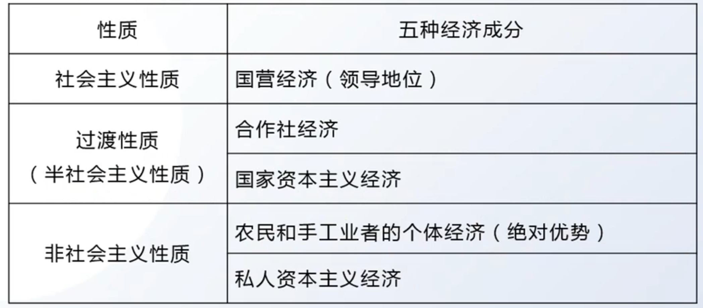
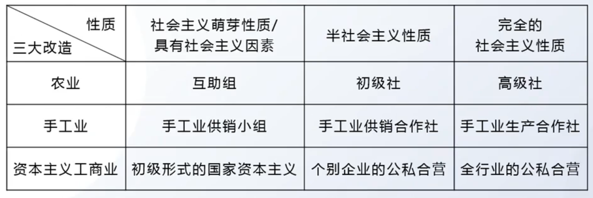

# 第三章 社会主义改造理论(1949 - 1956)

1949：新民主主义社会；1956：社会主义社会

1949-1956：新民主主义社会时期、社会主义革命时期、社会主义改造时期、过渡时期

历史逻辑：1949-1952：完成民主遗留任务；1952-1956：社会主义改造

## 考点

### 考点1：过渡时期的社会性质

1.1 经济方面的特点：五中经济成分及其性质、领导地位、主要部分、十字路口

1.2 政治方面的特点：主要矛盾、民资的两面性（新）、过渡时期总路线

1.3 新民主主义社会性质

### 考点2：三大改造

2.1 农业：改造方针、三个阶段

2.2 手工业：改造方针、改造道路、三个阶段

2.3 资本主义工商业：方法（和平赎买）、和平赎买的必要性和可能性、国家资本主义、三个阶段

2.4 改造完成：进入社会主义初级阶段的标志（三大改造完成）

### 考点3：社会主义基本制度的确立

改造完成的意义

第一届人大、第一部宪法

## 第一节 从新民主主义到社会主义的转变

### 1 新民主主义社会的性质和特点

从中华人民共和国成立到社会主义改造基本完成，是我国从新民主主义到社会主义的过渡时期。这一时期，我国社会的性质是新民主主义社会。新民主主义社会不是一个独立的社会形态，而是由新民主主义向社会主义转变的过渡性社会形态

- 经济方面

    五种经济成分：在新民主主义社会中，存在着五种经济成分，即社会主义性质的国营经济、半社会主义性质的合作社经济、农民和手工业者的个体经济、私人资本主义经济和国家资本主义经济

    {:height="70%" width="70%"}

    ---

    社会主义经济 - 工人阶级（领导地位）

    个体经济 - 农民、小资（量最多的主导地位）

    资本主义经济 - 民资

    ---

- 政治方面

    （1）中国社会的阶级构成主要是工人阶级、农民阶级和其他小资产阶级、民族资产阶级等基本的阶级力量

    （2）随着土地改革的基本完成，工人阶级和资产阶级的矛盾逐步成为我国社会的主要矛盾

- 民族资产阶级的两面性（新）

    这一时期的民族资产阶级仍然是一个具有两面性的阶级：既有剥削工人的一面，又有接受工人阶级及其政党领导的一面

- 新民主主义社会的性质

    （1）在新民主主义社会中，社会主义的因素不论在经济上还是在政治上都已经居于领导地位，但非社会主义因素仍有很大比重

    （2）新民主主义社会是属于社会主义体系的，是逐步过渡到社会主义社会的过渡性质的社会

### 2 党在过渡时期的总路线与理论依据

1. 过渡时期总路线的提出 - "一化三改"

    党在过渡时期总路线的主要内容被概括为“一化三改”。**“一化”即社会主义工业化，“三改”即对个体农业、手工业和资本主义工商业的社会主义改造**。它们之间相互联系，不可分离，可以比喻为鸟的“主体”和“两翼”。其中，“一化”是“主体”，“三改”是“两翼”，二者相辅相成、相互促进

---

**总结 7 ：三大时期的总路线**

1949以前：无产阶级领导的、人民大众的、反帝反封建革命 - 革命的总路线

1949-1956的总路线：**一化三改**

今天的总路线：领导和团结全国各族人民，以经济建设为中心，坚持四项基本原则，坚持改革开放，独立自主、自力更生，为把我国建设成为富强、民主、文明、和谐、美丽的社会主义现代化强国而奋斗 - **一个中心，两个基本点**

---

## 第二节 社会主义改造和历史经验

### 1 三大改造

1. 农业的社会主义改造

    （1）**道路**：积极引导农民组织起来，走互助合作道路

    土改完成后我国农民的生产积极性提高表现：

    1. 个体经济的积极性

    2. 互助合作的积极性

    （2）遵循自愿互利、典型示范和国家帮助的原则，以互助合作的优越性吸引农民走互助合作道路

    （3）正确分析农村的阶级和阶层状况，制定正确的阶级政策

    （4）坚持积极领导、稳步前进的方针，采取循序渐进的步骤：互助组、初级社和高级社三个发展阶段：

    1. 发展互助组，同时试办初级社。具有社会主义萌芽性质。
    2. 初级农业生产合作社。具有半社会主义性质。
    3. 高级农业生产合作社。具有完全的社会主义性质

2. 手工业的社会主义改造

    - **方针**：积极领导、稳步前进

    - **道路**：生产合作

    - 三个发展阶段：

        1. 手工业供销小组。具有社会主义萌芽性质。
        2. 手工业供销合作社。具有半社会主义性质。
        3. 手工业生产合作社。它是社会主义性质的集体经济组织

3. 资本主义工商业的社会主义改造

    - 方法：和平赎买

    - 和平赎买的必要性：

        （1）有利于发挥私营工商业在国计民生方面的积极作用，促进国民经济发展

        （2）有利于争取和团结民族资产阶级

        （3）有利于争取和团结民族资产阶级，

        （4）利于团结各民主党派和各界爱国民主人士，巩固和发展统一战线

        （5）有利于发挥民族资产阶级中大多数人的知识、才能、技术专长和管理经验

        （6）有利于争取和团结那些原来同资产阶级相联系的知识分子为社会主义建设服务

    - 和平赎买的可能性：

        （1）民族资产阶级具有两面性。既有剥削工人的一面，又有接受工人阶级及其政党领导的一面

        （2）中国共产党与民族资产阶级长期保持着统一战线的关系

        （3）我国已经有了以工人阶级为领导、工农联盟为基础的人民民主专政的国家政权，建立了强大的社会主义国营经济并掌握了国家的经济命脉，这就造成了私人资本主义在政治上、经济上对社会主义的依赖

    - 形式：国家资本主义

        所谓国家资本主义，就是在国家直接控制和支配下的资本主义经济

        这种新式国家资本主义经济是带着很大的社会主义性质的，是对工人和国家有利的。国家资本主义有初级形式和高级形式之分

    - 资本主义工商业的社会主义改造三大步骤：

        （1）初级形式的国家资本主义（初级国资）- "四马分肥" - 社会主义萌芽

        （2）个别企业的公私合营（高级国资） - "四马分肥" - 半社会主义性质

        （3）全行业的公私合营（高级国资） - "定股定息" - 完全的社会主义性质

    - 三大改造的步骤与其性质

        {:height="70%" width="70%"}

### 2 社会主义改造的历史经验

1. 历史经验：

    （1）坚持社会主义工业化建设与社会主义改造并举

    （2）采取积极引导、逐步过渡的方式

    （3）用和平方法进行改造

## 第三节 社会主义基本制度在中国的确立

1. 基本国情 + 社会主义基本制度的确立

    1956 年年底，我国对农业、手工业和资本主义工商业的社会主义改造的基本完成，标志着中国历史上长达数千年的阶级剥削制度的结束，实现了由新民主主义向社会主义的转变，**社会主义基本制度在我国初步确立**，**我国进入社会主义初级阶段**

2. 确立社会主义基本制度的意义

    （1）**最深刻最伟大的社会变革**：社会主义基本制度的确立是中国历史上最深刻最伟大的社会变革，为当代中国一切发展进步奠定了制度基础，也为中国特色社会主义制度的创新和发展提供了重要前提

    （2）社会主义基本制度的确立，极大地提高了工人阶级和广大劳动人民的积极性、创造性，极大地促进了我国社会生产力的发展，初步显示了社会主义的优越性。

    （3）**劳动人民真正成为国家的主人**：社会主义基本制度的确立，使广大劳动人民真正成为国家的主人

    > 1949 - 中国人民成为国家的主人

    （4）**社会主义运动的胜利**：中国社会主义基本制度的确立，使占世界人口1/4的东方大国进入了社会主义社会，这是世界社会主义运动史上又一个历史性的伟大胜利。

    （5）马克思理论的丰富：它不仅再次证明了马克思列宁主义的真理性，而且以其独创性的理论原则和经验总结丰富和发展了马克思主义的科学社会主义理论。