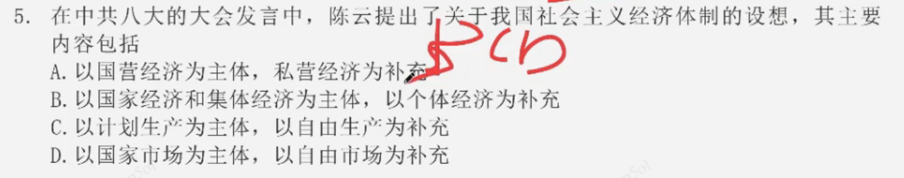

# 第四章 社会主义建设道路初步探索的理论成果(1956-1976)

## 考点

### 考点1：论十大关系

【探索中国社会主义的开端；方针：调动一切为社会主义服务】

1. 调动一切积极因素为社会主义事业服务 - 《论十大关系》

    - 提出

        1956 - 毛泽东 - 《论十大关系》

    - 良好开端：《论十大关系》标志着党探索中国社会主义建设道路的良好开端

2. 《论十大关系》

    - 1原则：以苏为鉴，独立自主地探索适合中国情况的社会主义建设道路

    - 1方针：努力把党内党外、国内国外的一切积极的因素，直接的、间接的积极因素，全部调动起来，为社会主义建设服务

    - 2标志

        （1）**开始探索**：标志着党探索中国社会主义建设道路的良好开端。

        （2）**第二次结合**：马克思主义与中国具体实际的 第二次结合 的开始

### 考点2：关于正确处理人民内部矛盾的问题

【总方针、主题、方针】

1. 《关于正确处理人民内部矛盾的问题》

    - 提出

        1957 - 毛泽东 - 系统论述了社会主义社会矛盾的理论

    - 内容

        矛盾是普遍存在的，社会主义社会同样充满着矛盾，正是这些矛盾推动着社会主义社会不断地向前发展

    - 基本矛盾

        （1）社会主义社会和资本主义社会的基本矛盾：**基本的矛盾仍然是生产关系和生产力之间的矛盾，上层建筑和经济基础之间的矛盾** - **永远是**

        > 基本矛盾永远不变，变的是主要矛盾

        （2）社会主义基本矛盾性质：在生产关系和生产力基本适应、上层建筑和经济基础基本适应条件下的矛盾，是在人民根本利益一致基础上的矛盾，是 **非对抗性** 的矛盾

        （3）由于社会主义社会的矛盾不是对抗性的矛盾，因此“它可以经过社会主义制度本身，不断地得到解决”

    - 我国的主要矛盾

        提出：党的八大 - 由毛泽东

        我们国内的主要矛盾，已经是人民对于建立先进的工业国的要求同落后的农业国的现实之间的矛盾，已经是人民对于经济文化迅速发展的需要同当前经济文化不能满足人民需要的状况之间的矛盾

    - 社会主义社会存在两类不同性质矛盾的理论

        （1）两类社会矛盾：敌我矛盾和人民内部矛盾，这是两类性质完全不同的矛盾

        （2）敌我矛盾：是人民同反抗社会主义革命、敌视和破坏社会主义建设的社会势力和社会集团的矛盾，这是根本利益对立基础上的矛盾，因而是对抗性的矛盾

        （3）人民内部矛盾是在人民根本利益一致基础上的矛盾，因而是非对抗性的矛盾
        
        （4）两类矛盾的转化：在一定的条件下，两类不同性质的矛盾可以互相转化

    - 关于正确处理两类不同性质社会矛盾的基本方法

        （1）解决敌我矛盾，是分清敌我的问题，采用 **专政** 的方法

        （2）解决人民内部矛盾，是分清是非的问题，采用 **民主** 的方法

    - 关于正确处理人民内部矛盾的方针

        **总方针：民主**

        （1）政法思想领域：团结 - 批评 - 团结

        （2）物质利益、分配方面：统筹兼顾、适当安排

        （3）人民群众和政府机关的矛盾：民主集中制

        （4）科学文化领域 - 双百方针：百花齐放、百家争鸣

        （5）共产党和民主党派的矛盾：前提 - 坚持社会主义道路和共产党领导，方针 - 长期共存、互相监督

        （6）民族之间的矛盾：民族平等、团结互助

    - 正确处理人民内部矛盾

        毛泽东强调，关于正确处理人民内部矛盾的问题是 **社会主义国家政治生活的主题**

### 考点3：社会主义工业化

1. 走工业化道路

    - 提出

        《论十大关系》：**第一大关系就是重工业、轻工业和农业的关系**

        《关于正确处理人民内部矛盾的问题》：中国工业化道路的问题，主要是指重工业、轻工业和农业的发展关系问题，要走一条有别于苏联的中国工业化道路 - **提出了工业化道路的问题**

        重工业、轻工业和农业的发展关系（总方针）：**以农业为基础，以工业为主导，以农轻重为序**

    - 走中国工业化道路的要求

        （1）中共八大（党的八大） - 提出既反保守又反冒进、坚持在综合平衡中稳步前进的方针

        （2）毛泽东、刘少奇、周恩来提出了把资本主义经济作为社会主义经济的补充的思想

        （3）毛泽东提出了发展商品生产、利用价值规律的思想，认为商品生产在社会主义条件下，还是一个不可缺少的、有利的工具，要有计划地大大地发展社会主义的商品生产

### 考点4：不发达社会主义与比较发达社会主义

1. 关于社会主义发展阶段的思想

    毛泽东提出：社会主义这个阶段，又可能分为两个阶段，第一个阶段是 **不发达的社会主义**，第二个阶段是 **比较发达的社会主义**。后一阶段可能比前—阶段需要更长的时间

### 考点5：初步探索的意义和教训

1. 初步探索的意义

    （1）巩固和发展了我国的社会主义制度。
    （2）为开创中国特色社会主义提供了宝贵经验、理论准备、物质基础。
    （3）丰富了科学社会主义的理论和实践。

2. 初步探索的经验教训

    （1）**探索自己的路**：必须把马克思主义与中国实际相结合，探索符合中国特点的社会主义建设道路

    （2）**发展生产力**：必须正确认识社会主义社会的主要矛盾和根本任务，集中力量发展生产力

    （3）不能急于求成：必须从实际出发进行社会主义建设，建设规模和速度要和国力相适应，不能急于求成

    （4）发展民主：必须发展社会主义民主，健全社会主义法制

    （5）加强党的建设：必须坚持党的民主集中制和集体领导制度，加强执政党建设

    （6）对外开放：必须坚持对外开放，借鉴和吸收人类文明成果建设社会主义，不能关起门来搞建设

    > 把之前、之后的意义类题目都归纳一下，只记归纳的印象

3. 改革开放前后的两个历史时期及其关系

    从1956年进入社会主义到1978改革开放；由改革开放到今天：

    这是两个相互联系又有重大区别的时期，但本质上都是我们党领导人民进行社会主义建设的实践探索

### 考点6：陈云三个主体三个补充

