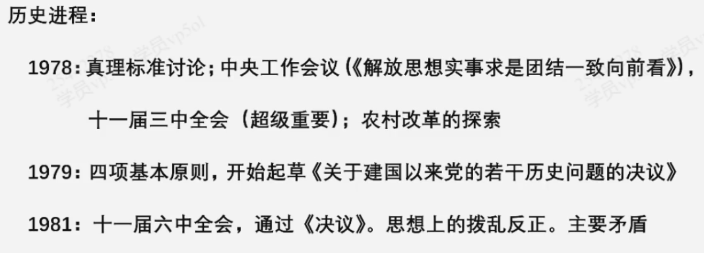
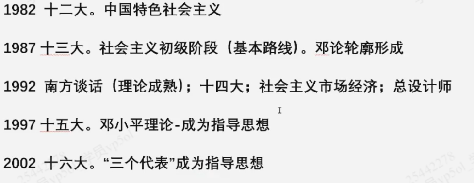
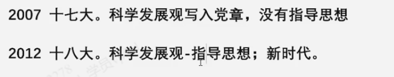
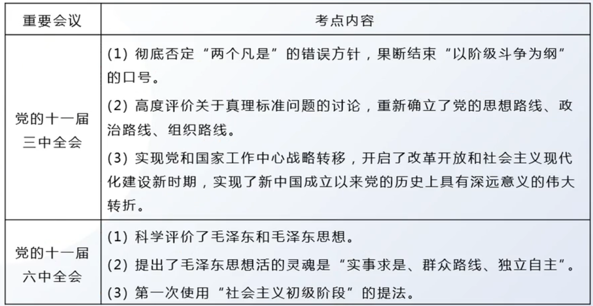
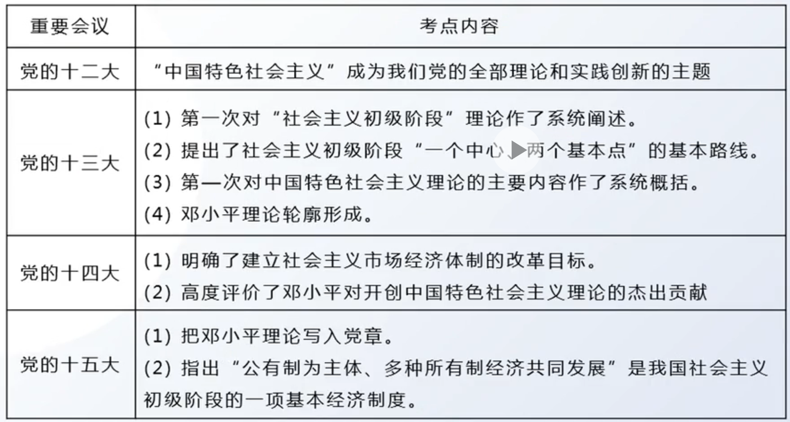

# 第五章 中国特色社会主义理论体系

【重要：邓小平诞辰120周年】

历史进程：

{:height="70%" width="70%"}

{:height="70%" width="70%"}

{:height="70%" width="70%"}

## 考点1：中国特色社会主义-内容

每一届领导人都要根据当时面对的国情回答具体问题，发展社会主义、马克思主义，形成理论体系

1. 邓小平理论：

    回答：什么是社会主义、怎样建设社会主义这一基本问题

2. “三个代表”重要思想

    回答：“建设什么样的党、怎样建设党”

3. 科学发展观

    回答：实现什么样的发展、怎样发展

4. 习近平新时代中国特色社会主义思想

    回答：

    （1）新时代坚持和发展什么祥的中国特色社会主义、怎样坚持和发展中国特色社会主义（最主要）

    （2）建设什么样的社会主义现代化强国、怎样建设社会主义现代化强国

    （3）建设什么样的长期执政的马克思主义政党、怎样建设长期执政的马克思主义政党

## 考点2：邓小平理论

见第六章，综合到一起了

## 考点3：十一届三中全会与重要会议

---

**总结 8 ：十一届三中全会 与考试有关的内容** - 5点

- 重新确立解放思想、实事求是的思想路线

- 形成以邓小平为核心的中央领导集体

- 开始拨乱反正（十一届六中全会：完成拨乱反正）

- 揭开改革开放的序幕

- 结束阶级斗争为纲，将党和国家的重心转移到现代化建设上来

**总结 9 ：重要会议内容总结**

十五大：第一次提出我国社会主义初级阶段的基本纲领（区别：基本路线 - 十三大）

总结 10：党历史上的三个历史决议

总结 11：党的三个路线

- 新民主主义革命总路线

- 过渡时期总路线

- 社会主义初级阶段的基本路线

---

2. “三个代表”重要思想

    写入党章：十六大

3. 科学发展观

    写入党章：十七大

4. 习思想

    十八大以来

