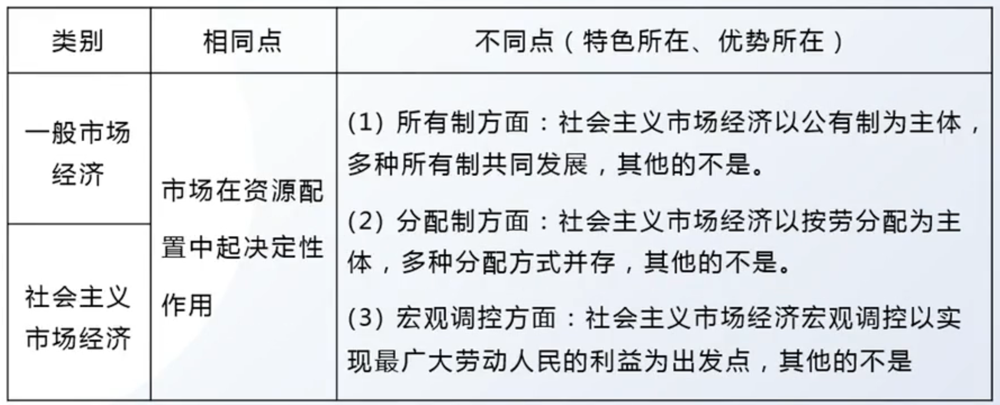

# 第六章 邓小平理论

## 第一节 邓小平理论首要的基本的理论问题

### 1 什么是社会主义 -回答的基本理论问题

1. 社会主义的本质

    - 提出： 1992 - 邓小平 - 南方谈话

    - 社会主义的本质

        社会主义的本质，是解放生产力，发展生产力，消灭剥削，消除两极分化，最终达到共同富裕

    - 提出的意义

        （1）一方面，它突出地强调解放和发展生产力在社会主义社会发展中的重要地位，纠正了过去关于发展生产力的一些错误观念

        （2）另一方面，它突出地强调“消灭剥削，消除两极分化，最终达到共同富裕”从生产关系和发展目标角度认识和把握社会主义本质

        1. 主体地位：公有制（原则）和按劳分配

        2. 原则：共同富裕

    - 两条根本原则

        一是以社会主义公有制经济为主体，一是共同富裕

### 2 邓小平理论的精髓：解放思想、实事求是

解放思想、实事求是 不仅是邓小平理论的精髓，也是其理论活的灵魂

毛泽东思想活的灵魂：实事求是、群众路线、独立自主。精髓是：实事求是

## 第二节 邓小平理论主要内容

### 1 社会主义初级阶段理论与党的基本路线

1. 社会主义阶段论

    - 第一个对社会主义划阶段 - 毛泽东 - 不发达、比较发达

    - 第一次使用社会主义初级阶段概念 - 十一届六中全会

    - 第一次将社会主义初级阶段作为国情把握 - 十三大前夕

    - 第一次对社会主义初级阶段理论系统概括 - 十三大

2. 社会主义初级阶段理论

    （1）十三大系统论述/论断：社会主义初级阶段，就是指我国在生产力落后、商品经济不发达条件下建设社会主义必然要经历的特定阶段，即从我国进入社会主义到基本实现社会主义现代化的整个历史阶段。

    （2）论断的两层含义：

    1. 我国已经进入社会主义社会，必须坚持而不能离开社会主义

    2. 我国的社会主义社会还处在不发达的阶段，必须正视而不能超越初级阶段

3. 党在社会主义初级阶段的基本路线

    - 提出：党的十三大

    - 基本路线：

        一个中心，两个基本点

        领导和团结全国各族人民，以经济建设为中心，坚持四项基本原则，坚持改革开放，自力更生，艰苦创业，为把我国建设成为富强、民主、文明的社会主义现代化国家而奋斗

    - 地位：党的基本路线是国家的生命线、人民的幸福线，我们要坚持把以经济建设为中心作为兴国之要、把四项基本原则作为立国之本、把改革开放作为强国之路

    （1）经济建设：以经济建设为中心是党在改革开放和社会主义现代化建设新时期实现的最根本的拨乱反正

    （2）四项基本原则：立国之本、党和国家生存发展的政治基石

    （3）改革开放：强国之路，是我们党和国家发展进步的活力源泉

    > 四项基本原则：坚持社会主义道路，坚持人民民主专政，坚持中国共产党的领导，坚持马克思列宁主义、毛泽东思想

    - 充实和完善

        党的十七大把“和谐”与“富强、民主、文明”一起写入了基本路线

        党的十九大进一步修改为“为把我国建设成为富强民主文明和谐美丽的社会主义现代化强国而奋斗”，不仅将“美丽”纳入了基本路线，而且将“现代化国家”提升为“现代化强国”

### 2 社会主义根本任务和发展战略理论

1. 社会主义根本任务的理论

    **生产力是社会发展的最根本的决定性因素，社会主义的根本任务是发展生产力**

### 3 改革开放和社会主义市场经济理论

1. 改革开放理论

    - 改革的性质：社会主义制度的自我完善和发展

        对待制度：完善和发展，不能否定

        对待体制：不是细枝末节的修补，而是根本性的变革

    - 直接动力：

        改革是社会主义社会发展的直接动力：社会主义社会的基本矛盾仍然是生产关系和生产力、上层建筑和经济基础之间的矛盾，正是这些矛盾推动了社会主义社会的发展（根本动力是矛盾）

        > 对于社会主义发展：改革是直接动力。不是根本动力，根本动力是社会基本矛盾

    - 判断改革是非得失的标准：三个有利于

        是否有利于发展社会主义社会的生产力，是否有利于增强社会主义国家的综合国力，是否有利于提高人民的生活水平

    - 改革开放的必要性：基本国策。

        开放也是改革，对外开放是建设中国特色社会主义的一项基本国策

        ---

        与考试有关的基本国策：

        节约资源、保护环境、一国两制、对外开放、男女平等（思修）

    - 对外开放的要求

        （1）**范围上全方位、宽领域、多层次**：在开放的范围上，对外开放是对世界所有国家的开放，包括对发达国家的开放，也包括对发展中国家的开放

        （2）**学别人，做自己**：学习的内容上，实行对外开放要正确对待资本主义社会创造的现代文明成果；开放的原则上，对外开放要高度珍惜并坚决维护中国人民经过长期奋斗得来的独立自主权利

    - 重要意义：关键一招

        改革开放是当代中国的鲜明标志和活力源泉，是决定中国命运的关键—招，也是实现中华民族伟大复兴的关键—招

2. 社会主义市场经济理论

    - 我国经济体制改革的核心问题：如何正确认识和处理 **计划与市场的关系**

    - 确立社会主义市场经济体制的改革目标 ：党的十四大

    - 社会主义市场经济理论的要点

        （1）计划和市场不是帽子：计划经济和市场经济不是划分社会制度的标志，计划经济不等于社会主义，市场经济也不等于资本主义

        （2）计划和市场都是手段：计划和市场都是经济手段，对经济活动的调节各有优劣，社会主义实行市场经济是要把二者优势结合起来

        （3）性质取决于使用的人：市场经济作为资源配置的手段本身不具有制度属性，可以和不同的社会制度结合，从而表现出不同的性质

    - 总结：社会主义市场经济的特色、优势

        {:height="70%" width="70%"}

### 4 两手抓，两手都要硬

非重点

### 5 一国两制与祖国统一

1. “和平统一、一国两制”构想的基本内容

    （1）**坚持一个中国**，这是“和平统一、一国两制”的核心，是发展两岸关系和实现和平统一的基础

    （2）**两制并存**，在祖国统一的前提下，国家的主体部分实行社会主义制度，同时在台湾、香港、澳门保持原有的社会制度和生活方式长期不变

    （3）**高度自治**，祖国完全统一后，台湾、香港、澳门作为特别行政区，享有不同于中国其他省、市、自治区的高度自治权，台湾、香港、澳门同胞各种合法权益将得到切实尊重和维护

    （4）尽最大努力争取和平统一，但不承诺放弃使用武力

    （5）解决台湾问题，实现祖国完全统一，寄希望于台湾人民

2. 祖国统一，台湾问题

    台湾问题是国内战争遗留下来的问题，属于中国的内政，不容许外国干涉

### 6 外交和国际战略

现在世界上真正大的问题，带全球性的战略问题，一个是和平问题，一个是经济问题或者说发展问题。和平问题是东西问题，发展问题是南北问题。概括起来，就是东西南北四个字。**南北问题是核心问题**

### 7 党的建设理论

## 第三节 邓小平理论的历史地位

1. 邓小平理论的重要意义

    （1）马克思列宁主义、毛泽东思想的继承和发展

    （2）中国特色社会主义理论体系的开篇之作（毛泽东理论不属于中特）

    （3）改革开放和社会主义现代化建设的科学指南