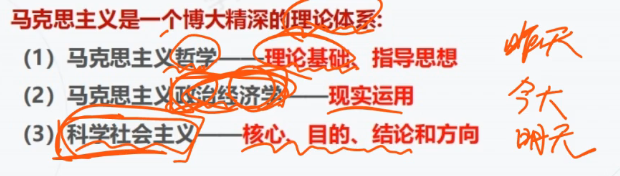
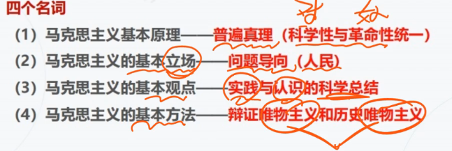
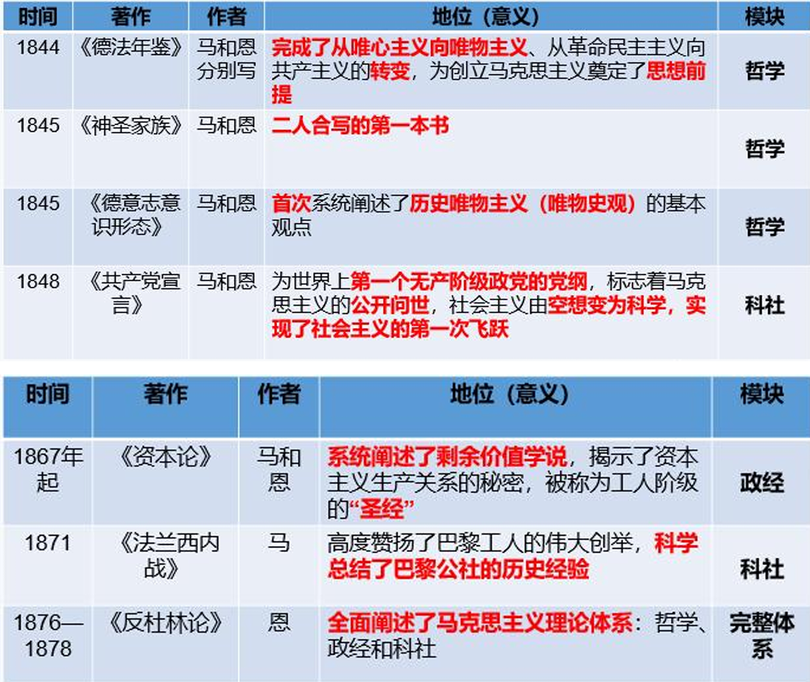
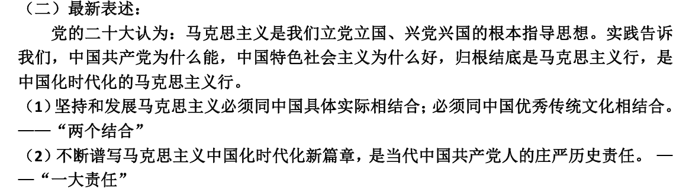

# 导论 马克思主义是关于无产阶级和全人类解放的科学

符号：

[10] 表示考点分布及重要性，0-100递增

==**表示重要考点**==

## 第一节 什么是马克思主义

### 1 马克思主义的组成部分（理论体系） [10]

> 选择题会考，需要将左边和右边的对应关系记住

## 第二节 马克思主义的创立

### 1 马克思主义的创立 [90]

> 导论最重要的一个考点， 90%的考点

#### 1.历史背景[90]

- 时代： 1840 (工业革命之后)

- 社会根源：资本主义的发展及其内在矛盾的激化（顺承工业革命）

- 阶级基础：1830-1840欧洲三大工人运动；无产阶级作为独立的政治力量登上历史的舞台； ==**1847年成立了世界上第一个国际无产阶级政党：共产主义同盟**==。

#### 2.理论来源和成就[90]

- 直接理论来源：德国古典哲学，英国政治经济学，法国英国空想社会主义

- 间接理论支持（自然科学）：19世纪的三大自然科学发现：细胞学说，能量守恒与转化定律，生物进化论

- ==理论独创成就（两个伟大发现）：==

    - ==唯物史观和剩余价值学说==

    - ==意义：奠定社会主义由空想变为科学这一飞跃的理论基石==

#### 3.理论著作体系与意义[100]

> 选择题。考过 3 4 次了。时间不用背，但是著作与相应的地位需要背

> 如何背：不再信唯心，转为唯物 -> 共同批评神 -> 表明自己的理论独创：历史唯物主管 -> 符合无产利益，工人阶级请求写一个政治纲领 -> 揭露资产阶级丑恶性，表示资产阶级必然灭亡 -> 歌颂总结巴黎公社的历史经验 -> 怼反对者，全面阐述马克思主义理论体系

### 2 马克思主义的发展 [10]

俄国化：

1. 理论发展 ==**马 “同时胜利论” -> 列 “首先胜利论”**==

2. 实践发展 ==**马 巴黎公社失败 -> 列 十月革命胜利**==

3. 总结 列宁实现了马克思主义的基本理论同俄国的实际情况相结合，实现了马克思主义的俄国化，产生了列宁主义。

    ==**实现了社会主义理论的第二次飞跃：由理想变为现实**==

中国化： 略

### 3 马克思主义的基本特征 [90]

> 考选择，考加粗部分的对应关系；考材料，阐述马克思的特征来回答一些问题

1. 科学性

    马克思主义是科学的理论，解释人类社会发展规律。是对自然、社会和人类思维发展本质和规律的 **正确反映**。

2. 人民性

    这是马克思主义的 **本质属性**。 **人民至上**是马克思主义的 **政治立场**。

3. 实践性

    是 **首要和基本的观点**， 是与其他理论的 **差别的显著特征**。

4. 发展性

    不断发展的理论。具有 **与时俱进的理论品质**。

5. 总结

    一句话概括马克思主义的特征： **科学性与革命性的同一**。

### 4 马克思主义的当代价值 [50]

1. 三大价值体现：

    1. 观察当代世界变化的认识工具

    2. 指引当代中国发展的行动指南

    3. 引领人类社会进步的科学真理

    > 马克思主义提供现实指导/具体方向/具体道路 - 错误

    > 马克思主义提供一般指导，理论认知 - 正确

2. 当代价值的最新表述

    