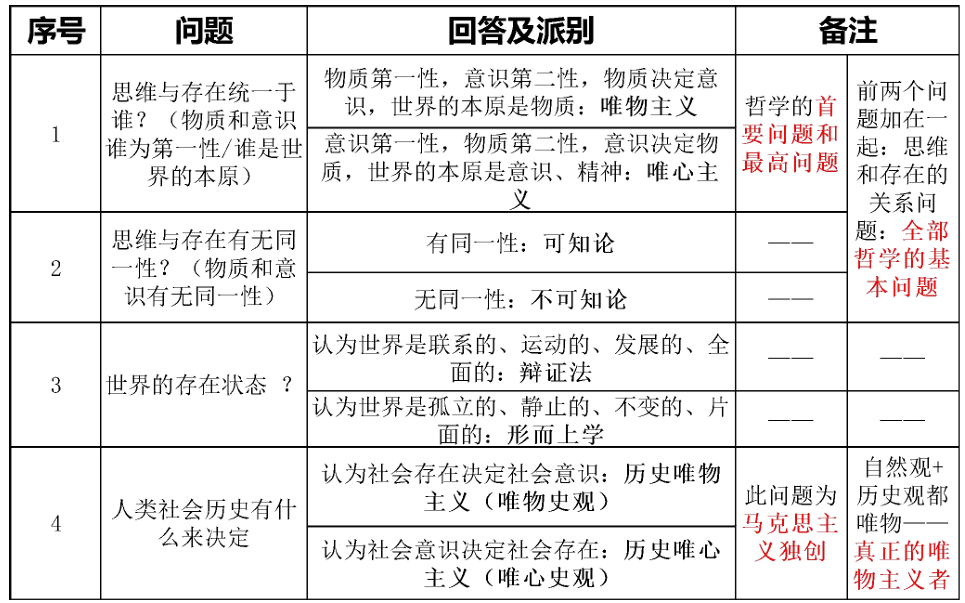
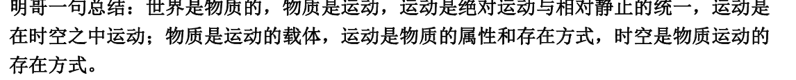
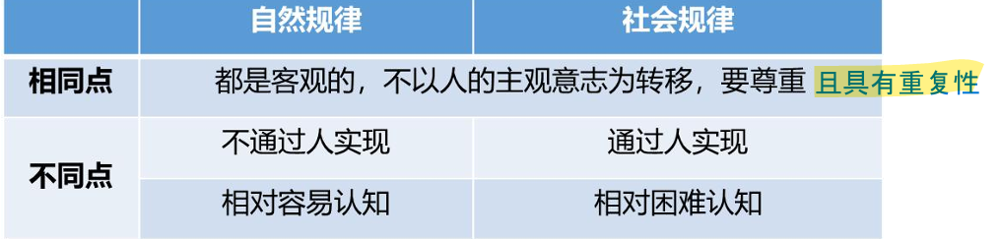
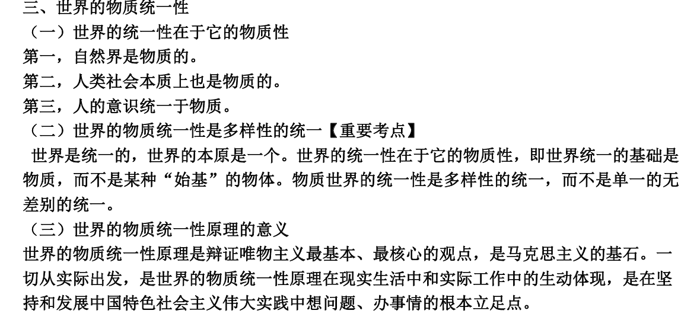

模块一：马克思主义哲学

马克思三大模块：哲学，政经，科学社会主义

哲学：唯物论，辩证法，

# 第一章 世界的物质性及其发展规律(唯物论+辩证法)

1节讲唯物论

2-3节讲辩证法

## 第一节 世界多样性与物质统一性(唯物论)

### 1 物质及其存在方式[100]

#### 1.哲学内涵[10]

哲学内涵：系统化、理论化的世界观和方法论（怎么看+怎么办）

#### 2.哲学的四大问题[50]

#### 3.哲学的基本派别与物质概念[50]

根据首要问题的不同回答进行划分

1. 唯心主义一元论

    定义： **意识决定物质**

    1. 主观唯心主义：认为人的认识是主观自生的，最终导致唯我论

        e.g. **感觉、经验、意志、理性、思想**

    2. 客观唯心主义：人的认识是人以外的客观精神的产物

        e.g. **理念、绝对观念、绝对精神、宇宙精神、神、道/理**

2. 唯物主义一元论

    定义： **物质决定意识**

    1. 古代朴素唯物主义：把世界本源归结为一种或几种原初物质

        e.g.金木水火土、元气、“原子”（古代朴素简单的原子）

        缺陷： **自发性、猜测性、直观性**

    2. 近代形而上学唯物主义（机械唯物主义）：把世界本源归结为原子（近代物理学的原子）

        缺陷： **机械性、形而上学性、不彻底性**

    3. ==**马克思的唯物主义（辩证唯物主义和历史唯物主义）**==

        - 观点：世界统一于物质；客观存在，人类社会也是自然界的一部分
        
        - 解释：【恩格斯版本】- （从共性和个性角度给出的定量解释）

        - ==**【列宁版本】**==：“物质是标志 **客观实在** 的哲学范畴，这种客观实在 1.是人通过感觉感知的，2.不依赖于我们的感觉而存在，3.为我们的感觉所复写、摄影、反映。” （物质与意识的关系角度）

        - 物质的唯一特征：客观实在性

        - 意义：

            1. **认为世界统一于物质**，坚持 **唯物主义一元论**，区别了唯心主义一元论和二元论； - 唯物的

            2. **认为物质是可知的**，从而坚持了能动的反映论和可知论，批判了不可知论； - 可知论的

            3. 体现了 **唯物论和辩证法的统一**，克服了形而上学唯物主义的缺陷； - 辩证的

            4. 体现了唯物主义 **自然观** 和唯物主义 **历史观** 的统一，坚持了 **彻底的唯物主义**。(认为人类社会、历史也是物质的) - 唯物史观的

            > 仍然考选择，加粗部分都可能考

#### 4.物质的存在方式（运动与时空）[100]

马克思的物质观与运动观：

1. 物质与运动

    1. 运动：标志一切事物和现象的变化及其过程的哲学范畴

    2. **==物质与运动的关系==**：物质是运动的基础和承担者；运动是物质的存在方式和根本属性。辩证唯物主义

2. 运动与静止

    1. 关系：运动是绝对的，静止时运动过程中的相对静止

    2. 相对静止：包括 **空间的相对位置 和 事物的根本性质** 暂时未变这两种物质运动的特殊状态

    3. 承认相对静止的意义：承认静止是 **衡量物质运动的尺度**

    4. 割裂运动与静止的错误：

        只强调静止而否认运动：形而上学

        反之：**相对主义诡辩**；唯心主义和不可知论（没有统一的标准）

马克思的时空观：

3. 时间和空间

    1. 时间和空间是运动着的物质的基本存在方式

    2. 内涵：
        
        时间：特点是 ==**一维性和不可逆性**==

        空间：特点是 三维性

    3. 特征： **绝对性与相对性的统一；无限性与有限性的统一**

    4. 时空也是物质。

    5. 时空与时空感：物质与意识。 -> 物质决定意识，物质不随意识变化，意识可以随意识变化。

对物质观、运动观、时空观的总结：

#### 5.物质世界的二重化[50]

1. 自然界与人类社会（两种物质）：人类社会也是物质；人类社会由自然界中分化出来；区别两者： **关键动作-劳动/实践**；人类社会是最高级的物质存在形态。

2. 客观世界（物质）与主观世界（意识）

    其关系满足物质与意识的关系

3. 人的实践活动

### 2 物质与意识的辩证关系[100]

> 考选择题

#### 1.物质决定意识[50]

1. 意识起源

    人脑的形成为一时的产生提供 **物质前提**

    **意识是社会劳动的产物**，劳动在意识的产生和发展中起着决定性作用，因此 **意识是人特有的**，语言是意识的 **物质外壳**。

2. 意识含义[50]

    意识是 **人脑** 对 **物质** 的 **能动反映**。意识在内容上是客观的，在形式上是主观的。

#### 2.意识对物质具有反作用[100]

==**能动反作用表现：**==

1. 意识活动具有目的性和计划性  
2. 意识活动具有创造性  
3. 意识具有指导实践改造客观世界的作用(**最重要的表现**)  
4. 意识具有调控人的行为和生理活动的作用
    
> 选择题高频考点

#### 3.主观能动性和客观规律性的辩证统一[主观题考点][100]

1. 规律：规律是事物变化过程中本身所固有的内在的、本质的、必然的 **联系**。规律是 **客观的**。

2. ==**自然规律和社会规律**==

    

3. ==**尊重客观规律与发挥主观能动性**==[主观题考点]

    1. 尊重客观规律是正确发挥主观能动性的前提。只有充分发挥主观能动性，才能正确认识和利用客观规律

    2. 正确发挥人的主观能动性的三个前提条件：

        1. 从实际出发是正确发挥人的主观能动性的前提

        2. 实践是正确发挥人的主观能动性的根本途径

        3. 正确发挥人的主观能动性，还要依赖于一定的物质条件和物质手段

#### 4.意识与人工智能[50]

1. 意识与人工智能的关系：

意识不等于人工智能，人工智能也不能代替意识。

人工智能只是意识能动性的一种特殊表现

### 3 世界的物质统一性

## 第二节 事物的普遍联系和变化发展（辩证法）

两大特征， **三大规律** ，五对关系。

### 1 辩证法的两大特征和总观点[90][主观题考点]

联系：事物内部各要素之间和事物之间相互影响、作用、制约的关系。规律是一种联系。

世界是联系的

1. ==**联系的特征**== [主观题考点]

    1. **客观性**：事物的联系是事物本身所固有的，主观不以意志为转移的

        方法论：这要求我们 **尊重联系，不要主观臆断** 。

    2. **普遍性**：事物联系的普遍性有三重含义：  
        1. 联系存在于事物 **内部**；  
        2. 联系存在于事物 **之间**；  
        3. **整个世界** 是相互联系的统一整体

        方法论：这要求我们 **全面、系统、整体的看待事物及事物之间的关系，建立辩证的整体观，系统观，有大局意识**。

    3. **多样性**：事物之间的联系是多样的。

        方法论：**根据联系的多样性要求我们做到具体问题，具体分析**
    
    4. **条件性**：条件 **可以改变**，但 **不是任意的**。

        方法论： **善于利用有关条件，规避不利条件**

事物是发展的

2. 发展

    1. 发展的内涵：指事物 **上升的，前进的** 运动变化，指事物不断由低级到高级、由简单到复杂的过程

    2. ==**发展的实质**==[主观题考点]

        发展的实质是 **新事物** 的产生和 **旧事物** 的灭亡。

        - 新事物：符合事物发展的客观规律，因而具有远大前途和 **强大生命力**。

        - 旧事物：不符合事物发展的客观规律，因而 **丧失其存在的必然性**，日趋灭亡。

        > 选择题：判断某事物是新/旧事物，看是否有强大生命力，应运规律而生

    3. ==**新事物不可战胜的原因**==[主观题考点]

        - 第一，新事物与环境的关系：它 **适应已经变化了的环境和条件**

        - 第二，新事物和旧事物的关系：它 **具有强大的生命力**

        - 第三，社会历史领域：它 **从根本上符合人民群众的利益和要求，能得到人民群众的拥护**

        > 第二点是根本决定性的原因

任何事物都是辩证、发展的

### 2 辩证法的三大规律[200][主观题考点]

#### 规律一：对立统一规律（矛盾）是事物发展的根本规律[200]

==**对立统一规律（矛盾）是事物发展的动力和原因**==

    对立统一规律 = 矛盾

    内因 = 内部矛盾

    外因 = 外部矛盾

    斗争性 = 对立

    同一性 = 统一

    普遍性 = 共性

    特殊性 = 个性

1. 对立统一规律（矛盾）的地位

    **对立统一规律是唯物辩证法的实质、核心，解释了事物运动发展的动力和源泉**

    - 实质：揭示事物普遍联系的根本内容，揭示 **事物变化发展的内在动力 - 事物的内部矛盾**

    - 核心：把握联系发展的根本(矛盾)，是把握唯物辩证法其他规律和范畴的中心线索

    - **矛盾分析方法是认识世界和该在世界的根本方法**

1. 从矛盾内涵出发 - 矛盾统一性和斗争性关系原理

    1. 矛盾：矛盾就是事物与事物之间、事物内部各要素之间 **即对立（斗争性）、又统一（同一性）的关系**

    2. 二者相互区别：

        - 矛盾的同一性是指：矛盾双方相互依赖、相互贯通、相互转化的性质和倾向，**同一性是相对的、有条件的**；

        - 矛盾同一性在事物发展中的作用

            第一，是事物存在发展的 **前提**  
            第二，促使双方 **相互吸收有利于自身的因素** ，在相互作用中得到发展  
            第三，规定着事物转化的可能和发展的 **趋势**

            > 会考选择题

        - 矛盾的斗争性：矛盾双方的相互排斥，否定，分离的性质和倾向。**斗争性是绝对的、无条件的**

        - 斗争性在事物发展中的作用：

            第一，促进矛盾双方力量的变化，造成发展的不平衡，为转化、质变创造条件  
            第二，矛盾的斗争是向一方过渡的决定性力量， **是事物存在发展的关键**  
            第三，**促使矛盾一方克服另一方或双方同归于尽，相互融合成新的事物，向前发展**

    3. 二者相互联系：

        - **同一性离不开斗争性**

        - **斗争性离不开同一性**

        - **和谐**

        方法论：大力发扬 **斗争精神**。敢于斗争、善于斗争是马克思主义的鲜明特色，是中国共产党人的 **鲜明品格**。

    4. 内部矛盾与外部矛盾（内因与外因）

        - 内因 是事物存在的 **基础**，是事物变化的 **根据**，规定事物发展的方向，是事物发展的 **根本原因**

        - 外因 是事物变化的 **条件**，能影响事物发展的进程，但 **必须通过内因而起作用**，是事物发展的 **第二位的原因**

2. 从矛盾特征出发 - 矛盾普遍性和特殊性关系原理

    1. 二者相互区别

        - 矛盾普遍性： **矛盾无处不在，矛盾无时不有**

            方法论：矛盾的普遍性要求我们重视矛盾的普遍性， **善于抓住事物发展的一般规律**

        - 矛盾特殊性：各个具体事物的矛盾

            事事的矛盾是不同的  
            时时的矛盾是不同的  
            解决矛盾的方法是不同的（一方客服一方，双方同归于尽，融合新的事物）

            方法论：矛盾的特殊性要求我们重视矛盾的特殊性， **做到具体问题，具体分析，对症下药**

    2. 二者相互联系

        - 普遍性（共性）离不开特殊性，特殊性（个性）离不开普遍性

        - 任何事物都是共性和个性的统一， **个性包含共性，共性寓于个性之中，个性也离不开共性**

        - 割裂二者的相互联系， **只强调共性而否认个性导致教条主义，只强调个性而否认共性导致经验主义**

3. 从解决矛盾出发 - 矛盾不平衡性原理

    事物存在的矛盾以及矛盾的发展是不平衡的，有 **主要矛盾和次要矛盾，矛盾的主要方面和次要方面之分**，这成为矛盾不平衡性原理。

    1. 主次矛盾关系原理（当面对众多矛盾时）

        - 相互区别：主要矛盾在矛盾体系中处于 **支配地位**，对事物发展起 **决定性作用**；次要矛盾处于从属地位，起次要作用

        - 相互联系： **主要矛盾决定次要矛盾，次要矛盾影响主要矛盾**

        - 方法论：要求在认识和实践上，要分清主要矛盾和次要矛盾，抓住主要矛盾；在现实中， **要学会抓中心，抓重点和抓关键，并兼顾其他矛盾**。

    2. 主次方面关系原理（当面对一对矛盾时）

        - 相互区别：矛盾的主要方面时在一对矛盾中 **起主导作用**， **处于支配地位**的方面；次要方面处于被支配地位的方面

        - 相互联系：物质的 **性质** 是由 **主要矛盾的主要方面** 规定的

        - 方法论：**面对事物，要区分现象和本质，着重把我本质**；面对形式，要 **区分主流和支流，着重把握主流**。

    3. 方法论意义：

        在解决矛盾时， **坚持两点论和重点论的统一，坚持两点论，反对一点论；坚持重点论，反对均衡论**

### 3 量变质变规律和否定之否规律[90]

### 4 联系和发展的基本环节

## 第三节 唯物辩证法是认识世界和改造世界的根本方法