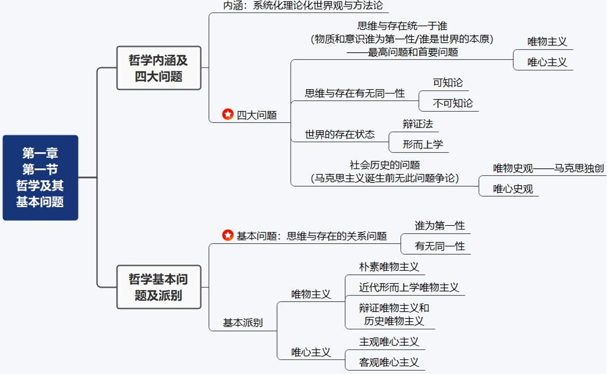
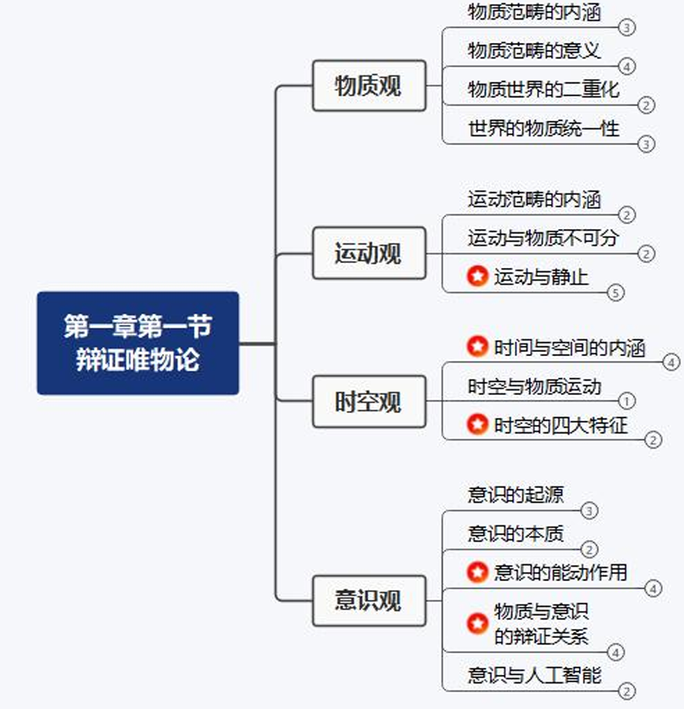
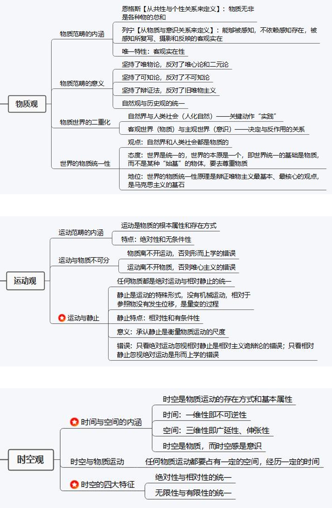
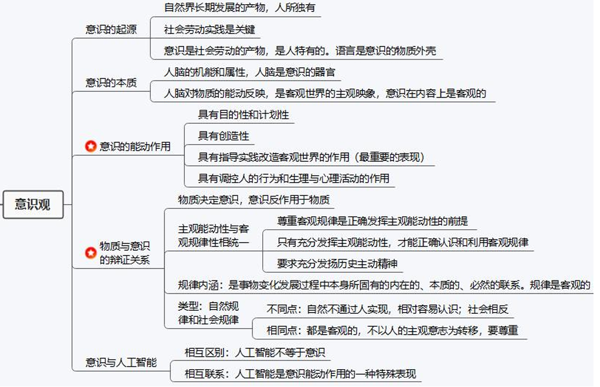

模块一：马克思主义哲学

马克思三大模块：哲学，政经，科学社会主义

哲学：唯物论，辩证法，唯物史观

# 第一章 哲学第一第三问题：唯物论+辩证法

==**选择2题，答题1题，每年必考**==

考点1： 哲学四大问题 + 哲学派别

> 补充 - 可知论：人能不能认识或完全认识世界

考点2： 辩证唯物论 - 物质观/运动观/时空观/意识观

## 第一节 世界多样性与物质统一性(唯物论)

### 1 物质及其存在方式

#### 哲学内涵[10]

哲学内涵：系统化、理论化的世界观和方法论（怎么看+怎么办）

#### 哲学的四大问题[50]

#### 哲学的基本派别与物质概念[50]

根据首要问题的不同回答进行划分

1. 唯心主义一元论

    定义： **意识决定物质**

    1. 主观唯心主义：认为人的认识是主观自生的，最终导致唯我论

        e.g. **感觉、经验、意志、理性、思想**

    2. 客观唯心主义：人的认识是人以外的客观精神的产物

        e.g. **理念、绝对观念、绝对精神、宇宙精神、神、道/理**

2. 唯物主义一元论

    定义： **物质决定意识**

    1. 古代朴素唯物主义：把世界本源归结为一种或几种原初物质

        e.g.金木水火土、元气、“原子”（古代朴素简单的原子）

        缺陷： **自发性、猜测性、直观性**

    2. 近代形而上学唯物主义（机械唯物主义）：把世界本源归结为原子（近代物理学的原子）

        缺陷： **机械性、形而上学性、不彻底性**

    3. ==**马克思的唯物主义（辩证唯物主义和历史唯物主义）**==

        - 观点：世界统一于物质；客观存在，人类社会也是自然界的一部分
        
        - 解释：【恩格斯版本】- （从共性和个性角度给出的定量解释）

        - ==**【列宁版本】**==：“物质是标志 **客观实在** 的哲学范畴，这种客观实在 1.是人通过感觉感知的，2.不依赖于我们的感觉而存在，3.为我们的感觉所复写、摄影、反映。” （物质与意识的关系角度）

        - 物质的唯一特征：客观实在性

        - 意义：

            1. **认为世界统一于物质**，坚持 **唯物主义一元论**，区别了唯心主义一元论和二元论； - 唯物的

            2. **认为物质是可知的**，从而坚持了能动的反映论和可知论，批判了不可知论； - 可知论的

            3. 体现了 **唯物论和辩证法的统一**，克服了形而上学唯物主义的缺陷； - 辩证的

            4. 体现了唯物主义 **自然观** 和唯物主义 **历史观** 的统一，坚持了 **彻底的唯物主义**。(认为人类社会、历史也是物质的) - 唯物史观的

            > 仍然考选择，加粗部分都可能考

#### 物质的存在方式（运动与时空）[100]

马克思的物质观与运动观：

1. 物质与运动

    1. 运动：标志一切事物和现象的变化及其过程的哲学范畴

    2. **==物质与运动的关系==**：物质是运动的基础和承担者；运动是物质的存在方式和根本属性。辩证唯物主义

2. 运动与静止

    1. 关系：运动是绝对的，静止时运动过程中的相对静止

    2. 相对静止：包括 **空间的相对位置 和 事物的根本性质** 暂时未变这两种物质运动的特殊状态

    3. 承认相对静止的意义：承认静止是 **衡量物质运动的尺度**

    4. 割裂运动与静止的错误：

        只强调静止而否认运动：形而上学

        反之：**相对主义诡辩**；唯心主义和不可知论（没有统一的标准）

马克思的时空观：

3. 时间和空间

    1. 时间和空间是运动着的物质的基本存在方式

    2. 内涵：
        
        时间：特点是 ==**一维性和不可逆性**==

        空间：特点是 三维性

    3. 特征： **绝对性与相对性的统一；无限性与有限性的统一**

    4. 时空也是物质。

    5. 时空与时空感：物质与意识。 -> 物质决定意识，物质不随意识变化，意识可以随意识变化。

对物质观、运动观、时空观的总结：

#### 物质世界的二重化[50]

1. 自然界与人类社会（两种物质）：人类社会也是物质；人类社会由自然界中分化出来；区别两者： **关键动作-劳动/实践**；人类社会是最高级的物质存在形态。

2. 客观世界（物质）与主观世界（意识）

    其关系满足物质与意识的关系

3. 人的实践活动

### 2 物质与意识的辩证关系

> 考选择题

#### 物质决定意识[50]

1. 意识起源

    人脑的形成为一时的产生提供 **物质前提**

    **意识是社会劳动的产物**，劳动在意识的产生和发展中起着决定性作用，因此 **意识是人特有的**，语言是意识的 **物质外壳**。

2. 意识含义[50]

    意识是 **人脑** 对 **物质** 的 **能动反映**。意识在内容上是客观的，在形式上是主观的。

#### 意识对物质具有反作用[100]

==**能动反作用表现：**==

1. 意识活动具有目的性和计划性  
2. 意识活动具有创造性  
3. 意识具有指导实践改造客观世界的作用(**最重要的表现**)  
4. 意识具有调控人的行为和生理活动的作用
    
> 选择题高频考点

#### 主观能动性和客观规律性的辩证统一[主观题考点][100]

1. 规律：规律是事物变化过程中本身所固有的内在的、本质的、必然的 **联系**。规律是 **客观的**。

2. ==**自然规律和社会规律**==

    

3. ==**尊重客观规律与发挥主观能动性**==[主观题考点]

    1. 尊重客观规律是正确发挥主观能动性的前提。只有充分发挥主观能动性，才能正确认识和利用客观规律

    2. 正确发挥人的主观能动性的三个前提条件：

        1. 从实际出发是正确发挥人的主观能动性的前提

        2. 实践是正确发挥人的主观能动性的根本途径

        3. 正确发挥人的主观能动性，还要依赖于一定的物质条件和物质手段

#### 意识与人工智能[50]

1. 意识与人工智能的关系：

意识不等于人工智能，人工智能也不能代替意识。

人工智能只是意识能动性的一种特殊表现

### 3 世界的物质统一性

## 第二节 事物的普遍联系和变化发展（辩证法）

两大特征， **三大规律** ，五对关系。

### 1 辩证法的两大特征和总观点[90][主观题考点]

联系：事物内部各要素之间和事物之间相互影响、作用、制约的关系。规律是一种联系。

世界是联系的

1. ==**联系的特征**== [主观题考点]

    1. **客观性**：事物的联系是事物本身所固有的，主观不以意志为转移的

        方法论：这要求我们 **尊重联系，不要主观臆断** 。

    2. **普遍性**：事物联系的普遍性有三重含义：  
        1. 联系存在于事物 **内部**；  
        2. 联系存在于事物 **之间**；  
        3. **整个世界** 是相互联系的统一整体

        方法论：这要求我们 **全面、系统、整体的看待事物及事物之间的关系，建立辩证的整体观，系统观，有大局意识**。

    3. **多样性**：事物之间的联系是多样的。

        方法论：**根据联系的多样性要求我们做到具体问题，具体分析**
    
    4. **条件性**：条件 **可以改变**，但 **不是任意的**。

        方法论： **善于利用有关条件，规避不利条件**

事物是发展的

2. 发展

    1. 发展的内涵：指事物 **上升的，前进的** 运动变化，指事物不断由低级到高级、由简单到复杂的过程

    2. ==**发展的实质**==[主观题考点]

        发展的实质是 **新事物** 的产生和 **旧事物** 的灭亡。

        - 新事物：符合事物发展的客观规律，因而具有远大前途和 **强大生命力**。

        - 旧事物：不符合事物发展的客观规律，因而 **丧失其存在的必然性**，日趋灭亡。

        > 选择题：判断某事物是新/旧事物，看是否有强大生命力，应运规律而生

    3. ==**新事物不可战胜的原因**==[主观题考点]

        - 第一，新事物与环境的关系：它 **适应已经变化了的环境和条件**

        - 第二，新事物和旧事物的关系：它 **具有强大的生命力**

        - 第三，社会历史领域：它 **从根本上符合人民群众的利益和要求，能得到人民群众的拥护**

        > 第二点是根本决定性的原因

任何事物都是辩证、发展的

### 2 辩证法的三大规律[200][主观题考点]

#### 规律一：对立统一规律（矛盾）是事物发展的根本规律[200]

==**对立统一规律（矛盾）是事物发展的动力和原因**==

    对立统一规律 = 矛盾

    内因 = 内部矛盾

    外因 = 外部矛盾

    斗争性 = 对立

    同一性 = 统一

    普遍性 = 共性

    特殊性 = 个性

1. 对立统一规律（矛盾）的地位

    **对立统一规律是唯物辩证法的实质、核心，解释了事物运动发展的动力和源泉**

    - 实质：揭示事物普遍联系的根本内容，揭示 **事物变化发展的内在动力 - 事物的内部矛盾**

    - 核心：把握联系发展的根本(矛盾)，是把握唯物辩证法其他规律和范畴的中心线索

    - **矛盾分析方法是认识世界和该在世界的根本方法**

1. 从矛盾内涵出发 - 矛盾统一性和斗争性关系原理

    1. 矛盾：矛盾就是事物与事物之间、事物内部各要素之间 **即对立（斗争性）、又统一（同一性）的关系**

    2. 二者相互区别：

        - 矛盾的同一性是指：矛盾双方相互依赖、相互贯通、相互转化的性质和倾向，**同一性是相对的、有条件的**；

        - 矛盾同一性在事物发展中的作用

            第一，是事物存在发展的 **前提**  
            第二，促使双方 **相互吸收有利于自身的因素** ，在相互作用中得到发展  
            第三，规定着事物转化的可能和发展的 **趋势**

            > 会考选择题

        - 矛盾的斗争性：矛盾双方的相互排斥，否定，分离的性质和倾向。**斗争性是绝对的、无条件的**

        - 斗争性在事物发展中的作用：

            第一，促进矛盾双方力量的变化，造成发展的不平衡，为转化、质变创造条件  
            第二，矛盾的斗争是向一方过渡的决定性力量， **是事物存在发展的关键**  
            第三，**促使矛盾一方克服另一方或双方同归于尽，相互融合成新的事物，向前发展**

    3. 二者相互联系：

        - **同一性离不开斗争性**

        - **斗争性离不开同一性**

        - **和谐**

        方法论：大力发扬 **斗争精神**。敢于斗争、善于斗争是马克思主义的鲜明特色，是中国共产党人的 **鲜明品格**。

    4. 内部矛盾与外部矛盾（内因与外因）

        - 内因 是事物存在的 **基础**，是事物变化的 **根据**，规定事物发展的方向，是事物发展的 **根本原因**

        - 外因 是事物变化的 **条件**，能影响事物发展的进程，但 **必须通过内因而起作用**，是事物发展的 **第二位的原因**

2. 从矛盾特征出发 - 矛盾普遍性和特殊性关系原理

    1. 二者相互区别

        - 矛盾普遍性： **矛盾无处不在，矛盾无时不有**

            方法论：矛盾的普遍性要求我们重视矛盾的普遍性， **善于抓住事物发展的一般规律**

        - 矛盾特殊性：各个具体事物的矛盾

            事事的矛盾是不同的  
            时时的矛盾是不同的  
            解决矛盾的方法是不同的（一方客服一方，双方同归于尽，融合新的事物）

            方法论：矛盾的特殊性要求我们重视矛盾的特殊性， **做到具体问题，具体分析，对症下药**

    2. 二者相互联系

        - 普遍性（共性）离不开特殊性，特殊性（个性）离不开普遍性

        - 任何事物都是共性和个性的统一， **个性包含共性，共性寓于个性之中，个性也离不开共性**

        - 割裂二者的相互联系， **只强调共性而否认个性导致教条主义，只强调个性而否认共性导致经验主义**

3. 从解决矛盾出发 - 矛盾不平衡性原理

    事物存在的矛盾以及矛盾的发展是不平衡的，有 **主要矛盾和次要矛盾，矛盾的主要方面和次要方面之分**，这成为矛盾不平衡性原理。

    1. 主次矛盾关系原理（当面对众多矛盾时）

        - 相互区别：主要矛盾在矛盾体系中处于 **支配地位**，对事物发展起 **决定性作用**；次要矛盾处于从属地位，起次要作用

        - 相互联系： **主要矛盾决定次要矛盾，次要矛盾影响主要矛盾**

        - 方法论：要求在认识和实践上，要分清主要矛盾和次要矛盾，抓住主要矛盾；在现实中， **要学会抓中心，抓重点和抓关键，并兼顾其他矛盾**。

    2. 主次方面关系原理（当面对一对矛盾时）

        - 相互区别：矛盾的主要方面时在一对矛盾中 **起主导作用**， **处于支配地位**的方面；次要方面处于被支配地位的方面

        - 相互联系：物质的 **性质** 是由 **主要矛盾的主要方面** 规定的

        - 方法论：**面对事物，要区分现象和本质，着重把我本质**；面对形式，要 **区分主流和支流，着重把握主流**。

    3. 方法论意义：

        在解决矛盾时， **坚持两点论和重点论的统一，坚持两点论，反对一点论；坚持重点论，反对均衡论**

#### 规律二：量变质变规律[90]

1. 质、量、度

2. 量变与质变的区别

    - 量变 表现为范围内的连续性、渐进性和不显著的变化 - **相对静止** 的变化

    - 质变 是事物性质的 **根本变化**，表现为超越度的间断性、飞跃性和显著性的变化 - **绝对运动** 的变化

3. 量变与质变的相互关系

    - 量变是质变的 **必要准备**，当量变积累到一定程度，突破度的范围，必然引起质的变化（量变不一定带来质变）

    - 质变是量变的 **必然结果**

    - 量变和质变的关系是事物发展的连续性和间断性、渐进性和飞跃性的统一。

    - 判断是否质变：是否在度的范围之内

> 考试这样考：  
> 错误 1 ：只强调量变，不强调质变 - 只看静止 - 形而上错误 （循环论）  
> 错误 2 ：不强调量变，直接质变 - 只看运动 - 相对主义诡辩论错误 （突变论）/极端猖獗的唯心主义

#### 规律三：否定之否定规律[90][主观题考点]

1. 肯定与否定的关系

    - 相互区别：肯定因素是维持现存事物存在的因素；否定因素是促使现存事物灭亡的因素

    - 联系：肯定中包含否定，一定意义上的肯定就是否定；否定相同。

2. 辩证否定观[主观题考点]

    - 第一，任何事物的发展都是事物 **内部矛盾自我否定引起的自我完善、自我发展的过程**；

        > 注意发展是自我否定

    - 第二，否定既是事物 **发展的环节**，又是新旧事物 **联系的环节**；

    - 第三，辩证否定的 **实质是“扬弃” - 即克服又保留**

3. 方法论意义

    - 第一，反对形而上学否定观，即反对肯定一切或否定一切

    - 第二，在对待传统文化和外来文化的问题上，坚持“扬弃”的态度

4. ==**否定之否定规律**== 的内容和意义[重要]

    1. 内容：

        - 从内容看，发展是事物内部矛盾自我否定引起的自我完善、发展的过程，要经历 **肯定 - 否定 - 否定之否定** 三个阶段

        - 从形式上看，事物发展的 **总方向是前进的，具体的道路是曲折的**，是前进性和曲折性的统一， **波浪式前进，螺旋式上升**。

    2. 意义

        反对 **只强调肯定而忽略否定的循环论观点和只强调否定而忽略肯定的直线论观点。**

### 3 联系和发展的基本环节（辩证法的5对范畴）

从辩证法，任何事物之间的关系 **根本关系** 都是 **矛盾的关系**，也就是 **区别** 与 **联系**。按照这个思路分析关系就很马克思。

#### 第一对：内容与形式[50]

内容与形式 - 从构成要素和变现方式上反映事物的一对基本范畴

1. 区别

    - 内容是构成事物的一切要素的总和

    - 形式是把诸多要素统一起来的结构 或 表现内容的方法

2. 联系

    - 内容是形式的基础，内容决定形式

    - 形式对内容具有反作用。适合内容的形式，对内容的发展起积极推动作用；反之相反

    - **内容易变，形式稳定，内容与形式不能总是适合的**

#### 第二对：本质与现象[90]

本质与现象 - 是揭示事物内在联系和外在表现的一对范畴

1. 区别

    - 本质：是事物的根本性质，是构成事物诸要素之间的内在联系

        内在、共性；必须借助理性来认识，是相对稳定的

    - 现象：是事物的外部联系和表面特征，是事物本质的外在表现。现象可区分为真象和假象

        外在、个性；用感性来把握，是多变易逝的
    
2. 联系

    - 本质决定现象

    - 现象是对本质的表现，**无论真象还是假象都表现本质**

3. 假象与错觉

    - 假象是客观的范畴

        > 大家都能看见的

    - 错觉是主观的范畴

        > 只有自己能看见的

#### 第三对：原因与结果[30]

原因与结果 - 是揭示事物引起和被引起关系的一堆范畴

2. 相互联系

    在一个具体的因果联系中，原因在前，原因在后， **二者不能混淆和颠倒** ；但是在其他联系中，原因与结果是 **相互依存和相互转化的**

3. 判定是否为因果关系的条件

    - 前后相继

    - 引起和被引起的关系

> 错误说法： “有其因必有其果”

#### 第四对：必然与偶然

必然与偶然 - 是揭示事物产生、发展和衰亡过程中的不同趋势的一对范畴

1. 区别

    - 含义：

        必然是事物联系与发展中确定不变的趋势；偶然是不确定的趋势

    - 成因：

        必然由事物内在根本矛盾决定，偶然由外部条件影响

    - 地位作用：

        必然在事物发展中处于支配地位，决定事物发展；偶然处于被支配地位，影响事物的发展

2. 联系

    - 偶然之中有必然，任何偶然都受到必然制约；

    - 必然之中有偶然， **偶然是必然的表现和补充，为必然的实现开辟道路。**

#### 第五对：现实与可能

1. 区别

    - 现实性是指相互联系着的实际存在的事物的综合

    - 可能性是潜在的尚未发现的东西

2. 可能性根据不同维度可分为：

    - 第一，根据现实是否具有条件可以分为：有可能和不可能

    - 第二，根据现实条件是否充分：现实可能和抽象可能

        > 现实可能：大概率；抽象可能：小概率

    - 第三，可能性所导致结果的价值评价：好的可能和坏的可能

3. 联系

    现实不断产生新的可能；可能会转化为现实 - 现实与可能相互转化

## 第三节 唯物辩证法是认识世界和改造世界的根本方法[30]

### 1 唯物辩证法是客观辩证法与主观辩证法的统一[50]

注：客观 - 物质；主观 - 意识。这就是物质和意识的关系。

1. 区别

2. 联系

    主观.是客观.的反映，本质统一，表现形式不同

### 2 唯物辩证法是科学的认识方法[50]

1. 矛盾分析法地位

    - 从内涵： **同一性和斗争性**，相互区别与相互联系，教会我们一分为二分析问题

    - 从特征：矛盾具有 **普遍性** 和 **特殊性**，教会我们抓住一般规律/具体问题具体分析

    - 从解决：矛盾分为 **主要矛盾/次要方面** ，抓关键、抓重点、抓主流。这都是矛盾分析法

2. 矛盾分析法的 **核心要求**

    > 考选择：矛盾的特殊性

    善于分析 **矛盾的特殊性**，做到具体矛盾具体分析，具体问题具体分析 = 实事求是

3. 其他要求

    - 既要看到事物之间相互区别，又要看到相互联系、相互转化

    - 善于抓住一般规律

    - 两点论、重点论的统一，抓主流、抓关键

### 3 六大思维能力[50]

1. 辩证思维能力

2. 历史思维能力

    以史为鉴，知古鉴今，历史由人民创造，为人民服务

3. 系统思维能力[重要]

4. 战略思维能力

    思维的整体性、全局性、长期性， **高瞻远瞩**

5. 底线思维能力[重要]

    理论： **适度原则**

6. 创新思维能力

### 4 推进实践基础上的理论创新[90]

用马原哲学论证以下习思想：

1. 人民至上： 马特征，唯物史观

2. 自信自立： 内因，外因；自我否定而非外部否定

3. 守正创新： 自我否定

4. 问题导向： 对立统一规律，矛盾的同一性、斗争性与矛盾的特殊性 - 具体问题具体分析

5. 系统观念： 联系的普遍性，简历辩证整体观

6. 胸怀天下： 科学社会主义

## 作业

1000题第一章

7月8日习题课