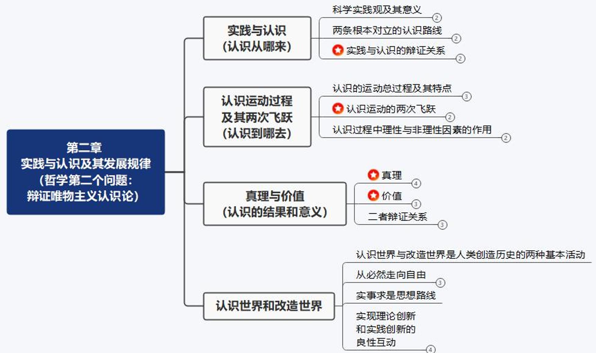
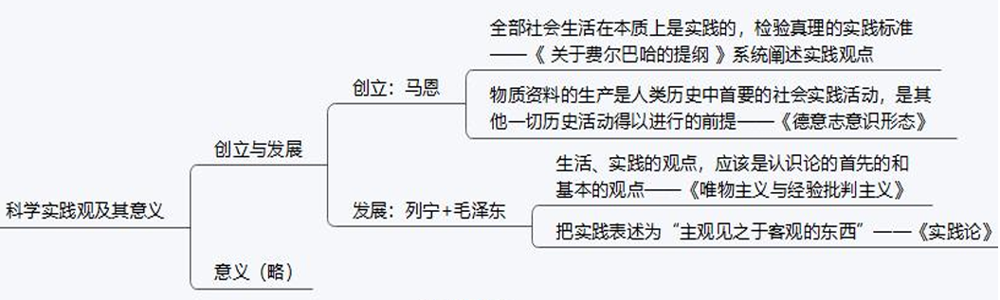
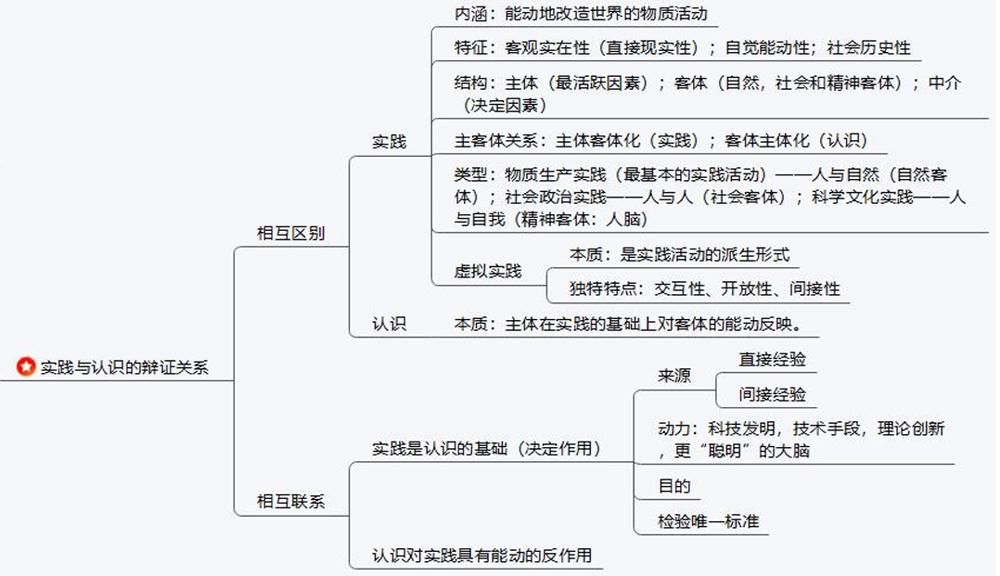
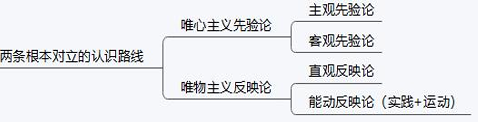
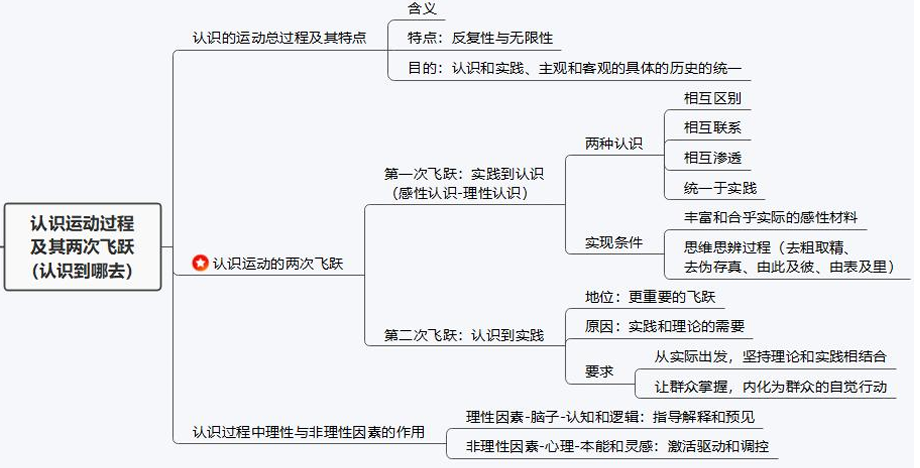
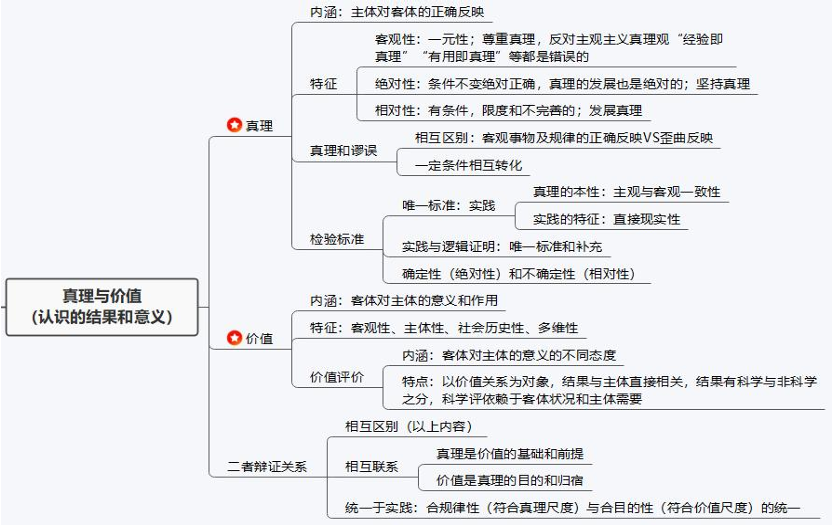
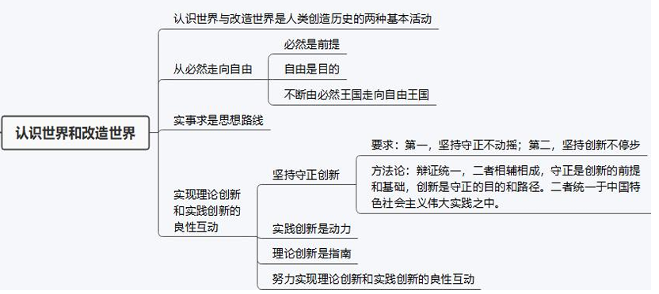
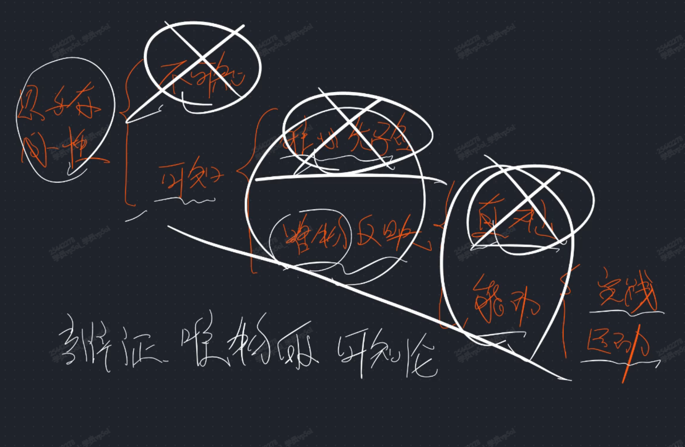

# 第二章 哲学第二问题：辩证唯物主义认识论

## 考点

四大部分：

### 考点1 ： 科学实践观

### 考点2 ： 实践（认识从哪来）

### 考点3 ： 认识

【认识的两条路线】

> 两条路线4种认识论，详细描述与其他三条的缺点见下

【第一次飞跃】 + 【第二次飞跃】

> 第一次飞跃：感性认识与理性认识部分，不够详细，请看笔记

### 考点4：真理 + 考点5：价值

### 考点 6 ： 必然与自由 + 认识世界

## 第一节 实践与认识

### 1 科学实践观

1. 创立

    **《关于费尔巴哈的提纲》 系统阐述实践观点，首次创立了科学的实践观，是一本天才的著作**

2. 发展

    **列宁：生活、实践的观点，是认识论的首先和基本的观点。**

3. 意义

    - 第一，客服旧唯物主义的根本缺陷

    - 第二，建立了科学、能动、革命的反映论

    - 第三，人类思想史上第一次揭示社会生活的本质

    - 第四，为能动认识、改造世界提供了基本的思想工作方法

### 2 实践（认识从哪来）

#### (1) 内涵与特征

1. 实践的内涵：是 **人类** 能动的改造世界的社会性的 **物质活动**

2. **实践的特征**[重点]

    - 实践具有 **客观实在性**（直接现实性）

        实践的要素是客观的，受客观规律制约，引起客观世界改变；

        把它同人的主观认识活动区分开来

        > 实践最根本的特征

    - 实践具有 **自觉能动性**

    - 实践具有 **社会历史性**

3. 实践的地位

    - 是人类生存和发展最 **基本的活动**

    - 是 **人类社会生活的本质**

    - 是是人的认识产生和发展的基础

    - 是人的存在方式，也是真理与价值统一的基础

#### (2) 基本结构（实践三要素）与主客体关系

1. **实践的三要素**： **主体，客体和中介**。三要素的有机统一构成实践的基本结构

    1. **实践主体**：从事社会实践活动的人

        - 个体主体

        - 群体主体

        - 人类主体

    2. **实践客体**：实践所指的对象

        - 自然客体

        - 社会客体

        - 精神客体（脑子）

    3. **实践中介**：工具、手段和方法

    > 任何实践活动都要有 主体、客体和中介

2. 实践的主体和客体的关系

    1. **实践关系**：最根本的关系。**主体客体化**（想法变为现实）

    2. 认识关系：**客体主体化**（产生新的想法）

    3. 价值关系

#### (3) 实践类型 虚拟时间

1. 三种实践活动

    1. **物质生产实践（最基本的实践互动）**

        自然客体的实践互动。人与自然

    2. **社会政治实践**

        社会客体的实践。人与人

    3. **科学文化实践**

        改造思想、学习的实践。人与自我。

    关系：1是2 3的基础，2 3 反作用于1

2. 虚拟实践

    1. 本质： **是实践互动的派生形式（借助虚拟空间）**

    2. 独特特点：交互性，开放性，间接性

#### (4) 辩证关系[主观题考点]

辩证关系：==**实践对认识有决定作用，认识对实践具有能动的反作用**==

==**实践是认识的基础，实践在认识活动中起着决定性作用**==。

==**实践的观点是辩证唯物论的认识论之第一和基本的观点**==。

表现在：

1. **实践是认识的来源**

    **直接经验**：亲身实践得到的认识

    **间接经验**：通过学习得到的别人实践得到的认识

    选择题：

    - 直接经验、间接经验之间不能相互决定

    - 之间不能进行重要性比较

2. **实践是认识发展的动力**

3. **实践是认识的目的**

4. **实践是检验认识真理性的唯一标准**

### 3 认识（认识到哪去）

#### (1) 认识的两条路线

1. 唯心主义先验论

    1. 内涵:认为意识决定物质

    2. 类型：

        - **主观唯心主义先验论**

            只信自己

        - **客观唯心主义先验论**

            信神明

    3. **不足**：否认认识是人脑对客观世界的反映，认为人士限于物质，先于前人的经验

2. 唯物主义反映论

    1. 内涵：认为物质决定意识

    2. 类型：

        - **旧唯物主义直观反映论**

            古代朴素、近代形而上

        - **辩证唯物主义能动反映论**

    3. 旧唯物主义直观反映论

        缺点：离开实践考察认识，没有看到实践对认识的决定性作用；没有把认识看作一个不断发展的过程

    4. 辩证主义能动（唯物）反映论（可知认识论）

        认为 ==认识的本质就是 **主体在实践的基础上对客体的能动反映**==（马克思对认识的定义）

        优点：实践；辩证法

#### (2) 两次飞跃

1. 从实践到认识 - 第一次飞跃

    1. 内涵：实质是从 **感性认识** 上升到 **理性认识** 的过程

    2. ==**感性认识**== （二者区别，补充）

        - 内涵：关于事物的 **现象、外部联系和各个方面的认识**

        - 特点： **直观性、具体性**

        - 形式： **感觉、知觉和表象**

    3. ==**理性认识**== （二者区别，补充）

        - 内涵：关于事物的 **本质、全体、内部联系** 和事物 **自身规律性**的认识

        - 特点： **间接性、抽象性**

        - 形式： **概念、判断、推理**

    4. ==**二者关系（联系）**== （补充）

        - 第一，感性认识是理性认识的基础

        - 第二，感性认识有待于发展和深化为理性认识

        - 第三，感性认识和理性认识相互渗透、相互包含，统一于实践

    5. 方法论

        - 只强调感性认识，忽略理性认识： **经验论**，导致 **经验主义**错误

        - 相反： **唯理论**，导致 **教条主义** 错误

        > 考试：两种认识的来源都是实践，之间没有来源

    6. 从感性上升到理性认识的2个条件[主观题考点]

        - 第一，投身实践，获得 **丰富和合乎实际的感性材料**

        - 第二， **去粗取精，去伪存真，由此及彼，由表及里**（要背）

    7. ==**影响因素：**== （作用，补充）

        - 理性因素（e.g.自身悟性）

            指导作用、解释作用、预见作用

        - 非理性因素（e.g.4外界信仰）

            激活、驱动和控制作用

2. 从认识到实践 - 第二次飞跃

    1.  原因

        - 认识的目的是改造世界和指导实践

        - 没有实践过程，认识就没有完成

    2. 方法

        - 第一，要 **从实际出发，坚持理论和实践相结合** 的原则

        - 第二，理论必须被 **群众掌握，内化为群众的自觉行动**

#### (3) 实践与认识的运动过程

1. 认识辩证过程的含义

    实践与认识的辩证运动，是 实践- 认识- 实践- 认识， **循环往复无穷的辨证发展过程**

2. 认识辩证过程的总特点

    1. **反复性**

        受认识主体条件限制 - 心理，生理等

        受认识客体条件的限制 - 客观事物的本质规律有一个逐步显露的过程。

    2. **无限性**

3. ==**认识辨证过程要求：认识和实践、主观和客观的具体的历史的统一**== （补充）

    - ==**实践是具体的，认识要与一定历史条件下的客观事物统一**==

    - ==**实践是历史的，人的认识要随实践的发展而发展，否则会造成左倾与右倾思想。**==

## 第二节 真理与价值

### 1 真理（认识的结果）

#### (1) 内涵 特征

1. 真理的含义：真理是对客观事物及其规律的正确反映

2. 两种错误的真理观：

    1. **马赫主义"经验即真理"**

    2. **有用主义"公说公有理，婆说婆有理"**（价值和真理不能混淆）

    3. 大多数人说的就是真理

3. 真理的特征

    - **客观性** 
    
        含义：真理的内容是对客观事物及其规律的正确反映。客观性是真理的本质属性，但是真理的形式又是主观的。

    - **真理一元性**： 同一条件，特定客体，真理只有一个

    - **绝对性** - 坚持真理

        在特定条件范围之内，真理一定正确 - 强调相对静止的条件

    - **相对性** - 发展真理

        条件外，范围外，对真理的认识是有限的，变化的。 - 绝对运动的角度

        > 考试：只强调绝对性 - 形而上错误 - **绝对主义/独断论**；夸大相对性 - 不可知/相对主义诡辩 错误 - **相对主义**

> ps:难点但不是考试重点

#### (2) 真理与谬误

1. 相互区别

    正确反映/歪曲反应

2. 在一定条件下相互转化

    1. 真理向谬误转化

        忽略真理存在的条件和范围，真理变为谬误

        **要不断实现认识和实践、主观和客观的具体的历史的统一**

    2. 谬误向真理转化

        回到适用的范围条件

        失败是成功之母，错误是正确的先导

    > 真理不会被推翻，只能被发展；如果不发展，会转化为谬误。但是真理不会被推翻！在适用范围之内，真理永远是真理

3. ==**真理与谬误的界限**==(补充)

    是否能与实际相符合/实践

    真理和谬误的对立只有在非常有限的范围内才有绝对的意义，这个范围就是度。超过度则为谬误

#### (3) 检验标准

1. ==**实践是检验真理的唯一标准，是由真理的本性和实践的特点决定的**==

    - 真理的本性表明：真理是正确反映，**它的本性在于主观和客观相符合（一致性）**

    - 实践的特点表明：实践是人们改造世界的客观物质性活动，具有 **直接现实性** 的特点

2. 实践标准和逻辑证明的关系

    实践是检验真理的唯一标准，但不排斥逻辑证明的作用

    1. 可通过逻辑，由一个正确理论确定另一个理论的真确性

    2. 逻辑证明不是检验真理的标准

3. 实践标准的确定性和不确定性

    - 确定性/决定性

        任何的真理都要通过实践来检验，这是确定不移的

    - 不确定性

        检验真理的实践要与时俱进（守正创新）

### 2 价值（认识的意义）

#### (1) 内涵

价值： **客体对主体的有用性**（哲学范畴的定义）

#### (2) 特征

1. 客观性

    价值来自于客观事物，价值标准不以客观意志而转移（价格）

2. 主体性

    可以自己去判断某个客体的价值

3. 社会历史性

    随时代变化

4. 多维性

    从不同的维度，有不同的价值

> 考试：区别材料体现的特性

#### (3) 价值的评价

1. 价值评价的内涵：客体对主体的意义的不同态度

2. 特点：

    （1）评价以主客体的价值关系为认识对象

    （2）评价结果与评价 **主体直接相关**

    > 注：与主体相关，不由主体决定

    （3）评价正确与否依赖于对客体状况和主体需要的认识

    （4）评价有科学与非科学之别。科学标准：

    - 是否推动社会历史进步

    - 是否符合社会发展趋势

    - 是否维护、满足了最广大人民的需要和根本利益

#### (4) 辩证关系

1. ==**相互区别**== （两句话，补充）

    - 真理一定有价值

    - 有价值的不一定是真理

2. 相互联系

    - 真理是价值的基础和前提

    - 价值是真理的目的和归宿

3. 真理和价值统一于实践

    ==**任何实践都是在真理尺度和价值尺度的制约下进行的，任何成功的实践都是合规律性和合目的性的统一**== 。
    
    既要做对的（真理），又要做好的（价值）

## 第三节 认识世界和改造世界

### 1 必然与自由

认识世界和改造世界是从必然走向自由的过程

1. 区别

    自由：意识及其能动性的发挥

    必然：物质规律和前提

    先必然，后自由。越必然，越自由，必然是自由的前提，基础和限度。

2. 自由是有条件的

    - 认识条件

    - 实践条件

3. 方法论

### 2 实事求是

1. 一切从实际出发，实事求是

    理论基础：

    - 唯物论：物质决定意识

    - 辩证法：矛盾分析法的核心要求-矛盾的特殊性：具体问题，具体以分析。

    既要强调物质基础，又要强调不断的运动、变化、发展，结合实际情况，做到具体问题具体分析过程。

2. 实事求是是中国共产党思想路线的核心

### 3 守正创新[主观题]

4. ==**坚持守正创新，实现理论创新和实践创新的良性互动**==（新考点，材料题重点）

    1. 坚持守正创新

        地位：坚持真理和发展真理。

        要求:

        - 第一， **守正不动摇**

        - 第二， **创新不止步**

    2. 实践创新是动力

    3. 理论创新是指南

    4. 努力实现理论创新和实践创新的良性互动
    