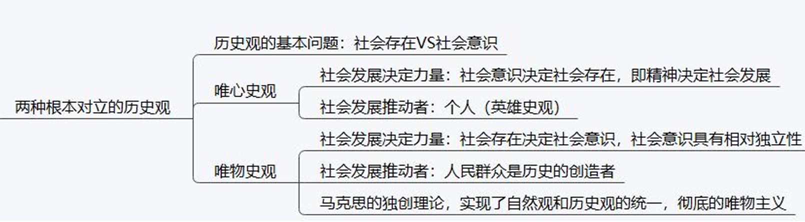
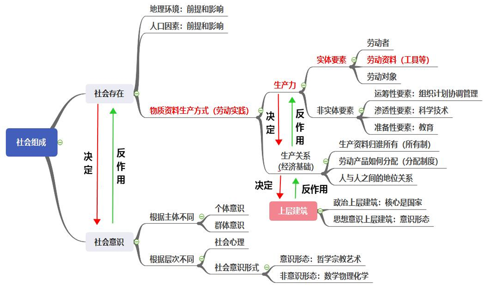
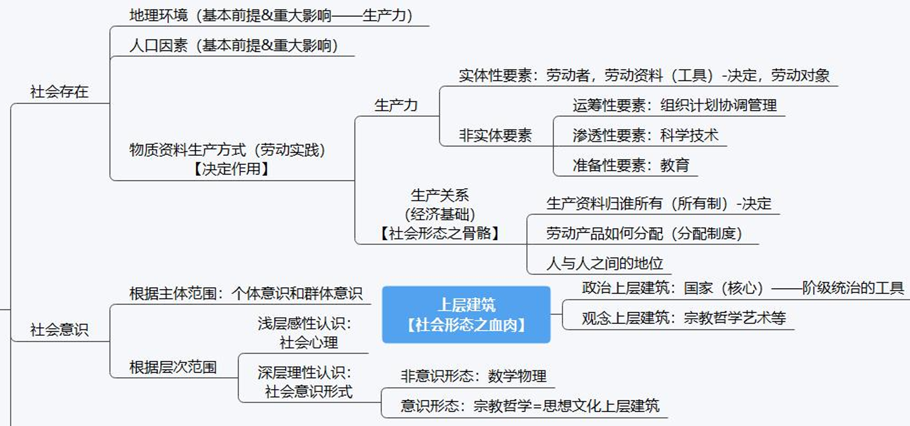
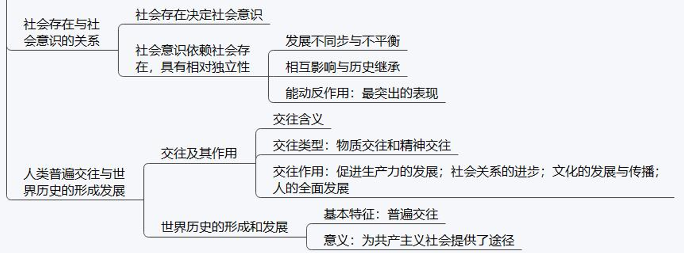
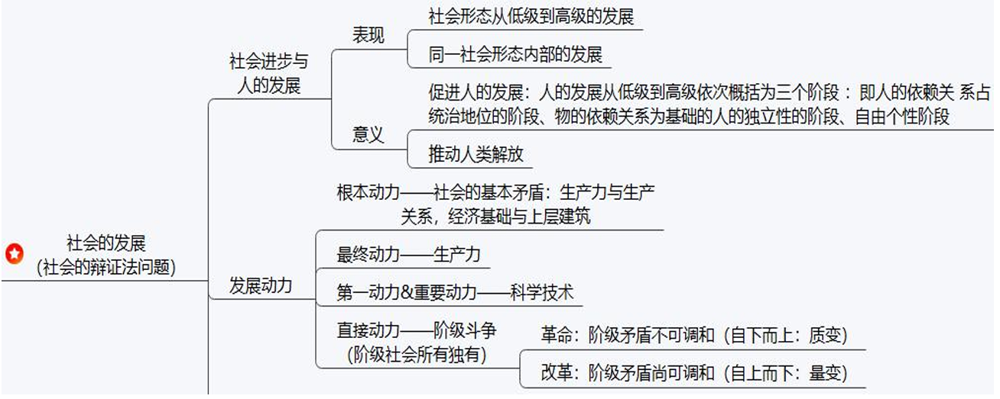
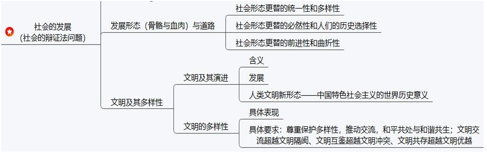
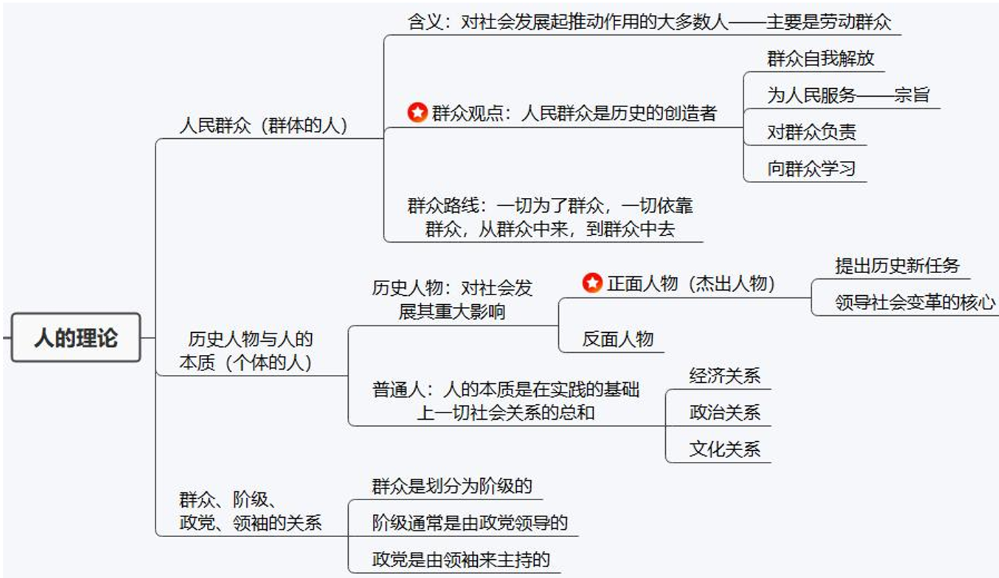

# 第三章 哲学第四问题：唯物史观

## 考点

社会理论 + 群众理论（人的理论）

### 考点一：两种历史观

### 考点二：社会组成（社会存在与社会意识）

1. 【社会意识】 + 【社会存在】

    

2. 【社会意识与社会存在的辩证关系】 + 【交往与世界】

    

    > 人类普遍交往与世界历史的形成发展：人类命运共同体的理论来源

3. 【社会基本矛盾】 + 【社会的运动规律】

    没有导图，详细看笔记

### 考点三：社会的动力 + 社会的发展

社会形态理论请看笔记

### 考点四：人的理论

## 第一部分 社会的组成

### 1 社会意识

社会的 **精神** 方面。 ==**社会意识是物质的产物，是社会物质生产和物质交换的产物**== （补充）

1. 分类：

    1. 依据反映的主体不同可分为：个体意识和群体意识；

    2. 依据反映的层次不同可分为：社会心理（以感性认识为主）和社会意识形式（以理
    性认识为主）；

    3. 依据与社会经济关系、阶级关系的联系程度不同（是否有阶级政治性）可分为：意
    识形态和非意识形态：

2. 意识形态

    阶级政治性。 **艺术、宗教、伦理道德、政治法律思想、哲学以及一部分社会科学**

3. 非意识形态

    自然现象和特定社会现象。 **主要包括自然科学、某些特定的社会科学、思维科学、心理学、语言学、逻辑学**

### 2 社会存在

社会的 **物质** 方面，包括物质生活资料的生产以及生产方式、自然地理环境和人口因素。

1. 地理环境

    - 前提条件

    - 影响作用

    - 方法论（ **人与自然关系和态度** ）

        我们要合理开发资源，保护生态环境，使资源的利用、环境的保护与社会经济发展相互协调，使人与自然相和谐，解决环境问题，构建生态文明，推动绿色发展，建设美丽中国。

2. 人口因素

    - 前提条件

    - 影响作用

        人多促进社会经济发展，人太多阻碍。

3. **物质资料生产方式**

    - **对社会的发展具有决定作用**。

    - **一部历史首要的、根本的是生产劳动的历史和生产方式变化的历史，生产劳动的观点是唯物史观的首要的、基本的观点**。表现为：

        1. 是社会有机体的物质承担着

        2. 决定社会结构、面貌、性质，制约人们的全部社会生活

        3. 决定社会历史的发展
    
    - 补充表述：物质生产活动和生产方式

        （1）是人类社会赖以存在和发展的基础（决定性作用）

        （2）是人类其他一切活动的首要前提

        （3）决定整个社会历史的变化发展及社会形态从低级到高级的更替和发展

        （4）生产方式是社会物质生活最重要的条件

### 3 辩证关系

1. **社会存在决定社会意识，社会意识是社会存在的反映**，并反作用于社会存在

2. 社会意识 **依赖于** 社会存在，但又具有其 **相对独立性**

    相对独立性：

    - 一是社会意识与社会存在发展具有 **不完全同步性和不平衡性**。  
    - 二是社会意识内部各种形式之间存在 **相互影响且各自具有历史继承性**。  
    - 三是社会意识对社会存在具有 **能动的反作用**，这是社会意识相对独立性的 ==**最突出表现**==。

3. 重要意义

    “**社会存在决定社会意识**”：从而在人类思想史上第一次正确回答了社会历史观的基本问题，宣告了唯心史观的彻底破产。马克思的唯物主义也是彻底的唯物主义。

### 4 社会基本矛盾及运动规律

**==生产力与生产关系、经济基础与上层建筑之间的矛盾==，是人类社会基本矛盾。==生产力与生产关系矛盾运动的规律、经济基础与上层建筑矛盾运动的规律==，是人类社会发展的基本规律。**

#### (1)生产力与生产关系

1. 生产力

    **补充表述：生产力是人类社会发展的最终决定力量**

    含义：人在生产实践活动中改造自然的力量

    **基本要素**：实体要素+非实体要素

    - 实体要素

        1. 劳动者

            作用：具有主导作用

            意义：人才资源是第一资源

        2. 劳动资料（劳动手段）

            地位： **生产工具是衡量社会生产力发展水平的客观物质尺度**，是划分不同经济时代的 **客观依据和标签**

            *渔畜时代、农耕时代、工业时代、信息时代*

        3. 劳动对象

            地位：现实生产的必要前提

    - 非实体要素

        1. **运筹性要素**：组织、计划、协调和管理等；

        2. **渗透性要素**：科学技术。  
            日益成为生产发展的决定性因素；  
            科学技术是先进生产力的集中体现和主要标志；  
            邓小平指出科学技术是第一生产力，对劳动者，生产资料有重大影响；

        3. **基础性要素**：教育

        > 知道就行

2. 生产关系

    1. 含义：

        生产关系反映的是 **人与人之间的关系**，是人们在物质生产过程中形成的不以人的意志为转移的 **经济关系**。

        生产关系是 **社会关系中的最基本关系**，与社会生产力发展相适应。

    2. 构成

        1. **生产资料所有制关系**，即生产资料归谁所有（ **决定因素** ）；
        
        - 生产资料所有制关系是最基本的，所以是具有决定意义的方面。  
        
        - 它是区分不同生产方式、判定社会经济结构性质的客观依据。如公有制和私有制

            *原始社会，奴隶社会，封建社会，资本社会，社会主义社会，共产主义社会*

        2. **产品分配关系**，即产品如何分配；

        3. 生产中的人与人关系。

3. 生产力和生产关系的关系

    1. 生产力 **决定** 生产关系的产生、性质、变化；

    1. 生产关系对生产力具有 **反作用**，适应起促进作用，不适应则起阻碍作用

    1. 意义：

        - 否定单纯以道德作为评判历史功过是非的思想体系

        - 马克思主义政党指定路线、方针和政策的重要依据

#### (2)经济基础与上层建筑

==**经济基础与上层建筑组成了社会结构，是社会结构的“骨骼”和“血肉”**==

1. 经济基础

2. 上层建筑

    - 政治上层建筑

        **核心是国家政权**

        **国家是统治阶级实施统治的暴力工具**

    - 观念上层建筑（意识形态）

3. 二者关系

    **政治上层建筑是在观念上层建筑指导下建立起来的**，是统治阶级意志的体现。具体表现为：

    1. 首先，经济基础决定上层建筑。

    2. 其次，上层建筑对经济基础具有反作用；

    3. 再次，经济基础与上层建筑的相互作用构成二者的矛盾运动；

    4. 最后，经济基础和上层建筑之间的内在联系构成了上层建筑一定要适合经济基础状况的规律。

## 第二部分 社会的发展

### 1 社会进步 社会形态更替

1. 社会进步的表现

    - 社会形态从低级到高级的发展

    - 统一社会形态内部的发展

2. 社会进步的意义：

    （1）社会进步促进人的发展。

    把人的发展从低级到高级依次概括为三个阶段 ：**即人的依赖关系占统治地位的阶段、物的依赖关系为基础的人的独立性的阶段、自由个性阶段**。

    （2）社会进步推动人类解放。

3. 社会形态包括
    
    经济形态、政治形态和意识形态

4. **社会形态更替的特性** / 发展形态（骨骼与血肉）与道路

    > 社会形态/社会结构由骨骼和血肉组成，即经济基础和上层建筑

    - 统一性（必然性） 与 多样性（历史选择性） 

        （1）必然性：**社会形态更替的客观必然性**

        社会形态依次更替的过程和规律是客观的

        社会形态更替归根结底是社会基本矛盾运动的结果

        社会形态发展的基本趋势是确定不移的

        （2）历史选择性：**人们的历史选择性的表现**

    - 前进性（顺序性） 与 曲折性（跨越性）

        （1）前进性：社会发展的 **决定性、统一性决定了社会发展的前进性**

        （2）曲折性：社会发展的 **选择性、多样性决定了社会发展是曲折的**

### 2 社会发展的动力

**五大动力：**

- **根本动力**：社会的根本矛盾（生产力vs生产关系、经济基础vs上层建筑）

- 最终动力：生产力（工具变革）

- 第一动力、重要动力：科学技术

- 直接动力：阶级斗争 - 激化[革命]/缓和[改革]

#### (1)社会基本矛盾（根本动力）

1. 两对基本矛盾

    （1）生产力和生产关系

    （2）经济基础和上层建筑

2. 社会基本矛盾是历史发展的根本动力

3. 社会主要矛盾在历史发展中的作用

#### (2)阶级斗争和社会革命（直接动力）

1. 阶级和阶级斗争是人类社会发展到一定阶段才会出现的社会现象

    1. 阶级是一个 **经济范畴**，也是一个 **历史范畴**。
    2. 阶级斗争根源于阶级之间物质利益的根本对立，根源于 **社会经济关系的冲突**

2. 阶级斗争是阶级社会发展的直接动力

3. 马克思主义的阶级分析方法是认识阶级社会的科学方法

4. 社会革命的实质和作用

    1. 社会革命是阶级矛盾不可调和的矛盾

    2. “革命是历史的火车头”，是“社会进步和政治进步的强大推动力”

5. 改革在社会发展中的作用

    1. 改革： **自上而下** 缓和解决阶级矛盾的形式

    2. 我国改革实质和作用：社会主义改革是社会主义制度的自我完善和自我发展，作为体制的根本转变，是第二次革命，解放和发展生产力，是社会主义社会发展的直接动力。

#### (3)科学技术（第一动力）

**科学技术作为先进生产力的重要标志，是推动社会文明进步的重要力量。科学技术是一个复合概念。**

1. 科技革命是推动经济和社会发展的强大杠杆

### 3 文明及其多样性

1. 文明

    （为习思想提供理论背书）

    （人类文明新形态）

2. 文明的多样性

## 第三部分 人民群众在历史发展中的作用

### 1 人民群众是历史的创造者

#### (1)两种历史观

唯物史观与唯心史观的对立，在历史创造者问题上表现为群众史观与英雄史观的对立

1. 英雄史观

    1. 从认识根源

    2. 从社会历史根源

    3. 从阶级根源

2. **唯物史观**

    - 首先，唯物史观立足于 **现实的人及其本质来把握历史的创造者**；

    - 其次，唯物史观立足于 **整体的社会历史过程来探究谁是历史的创造者**；

    - 再次，唯物史观从 **社会历史发展的必然性** 入手来考察和说明 **谁是历史的创造者**；

    - 最后，唯物史观从 **人与历史关系的不同层次上** 考察 **谁是历史的创造者**。

    => 结论：==**人民群众是历史的创造者**==

#### (2)人民群众在创造历史过程中的决定作用

1. 人民群众的内涵 - 一个历史范畴

    - 从质来看：指一切对社会历史发展起 **推动作用的人**

    - 从量来看：指社会人口中的 **绝大多数** ；

    - 最稳定的主体部分，始终是从事物质资料生产的 **劳动群众**

2. 人民群众的历史创造作用：绝对作用。人民群众创造历史，表现在：

    - 社会物质财富的创造者

    - 社会精神财富的创造者

    - 社会变革的主要力量

    - **人民群众的历史作用受到历史制约性**（辩证）

#### (3)无产阶级政党的群众路线

1. 群众观点

    坚信人民群众自己解放自己的观点，全心全意为人民服务的观点，一切向人民群众负责的观点，虚心向群众学习的观点

2. 群众路线

    - 内容：即 **一切为了群众，一切依靠群众，从群众中来，到群众中去**。

    - 意义：群众路线是 ==**我们党的生命线和根本工作路线**== ，也是我们党的优良传统。

        > 党的生命线有且只有一个：群众路线

### 2 个人在社会历史中的作用

#### (1)杰出人物的历史作用

1. **历史人物** 的含义：历史人物是一定历史事件的主要倡导者、组织领导者或思想理论、科学文化的重要代表人物。

2. 历史人物的作用：历史人物对历史发展有深刻影响，甚至有时能够决定个别历史事件的结局，从而导致历史发生这样或那样的重大变化。

3. 历史人物的类型：

    **杰出人物**——对历史发展起促进作用；

    **反动人物**——对历史发展起阻碍作用。

4. 杰出人物的作用：对于人类科学文化的发展和社会进步有着巨大的推动作用。但不能决定历史规律。

#### (2)辩证判断个人的历史作用

1. 历史分析法

2. 阶级分析法

3. 无产阶级领袖

### 3 群众、阶级、政党、领袖的关系

群众、阶级、政党、领袖环环相扣、相互依存，构成一个有机整体，任何时候都不应
该把它们割裂开来。

首先，群众是划分为阶级的。

其次，阶级通常是由政党领导的。

最后，政党是由领袖来主持的。一个阶级的政党要领导本阶级进行有组织的活动，维护本

阶级的利益，就必须有自己的领袖。