政治经济学：4、5章

# 第四章 资本主义的本质及其规律(资本主义社会组成 - 经济基础和上层建筑)

资本主义 - 经济/政治

经济方面 - 现象： ==**商品经济理论**== ；  
        - 本质： ==**剩余价值理论**== + ==**资本理论**==

政治方面

## 第一节 经济现象 - 商品经济理论

### 1 商品经济

1. 商品经济与自然经济[考点1]

    是否为交换为目的的不同经济形式：商品经济/自然经济

    商品经济生产力水平更高

2. 商品经济产生的历史条件

    1. 社会分工的出现

    2. **生产资料和劳动产品属于不同的所有者**

3. 商品经济的发展阶段

    1. 简单商品经济

        以为生产资料私有制和个体劳动为基础

    2. 发达商品经济

        以生产资料私有制和雇佣劳动为基础

### 2 商品

#### 商品含义

1. 商品含义： **用来交换、能满足人的某种需要的劳动产品**；

2. 二因素： 商品具有 **使用价值** 和 **价值** 两个因素；

3. 使用价值：商品的有用性与商品的 **个性**。是商品的 **自然属性**（人与自然交换的产物）；是 **社会财富**；

4. 价值：商品的 **共性**。 是商品的 **社会属性与本质属性**（凝结在商品的无差别的劳动）。

#### 使用价值与价值(商品二因素)

1. 使用价值与价值的区别

    - 商品的使用价值是指商品的有用性，是商品能够满足人的某种需要的属性；

    - 商品的价值是凝结在商品中的无差别的一般人类劳动

    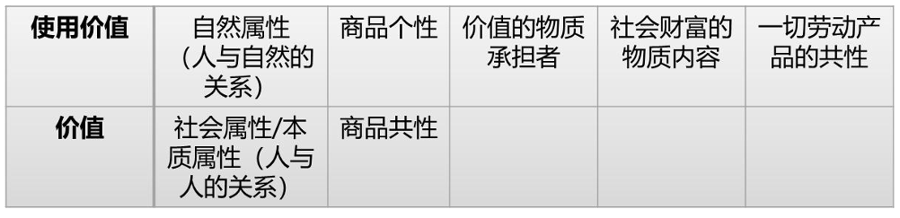

2. 使用价值与价值的矛盾

    - 作为商品，必须同时拥有使用价值和价值两个因素

    - 无论对于商品的生产者还是消费者，二者不可兼得，只能占有其一。卖出去：占有价值；使用：占有使用价值

3. 价值与 **交换价值** 的区别

    - 商品的 **交换价值** 是指在一次交换中价值量的表现大小，首先表现为一种使用价值同另一种使用价值相交换的量的关系或比例。**决定商品交换比例的不是商品的使用价值，而是价值**；

    - **只有价值能进行量化和大小比较，使用价值无法比较**；

    - **价值是交换价值的基础，交换价值是价值的表现形式**。

#### 商品生产(劳动二重性)

1. 具体劳动和抽象劳动

    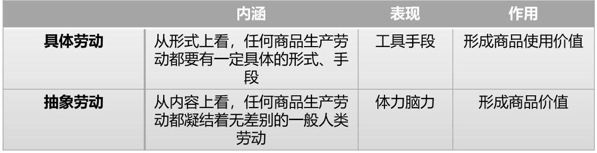

    **具体劳动  = 商品的使用价值**

    **抽象劳动 = 商品的价值**

2. 相互联系

    时间上和空间上统一，是商品生产者的同一劳动过程不可分割的两个方面

    具体劳动 - 人与自然关系 - 自然属性；

    抽象劳动 - 社会关系 - 社会属性

#### 商品售卖

1. 商品价值量计算方式

    价值量是由劳动者生产商品所耗费的劳动量决定的，而劳动量则按照 **劳动时间**来计量。当同一生产部门内存在着个别劳动时间和社会必要劳动时间的差别时，商品的价值量是由生产商品的 **社会必要劳动时间**所决定的。

    （1）**个别劳动时间**：商品生产者生产某种使用价值所实际消耗的劳动时间。

    （2）社会必要劳动时间：社会上大多数劳动者生产一个产品的劳动时间。**个别劳动时间的众数**
    
    （3）社会必要劳动时间是在 **同一生产部门内部、商品生产者之间相互竞争中自发形成的**

    当 个别时间 > 必要时间：赔钱；相反赚钱

2. 商品价值量与劳动生产率之间的关系

    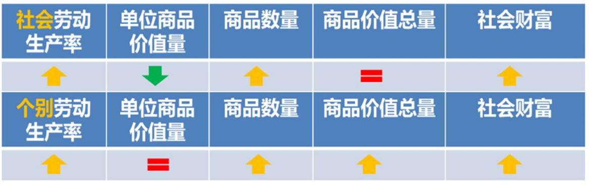

    1. 单位商品价值量 只与 大多数的个别劳动时间 正相关

    2. **商品价值总量** 只与 单位商品价值量*商品数量 正相关

    3. 社会财富 只与 商品数量 正相关

### 3 商品客观规律(货币职能理论+价值规律)

#### 货币职能理论

1. 商品价值形式的四个阶段

    （1）简单的或偶然的价值形式；

    （2）总和的或扩大的价值形式；

    （3）一般价值形式，一般等价物

    （4）以及货币形式

2. 货币的含义与本质

    （1）含义：货币是在长期交换过程中形成的 **固定充当一般等价物的商品**，是商品经济内在矛盾发展的产物，货币的本质体现一种 **社会关系**；

    （2）本质：**一般等价物**；

    （3）马克思名言： **金银天然不是货币，但货币天然是金银**；

3. 货币的职能

    1. **价值尺度**：用货币来衡量商品的价值（观念想象的货币）

    2. **流通手段**：货币充当商品交换的媒介（实际的货币）

    3. **支付手段**：出现购物赊账后，货币用作支付债务、 **工资**、税款、利息等。

        > 流通手段：一手交钱，一手交货  
        > 支付手段：先交定金，再交余款和利息

    4. **贮藏手段**：用足值的金属货币，退出流通领域贮藏起来

        > 纸币不能贮藏

    5. **世界货币**：在世界市场充当货币的职能。作为世界货币必须是足值的金属货币

4. 货币的社会作用

    1. 商品内在的使用价值和价值的矛盾发展起来，转化为商品和货币的外在矛盾

    2. “商品的惊险的跳跃，如果跳跃不成功，摔坏的是商品占有者”（商品卖不出去）

    3. 经济危机的一般可能性，首先是由货币作为流通手段和支付手段引起的。

#### 价值规律

1. 价值规律的内容

    商品生产中 **商品的价值量是由生产商品的社会必要劳动时间所决定的，商品交换中以价值量为基础实行等价交换**。当货币出现后，商品的价值表现为商品的价格，等价交换的原则必然要求价格与价值相一致。

2. 价值规律的形式

    ==**商品的价格围围绕商品的价值自发波动**==

    （1）在短期内，由于市场供求关系的影响会造成价格与价值背离，但是价格围绕价值上下波动，体现了价值规律的作用。

    （2）在长期内，价格围绕价值波动，在整体上正负相抵，从而使商品的平均价格与价值相一致充分体现价值规律的要求。

3. 价值规律的积极作用

    **（1）自发地调节生产资料和劳动力在社会生产部门之间的分配比例；**

    **（2）自发地刺激社会生产力的发展；**

    **（3）自发地调节社会收入的分配。**

4. 价值规律的消极后果

    其一，导致社会资源浪费；

    其二，阻碍技术进步；

    其三，导致收入两极分化

5. 社会主义市场经济——利用好“两只手”

    **一方面要充分利用价值规律，让市场在资源配置中起决定性作用**；

    > 尊重客观规律

    **另一方面，也要认识到价值规律的局限性，更好发挥政府作用，使市场更加稳健地运行， 更好地服务于提升综合国力和改善人民生活水平，坚决防止出现两极分化**。

    > 发挥主观能动性

### 4 商品经济基本矛盾

商品的使用价值和价值的矛盾、生产商品的具体劳动和抽象劳动的矛盾，根源于私
人劳动和社会劳动的矛盾。 ==**私人劳动和社会劳动的矛盾是商品经济的基本矛盾**==  。

1. 私人劳动与社会劳动

    （1）**私人劳动=为自己生产商品创造使用价值=生产**；

    （2）**社会劳动=为社会消耗体力脑力创造价值=消费**。

    （3）将私人劳动转化为社会劳动靠 **交换**，所谓卖出去

    （4）地位：**私人劳动和社会劳动的矛盾是商品经济其他一切矛盾的基础**。在资本主义商品经济中一步发展成资本主义的基本矛盾，即 **生产社会化和生产资料资本主义私人占有之间的矛盾**

2. 几对基本矛盾

    - 一切社会：生产力 vs 生产关系

    - 商品经济：社会劳动 vs 私人劳动

    - 商品：价值 vs 使用价值

    - 劳动：抽象劳动 vs 具体劳动

    - 资本主义：生产社会化 vs 生产资料资本主义私人占有

3. 商品拜物教

    **只看到物与物的关系，没看到人与人的关系，只看现象，不看本质**。

    **资本家的谎言。资本家实质上只是想在商品转换为货币的过程中赚钱**。

4. 马克思劳动价值论

    1. 马克思劳动价值论扬弃了英国古典政治经济学的观点，为剩余价值论的创立奠定了
    基础。**劳动二重性理论成为“理解政治经济学的枢纽”**。
    
        > 枢纽在这里

    2. 马克思劳动价值论 **揭示了私有制条件下商品经济的基本矛盾**，为从物与物的关系背后揭示人与人的关系提供了理论依据。、

    3. 马克思劳动价值论 **揭示了商品经济的一般规律**，对理解社会主义市场经济具有指导意义。

## 第二节 资本主义经济制度的本质(剩余价值理论)

### 1 资本主义经济制度的产生

1. 前资本主义社会形态的演进和更替 - 按经济基础/所有制关系划分

    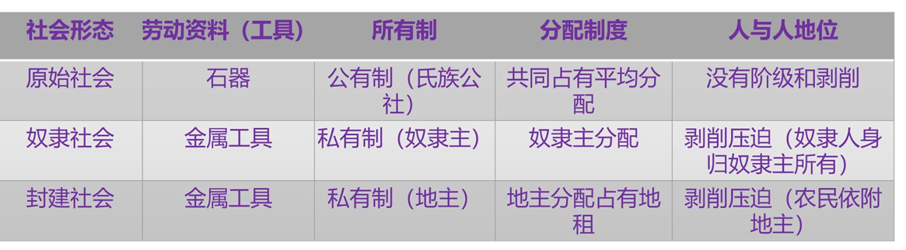

    资本主义社会 - 机器工具 - 私有制（资本家） - 占有工人剩余价值 - 剥削压迫

2. 资本主义生产关系的产生[考点]

    1. 从小商品经济分化出来

    2. 从商人和高利贷者转化而来

    > 产业资本家；商业资本家；银行资本家；农业资本家

3. 资本的原始积累[考点]

    1. 关键词： **暴力掠夺**

    2. 途径：

        - 一是用暴力手段 **剥削农民的土地** - 圈地运动

        - 二是用暴力手段 **掠夺货币财富** - 三角贸易

4. 资本主义制度的确立

    1. 初步确立标志：一系列资产阶级革命（政治上层建筑）

    2. 最终确立标志：工业革命的完成

    3. 资本主义生产关系的本质：

        资本家凭借对生产资料的占有，在等价交换原则的掩盖下，雇佣工人从事劳动，无偿占有雇佣工人创造的 **剩余价值**。

5. 两个公式

    1. 商品流通公式： W - G - W 生活消费

    2. 资本增殖公式： G - W - G 生产赚钱

    W：商品 G：货币

    **如果货币发生增殖，叫做资本** 

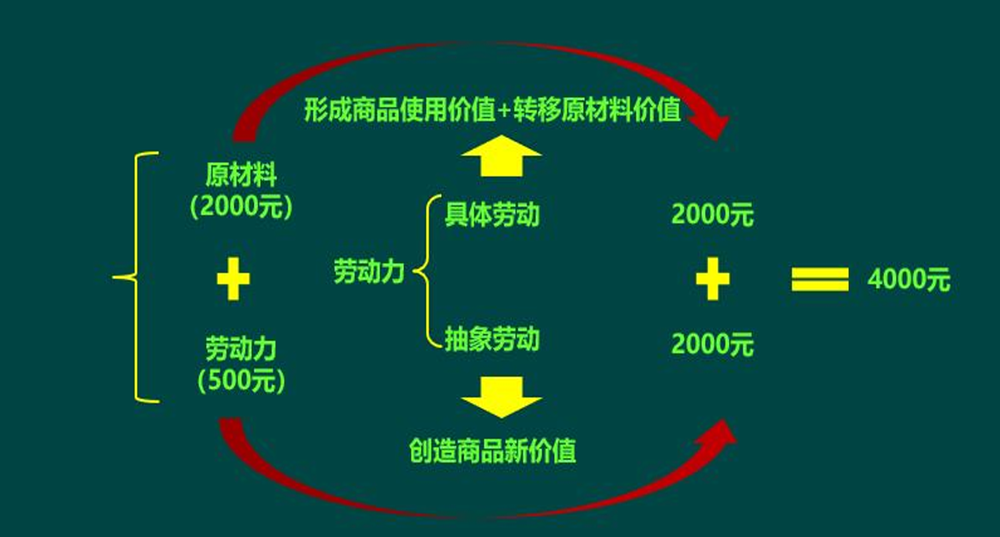

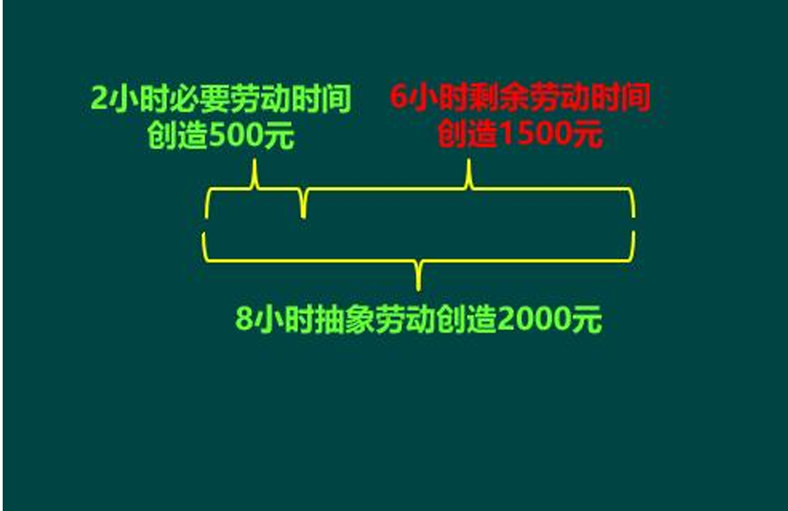

### 2 剩余价值理论(1):剩余价值生产的前提

#### 货币转化为资本

**当货币被用作追逐价值增殖时，货币就转变为资本。但资本家要实现价值增殖必须要到流通中去购买一种特殊的商品——劳动力，只有在劳动力的使用过程——劳动过程中，才能带来剩余价值。所以 ==劳动力成为商品是货币转化为资本的前提条件==**。

#### 货币转化为资本的前提-劳动力成为商品

1. 劳动力成为商品的基本条件

    1. 劳动力是自由人，有劳动能力

    2. 劳动力有且仅有劳动力，一无所有

2. ==**劳动力商品**==

    - 价值：给劳动力的工资

        劳动力价值的包含（劳动力价值三要素）：

        - 满足自己生活

        - 满足家人生活

        - 之前所受教育培训费用（学历加成）

        - 特殊因素/与不同商品的不同：历史和道德的因素（人道主义）

    - 使用价值： **劳动力商品的使用价值是价值的源泉**（劳动力商品使用价值的特点）。劳动力商品创造 **剩余价值**，实现价值增值。

3. 资本主义工资的本质和形式

    - 内涵：是工人劳动力的价值或价格的转化形式

    - 形式上：工人劳动的价值或价格（掩盖资本家剥削）

    - 本质：工人劳动力的价值或价格

    - 把握工资的本质：关键是区分劳动和劳动力

    ==**工人所获得的工资 = 工人在必要劳动时间创造的价值 = 再生产劳动力所需要的时间 = 劳动力的价值 = 资本家投入的可变资本**==

### 3 剩余价值理论(2):剩余价值生产的过程

#### 劳动过程和价值增殖过程的统一

**资本主义生产过程，从形式上看：是生产物质资料的劳动过程；从实质上看：是生产剩余价值的价值增殖过程**。

**资本主义生产的实质是剩余价值的生产**。

1. 资本主义的劳动过程

    1. 工人的劳动受资本家支配

    2. 劳动的成果或产品全部归资本家所有

2. 剩余价值的生产

    商品价值的形成过程： W = c + v + m .用劳动二重性解释商品价值以及剩余价值的形成：

     - W: 商品的价值

    - c: 通过工人的 **具体劳动**，作用在生产资料上，创造出商品的使用价值，将生产资料的价值转移到新产品中去，形成商品价值的 c 部分。 **其实就是原材料成本**

    - 通过工人的抽象劳动创造商品的新价值 v+m  
        v: 在必要劳动时间，生产出劳动力价值 v  
        m: 在剩余劳动时间内，创造商品的剩余价值m

    - 剩余价值是超过劳动力价值的价值，延长了商品价值的形成过程

#### 剩余价值生产的方法

1. 绝对剩余价值（加班/增加强度）

    - 绝对剩余价值： **在必要劳动时间不变的前提下，通过绝对地延长工作日的长度** 从而绝对地延长了剩余劳动时间，所获得的剩余价值，叫绝对剩余价值。

2. 超额剩余价值（个别提高生产率）

    在工作日长度不变的前提下，通过提高个别生产者劳动生产率从而使得个别劳动时间低于社会必要劳动时间，所获得的剩余价值，叫超额剩余价值。

    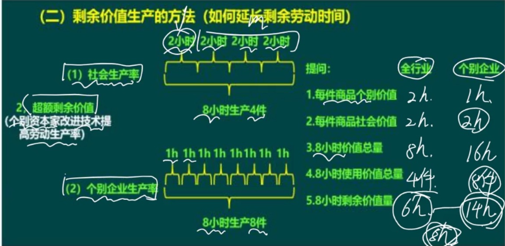

3. 相对剩余价值（效仿之下，全体提高生产率）

    在工作日长度不变的前提下，通过提高全社会劳动生产率从而缩短了必要劳动时间，相对地延长了剩余劳动时间，所获得的剩余价值，叫相对剩余价值

    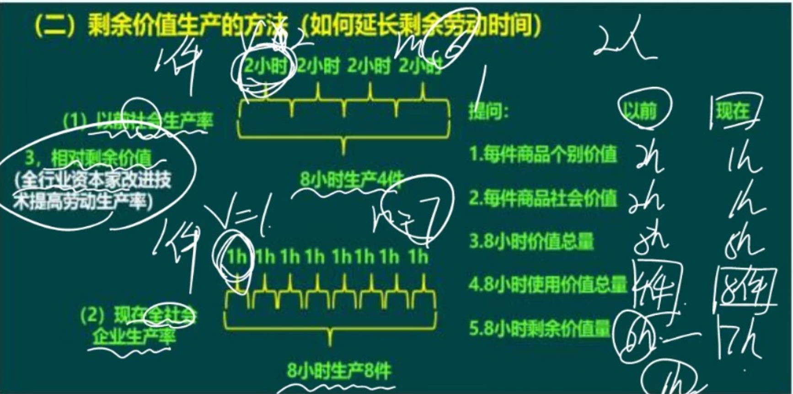

4. 剩余价值提高的本质解释

    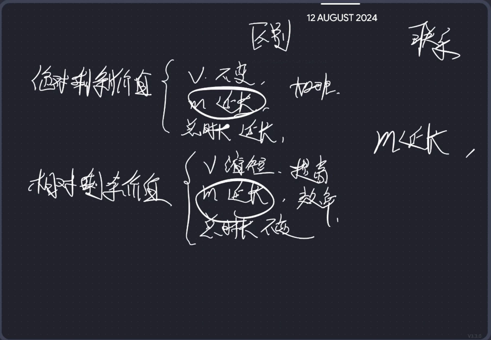

### 4 剩余价值理论(3):剩余价值率

#### 资本

1. 内涵： **能带来剩余价值的价值**。反映了 **资本主义的生产关系：剥削**

2. 分类：根据资本在剩余价值生产过程的不同作用

    1. **不变资本**：生产资料

    2. **可变资本**：劳动力

3. 划分不变资本与可变资本的意义

    揭示了剩余价值产生的源泉：可变资本 - 劳动力。

    揭露了资本家剥削劳动者的事实

    为确定 ==**资本家对雇佣劳动者的剥削程度**== 提供了科学依据：
    
    **剩余价值率** $m' = m/v$

4. 生产自动化条件下剩余价值的源泉

    只有工人的劳动才是剩余价值的唯一源泉

### 5 剩余价值理论(4):平均利润

#### 剩余价值的分配

在平均利润率规律的作用下，不同的资本家集团共同瓜分产业工人所创造的剩余价值： **产业资本家获得产业利润，商业资本家获得商业利润，银行资本家获得银行利润，农业资本家获得农业利润等。**

> 农业资本家：收地租

#### 平均利润的形成

1. 生产成本的形成

    1. 取消 c 和 v 的区别，把他们都看作生产中必须投入的费用-生产成本K

    2. $W = K + m$ ，从形式上m就被看作K的增加额，即所费资本的产物，从而掩盖了剩余价值的来源

2. 剩余价值转化为利润(m -> P)

    1. 剩余价值转化为利润

        剩余价值和利润的关系：剩余价值是利润的实质，利润是剩余价值的转化形式

    2. 剩余价值率转化为利润率。

    **利润率**: $p' = \frac{m}{c+v}$

3. 利润转化为平均利润

    1. 平均利润的形成：由资本在不同部门之间流动、竞争而成

    2. 平均利润遵循 **等量资本获取等量利润的原则**：剩余价值的大小完全取决于所投入的资本的数量。从而掩盖了工人的贡献 - 剩余价值的来源

4. 商品价值转化为商品的生产价格

    当利润转化为平均利润时，商品价值转化为商品的生产价格，商品的生产价格等于生产成本+平均利润

### 6 资本理论(1) - 资本积累

#### 资本积累

1. 内涵及其实质：

    资本积累就是剩余价值的资本化。其实质使用剥削工人创造的剩余价值不断扩大规模去获取更多的剩余价值。

2. 动因（为什么进行资本积累）

    1. **内在动力**：对剩余价值无限贪婪的追求

    2. **外在压力**：资本主义激烈竞争的需要

3. 途径

    - **资本积聚**：在生产中一点点积累。通过资本积累实现基本积聚  
    结果：个别资本增大，社会总资本也增大

    - **资本集中**：把中小资本合并成为大资本  
    结果：个别资本规模迅速增大，社会总资本规模不变

    - 积聚与集中的关系：积聚促进集中，集中促进积聚。

4. 影响资本积累的因素

    1. 资本家对工人的剥削程度

    2. 劳动生产率的高低

    3. 资本家垫付资本的大小

    4. 所用资本与所费资本之间的差额

5. **资本积累的唯一源泉 - 产业工人所创造的剩余价值**

6. 资本再生产（个别资本）两种类型

    1. 简单再生产  
    实质： **物质资料在生产和资本主义生产关系再生产的统一**  
    （说人话：再买生产资料，重复剥削工人创造剩余价值的过程）

    2. 扩大再生产  
    **资本主义再生产的特点** 就是扩大再生产

7. 资本积累的意义：

    **资本积累是资本主义扩大再生产的源泉**

8. 源泉：总结

    - 工人剩余劳动 - 剩余价值的源泉

    - 工人必要劳动 - 劳动力自身价值的源泉

    - 剩余价值 - 资本积累的源泉

    - 资本积累 - 扩大再生产的源泉

#### 资本积累的后果

1. ==**直接后果：资本有机构成的提高**==  
**资本有机构成**：由资本的技术构成所决定的，并反映技术构成变化的资本的的价值构成。  
    1. **资本技术构成**：由生产水平所决定的生产资料和劳动力的构成比例  
    2. **资本价值构成**：不变资本和可变资本的价值比例  

2. ==**间接后果：随着资本有机构成的提高，进一步引起相对过剩人口**==（资本主义失业理论）

    ==**（1）成因**==

    1. 随着资本有机构成的提高，资本对劳动力的需求减少  

    2. 随着资本有机构成的提高，生产过程日益简单化，造成劳动力供给增加，造成人口相对过剩

    ==**（2）过剩人口类型**==

    1. 流动的过剩人口

    2. 潜在的过剩人口

    3. 停滞的过剩人口

#### 资本积累的规律和历史趋势

1. 资本积累的规律 - 两极化

    财富分配不均。社会财富日益集中到资产阶级手中，而社会财富的直接创造者 - 无产阶级则只占有少部分社会财富。

2. 基本积累的历史趋势

    资本主义两极化加剧、资本主义基本矛盾尖锐化，从而迫使资本主义制度的必然灭亡和社会主义制度的必然胜利。

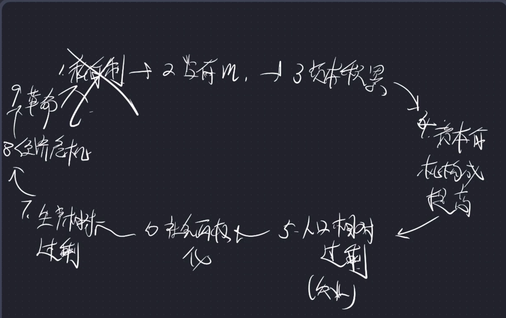

### 7 资本理论(2) - 资本循环与周转

#### 资本循环

1. 内涵：产业资本在循环过程中一次经历三个阶段，采取三种职能形式，实现三种职能作用，完成循环实现价值增殖。

2. ==**内容**==

    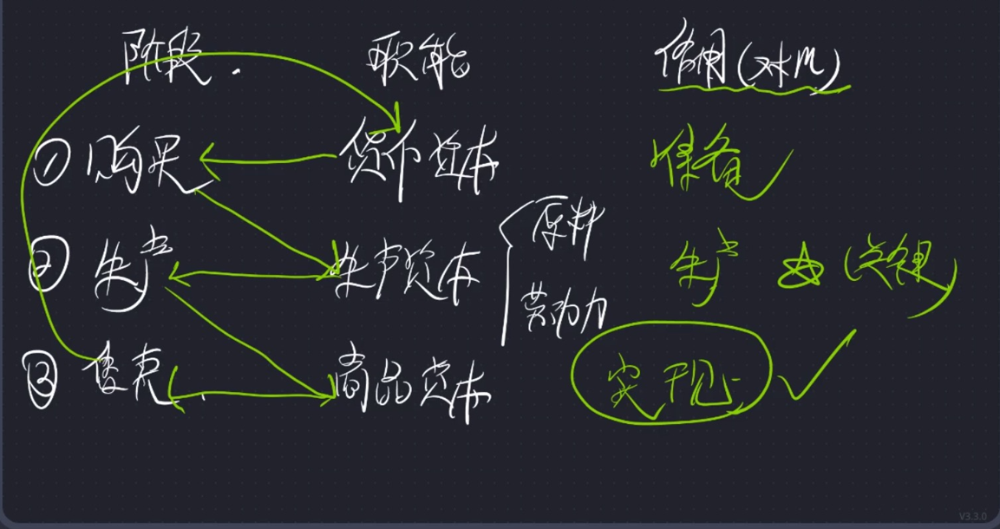

3. 条件

    1. 空间上并存

    2. 时间上继起

#### 资本周转

1. 内涵：不断反复、周而复始的资本循环过程

2. 衡量资本周转速度的因素

    1. 资本周转的时间

        时间越长，周转速度越慢

    2. 资本周转的次数

        次数越多，周转速度越快

3. 影响资本周转的因素

    1. 资本周转的时间

    2. 生产资本的构成

        **固定资本**：固定的机器这类。

        **流动资本**：流动的货物这类。

        **流动资本比例越大，资本周转越快**

### 8 资本理论(3) - 资本再生产

全社会资本再生产，不等同于之前的个别资本再生产

1. 社会总资本

    内涵：相互联系、相互依存的所有个别资本的总和

2. ==**社会再生产的核心问题 - 社会总产品的实现问题**==[考点1]

    > 实现 = 卖出去

3. **社会再生产的条件**：[考点2]

    1. 价值补偿

        下一次生产的 **前提和基础**

    2. 实物补偿

        **社会再生产的关键**

3. 社会再生产的基本规律

### 9 资本理论(4) - 资本主义基本矛盾与经济危机

1. 资本主义基本矛盾

    ==**生产社会化和生产资料资本主义私人占有之间的矛盾**==

2. 经济危机理论

    1. 经济危机的实质

        **生产相对过剩**。指相对于劳动人民有支付能力的需求来，商品相对过剩。

    2. 经济危机的根源

        1. 单个企业内部生产的有组织性与整个社会生产的无政府状态的矛盾（私有制与生产力）

        2. 生产无限扩大，劳动人民支付能力相对缩小

    3. 经济危机的周期性

        包括 危机、萧条、复苏、高涨 四个阶段。关键环节是危机

## 第三节 资本主义政治制度和意识形态

### 1 政治制度

1. 资本主义国家的本质

    资本主义国家是资产阶级作为剥削阶级对人民群众进行阶级统治和阶级压迫的工具。

2. 资本主义国家的职能

    - 对内职能：
    
    **(1)对内实行政治统治**

    **(2)社会公共管理的职能**

    - 对外职能：

        对外职能包括对外进行国际交往和维护国家安全及利益的职能。资本主义国家的对外职能是国家对内政治统治职能的延伸，是 **服务于其政治统治**的。

### 2 民主制度

1. 资本主义民主制度的内容

    资本主义国家的政治统治是通过具体的政治制度实现的，主要有资本主义法律制度、政权组织形式、选举制度、政党制度等。

2. 资本主义民主制度的本质

3. 资本主义民主制度评价

    局限性：

    第一，资本主义的民主是金钱操纵下的民主，实际是资产阶级精英统治下的民主；  
    第二，法律名义上的平等掩盖着事实上的不平等；  
    第三，资本主义国家的政党制是一种维护资产阶级统治的政治制度；  
    第四，政党恶斗相互掣肘，决策效率低下，激化社会矛盾

4. 资本主义意识形态及其本质

    第一，资本主义意识形态是资本主义社会的观念上层建筑，是为资本主义的经济基础服务的，因而是为资本主义国家的政治上层建筑服务的。

    第二，资本主义意识形态是资产阶级的阶级意识的集中体现。