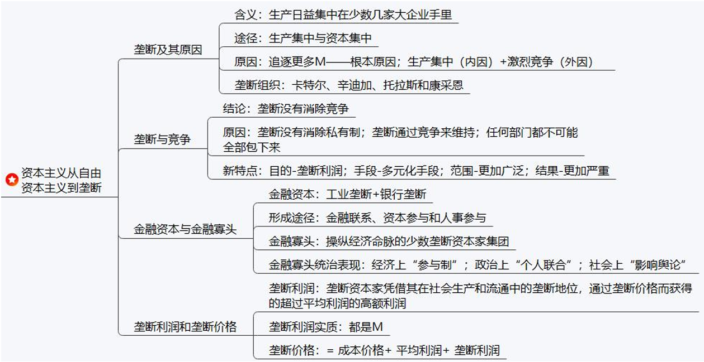
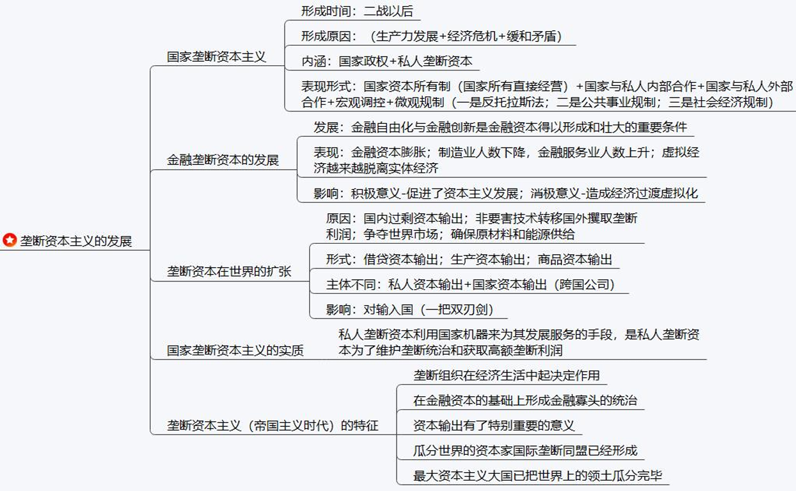
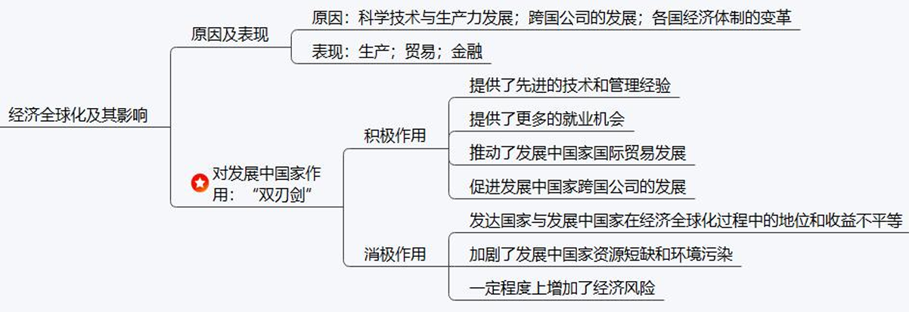
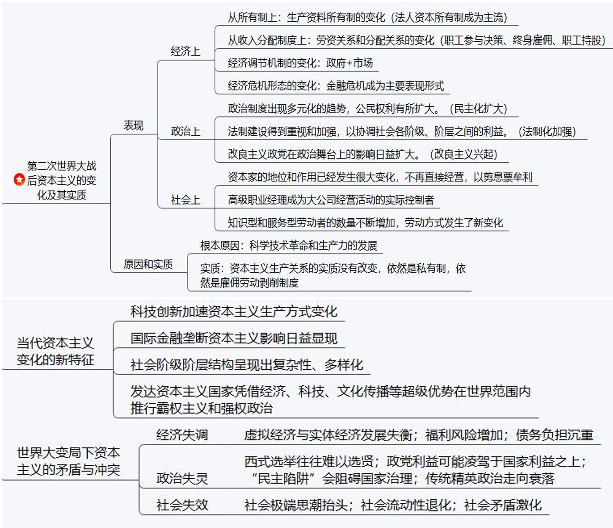
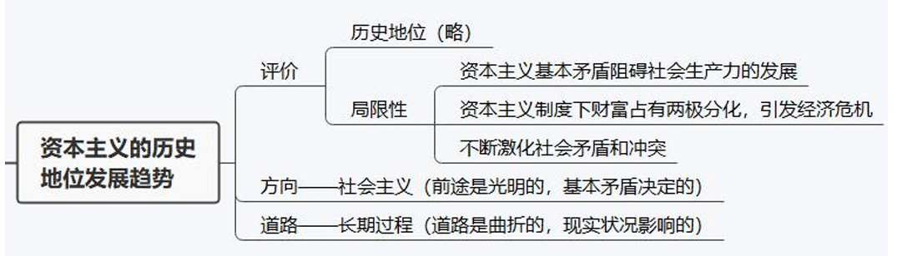

# 第五章 资本主义的发展及趋势

## 考点

### 考点1 垄断

1.1 垄断及其原因：生产集中、资本集中、垄断原因

==**垄断形成标志：垄断代替自由竞争在经济生活中占统治地位**==

==**国家垄断标志：国家垄断代替私人垄断在经济生活中占统治地位**==

1.2 垄断与竞争：垄断没有消除竞争+原因、垄断下竞争的特点

1.3 金融资本与金融寡头：金融资本、金融寡头、金融寡头统治【==**参与制+个人联合+影响舆论**==】

1.4 垄断利润与垄断价格：垄断利润、==**垄断利润的来源**==、垄断价格、==**垄断低价、垄断高价**==

**总结：垄断利润、垄断价格**

垄断利润凭借：垄断地位

垄断利润的获得通过：垄断价格

垄断价格形成的基础：垄断统治的地位

垄断价格的目的：获得高额的垄断利润

### 考点2 垄断资本主义

2.1 国家垄断资本主义：私人垄断、国家垄断、国家资本所有制、表现形式【国家资本所有制+内部合作+外部合作+宏观调控（财政、货币政策）+微观调控（国家法律）】、国家垄断资本主义的实质

2.2 金融垄断资本

2.3 世界垄断资本：扩张原因、扩张形式、扩张影响

2.4 垄断资本主义的特征

### 考点3 经济全球化

### 考点4 当代资本主义新变化

4.1 当代资本主义新变化表现：经济上【所有制+分配+经济调节机制+经济危机】、政治上【民主扩大化+法制化加强+改良主义】、社会上

> 考试方式：1. 考经济、政治、社会上有哪些变化； 2. 考对应关系，不能记混

4.2 当代资本主义新变化的变化的原因与实质

4.3 当代资本主义新变化的特征

4.4 当代世界资本主义的矛盾与冲突：经济、政治、社会

> 需要会匹配

### 考点5 资本主义的历史地位与发展趋势

## 第一节 垄断理论

### 1 垄断：由自由竞争到垄断

#### （1）垄断的形成

1. 生产集中与垄断的形成

    生产集中 => 资本集中 => 垄断

2. **垄断的根本原因：生产力的发展**

3. 垄断产生的其他原因

#### （2）垄断下的竞争

1. 垄断不能消除竞争的原因

    1. 垄断没有消除产生竞争的经济条件（私有制）

    2. 垄断必须通过竞争来维持

    3. 社会生产复杂多样，垄断不能包下所有的社会生产

2. 垄断条件下竞争的特点

    1. 竞争的目的是通过操纵价格获得高额的垄断利润

    2. 竞争的手段更加多样化

    3. 竞争范围、规模程度更大

    4. 竞争的后果更严重

#### （3）金融资本与金融寡头

1. 金融资本

    内涵：是由 **工业垄断资本** 和 **银行垄断资本** 融合在一起形成的一种 **垄断资本**

    途径： **金融联系、资本参与、人事参与**

2. 金融寡头

    ==**寡头统治表现**==

    （1）在经济上，主要是通过“参与制”（金融寡头通过掌握一定数量的股票来层层控制企业的制度）来实现的。  
    （2）第二、在政治上，对国家机器的控制主要是通过同政府的“个人联合”（金融寡头亲自担任或指派代理人担任政府要职）来实现的。  
    （3）第三、在其他方面，金融寡头还通过建立政策咨询机构，掌握新闻出版、科教、文化体育等领域来左右和影响国家的内政外交与社会生活。

#### （4）垄断利润和垄断价格

1. 垄断资本的实质

    垄断资本的实质在于获取垄断利润
    
    垄断利润：垄断资本家凭借其在社会生产和流通中的垄断地位而获得的超过平均利润的高额利润

    方式：垄断价格

2. ==**垄断利润的来源**==

    - 垄断高额利润的实质来源：劳动人民创造的剩余价值

    - 垄断利润来自几个方面：

        1. 对本国无产阶级和其他劳动人民剥削的加强

        2. 通过垄断高价和垄断低价控制市场，获得其他企业的利润

        3. 加强对其他国家劳动人民加强剥削

        4. 通过资本主义国家证券进行有利于自己的再分配（纳税），将国民收入变成自己的收入

3. 垄断价格

    内涵：垄断价格是垄断组织在销售或购买商品时，凭借其垄断地位规定的、旨在保证获取最大限度利润的市场价格。

    ==**形式：垄断低价、垄断高价**==

    垄断低价：进货低价

    垄断高价：出售高价

    公式：垄断价格 = 成本价格 + 平均利润 + 垄断利润

### 2 垄断资本主义

#### （1）国家资本垄断资本主义的形成与作用

1. 国家垄断资本主义的内涵

    国家垄断资本主义是国家政权和私人垄断资本融合在一起的垄断资本主义。

2. 国家垄断资本主义的形成原因

    1. 社会生产力的生产

    2. 经济波动和经济危机的深化

    3. 社会矛盾的激增。为了缓和社会矛盾，协调利益关系，要求产生【根本原因】

3. 国家垄断资本主义的主要形式

    1. **国家所有并直接经营的企业**

    2. **国家与私人共有、合营企业**

    3. **国家与私人垄断企业的外部合作**，国家向垄断企业订货、补贴

    4. **宏观调节**，“看不见的手”。主要是国家的财政政策、货币政策

    5. **微观规制**，国家法律手段

4. 国家垄断资本主义的局限性

    没有从根本上消除资本主义的基本矛盾，不能消除经济危机

#### （2）金融垄断资本的发展

1. **金融自由化与金融创新** 是金融垄断资本得以形成和壮大的重要制度条件

2. 表现：

    （1）实体经济部门不得不把利润的一部分投向金融领域，导致金融资本的急剧膨胀；
    
    （2）制造业就业人数严重减少，以金融为核心的服务业就业人数逐步增加；
    
    （3）虚拟经济越来越脱离实体经济。

3. ==**垄断资本向世界范围扩展的基本形式**==

    1. 借贷资本输出（开银行）

    2. 生产资本输出（开工厂）

    3. 商品资本输出（开超市）

4. 垄断资本向世界范围扩展的社会经济后果

    对输入国：双刃剑

### 3 经济全球化

1. 经济全球化的表现

    1. 生产的全球化

    2. 贸易全球化

    3. 金融全球化

2. 经济全球化的动因

    1. 科学技术的进步和生产力的发展 (根本原因)

    2. 跨国公司：媒介

    3. 各国经济体制的变革：体制保障

3. 经济全球化的影响：双刃剑

    1. 积极作用

    2. 消极作用

## 第二节 资本主义的新变化

### 1 二战后资本主义的变化及其实质

1. 生产资料所有制的变化

     - **法人资本所有制**是**当前主要形式**

    - **国家资本所有制**仍然是一种私有制，并且体现资本家对劳动者的剥削

2. 劳资关系和分配关系的变化

    资本家及其代理人开始采取一些缓和劳资关系的激励制度，促使工人自觉地服从资本家的意志，主要有： **职工参与决策，终身雇佣，职工持股**

3. 社会阶层和阶级结构的变化

    1. 资本家的地位和作用发生很大的变化

    2. 高级职业经理成为大公司经营活动的实际控制者

    3. 知识型和服务型劳动者数量不断增加，劳动方式发生了新变化

4. 经济调节机制和经济危机形态的变化

    弱政府，强市场。

    经济危机 -> 金融危机：金融泡沫，通货膨胀，钱印多了

5. 经济危机新的特点

6. 政治制度的变化

    1. 公民权力扩大

    2. 法制建设加强

    3. 改良主义政

### 2 变化的原因和实质

1. 原因

    - 根本：科学技术革命和生产力的发展

    - 工人阶级的斗争 - 重要力量

    - 社会主义制度的影响 - 重要影响

    - 改良主义政党 - 重要作用

2. 变化的实质

    1. 基本矛盾不变

    2. 维护资产阶级统治

3. 世界大变局下资本主义的矛盾与冲突

    1. 经济发展失调

        经济滞涨；福利风险增加；债务负担沉重、

        > 易错：福利是属于经济一项

    2. 政治体制失灵

    3. 社会融合机制失效

        社会极端思潮抬头；社会流动性退化；社会矛盾激化

## 第三节 资本主义的发展趋势

1. 资本主义自身的局限性

    第一，资本主义基本矛盾阻碍社会生产力的发展； 
    第二，资本主义制度下财富占有两极分化，引发经济危机；  
    第三，资产阶级支配和控制资本主义经济和政治的发展和运行，不断激化社会矛盾和冲突。

2. 资本主义终究要被社会主义取代的根本原因： **资本主义的内在矛盾**

3. 资本主义终究要被社会主义所取代的具体原因：

    第一，资本主义基本矛盾“包含着现代的一切冲突的萌芽”。  
    第二，资本积累推动资本主义基本矛盾不断激化并最终否定资本主义自身。  
    第三，国家垄断资本主义是资本社会化的更高形式，将成为社会主义的前奏。  
    第四，资本主义社会存在着资产阶级和无产阶级两大阶级之间的矛盾和斗争
