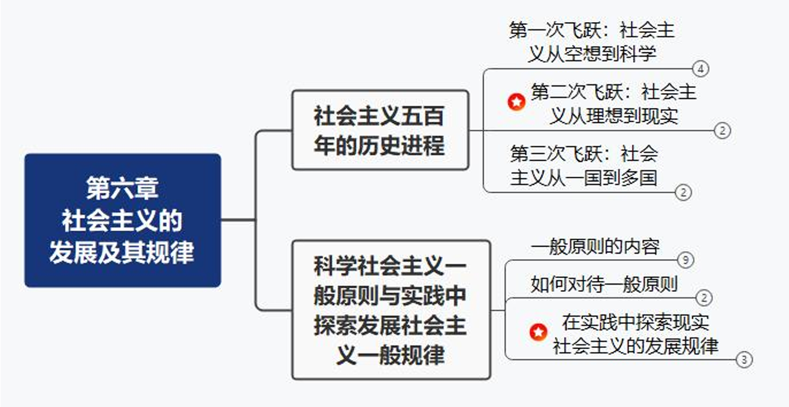
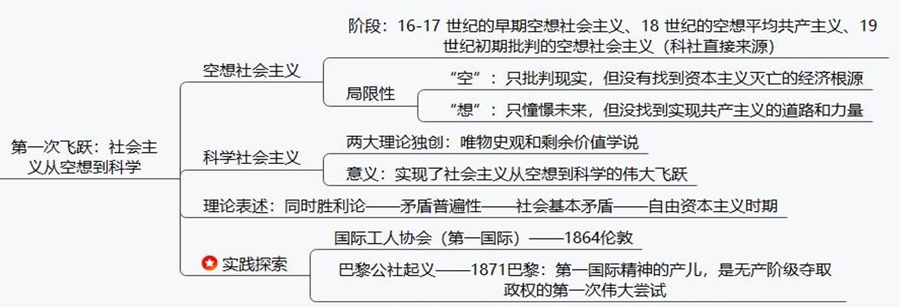
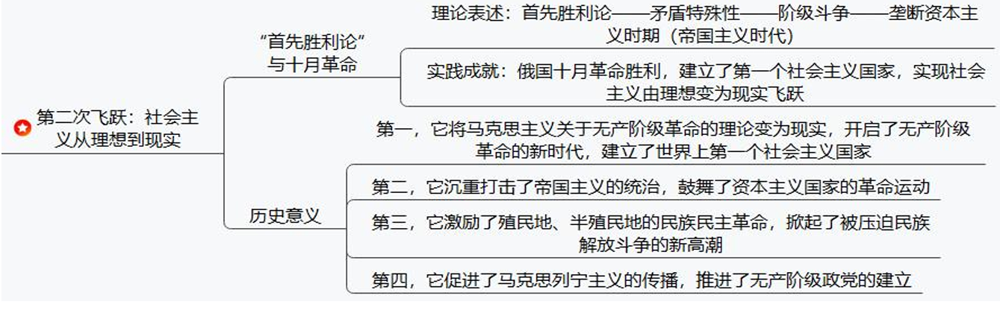
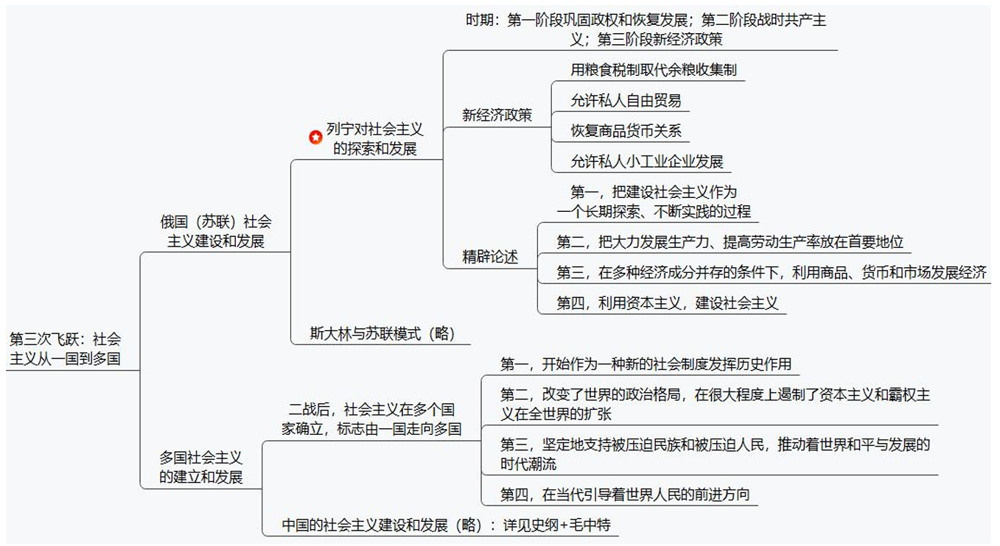
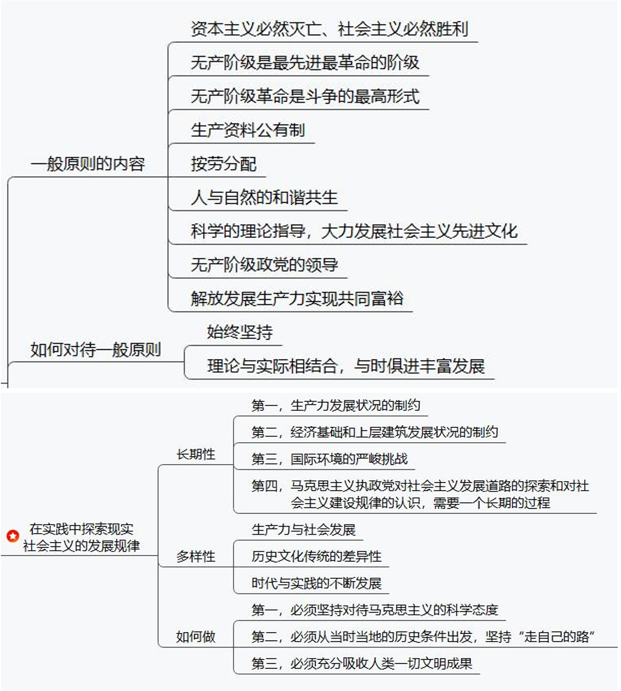
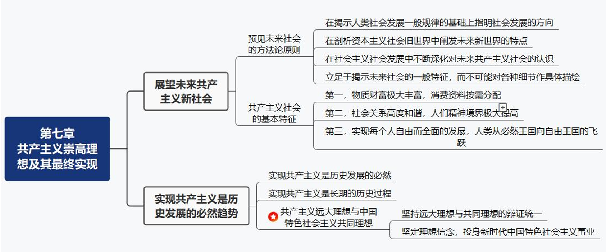
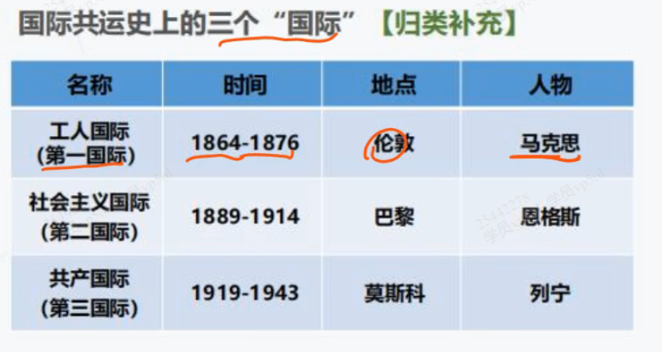
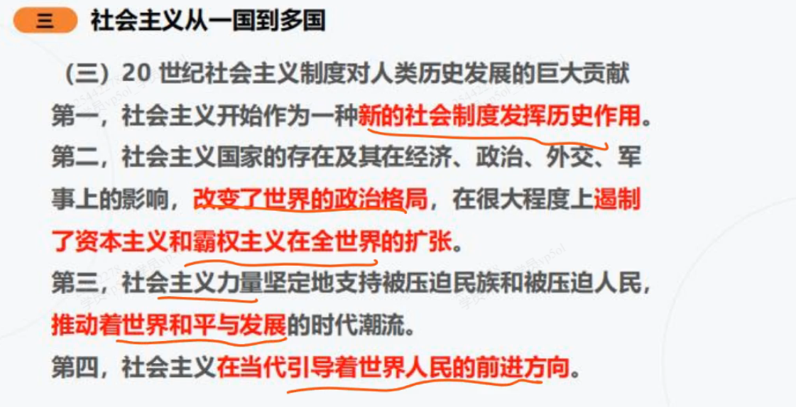

# 第六章+第七章 科学社会主义与共产主义

## 考点

### 考点1 社会主义的发展：三次飞跃

1.1 第一次飞跃：从空想到科学【巴黎公社】

1.2 第二次飞跃：从理想到现实【十月革命】

1.3 第三次飞跃：从一国到多国【战时共产主义、新经济政策】

==**列宁的新经济政策：把马克思主义基本原理同俄国的具体实际相结合**==

### 考点2 社会主义发展特征

2.1 社会主义发展的一般原则

2.2 社会主义发展道路/发展规律

- 长期性：生产力发展状况制约【根本原因】

- 多样性：生产力发展状况不同与社会发展阶段不同【根本原因】+时代与实践的不断发展【现实原因】+历史文化传统的差异【重要影响】

### 考点3 共产主义

## 第一节 社会主义500年的历史进程

### 1 从空想到科学（第一次飞跃）

1. 空想社会主义的发展

    - 开创标志：1516 托马斯-莫尔所 《乌托邦》

    - 空想社会主义三个阶段

        1. 16-17早期空想

        2. 18实际空想平均共享注意

        3. **19实际初期批判的空想社会主义**，代表者 圣西门、傅里叶和欧文，**是科学社会主义的直接思想来源**

2. 空想社会主义的局限

    1. “空”：没有揭示资本主义必然灭亡的经济根源、

        > 马克思：剩余价值理论

    2. “想”：看不到埋葬资本主义的力量；找不到通往理想社会的显示道路

        > 马克思：唯物史观

3. 科学社会主义的创立

    1. 理论独创1：剩余价值学说 - 1867《资本论》

    2. 理论独创2：唯物史观 - 1845《德意志意识形态》

4. 第一国际与巴黎公社

    - 1864年，国际工人协会（第一协会）诞生

    

    - 巴黎公社

        1. 1871.3 法国巴黎

        2. 地位：第一国际精神的产儿，是无产阶级夺取政权的第一次伟大尝试

        3. 意义和经验

### 2 从理想到现实（第二次飞跃）

#### 十月革命胜利与第一个社会主义国家

1. 列宁的贡献

    - 理论贡献：首先胜利论

    - 实践贡献：十月革命胜利

2. 十月革命

#### 社会主义在苏联的实践

1. 列宁时期

    1. 进一步巩固苏维埃政权使其

    2. 外国武装干涉和国内战争时期 - 战时共产主义时期

    3. 新经济政策

2. 列宁的思考与论述

    - 把建设社会主义作为一个长期探索、不断实践的过程

    - 把大力发展生产力、提高劳动生产率放在首尾

    - 利用商品、货币和市场发展经济

    - 利用资本主义建设社会主义

3. ==**列宁的最大贡献**==

    努力把马克思主义基本原理同俄国的具体实际相结合，探索出一条适合俄国国情的社会主义道路

### 3 从一国到多国

## 第二节 社会主义基本原则

1. 科学社会主义基本原则及其主要内容

    - **核心命题：资本主义必然灭亡，社会主义必然胜利**

    - 第二，无产阶级是最先进最革命的阶级，肩负着推翻资本主义旧世界、建立社会主义和共产主义新世界的历史使命。
    - 第三，无产阶级革命是无产阶级进行斗争的最高形式，以建立无产阶级专政的国家为目的。 
    - 第四，社会主义社会要在生产资料公有制基础上组织生产，以满足全体社会成员的需要为生产的根本目的。
    - 第五，社会主义社会要对社会生产进行有计划的指导和调节，实行按劳分配原则。
    - 第六，社会主义社会要合乎自然规律地改造和利用自然，努力实现人与自然的和谐共生。
    - 第七，社会主义社会必须坚持科学的理论指导，大力发展社会主义先进文化。
    - 第八，无产阶级政党是无产阶级的先锋队，社会主义事业必须始终坚持无产阶级政党的领导。
    - **社会主义的本质**：第九，社会主义社会要大力解放和发展生产力，逐步消灭剥削和消除两极分化，实现共同富裕和社会全面进步，并最终向共产主义社会过渡。
    - 第十，共产主义是人类最美好的社会，实现共产主义是共产党人的最高理想

2. 如何把握社会主义基本原则

## 第三节 社会主义发展规律

1. 经济文化相对落后国家建设社会主义的长期性

2. 社会主义发展道路多样性的原因

    1. 根本决定因素：各个国家的 **生产力发展状况和社会发展阶段**决定了

    2. 重要条件：历史文化传统的差异性

    3. 现实原因：时代和实践的不断发展

3. 探索适合本国国情的发展道路

    - 坚持：马克思理论

    - 结合实际，实事求是

    - 充分吸收人类一切文明成果

# 第七章：共产主义

## 展望未来共产主义新社会

1. 预见未来社会的方法论原则

    - 在揭示人类社会发展一般规律的基础上指明社会发展的方向

    - 在剖析资本主义旧世界的过程中阐发未来新世界的观点

    - 在社会主义社会发展中不断深化对未来共产主义社会的认识

    - 立足于揭示未来社会的一般特征，而不对各种细节做具体描绘

2. 共产主义社会的基本特征

    - 物质财富极大丰富，消费资料按需分批额

        1. 需要社会生产力高度发展，产品极大丰富

        2. 个人消费品：“各尽所能，按需分配”

    - 社会关系高度和谐，人们精神境界极大提高

        1. 阶级将会消亡

        2. 国家将会消亡

        3. 战争不复存在

        4. 工业与农业、城市与农村、脑力劳动与体力劳动的差别 - “三大差别”必将归于消失

    - 实现每个人自由而全面的发展，人类从必然王国向自由王国飞跃

