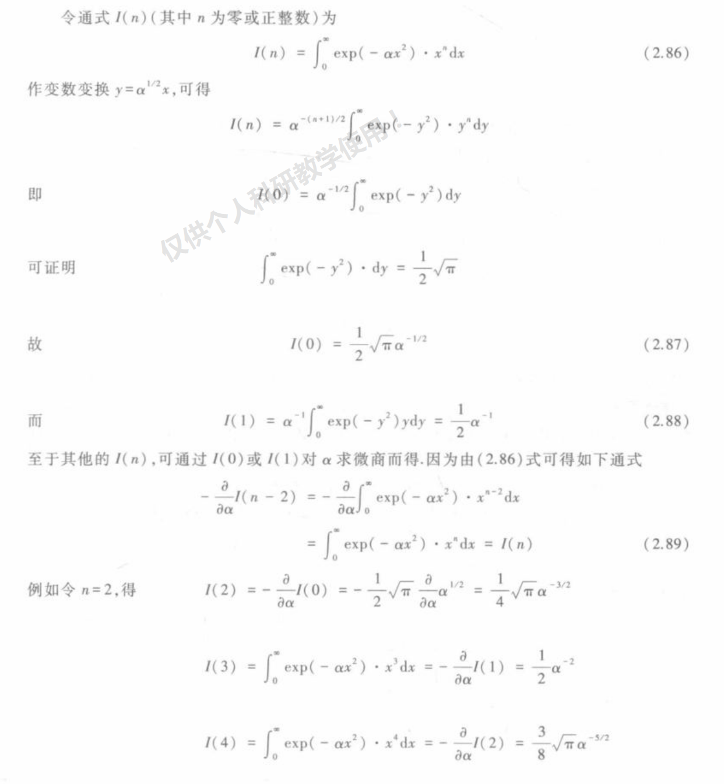
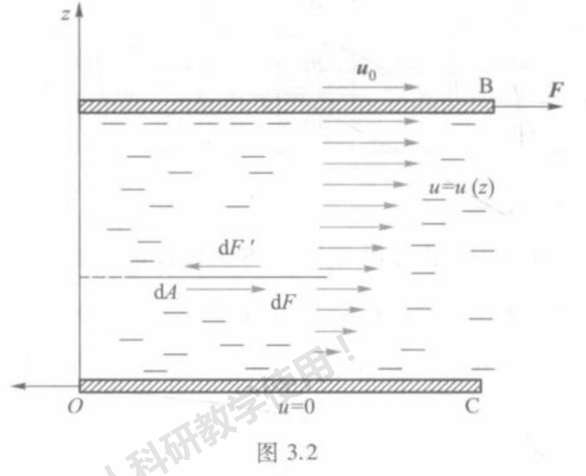
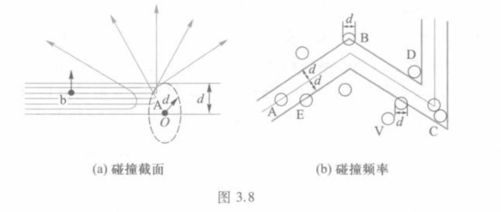
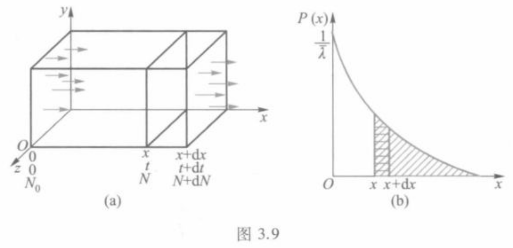
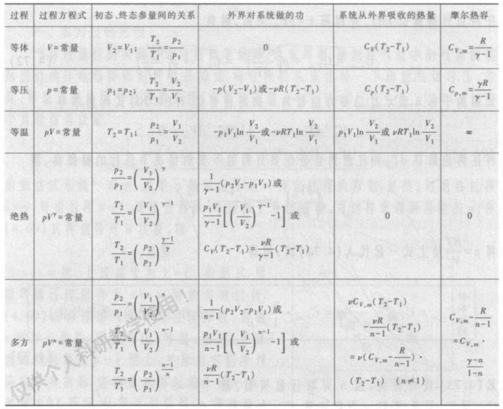

# 热学

## 1 导论

1. 宏观描述方法与微观描述方法

    热物理

    （1）宏观描述方法：热力学

    （2）微观描述方法：分子动理学、统计物理学、非平衡态统计

2. 平衡态

    - 平衡态定义

        *不受外界影响下，经过足够长的时间系统达到的宏观上不随时间变化的状态*

    - 平衡态判定法

        （1）看系统中是否存在热流与粒子流

        （2）力学平衡：系统内各部分之间、系统与外界达到力学平衡（压强相等）

        （3）热学平衡：系统内温度处处相等

        （4）化学平衡：无外场下化学组分相同

    - 稳态

        有热流或粒子流情况下，各处宏观状态（T,V,P...）不随时间变化的状态

3. 温度

    - 热力学第零定律

        AC平衡，BC平衡 = AB平衡

    - 温标的三个要素

        （1）具有测温属性的某种物质

        （2）具有明显特征的固定温度点

        （3）进行分度

    - 摄氏温标/华氏温标、理想气体温标、热力学温标

        前三种为经验温标，热力学温标为绝对温标

4. 物态方程

    - 物态方程/状态方程定义

        处于平衡态的系统的热力学参数（P,V,T）的函数关系

    - 理想气体定义

        压强趋近于0时的气体

        或者：能严格满足理想气体物态方程的气体

    - 理想气体物态方程

        $$
        pV = \nu RT
        $$

5. 物质微观模型

    - 微观模型基本内容

        （1）物质由大数分子组成

        （2）分子处于不停的无规则热运动中

        （3）分子之间存在吸引力和排斥力

    - 扩散、布朗运动与涨落

        涨落：热力学量在其系统微观统计平均值的偏离；这种偏离的平均值为0，但均方偏差不为0.涨落就是均方偏差。

        $$
        \Delta M = \overline{M-\overline{M}}=0
        $$
        
        $$
        \overline{\Delta M^2}=\overline{(M-\overline{M})^2}
        $$

        且

        $$
        \frac{[\overline{\Delta N^2}]^{1/2}}N\propto\frac1{\sqrt{N}}
        $$

6. 理想气体微观初级理论（粗糙）

    - 理想气体微观模型

        （1）分子线度比分子平均间距小的都，故可忽略不计

        （2）除碰撞瞬间，分子间相互作用力忽略不计

        （3）平衡态的理想气体，所有碰撞均为弹性碰撞，不损失能量

    - 洛施密特常量与微观物理量的估计

        （1）施罗特常量 $n_0$：标准状态下 $1m^3$ 理想气体中的分子数

        $$
        n_0=\frac{6.02\:\times\:10^{23}}{22.4\:\times\:10^{-3}}\:\mathrm{m}^3=2.7\:\times\:10^{25}\:\mathrm{m}^{-3}
        $$

        （2）标准状况下分子平均间距 $\overline{L}$

        $$
        \overline{L}=\left(\frac{1}{n_0}\right)^{1/3}=\left(\frac{1}{2.7 \times 10^{25}}\right)^{1/3}\text{m}=3.3 \times 10^{-9} m
        $$

    - 气体分子碰撞数

        $$
        \Gamma=\frac{\Delta N}{\Delta A\Delta t}=\frac{n\overline{v}}6
        $$

    - 理想气体压强公式

        $$
        p = \frac{1}{6}n\overline{v} \cdot 2m\overline{v} \approx \frac{1}{3}nm \overline{v^{2}} = \frac{2}{3}n \overline{\varepsilon_{1}}
        $$

        理想气体状态方程可写为：

        $$
        p = nkT
        $$

    - 玻尔兹曼常量

        $$
        k\:=\:\frac{R}{N_{_A}}\:=\:1.38\:\times\:10^{-23}\:\mathrm{J}\:\cdot\:\mathrm{K}^{-1}
        $$

    - 理想气体分子热运动平均动能

        $$
        \overline{\varepsilon_{1}}=\frac{m\:\overline{v^{2}}}{2}=\frac{3kT}{2}.
        $$

    - 温度的微观意义

    - 方均根速率

        $$
        v_{\mathrm{rms}}\:=\:\sqrt{v^{2}}\:=\:\sqrt{\frac{3kT}{m}}\:=\:\sqrt{\frac{3RT}{M}}
        $$

7. 分子间作用势与真实气体物态方程

    - 分子间作用力曲线与作用势

    - 范德瓦尔斯方程

## 2 分子动理学平衡态理论

0. 积分关系

    

1. 概率论

2. 麦克斯韦速率分布

    - 麦克斯韦速率分布函数

        $$
        f(v)\mathrm{d}v=4\pi\left(\frac{m}{2\pi kT}\right)^{3/2}\cdot\exp\left(-\frac{mv^{2}}{2kT}\right)\cdot v^{2}\mathrm{d}v
        $$

        （1）温度越低、质量越大，速率分布越集中

    - 三种速率

        （1）平均速率

        $$
        \overline{v}=\int_0^\infty vf(v)\mathrm{d}v = \sqrt{\frac{8RT}{\pi M}}
        $$

        （2）方均根速率

        $$
        \overline{v^{2}}=\int_{0}^{\infty}v^{2}f(\:v\:)\:\mathrm{d}v=\int_{0}^{\infty}4\pi\biggl(\frac{m}{2\pi kT}\biggr)^{3/2}\:\cdot\:\exp\biggl(-\frac{mv^{2}}{2kT}\biggr)\:\cdot\:v^{4}\:\mathrm{d}v=\frac{3kT}{m}
        $$

        需要开平方

        （3）最概然速率

        $$\left.\frac{\mathrm{d}f(\:v\:)}{\mathrm{d}v}\right|_{v=v_p}=0$$

        $$v_p\:=\:\sqrt{\frac{2kT}{m}}\:=\:\sqrt{\frac{2RT}{M}}$$

3. 麦克斯韦速度分布

    - 速度分布

        $$f(\:v_x\:,v_y\:,v_z\:)\:\mathrm{d}v_x\:\mathrm{d}v_y\:\mathrm{d}v_z=\left(\frac{m}{2\pi kT}\right)^{3/2}\cdot\:\exp\left[\:-\frac{m\:(\:v_x^2+v_y^2+v_z^2\:)}{2kT}\right]\:\cdot\:\mathrm{d}v_x\:\mathrm{d}v_y\:\mathrm{d}v_z$$

        物理意义：任一分子处在速度空间中任一体积为 $dv_x,dv_y,dv_z$ 小立方体中的概率

    - 速度分布导出速率分布

4. 气体分子碰壁数

    （1）由动理学推出碰壁数：

    $$\Gamma=\frac{N^{\prime}}{\mathrm{d}A\:\mathrm{d}t}=\frac14n\overline{v}$$

    （2）由动理学推出气体压强公式：

    $$
    p=\frac{nm\overline{v^{2}}}{3}
    $$

    （3）均与气体微观初级理论相同

5. 玻尔兹曼分布

    - 等温大气压强公式

        $$
        p\left(z\right)=p\left(0\right)\cdot\exp\left(-\frac{Mgz}{RT}\right)
        $$

        悬浮粒子高度分布

        $$n(z)=n(0)\cdot\exp\!\left(-\frac{m^*gz}{kT}\right)$$

    - 旋转体中悬浮粒子径向分布

        $$
        n\left(r\right)=n\left(0\right)\cdot\exp\left(\frac{m\omega^{2}r^{2}}{2kT}\right)
        $$

    - 玻尔兹曼分布

        $$
        n_1=n_2\exp\left(-\frac{\varepsilon_1-\varepsilon_2}{kT}\right)
        $$        

6. 能均分定理

    - 能均分定理：处于T的平衡态气体，每一个自由度的平均动能是 kT/2

    - 几种分子气体

        （1）单原子分子 - 稀有气体：自由度为3

        （2）双原子气体：自由度为5

        （3）多原子气体

    - 应用：热力学中理想气体的定容摩尔热容公式为：

        $$C_{V,m}=\frac f2R,$$

        $$
        C_{p,m}=C_V+R,
        $$

        绝热指数

        $$
        \gamma=\frac{C_p}{C_V}.
        $$

        f为自由度

## 3 气体分子动理学非平衡态理论

输运现象：粘性、扩散、热传导

热量传递现象：热传导、对流、辐射

1. 黏性现象

    - 层流与湍流

        （1）层流：流动过程相邻质点轨迹线稍有差别，流体不同质点轨迹线互补混杂的流动；发生在流速较小，雷诺数较小

        （2）湍流：局部速度压力不规则脉动的流动；发生在大雷诺数

    - 牛顿粘性定律

        （1）物理图像：

        {:height="70%" width="70%"}

        $$
        F=-\eta\cdot\frac{\mathrm{d}u}{\mathrm{d}z}\cdot A
        $$

        （2）动量流密度

        $$J_p=-\eta\frac{\mathrm{d}u}{\mathrm{d}z}$$

        [旋转粘度计]

        （3）气体粘性微观机理：流速不同的流体层之间的定向动量迁移

    - 泊肃叶定律

        （1）泊肃叶定律：体积流率与压强差的关系

        $$\frac{\mathrm{d}V}{\mathrm{d}t}=\frac{\pi r^4\Delta p}{8\eta L}$$

        （2）管道流阻

        $$R_{_F}=\frac{8\eta L}{\pi r^4}$$

        则

        $$\frac{\mathrm{d}V}{\mathrm{d}t}=\frac{\Delta p}{R_F}$$

        （3）斯托克斯定律

        物体球形，流体雷诺数小于1，运动物体所受阻力：

        $$
        F=6\pi\eta vR
        $$

        雷诺数公式：

        $$Re=\frac{\rho vr}{\eta}$$

        雷诺数 $Re = 10^3~10^5$：

        $$F=0.2\pi\rho R^2v^2$$

2. 扩散现象

    （1）菲克定律：一维扩散的粒子流密度（单位时间单位截面扩散粒子数）：

    $$
    J_N=-D\frac{\mathrm{d}n}{\mathrm{d}z}
    $$

    $$\frac{\mathrm{d}m}{\mathrm{d}t}=-\:D\:\frac{\mathrm{d}\rho}{\mathrm{d}z}\cdot A$$

    （2）气体扩散微观机理：存在同种粒子的粒子数密度空间不均匀性，由于分子热运动产生的宏观粒子迁移现象

3. 热传导现象

    （0）热传递：热传导、对流与辐射三种方式

    （1）傅里叶定律：连续介质由于温度梯度产生热流（单位时间内通过的热量）：

    $$\dot{Q}=-\:\kappa\cdot\frac{\mathrm{d}T}{\mathrm{d}z}\cdot A$$

    注：通电导线的热流：

    $$\dot{Q}=I^{2}R$$

    热流密度（单位时间内通过单位截面的热量）：

    $$J_{_T}=-\:\kappa\cdot\frac{\mathrm{d}T}{\mathrm{d}z}$$

    （2）热欧姆定律：长L，横截面A的均匀棒达到稳态传热时，用$-U_T$表示$\dT$；用$I_T$表示$\dot Q$的热流：

    $$I_\mathrm{T}=\kappa\frac{\Delta U_\mathrm{T}}L\cdot A$$

    热欧姆定律：

    $$
    \Delta U_{\mathrm{T}}=\frac{L}{\kappa A}I_{\mathrm{T}}=R_{\mathrm{T}}I_{\mathrm{T}}
    $$

    $$R_\mathrm{T}=\frac L{\kappa A}=\frac{\rho_\mathrm{T}L}A$$

    热阻率：

    $$
    \rho_T = \frac{1}{\kappa}
    $$

    用电路思路处理

    （3）气体热传导的微观机理：分子热运动强弱程度（温度）不用所产生的能量传递

4. 对流传热

    （1）自然对流：存在温度梯度的流体，由于重力出现密度梯度，故而发生流动而交换粒子传热
    
    （2）牛顿冷却定律：固体热源$T$，与周围介质温度$T_0$差不大时，向周围对流传热：

    $$\dot{Q}=hA\left(T-T_{0}\right)$$

    或

    $$
    \dot{Q}=\alpha(T-T_{0})
    $$

5. 扩散系数的微观导出

    1. 气体分子平均自由程

        物理图像：

        {:height="70%" width="70%"}

        - 碰撞截面

            （1） 分子碰撞有效直径 $d$：碰撞/散射发生作用两分子最大碰距

            （2）碰撞/散射截面：$\sigma=\pi d^{2}$

            （3）刚性分子碰撞截面公式：

            $$\sigma\:=\:\frac{1}{4}\pi\:(\:d_{1}\:+\:d_{2}\:)^{2}$$

        - 平均碰撞频率

            （1）同分子平均碰撞频率

            $$
            \overline{Z}=\sqrt{2}n\overline{v}\sigma
            $$

            带入相关式子：

            $$
            \overline{Z}=\frac{4\sigma p}{\sqrt{\pi mkT}}
            $$

            （2）不同分子平均碰撞频率

            $$
            \overline{Z}=n\cdot\sigma\cdot\overline{v_{12}}
            $$

            其中，

            $$
            \overline{v}_{12}=\sqrt{\overline{v}_{1}^{2}+\overline{v}_{2}^{2}} = \sqrt{\frac{8kT}{\pi\mu}}
            $$

        - 平均自由程

            $$
            \overline{\lambda}=\frac{\overline{vt}}{\overline{Zt}}=\frac{\overline{v}}{\overline{Z}} = \frac{1}{\sqrt{2}n\sigma} = \frac{kT}{\sqrt{2}\sigma p}
            $$

    2. 气体分子碰撞的概率分布

        物理图像：

        {:height="70%" width="70%"}

    3. 气体输运系数的导出

## 4 热力学第一定律

1. 可逆与不可逆过程

    （1）准静态过程：系统内部各部分之间、系统与外界之间，始终满足三大平衡条件的过程

    （2）可逆过程：无耗散的准静态过程

2. 功和热量

    （1）概念：功是力学相互作用过程中的能量转移，热量是热学相互作用中的能量转移；功和热量是过程改变量，不是状态参量

    （2）从外界对系统做的微功理解：

    $$\mathrm{d}W=-p\mathrm{d}V.$$

    （3）从几何上理解：功是 $p-V$ 图曲线下的面积

3. 热力学第一定律

    （1）含义：热学中的能量守恒与转化定律

    $$\Delta U=Q+W,$$

    （2）内能：功和热量不是态函数，但是内能是态函数

    （3）对于准静态过程：

    $$
    \mathrm{d}U=\mathrm{d}Q-p\mathrm{d}V.
    $$

4. 热容和焓

    （1）热容：升高单位温度所吸收的热量；有定体热容、定压热容

    （2）焓：在等压过程中吸收的热量

    $$
    H=U+pV.
    $$

5. 理想气体

    （1）理想气体的热容和焓

    $$
    \mathrm{d}U=\nu C_{_{V,m}}\mathrm{d}T,\quad\mathrm{d}H=\nu C_{_{p,m}}\mathrm{d}T.
    $$

    （2）迈耶公式

    $$
    dH = dU + \nu RdT
    $$

    因此

    $$
    C_{p,m}-C_{V,m}=R.
    $$

    （3）理想气体的等体、等压、等温过程

    由：

    $$\Delta U=Q+W,$$

    $$\mathbf{d}Q=\nu C_{V,\:m}\mathrm{d}T\:+\:p\mathrm{d}V.$$

    - 等体：W = 0；吸收热量 = 内能增加

    - 等压：吸收热量 = 焓的增加

    - 等温：内能不变，吸收的热量：

        $$
        Q=-W=\nu RT\mathrm{ln}\frac{V_{2}}{V_{1}}.
        $$

    （4）理想气体的绝热过程（Q = 0）

    比热容比：

    $$\gamma=\frac{C_{p,m}}{C_{_{V,m}}}$$

    泊松公式：

    $$p_{1}V_{1}^{\gamma}\:=\:p_{2}V_{2}^{\gamma}\:=\:\cdots\:=\:C_{1}.$$

    做功（平衡态）

    $$
    W=U_2-U_1=\nu C_{V,m}(T_2-T_1) = \frac{\nu R}{\gamma-1}(T_{2}-T_{1})
    $$

    做功（可逆过程）

    $$
    W =-\int_{V_{1}}^{V_{2}}p\mathrm{d}V=-\int_{V_{1}}^{V_{2}}p_{1}\left(\frac{V_{1}}{V}\right)^{\gamma}\mathrm{d}V =\frac{p_1V_1}{\gamma-1}\cdot\left[\left(\frac{V_1}{V_2}\right)^{\gamma-1}-1\right]
    $$

    热容为0

    （5）多方过程

    $$
    PV^{n}=C
    $$

    做功：将绝热过程的 $\gamma$ 换为 n

    热容：

    $$
    C_{n,m}=C_{V,m}-\frac{R}{n-1}=C_{V,m}\cdot\frac{\gamma-n}{1-n}
    $$

    （6）总结：理想气体

    

6. 热机

    （1）热机效率

    $$\eta_\text{热}=\frac{W^{\prime}}{Q_1}=\frac{\mid Q_1\mid-\mid Q_2\mid}{\mid Q_1\mid}=1\:-\:\frac{\mid Q_2\mid}{\mid Q_1\mid},$$

    （2）卡诺热机

    $$
    \eta_\text{ 卡热 }=\frac{T_1-T_2}{T_1}=1-\frac{T_2}{T_1}.
    $$

7. 制冷机、节流效应

    （1）制冷机制冷系数

    $$
    \eta_\text{冷}=\frac{\mid Q_2\mid}{W}=\frac{\mid Q_2\mid}{\mid Q_1\mid-\mid Q_2\mid},
    $$

    （2）卡诺制冷机

    $$\eta_{_\text{卡冷}}=\frac{T_{_2}}{T_{_1}-T_{_2}}.$$

    （3）节流效应（焦耳-汤姆孙效应）：绝热条件下，高压气体经过多孔塞流到低压的一边。不可逆过程

## 5 热力学第二定律

1. 热力学第二定律

    （1）开尔文表述：不可能从单一热源吸热，使之完全转化为功而不产生其他影响

    （2）克劳修斯表述：不可能把热量从低温物体传到高温物体而不引起其他影响

    （3）实质：一切自发实现的热现象都是不可逆的

2. 卡诺定理

    （1）相同条件，可逆热机效率都相等

    （2）相同条件，可逆热机效率一定大于等于不可逆热机

3. 熵 熵增原理

    （1）克劳修斯等式（可逆循环）

    $$\sum_{i=1}^n\frac{\Delta Q_i}T=\oint\biggl(\frac{\mathrm{d}Q}T\biggr)_\text{可逆}=0$$

    （2）熵的定义（可逆过程）

    $$S_b\:-\:S_a\:=\int_{a\text{可逆}}^b\frac{\mathrm{d}Q}T$$

    $$\mathrm{d}S=\frac{\mathrm{d}Q}{T}$$

    （3）熵是状态参数，也就是态函数

    （4）用熵表示热容

    $$
    C_{\nu}=\left(\frac{\mathrm{d}Q}{\mathrm{d}T}\right)_{V}=T\left(\frac{\partial S}{\partial T}\right)_{V},
    $$

    $$
    C_{p}=\left(\frac{\mathrm{d}Q}{\mathrm{d}T}\right)_{p}=T\left(\frac{\partial S}{\partial T}\right)_{p}.
    $$

    （5）温度 - 熵图：温度为纵坐标，熵为横坐标；面积表示热量

    （6）理想气体的熵

    $$S\:-\:S_{0}\:=\:\nu C_{V,\:m}\ln\frac{T}{T_{0}}\:+\:\nu R\ln\frac{V}{V_{0}}\:,$$

    $$S\:-\:S_{0}\:=\:\nu C_{p,\:m}\ln\frac{T}{T_{_0}}\:-\:\nu R\ln\frac{p}{p_{_0}}.$$

    常用简化形式：

    - 等温：$\Delta S=nR\ln\frac{V_2}{V_1};$

    - 等容：$\Delta S=nC_{V,\:m}\ln\frac{T_2}{T_1}$

    - 等压：$\Delta S=nC_{p,\:m}\ln\frac{T_2}{T_1}.$

    （7）熵增加原理：绝热过程，若可逆，熵不变；若不可逆，熵增加。

    （8）热力学基本方程

    $$
    \mathrm{d}U=T\mathrm{d}S-p\mathrm{d}V.
    $$

## 6 物态与相变

1. 物态

2. 液体

3. 液体表面现象

4. 相变

## 补充：统计物理

1. 麦克斯韦关系

2. 统计物理

    - 三种分布

    - 玻尔兹曼统计

    - 玻色统计

    - 费米统计

    - 系综理论