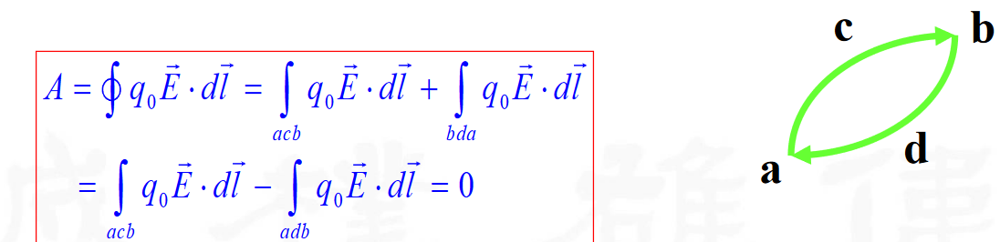
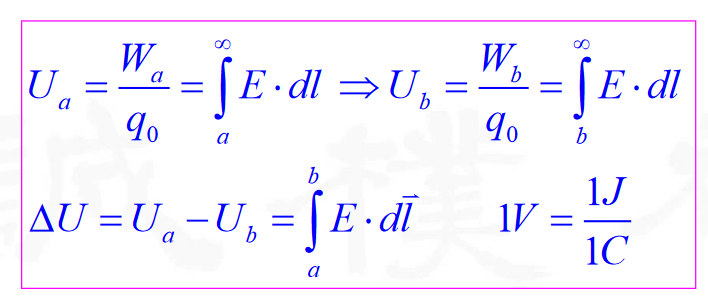
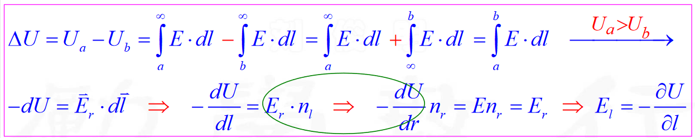
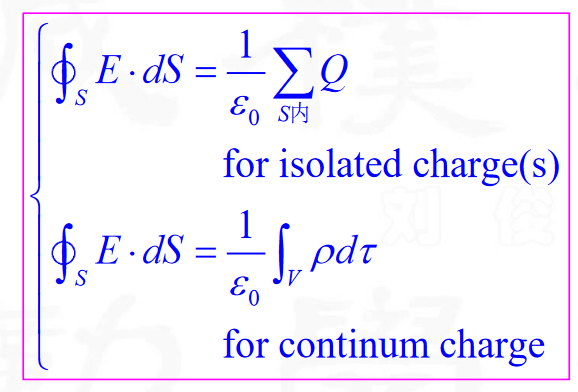
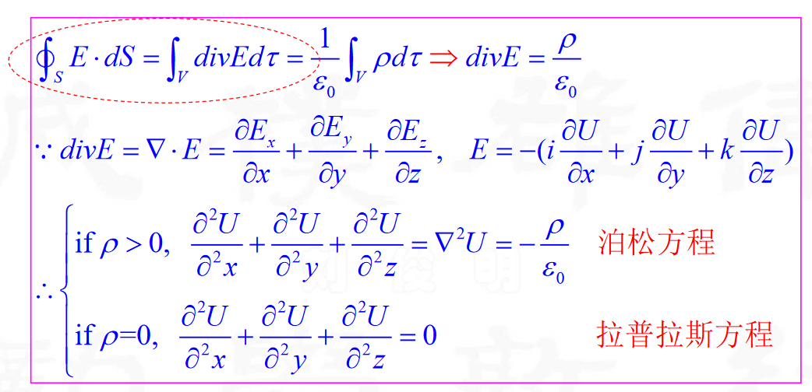
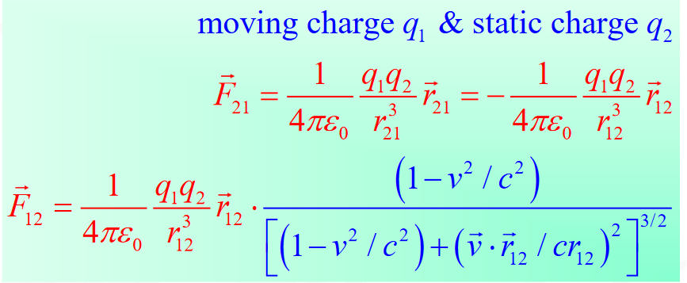

# 电磁学

## 1 数学基础

1. 矢量运算

    极矢量与轴矢量

2. 立体角

3. 坐标系

4. 场论

<!-- ## 2 静电学

0. 电定义与计算公式

    - 电荷密度 \(\rho\)

    表示单位体积内的电荷量：  
    $$
    \rho = \frac{dQ}{dV}
    $$

    - 电场强度 \(\mathbf{E}\)

    描述电场中某点的力强度和方向：  
    $$
    \mathbf{E} = \frac{\mathbf{F}}{q}
    $$  
    或通过库仑定律积分得到：  
    $$
    \mathbf{E} = \frac{1}{4\pi \epsilon_0} \int \frac{\rho(\mathbf{r'}) (\mathbf{r} - \mathbf{r'})}{|\mathbf{r} - \mathbf{r'}|^3} dV'
    $$

    - 静电力 \(\mathbf{F}\)

    库仑定律：  
    $$
    \mathbf{F} = k_e \frac{q_1 q_2}{r^2} \hat{\mathbf{r}}
    $$

    - 电偶极矩 \(\mathbf{p}\)

    定义为电荷分布的极化强度：  
    $$
    \mathbf{p} = q \mathbf{d}
    $$

    - 电势 \(\phi\)** 和 **电势能 \(U\)

    电势：  
    $$
    \phi = \frac{U}{q}
    $$
    或通过积分表示：  
    $$
    \phi = - \int \mathbf{E} \cdot d\mathbf{l}
    $$

    电势能：  
    $$
    U = q\phi
    $$

    - 静电能量 \(E\)

    由电场存储的能量：  
    $$
    E = \frac{1}{2} \epsilon_0 \int |\mathbf{E}|^2 dV
    $$

1. 真空场

解决工具

1. 库仑定律积分方法：以 \(\mathbf{E}\) 为基本量

   利用库仑定律计算电场强度。  

   - 公式： 
 
     $$
     \mathbf{E} = \frac{1}{4\pi \epsilon_0} \int \frac{\rho(\mathbf{r'}) (\mathbf{r} - \mathbf{r'})}{|\mathbf{r} - \mathbf{r'}|^3} dV'
     $$

   - 经典模型：点电荷、电偶极子、电线、球形分布等。

2. 几何方法：环路定理与高斯定理

   利用场的对称性和通量计算。  

   - 公式：

     - 环路定理（静电场无旋）：  

       $$
       \oint \mathbf{E} \cdot d\mathbf{l} = 0
       $$

     - 高斯定理：

       $$
       \oint_S \mathbf{E} \cdot d\mathbf{A} = \frac{Q_{\text{enc}}}{\epsilon_0}
       $$

   - 经典模型：  

     线性、平面和球对称场。

3. Maxwell方程微分方法：以 \(\phi\) 为基本量

   利用泊松方程或拉普拉斯方程求解。  

   - 公式：  

     $$
     \nabla \cdot \mathbf{E} = \frac{\rho}{\epsilon_0}
     $$

     或

     $$
     \nabla^2 \phi = -\frac{\rho}{\epsilon_0}
     $$

   - 经典模型：电荷分布的电势场。

    <!-- - 经典模型

        1. 电偶极子

        2. 一维：带电棒

        3. 二维：圆环、圆面

        4. 三维：圆柱、圆柱面、球、球面

        5. 无限大：无限大平板 -->

2. 导体问题

    - 解决工具

        1. 积分方法：以 \(\mathbf{E}\) 为基本量

            利用电场的积分公式，求解导体内部和表面的电场分布。
            
            $$
            \mathbf{E} = \frac{1}{4\pi \epsilon_0} \int \frac{\sigma(\mathbf{r'}) (\mathbf{r} - \mathbf{r'})}{|\mathbf{r} - \mathbf{r'}|^3} dA'
            $$

        2. 几何方法：环路定理与高斯定理

            应用高斯定理和边界条件分析导体内部和周围的电场：  

            $$
            \oint_S \mathbf{E} \cdot d\mathbf{A} = \frac{Q_{\text{enc}}}{\epsilon_0}
            $$  

            静电场中环路积分为零：  

            $$
            \oint \mathbf{E} \cdot d\mathbf{l} = 0
            $$

        3. 微分方法：以 \(\phi\) 为基本量

            通过泊松方程求解电势分布：  

            $$
            \nabla^2 \phi = -\frac{\rho}{\epsilon_0}
            $$  

            导体内部为等势体：  

            $$
            \phi = \text{常数}
            $$

    - 导体内部

        1. 自由电荷分布

            在静电平衡时，导体内部无自由电荷分布：  

            $$
            \rho = 0
            $$

        2. 电场、电势、静电力、静电能量

            - 电场：  

                $$
                \mathbf{E} = 0 \quad (\text{导体内部})
                $$

            - 电势：  

                $$
                \phi = \text{常数}
                $$

            - 静电能量：集中在导体表面。

    - 导体表面

        1. 电场、电势、静电力、静电能量

            - 电场在导体表面法向分布，满足：  

                $$
                E = \frac{\sigma}{\epsilon_0}
                $$

            - 电势在表面处连续：

                $$
                \phi_{\text{内}} = \phi_{\text{外}}
                $$

        3. 尖端效应

            在尖端附近，电场增强，满足：  

            $$
            E \propto \frac{1}{R}
            $$  

            \(R\) 为曲率半径。

    - 导体周围

        1. 电场、电势、静电力、静电能量

    - 经典模型：

3. 电介质问题

    - 解决工具

        1. 积分方法：以E为基本量

        2. 几何方法：环路定理与高斯定理

        3. 微分方法：以U为基本量

    - 极化物理量

        极化强度、极化电荷面密度、极化电场、极化电势、极化静电力、极化电流密度、极化率与介电常数

    - 电介质分界面问题

    - 经典模型

4. 电像法

5. 电容问题

    1. 真空、导体、电介质公式

    2. 经典模型：球形、柱形、平行板电容器 -->

## 2 静电学

1. 电荷

    要了解的大概有：

    （1）静电感应

    （2）电荷常数

    （3）*单位换算：国际单位制与高斯单位制

    （4）电荷守恒

2. 库仑定律

    - 库仑定律与牛顿第三定律的关系

        若被作用电荷静止，系统动量不变；但若被作用的电荷发生运动，系统动量变化，是否说明牛顿第三定律/动量守恒定律被破坏？

        解释：将场包含进去，运动电荷会产生磁场，满足系统电荷动量+磁场动量守恒

    - 证明平方反比

    - 叠加原理

    - 电荷震荡问题/表面等离激元

3. 电场

    - 电场强度

        $$
        \begin{aligned}
        & \boxed{\vec{F}=\frac{q_0Q}{4\pi\varepsilon_0r^2}\frac{\vec{r}}{r}} \\
        & \boxed{\vec{E}=\lim_{q_0\to0}\frac{\vec{F}}{q_0}=\frac{Q}{4\pi\varepsilon_0r^2}\frac{\vec{r}}{r}}
        \end{aligned}
        $$

    - 叠加原理

    - 带电棒、圆环、圆面、圆柱、球面

    - 无限大平行板

    - 电偶极子

6. 环路定理

    

    环路定理的证明

7. 电势能与电势

    - 电势，电势差与电势能：

        

        电势能 W 就是 q 乘 电势（对每一个电荷元）

    - 电势与电场关系

        

    - 带电棒、圆环、圆面、圆柱、球面

    - 无限大平行板

    - 电偶极子

9. 高斯定理

    - 高斯定理

        （1）积分形式：

        

        （2）微分形式：

        

    - 导体电磁屏蔽

    - 球

    - 圆柱

    - 无限大平行板

## 3 导体与电介质

1. 导体

    - 定义

    - 导体内部

        1. 自由电荷分布

        2. 电场、电势、静电力

    - 导体表面

        1. 电场、电势与静电力

        3. 尖端效应

    - 导体周围

        1. 电场、电势、静电力

    - 计算：导体静电问题

        导体球、导体同心球壳与不同心球壳、导体圆筒、半无限大导体

    - 电像法

    - 电容：球形、柱形、平行板

    - 电荷系静电能量问题

2. 电介质

    - 电介质极化现象

    - 极化物理量
    
        极化强度、极化电荷面密度、极化电场、极化电势、极化静电力、极化电流密度

    - 电感应强度与电介质静电场

        电感应强度

        库伦定理、环路定理、高斯定理

    - 极化率与介电常数

    - 电介质分界面问题

        电场、电势与静电力

    - 电介质内部与外部

        电场、电势与静电力

    - 电场能/静电能量

## 3 电路

1. 电流

    - 电流公式

    - 电流密度

    - 电流强度与电流密度

    - 电流线

2. 电流连续性方程

    - 电流连续性方程

    - 电荷守恒的推导

3. 稳恒电流场

    - 稳恒电流

    - 基尔霍夫第一定理

    - 稳恒电流电场的微分定律

4. 欧姆定律

    - 欧姆定律

    - 电阻率

    - 欧姆定律微分形式

5. 电流做功、功率

    - 焦耳定律

    - 焦耳定律微分形式

6. 金属导电经典微观理论

7. 电源与电动势

8. 基尔霍夫定律

    - 第一定律

    - 第二定律

    - 支路电流法

    - 回路电流法

    - 复杂电路计算问题

9. 电容充放电模型

<!-- ## 4 静磁学

1. 毕奥-萨伐尔定律（B-S定律）

    - B-S定律

    - 磁场力

    - 磁场叠加原理

    - 基本模型：载流直导线、载流圆线圈、载流螺线管、赫姆霍兹线圈

2. 磁场高斯定理

    - 积分形式

    - 微分形式

3. 安培环路定理

    基本模型：无限长圆柱载流导体、无限长螺线管、载流螺绕环、

4. 磁矢势

5. 磁偶极子

6. 磁力矩问题

7. 磁势能

## 5 磁介质

1. 介质磁化

    - 电子磁矩与核磁矩

    - 铁磁性来源

    - 抗磁性来源

    - 顺磁性来源

2. 磁化强度与磁化电流强度

    - 磁化强度

    - 磁化强度

    - 磁化电流面密度

    - 磁导率

3. 介质磁场基本方程

    - 积分形式

    - 微分形式

4. 等效磁荷理论

5. 磁介质分界面问题 -->

## 4 静磁学

0. 磁定义

    - 稳恒电流 I

    - 磁强度 B

    - 静磁力 F 磁力矩 L

    - 磁矢势与磁势能 φ,U

    - 磁场能 E

1. 真空场

    - B-S定律积分方法

        经典模型：

    - 几何方法：环路定理与高斯定理

        经典模型：

    - Maxwell方程微分方法

        经典模型：

    - 等效磁荷法

        经典模型：

2. 电荷运动

    - 安培力与洛伦兹力

    - 受力与运动学公式

        磁聚焦

    - 荷质比与质谱仪

    - 回旋加速器

    - 经典霍尔效应

    - 等离子体

    - 运动电荷的场

3. 磁介质

    - B-S定律积分方法

        经典模型：

    - 几何方法：环路定理与高斯定理

        经典模型：

    - Maxwell方程微分方法

        经典模型：

    - 等效磁荷法

        经典模型：

## 5 电磁感应 麦克斯韦方程组 电磁波

1. 

运动场问题：

1. 被作用电荷运动，静电力/磁力变化：

    

2. 带电物体运动，产生场问题：