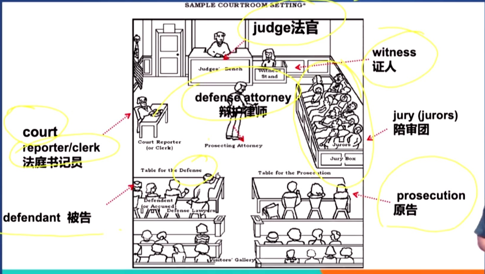
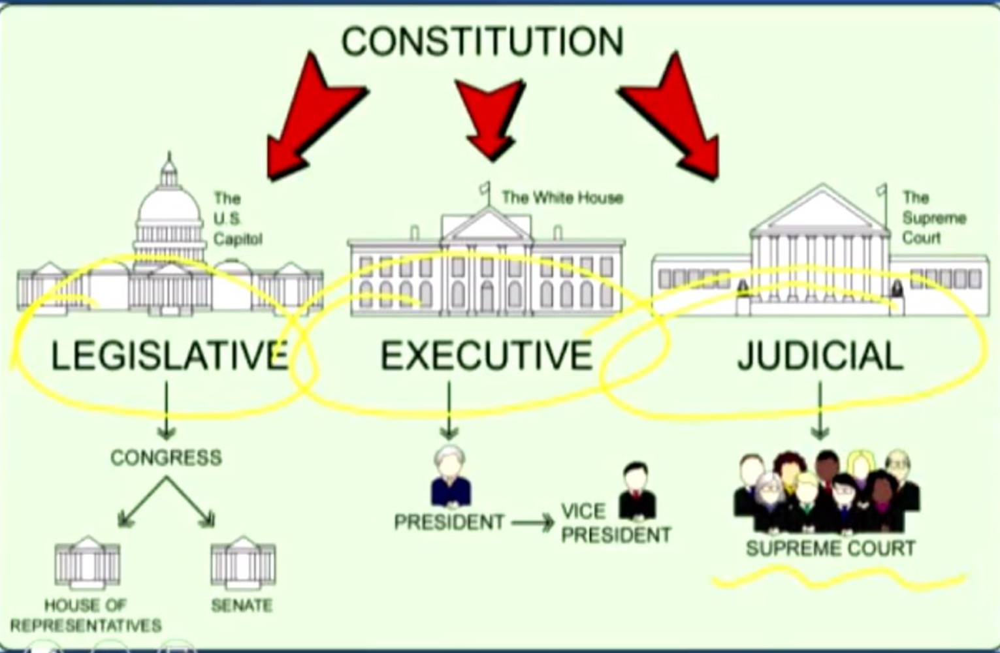
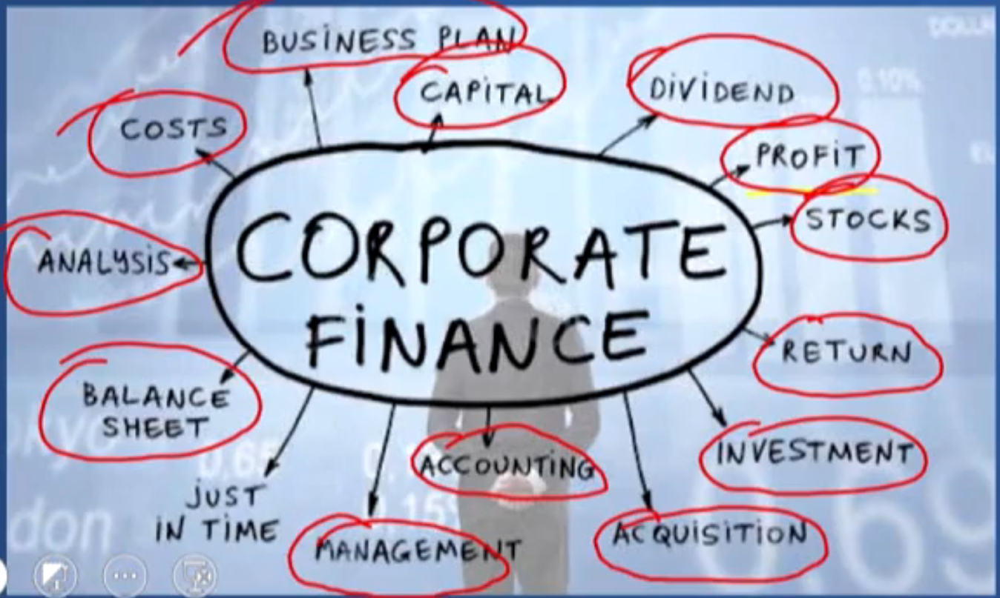

# 词汇

## 1 背单词方法论

1. 怎么背 - 不同阶段

    

2. 背哪些

    结合分数 与 频率

    

3. 怎么背：方法

    单词：语义、拼写、例句、搭配、同/近义、引申词

    只背第一重要的： **语义**

    生词：只背第一个语义

    熟词：只背最后一个语义

    ==**原则：只背第一重要**==

4. 词汇十大原则

    1. 单词发音最重要

    2. 英汉对比学有效

    3. 动词才是最核心

    4. 语境助你记得牢

    5. 阅读句式来写作

    6. 未知是由已知教

    7. 熟词辟义记根本

    8. 单词区别不自扰

    9. 常用单词考法多

    10. 感觉远比死记巧

    发音现象：名清动浊，名前动后

5. 自我总结方法论

    1. 艾宾浩斯记忆法：不断且有规律地重复

    2. 归纳法：不断寻找有相同点的大量的单词组，高维重复 1 

        0. 高频词、中频词、低频词、超低频词

        1. 相似主题单词汇总（神近）

        2. 相同词根单词汇总（形近）

## 2 第二轮：频率分词记忆

### 高频词

take  
看法

takeaway  
要点

takeaway  
外卖

blunder  
错误

entrepreneur  
企业家

transact  
交易

retail  
零售

soar  
增长

spike  
陡增

constitution  
宪法

proceed  
开展

proceedings  
n.诉讼

enact  
通过

manifest  
展示

overrule  
驳回

testify  
当庭作证

contest  
比赛；争论

cultivate  
培育

civilise  
教化

prosecute  
起诉

trial  
审判

appeal  
上诉

plead  
请愿

levy  
v.征税；n.税收

setback  
挫折

democratic  
民主的

coherent  
合乎逻辑的

inform  
影响

reinvent  
以新形象示人

conceive  
设想；怀孕

exclusive  
独有的

patriotism  
爱国

reap  
收割

discern  
分辨

acute  
敏感的、急性的

back  
支持

backdrop  
背景

backfire  
产生不良后果

affirm  
确定属实

render  
使变得

contemplate  
沉思

procedure  
流程

trivial  
不重要的

augment  
增加

elevate  
提升

rate  
评价

favorable  
赞成的

favoritism  
偏爱

lucrative  
利润丰厚的

virtually  
几乎

interpersonal  
人际关系的

dispute  
争论

assign  
布置

pension  
抚恤金

subsidise  
补贴

welfare  
福利

inclination  
倾向

tide  
潮流

revolve  
转动

involve  

involution  
内卷

refrain  
限制

confine  
限制

sanction  
制裁

mandate  
授权

ideology  
意识形态

venture  
(有风险的)商业活动

terminology  
专业术语

provision  
规定

cope  
处理、解决

discourse  
话语

manipulate  
控制

majority - minority  
人种(多数-少数)

sentimate  
情绪

municipal  
地方政府的

endeavour  
努力

accountability  
责任

accountable  
对...有责任的

exclaim  
尖叫

compliment  
称赞

prescription  
药方

malpractice  
玩忽职守

viscerally  
发自内心地

evade  
逃避

inevitable  
不可避免的

### 中频词

## 词根词缀汇总

### con-

constitution  
宪法

conscience  
n.良知

contest  
n.v. 比赛 争论

consequence  
n.结果

conservative  
保守的，保守党的

conceive  
v.设想，怀孕

context  
背景，语境

confirm - confirmation  
确认

considerable  
a.相当大/多的

contemplate  
v.沉思

confine  
限制

contend  
（在争论中）声称

contrary  
相反的

conclude  
v.结束（生义）；得出结论

conclusive  
a. 确凿的

consent  
n./v.同意

consensus  
共识

continuous - continual  
持续的（无间断的-有间断的）

concrete  
a.实际的（生义）；混凝土

concert  
音乐会

conceal  
隐藏

conduct  
实施

conductor  
导体

conjunction  
连接

congress  
（美国）国会

condemn  
谴责

contract  
v.收缩 n.合同

conviction  
判罪

conflict  
v./n.冲突

converge  
汇集

convention  
大会；习俗

conscious  
意识到的

concept - conceptual  
概念 - 概念上的

misconception  
误解

confront  
面对

consultant  
顾问

constituent  
选民

contrive  
（精心）策划、计划

consist in  
存在于

consist of  
由...组成；包含

contain  
包含、抑制

constrain - constraint  
v.-n. 限制

conversely  
相反地

consent  
允许

convert  
转换、转换器

contradict - contradiction - contradictory  
反驳、与...矛盾

conviction  
审判

construct  
构想

contempt - contemptuous  
n.轻视 - 鄙视的

condense  
凝结

consolidate  
巩固、加强

constitute  
组成

connote  
暗示、意味着

continental  
大陆的

controversial  
有争议的

contentious  
有争议的

contest = contend  
争论

---

在前缀为 "con-" 的单词中，"con-" 通常表示 "一起"、"共同"、"完全" 的意思，体现了合并、连接、聚集等概念。接下来，我将结合前缀 "con-" 以及单词的词根和后缀，深入讲解这些单词的构成和含义。

1. 联合/合作类

    这些单词通常涉及将多个事物结合、协作或聚集在一起。

    - **conform**  
    - **前缀：** "con-" (共同)  
    - **词根：** "form" (形状，形式)  
    - **含义：** 使自己的行为或外表符合某种形式或规范，体现了“共同遵循某种形式”的概念。

    - **connect**  
    - **前缀：** "con-" (一起)  
    - **词根：** "nect" (连接)  
    - **含义：** 将两个或多个事物连接在一起，体现了“共同连接”的概念。

    - **contribute**  
    - **前缀：** "con-" (一起)  
    - **词根：** "tribute" (给予)  
    - **含义：** 共同给予某些东西，指向一个共同的目标，体现了“共同贡献”的概念。

    - **convene**  
    - **前缀：** "con-" (一起)  
    - **词根：** "vene" (来，来到)  
    - **含义：** 召集人们来到一起，体现了“共同聚集”的概念。

    - **converge**  
    - **前缀：** "con-" (一起)  
    - **词根：** "verge" (倾向于，转向)  
    - **含义：** 向某一点汇聚，强调“共同汇聚”的概念。

    **词根逻辑关系：** 这些词的词根都与“形状、连接、给予、来、转向”等有关，前缀 "con-" 进一步强化了“共同做某事”的含义。

2. 限制/约束类

    这类单词通常涉及控制、限制或约束的概念。

    - **constrain**  
    - **前缀：** "con-" (完全)  
    - **词根：** "strain" (拉紧)  
    - **含义：** 完全拉紧，表示强制或限制，体现了“完全限制”的概念。

    - **confine**  
    - **前缀：** "con-" (完全)  
    - **词根：** "fine" (界限，限制)  
    - **含义：** 完全界定或限制，强调“完全局限于某个范围”。

    - **constrict**  
    - **前缀：** "con-" (完全)  
    - **词根：** "strict" (拉紧)  
    - **含义：** 完全收紧，强调“完全的限制或束缚”。

    - **condemn**  
    - **前缀：** "con-" (完全)  
    - **词根：** "demn" (损害)  
    - **含义：** 完全谴责或责备，具有“完全的否定”之意。

    **词根逻辑关系：** 这些词的词根与“拉紧、界限、损害”等有关，前缀 "con-" 强调了动作或状态的彻底性。

3. 变化/转换类

    这些单词涉及到改变某物的形式、性质或状态。

    - **convert**  
    - **前缀：** "con-" (完全)  
    - **词根：** "vert" (转)  
    - **含义：** 完全转变，强调“彻底的改变或转换”。

    - **conserve**  
    - **前缀：** "con-" (完全)  
    - **词根：** "serve" (保存)  
    - **含义：** 完全保存，强调“保护和保留”。

    - **condense**  
    - **前缀：** "con-" (完全)  
    - **词根：** "dense" (浓密)  
    - **含义：** 完全浓缩或压缩，强调“缩减体积或内容”。

    - **contract**  
    - **前缀：** "con-" (完全)  
    - **词根：** "tract" (拉)  
    - **含义：** 完全收缩或缩短，强调“缩减的动作”。

    **词根逻辑关系：** 这些词的词根与“转动、保存、浓密、拉”等相关，前缀 "con-" 强调动作的完整性或彻底性。

4. 思考/决定类

    这类单词主要涉及思考、决定或判断的过程。

    - **consider**  
    - **前缀：** "con-" (完全)  
    - **词根：** "sider" (星)  
    - **含义：** “仔细观察星星”，引申为仔细思考和权衡，强调“深思熟虑”。

    - **contemplate**  
    - **前缀：** "con-" (完全)  
    - **词根：** "template" (看)  
    - **含义：** 完全注视或思考，强调“深思或冥想”。

    - **conceive**  
    - **前缀：** "con-" (完全)  
    - **词根：** "ceive" (抓住)  
    - **含义：** 完全抓住，表示形成想法或概念，强调“构思的过程”。

    - **convince**  
    - **前缀：** "con-" (完全)  
    - **词根：** "vince" (征服)  
    - **含义：** 通过论据或说服完全征服他人的思想，强调“彻底说服”。

    **词根逻辑关系：** 这些词的词根与“星、看、抓、征服”等有关，前缀 "con-" 强调了思考或决策过程的彻底性和深度。

5. 冲突/矛盾类

    这些单词与冲突、对立或矛盾有关。

    - **conflict**  
    - **前缀：** "con-" (一起)  
    - **词根：** "flict" (打击)  
    - **含义：** 共同打击，表示不同观点或利益的碰撞，强调“冲突”。

    - **contest**  
    - **前缀：** "con-" (共同)  
    - **词根：** "test" (见证)  
    - **含义：** 共同见证，通常指争论或竞争，强调“争辩或对抗”。

    - **contradict**  
    - **前缀：** "contra-" (反对)  
    - **词根：** "dict" (说)  
    - **含义：** 说出与他人意见相反的内容，强调“反驳”。

    - **confront**  
    - **前缀：** "con-" (完全)  
    - **词根：** "front" (前面)  
    - **含义：** 完全面对问题或对手，强调“面对冲突或困难”。

    **词根逻辑关系：** 这些词的词根与“打击、见证、说、前面”等相关，前缀 "con-" 强调共同或完全面对对立面的状态。

6. 传达/表达类

    这类单词涉及信息或思想的传达与表达。

    - **convey**  
    - **前缀：** "con-" (一起)  
    - **词根：** "vey" (道路)  
    - **含义：** 通过某条道路传递信息或情感，强调“传达”。

    - **confirm**  
    - **前缀：** "con-" (完全)  
    - **词根：** "firm" (坚固)  
    - **含义：** 完全使某事坚固或确定，强调“确认”。

    - **communicate**  
    - **前缀：** "com-" (共同)  
    - **词根：** "mun" (服务)  
    - **含义：** 共同服务于信息的传递，强调“交流”。

    **词根逻辑关系：** 这些词的词根与“道路、坚固、服务”等相关，前缀 "con-" 强调信息或思想传递的共同性或完全性。

好的！让我们按照前缀 "con-" 的逻辑和形式，分析你收集的这些单词。

1. 法律/规范类

    这些单词涉及到法律、规则、规范等相关概念。

    - **constitution**  
    - **前缀：** "con-" (共同)  
    - **词根：** "stitut" (建立)  
    - **含义：** 共同建立的规则或法律，即宪法。体现了“共同的构建或基础”的概念。

    - **congress**  
    - **前缀：** "con-" (一起)  
    - **词根：** "gress" (行走)  
    - **含义：** 一群人共同走到一起，指代国会或正式会议。

    - **contract**  
    - **前缀：** "con-" (共同)  
    - **词根：** "tract" (拉)  
    - **含义：** 共同拉紧的协议，指合同；也可表示收缩的动作。

    - **conviction**  
    - **前缀：** "con-" (完全)  
    - **词根：** "vict" (征服)  
    - **含义：** 完全的信念或法律上的定罪，指代强烈的信念或判决结果。

    - **consent**  
    - **前缀：** "con-" (共同)  
    - **词根：** "sent" (感觉)  
    - **含义：** 共同感受到同意或认可，指同意或许可。

    - **consensus**  
    - **前缀：** "con-" (共同)  
    - **词根：** "sens" (感觉)  
    - **含义：** 共同的感觉或意见，即共识。

    **词根逻辑关系：** 这些单词的词根通常与“建立、行走、拉紧、感觉”等相关，前缀 "con-" 强调了法律、规则和共同协议的概念。

2. 思考/决定类

    这些单词涉及到思考、决定或判断的过程。

    - **conscience**  
    - **前缀：** "con-" (完全)  
    - **词根：** "science" (知道)  
    - **含义：** 内心深处的完全知觉，指良知或道德感。

    - **conceive**  
    - **前缀：** "con-" (完全)  
    - **词根：** "ceive" (抓住)  
    - **含义：** 完全抓住或构思，表示形成想法或怀孕。

    - **considerable**  
    - **前缀：** "con-" (完全)  
    - **词根：** "sider" (星星)  
    - **含义：** 反复考虑，表示数量或程度上值得重视。

    - **contemplate**  
    - **前缀：** "con-" (完全)  
    - **词根：** "template" (看)  
    - **含义：** 完全注视或思考，表示深思熟虑。

    - **confirm**  
    - **前缀：** "con-" (完全)  
    - **词根：** "firm" (坚固)  
    - **含义：** 完全使某事坚固或确定，强调“确认”。

    - **conclude**  
    - **前缀：** "con-" (完全)  
    - **词根：** "clude" (关闭)  
    - **含义：** 完全关闭，指结束或得出结论。

    **词根逻辑关系：** 这些词的词根通常与“知道、抓住、看、关闭”等相关，前缀 "con-" 强调了思考、决定或完全确认的概念。

3. 争议/对立类

    这些单词涉及冲突、争论或对立的概念。

    - **contest**  
    - **前缀：** "con-" (共同)  
    - **词根：** "test" (见证)  
    - **含义：** 共同见证，通常指争论或比赛。

    - **contend**  
    - **前缀：** "con-" (共同)  
    - **词根：** "tend" (伸展)  
    - **含义：** 共同伸展力量，指争论或声称。

    - **contrary**  
    - **前缀：** "contra-" (反对)  
    - **词根：** "ary" (形容词后缀)  
    - **含义：** 与之相反的，表示对立或相反的状态。

    - **conflict**  
    - **前缀：** "con-" (共同)  
    - **词根：** "flict" (打击)  
    - **含义：** 共同打击，表示冲突或矛盾。

    - **confront**  
    - **前缀：** "con-" (完全)  
    - **词根：** "front" (前面)  
    - **含义：** 完全面对问题或对手，强调“面对冲突或困难”。

    - **contradict**  
    - **前缀：** "contra-" (反对)  
    - **词根：** "dict" (说)  
    - **含义：** 说出与他人意见相反的内容，强调“反驳”。

    **词根逻辑关系：** 这些词的词根与“见证、伸展、打击、说”等相关，前缀 "con-" 或 "contra-" 强调了争论、对立或冲突的概念。

4. 转换/变化类

    这些单词涉及到形式、状态或位置的改变。

    - **convert**  
    - **前缀：** "con-" (完全)  
    - **词根：** "vert" (转)  
    - **含义：** 完全转变，强调“转换或改变”。

    - **condense**  
    - **前缀：** "con-" (完全)  
    - **词根：** "dense" (浓密)  
    - **含义：** 完全浓缩或压缩，强调“缩减体积或内容”。

    - **construct**  
    - **前缀：** "con-" (共同)  
    - **词根：** "struct" (建造)  
    - **含义：** 共同建造，指构建或建立。

    - **constitute**  
    - **前缀：** "con-" (共同)  
    - **词根：** "stitut" (建立)  
    - **含义：** 共同建立，指组成或构成。

    - **contain**  
    - **前缀：** "con-" (完全)  
    - **词根：** "tain" (保持)  
    - **含义：** 完全保持，表示包含或抑制。

    **词根逻辑关系：** 这些词的词根与“转动、浓密、建造、保持”等相关，前缀 "con-" 强调了转换或完全包含的概念。

5. 持续/重复类

    这些单词涉及到某种状态或动作的持续或重复。

    - **continuous**  
    - **前缀：** "con-" (完全)  
    - **词根：** "tinu" (保持)  
    - **含义：** 完全保持，表示持续不断的。

    - **continual**  
    - **前缀：** "con-" (完全)  
    - **词根：** "tinual" (继续)  
    - **含义：** 有间断的持续，强调间断但重复的状态。

    - **conserve**  
    - **前缀：** "con-" (完全)  
    - **词根：** "serve" (保存)  
    - **含义：** 完全保存，表示保护和保留。

    - **consolidate**  
    - **前缀：** "con-" (完全)  
    - **词根：** "solid" (坚固)  
    - **含义：** 完全使坚固，表示巩固或加强。

    **词根逻辑关系：** 这些词的词根与“保持、继续、保存、坚固”等相关，前缀 "con-" 强调了动作或状态的持续性和坚固性。

6. 表达/传递类

    这些单词涉及信息、思想或情感的表达与传递。

    - **convey**  
    - **前缀：** "con-" (一起)  
    - **词根：** "vey" (道路)  
    - **含义：** 通过某条道路传递信息或情感，强调“传达”。

    - **connotation**  
    - **前缀：** "con-" (完全)  
    - **词

    根：** "note" (标记)  
    - **含义：** 某一词汇带有的完全标记或隐含意义，指暗示或内涵。

    - **conjunction**  
    - **前缀：** "con-" (共同)  
    - **词根：** "junct" (连接)  
    - **含义：** 共同连接，指结合或连接词。

    - **consultant**  
    - **前缀：** "con-" (完全)  
    - **词根：** "sult" (跳跃)  
    - **含义：** 完全参与商讨的人，指顾问。

    **词根逻辑关系：** 这些词的词根与“道路、标记、连接、跳跃”等相关，前缀 "con-" 强调了表达、传递或连接的概念。

7. 其他类别

    这部分单词与上面的分类不完全吻合，但也具有一定的逻辑关系。

    - **consume**  
    - **前缀：** "con-" (完全)  
    - **词根：** "s

    ume" (取)  
    - **含义：** 完全取走，强调“消耗”。

    - **consequence**  
    - **前缀：** "con-" (一起)  
    - **词根：** "sequence" (顺序)  
    - **含义：** 一系列的结果或后果，强调“随之而来的结果”。

    - **contrive**  
    - **前缀：** "con-" (共同)  
    - **词根：** "trive" (寻找)  
    - **含义：** 共同寻找方法，通常指巧妙地策划或设计。

    **词根逻辑关系：** 这些词的词根与“取、顺序、寻找”等相关，前缀 "con-" 强调动作的共同性或彻底性。

---

通过结合前缀 "con-" 和各个单词的词根分析，可以看出，这些单词的构成逻辑通常围绕着“合并、完全、共同”等概念展开，结合词根的含义，可以更好地理解每个单词的语义和用法。

## 同近义词汇总

## 3 考研阅读专题词汇

### 阅读分类

#### 经济

2014 Text 1 英国的“预先找工作”计划

2014 Text2 律师职业花费高昂原因分析

2013 Text2 用户隐私和广告利益

2011 Text 1 唱片冲击古典音乐的销售

2010 Text 4 财务标准制定者的困境

2007 Text 3 美国中产阶级经济压力

2004 Text3经济衰退对消费者影响

2003 Text 3 垄断之并购

2002 Text 3 石油价格与经济衰退

2001 Text 4 全球并购

2000 Text 1 美国经济兴衰史

1998 Text 2 美国经济与企业重组

1998 Text 3 科学与反科学

1997 Text 5货币政策与通货膨胀

1996 Text 3 劳资关系的发展

1994 Text 1 美国经济体制

#### 科学与科技

2014 Text3 对科学领域高额奖金的质疑

2014 Text 4 对《问题的核心》报告的讨论

2013 Text3 人类的广阔前景

2012 Text 3 科学发现是如何变得可信的

2009 Text 2 亲子鉴定

2009 Text 4 新英格兰人的历史研究

2008 Text 2 网络改变学术出版

2007 Text 2 智力测试和实际能力

2005 Text 3 做梦能否人为控制

2004 Text 1 互联网

2003 Text 1 互联网对情报业的影响

2003 Text 2 动物保护与生物医学

2002 Text 2 人工智能发展优缺点

2001 Text 1 科学发展史

2001 Text 2 互联网---发展中国家机会

2000 Text 2 医疗进步与身体进化

1999 Text 4 禁止克隆人

1999 Text 5 科学思维与科学精神

1998 Text 5 板块运动与“热点”概念

1997 Text 3 药物的医学界定

1995 Text 5 人类记忆研究

1994 Text 2 计算机与效率提升

1994 Text 3 癌症研究

#### 文化

2013 Text1 快速时尚

2010 Text 1 报纸失去了艺术评论

2010 Text 3 是明星引领潮流吗

2006 Text 1 美国种族文化融合

2006 Text 2 莎翁故居剧团市民争端

2006 Text 4 艺术表现美还是丑

2000 Text 3 未来主义诗歌之批判

1997 Text 2 美国人友善与好客的文化

1996 Text 5 创世纪论进化论之争

#### 教育

2011 Text 4 养育孩子带来快乐还是痛苦

2009 Text 3 教育与经济关系

2004 Text 4 对大学教育的思考

1999 Text 3 学校电脑普及中的问题

1996 Text 3 美国发明与其小学教育

1994 Text 3 特殊儿童与教育公平

#### 社会

2012 text1 同辈压力的影响和作用

2012 test2 佛蒙特洋基核电厂应信守承诺

2011 Text 2 高管的裸辞现象

2011 Text 3 传统付费外的新媒体

2009 Text 1 习惯于创新

2008 Text 1 女性压力大

2008 Text 3 美国人停止长个子

2007 Text 1 天生成功VS 后天努力

2007 Text 4 信息泄露

2006 Text 3海洋渔业过度捕捞

2005 Text 1 人类公平意识来源

2005 Text 2 全球变暖

2005 Text 4 正式英语消失的书评

2004 Text 2 姓名歧视

2003 Text 4 对死亡的不同看法

2002 Text 1 如何幽默

2002 Text 4 安乐死

2001 Text 3 媒体信任危机

2001 Text 5 美国妇女生活观念变化

2000 Text 4 日本社会道德下降

2000 Text 5 如何看待野心与报复

1999 Text 1 消费者与企业索赔

1999 Text 2 网络营销

1998 Text 1 大型水坝之利弊

1998 Text 4 美国人口迁移

1997 Text 1 澳大利亚安乐死

1997 Text 4 公司自由与社会责任

1996 Text 1 找工作的方法与准备

1996 Text 2 BBC的改革

1995 Text 1 广告的效用

1995 Text 2 成长的定义： 结果vs过程

1995 Text 3 信息获取的方式变迁

1995 Text 4 性格形成的原因

1994 Text 5 创新的本质

#### 政治

2013 Text4 联邦和州政府间的立法权角逐

2012 Text 4 公共部门工会势力不断壮大的原因及其影响

2010 Text 2 美国法庭批准专利

2008 Text 4 美国开国元勋与奴隶制

### 1 法律与政治

1. 法律程序和制度

    - 上诉辩论

        lawsuit  
        诉讼

        suit  
        诉讼

        file a lawsuit  
        提起诉讼

        trial  
        n.审判

        prosecution/plaintiff  
        原告

        defendant  
        被告

        sue  
        控告

        charge  
        控告

        accuse  
        控告

        appeal  
        上诉

        pleading  
        诉求

        petition  
        请愿

        plead  
        （被告人）辩护

        witness  
        证人

        deposition  
        证词

        evidence  
        证据

        transcription  
        法庭记录

    - 结果

        sentence  
        判决

        verdict  
        裁决

        convict  
        定罪

        dismiss  
        驳回

        overrule  
        驳回

        violate 
        违反

        enforce  
        执行
        
        innocence  
        无罪

        guilt  
        有罪

        settle/resolve  
        和解

        acquit  
        无罪释放

2. 法律相关职业

    legal profession  
    法律职业

    lawyer  
    律师

    attorney  
    律师

    defense attorney  
    辩护律师

    counselor  
    法律顾问

    consultant  
    顾问

    judge  
    法官

    magistrate  

    prosecutor  
    检察官

    jury  
    陪审团

    legal secretary  
    法律秘书

3. 法律相关机构

    federal  
    联邦

    state  
    州

    court  
    法院

4. 法律概念

    constitution  
    宪法

    amendment  
    专表法律的修正案

    justice  
    公平；司法

    quality  
    平等

    rights  
    权力

    duty  
    义务

    freedom  
    自由

    violation  
    违反

    compliance  
    遵守
    
    jurisdiction  
    司法管辖权

    contract  
    合同

    trust  
    信托

    property  
    财产

    asset  
    资产

    liability  
    负债

    clause  
    条款

    chapter  
    宪章

5. 具体法律

    criminal law  
    刑法

    civil law  
    民法

    labor law  
    劳动法

    intellectual property law  
    知识产权法

    corporate law  
    公司法

    constitution  
    宪法

6. 政治派别

    

    Parties  
    党派

    - 左派：

    Communism  

    Labour  

    Democrats

    progressive

    inclusive  

    multicultural  

    evolving  

    - 右派：

    republican

    conservative

    nationalist

    traditional

    exclusive  

    established  

    nationalistic

### 2 经济

1. 宏观经济学

    aggregate demand  
    总需求

    aggregate supply  
    总供给

    business cycle  
    商业周期

    inflation  
    通货膨胀

    fiscal policy  
    财政政策

    monetary policy  
    货币政策

2. 微观经济学

    market  
    市场

    marketing  
    营销

    price elasticity  
    价格弹性

3. 国际经济学

    balance of payments  
    收支平衡

    exchange rate  
    汇率

    comparative advantage  
    比较优势

    absolute advantage  
    绝对优势

    globalization  
    全球化

4. 金融学

    capital  
    资本

    investment  
    投资

    saving  
    储蓄

    regression analysis  
    回归分析

### 3 科学与科技

### 4 文化

1. 宗教

    religion  
    宗教

### 5 教育

1. 教育阶段

    public institution  
    公立学校

    private school  
    私立学校

    primary school  
    小学

    secondary school  
    中学

    college/university  
    大学

    vocational education  
    职业教育

    tertiary education  
    高等教育

    academy  
    学院

    campus  
    校园

    department  
    系

    semester  
    学期

    assignment  
    作业

2. 教育角色

    professor  
    教授

    associate professor  
    副教授

    guest professor  
    客座教授

    faulty  
    教师群体

    postgraduate  
    研究生

3. 教育概念

    major  
    专业

    minor  
    辅修

    collaboration  
    合作

    critical thinking  
    批判思维

    distance learning  
    远程教育

    educational reform  
    教育改革

    funding  
    资金

### 6 社会与社会现象（其他）

## 4 考研6500词

### Unit 1

1. vocational a.职业的  
    career n.事业  
    job - career - calling

2. state [前缀] st\sta: 停留 stop station star  
    n.国家，州，政府（注意美国的州=国的特殊性，理解情景）  
    a.州/国家的  
    overstate/overstatement 过于的说法  
    understate/understatement 保守的说法  
    estate: real estate 房地产  
    status 情况、地位 ==status quo== 现状  
    **stake: at stake = in danger**

3. change  
    alter v.改变  
    alternative n.  
    switch v.改变/交换

4. social  
    asocial 不social的  
    associate  
    association

5. take n.看法  
    **What's your take in this?** 你的看法是什么  
    **takeaway n.要点 外卖**  
    mistake = ==blunder== n.错误

6. company n.  
    accompany v.  
    **companion n. 伴侣**  
    companionship n. 友谊  

7. accord v.与...一致 n.协议  
    accordingly 相应地，因此(therefore)

    > accord with 与...一致  

8. own  
    ownership n.所有权  
    property n.财产  
    owe v.欠  

    > owe A to B 把A归因于B:  
    > attribute A to B  
    > **ascribe A to B**

9. mean n.平均值 a. 不友好的  
    > A be meant to do sth A注定要做...

10. choose  
    select  
    selection  
    selective  
    **opt** v.选择  
    option  
    optional  

11. business  

    > It's business.  
    > Business is business. 公事公办  

    commerce n.商业  
    commercial n.**广告** a.商业的  
    E-commerce 电商  
    **enterprise v.企业**  
    entrepreneur n.企业家 开创者  
    entrepreneurship n.企业家精神 开创精神  
    **transact transaction 交易**  
    wholesale 批发  
    **commodity n.商品（大宗商品）**  
    bargain: such a bargain 划算的买卖  

12. question  
    inquire/enquire  
    inquiry/enquiry 调查\询问  
    **issue v.发布**  
    affair n.（政治，外交）事务 外遇  

13. human  
    humanity 人性  
    humanistic 人道的  
    humanitarian 人道主义者  
    anthropologist 人类学家  
    anthropology 人类学  
    archeologist 考古学  
    archeological 考古的  
    demographic 人口统计学的  

14. publication 公开 出版

15. marked 显著的

16. sector 部门  
    **segment v.切分 n.切片**  
    segmentation n.切分

17. governance n.管理  
    governor n.州长

### Unit 2

1. increase  
    **soar v.增长，腾飞**  
    **spike v.陡增 n.尖状物**  
    accelerate v.加速  
    decline v. **（委婉的）拒绝**；下降  
    **diminish v.削弱**

2. **mortgage v.抵押 n.抵押贷款**

3. lawyer n.法律从业者  
    **lawsuit n.起诉**  
    judge n.法官  
    legitimate=legal a.合法的，合理的  
    legitimacy n.合法性  
    **constitution n.宪法**  
    **legislate v.立法**  legislative 立法的 legislation 立法 legislator 立法者 legislature 立法机关  
    proceedings  
    **enact v.通过**  
    bar  
    法律相关单词：

    

4. exhibit v.表现  
    manifest v.展示  
    demonstrate v.展示  
    = suggest/indicate

5. conscience n.良知

6. rule v.判决，统治  
    overrule v.驳回  
    regulatory a.管理的  
    constitution n.宪法  
    constitutional a.宪法的  
    unconstitutional a.违宪的  
    charter n.宪章

7. economist n.经济学人 经济学家  
    ecnomics n.经济学  
    economy n.经济，经济体  
    economical a.经济实惠的

8. decisiveness n.决定性  
    decisive a.决定性的  
    pre-determined a.内定的  
    resolution n.解决方案 决定

9. testify  v.当庭作证  
    contest n.v. 比赛 争论  
    protest v.抗议

10. infinite a.无限的

11. differentiate v.差异化 differentiation  
    distinguish v.区分

12. power plant 发电站

13. cultivate v.培育  
    civil a.文明的 内部的  
    civilise v.教化  
    civility n.礼貌  
    civilian n.公民

### Unit 3

1. consequence n.结果  
    aftermath n.结果  
    fallout n.后果

2. court v.渴望 n.法院  
    courtship n.渴望  
    prosecute v.  
    trial n.审判  
    appeal v.上诉  
    plead v.情愿

3. marketing n.营销  
    marketer n.做营销的人  
    budget n.预算  
    levy v.征税 n.税收

4. in the first place 最开始  
    placement n.放置  
    substitute v./n.替代 替补

5. set off/out  出发（准备好了）  
    setback n.挫折  
    setter n.安置者  
    unsettle v.使...不稳定

6. preserve v.保留 n.保护区  
    reserve v.预定，保留 n.保护区

7. view/viewpoint 观点  
    interview 采访，面试  
    **review v./n.评论**  
    prospect n.前景  
    landscape n.格局 global landscapes 全球格局

8. upkeep n.保养，维修

9. abide by  遵守

10. depart v.离开 departure  
    department n.局，系  
    detach - attach 脱离 - 连接

11. federal a.联邦的  
    democratic democracy democratize 民主  
    democrat 民主党员  
    conservative 保守的，保守党的  
    republic 共和国  
    republican 共和党人  
    chancellor premier 大臣

    一张图：
    

### Unit 4

1. effective 有效的  
    efficiency 高效的  
    impact 冲击  
    Interact 相互影响  
    interplay 相互影响

2. reasoning 推理  
    rational 理性的  
    rationlist 理性主义者  
    coherent 合乎逻辑的

3. inform v.影响

4. acquire v.获得

5. reinvent v.以新形象示人

6. led 铅

7. share n.股份，份额  
    shareholder 股东  
    stock n.股份 v.存储 a.老的

8. project v.投射  
    conceive v.设想，怀孕  
    scheme v./n.计谋  

9. exclude 排除  
    exclusive 独有的

10. patriotism 爱国  
    innovation 创新  
    inclusiveness 包容  
    virtue 美德

11. devalue v.贬低  
    devaluation 货币贬值  

12. productive 多产的  
    by-product 副产品  
    yield v.产生 n.产量  
    reap v.取得，收割

13. context 背景，语境

14. calling 使命感，事业

15. discern v.分辨

16. chronic a.长期的  
    chronicle n.编年史 v.计入编年史  
    acute a.急性的

17. arouse 引起

18. back v.支持  
    backdrop n.背景  
    backfire v.产生不良后果

### Unit 5

1. affirm v.确定属实  
    affirmative a.肯定的，积极的  
    confirm - confirmation 确认

2. hold off 推迟  
    withhold v.（握在手上不给出去）拒绝给出去  
    uphold v.（向上握住）维持  
    grasp v.理解

3. providing 假如  
    provider 供应商  
    offer v.出价  
    supplement v.补充 n.补充物  
    render v.使变得  
    complementary a.补充的

4. turnaround n.彻底转变  
    turnover n.流动、周转（一种感觉）  
    downturn n.衰退
    overturn v.推翻

5. considerable a.相当大/多的  
    contemplate v.沉思

6. statesman 政客
    regime v.政权

7. emphasis n.重点  
    emphasise v.强调 stress  highlight  
    place emphasis on  = attach importance to = lay stress on 重视

8. industry 勤勉  
    industry 行业

9. procedure n.流程 = process

10. vital 重要的 crucial  
    foremost 最重要的  
    trivial 不重要的，琐碎的  
    watershed 分水岭

11. heighten 增加  
    enhance 提高  
    augment 增加，提高  
    elevate 提升  
    swell 肿胀；增加/增多

12. rate v.评价/评估 = estimate

13. scale v.测量  scale sth; scale down/scale up 缩减/扩大

14. burden n.负担 v.给负担  
    tension n.张力（绷紧的那种感觉）

15. support 儿子对父母的赡养/供养  
    foster 父母对孩子的培养 raise  
    feed 喂养  
    favor 赞成，偏袒  
    favorable 赞成的  
    favoritism 偏袒，偏爱  

16. benefit n.福利费，保险金  
    benefactor 赞助者  
    lucrative 利润丰厚的

17. distract v.分散注意力 distraction  

18. attentive 体贴的 注意的

19. virtual 接近现实的这种感觉 virtual reality 虚拟现实  
    virtually 几乎

20. interpersonal 人际关系的  
    individualism 个人主义

21. argue 论证  
    dispute n./v.争论  

22. assign 布置

### Unit 6

1. fund 资金（funds）；提供资金  
    refund 退款  
    allowance 补助金  
    pension 抚恤金  
    subsidy 补贴  
    subsidise 给...补贴  
    welfare 福利 social welfare  
    listed company 上市公司

2. tend to do ... = be apt to do...
    往往 [翻译]、倾向于
    trend 趋势  
    trendy 潮流的  
    inclination 倾向 inclined 有倾向的  
    prone: be prone to de 倾向于做...  
    tide 潮流，趋势

3. formal  
    formation  
    informal  
    formula 配方，方程式  
    formulate 形成  
    reform revolution 改革 革命  
    reform and opening-up 改革开放  
    transform 改变  
    uniform 统一的  
    former = latter

4. commonality 普遍 commonness

5. involve - evolve - revolve  进化  
    evolution 进化 involution 内卷  
    revolutionary n.革命者 a.革命性的

6. limit - restrict - refrain - confine  限制  
    restrict 限制  
    refrain 抱怨；克制    
    sanction 制裁  
    confine 限制

7. mandate n./v. 授权

8. mindset 思维  
    ideology 意识形态

9. eliminate 移除  
    shift 切换

10. patent 专利

11. venture （有风险的）商业活动 adventure 冒险

12. terminology 专业术语  
    provision 规定  
    contest 比赛；争议； contested 有争议的  

13. biotech 生物技术  
    craft 手艺 craftsman 手工艺人

14. address 解决，处理  
    cope 处理 = handle；deal with
    tackle 解决

15. discourse 话语 intercourse 性交流  
    course 课程 curriculum 课程

16. billboard 广告牌  
    broadband 宽带  
    abroad - domestic 国外 - 国内

17. interpret 解读 misinterpret 误读  

18. staff = faculty 员工

### Unit 7

1. remark  
    评论

2. manipulate manipulation  
    控制，操纵  
    manipulation  
    a.善于操纵的

3. principal  
    a.主要的 n.校长

    principle  
    n.原则

    minor  
    次要的

    majority 白人； minority 其他有色人种

4. hack hacker  
    非法侵入（计算机）

5. sense  
    感觉，判断力

    nonsense  
    胡扯

    sensible  
    合理的

    **sentiment**  
    情绪

    sentimental = emotional  
    情绪的

6. municipal  
    地方政府的

7. communism  
    共产主义

    communist  
    共产主义者

8. indefinitely  
    无限期地

9. endeavour  
    v./n.努力

    strive  
    v.努力

10. sequence  
    系列 = series  

    subsequent  
    a.后来的

11. accountability  
    n.责任

    accountable  
    对...负有责任的

    algorithm  
    算法

12. claim  
    n.所有权

    acclaim  
    称赞

    exclaim exclamation  
    尖叫

    assert  
    声称

    allege  
    声称

    contend  
    （在争论中）声称

    compliment  
    v./n.称赞

13. prescription  
    药方 prescription drugs 处方药

    manuscript  
    手稿

14. occasion  
    场合

    occasionally  
    偶尔地

15. malpractice  
    玩忽职守

    routine  
    a.常规的

    progressive  
    先进的，激进的

    conservative  
    保守的

16. nature  
    天性

    instinct  
    本能/直觉

    viscerally  
    发自内心地

17. trust  
    信托基金

    entrust  
    委托

    trustworthiness  
    可信度

18. approach - method - way - path - pathway - means - avenue - channel  
    道路，方法

19. inhabit  
    占据
    
    inhabitant  
    居民/栖息动物

    habitually  
    习惯地

20. evade evasion  
    逃避

    inevitable  
    不可避免的

21. evidence  
    证实

    evident  
    明显的

    apparent  
    明显的

    strikingly  
    显然地

22. justice  
    法官；司法；正义

    justify  
    正义化；辩护

    jury  
    陪审团

    juror  
    陪审员

    jurisdiction  
    司法权

---

中频词：

### Unit 8

1. represent representation  
    代表 = behalf

    embody embodiment  
    具体表现

1. peer  
    凝视

    counterpart  
    对应的人/物

1. singlehood  
    单身

    sole  
    唯一的

    respectively  
    分别地

1. reckon  
    估算

    speculate  
    猜测

1. appear  
    出版

    emerge  
    出现

    fade  
    褪色；慢慢消亡

    vanish  
    消失

1. promote - prompt - boost - spur - foster - elevate  
    提升

    promotion  
    升职

1. extravagant  
    奢侈的

    luxury  
    奢侈、奢侈品

    luxurious  
    奢侈的

    vanity  
    虚荣

    sin  
    罪恶

1. image  
    形象/人设

1. expose  
    体验

    exposure  
    接触

    **impose**  
    强加

    opponent  
    对手

    pose  
    放置

    hypothesis  
    假设

    premise  
    假设

    presumably  
    假设地

    contrary  
    相反的

1. reinforce  
    加强

    reinforcement  
    援军

    enforce enforcement  
    执法

    law enforcement  
    法律执行

    **compel**  
    迫使

    **compulsory**  
    强迫的

    oblige  
    迫使

    obligation  
    义务

    impose  
    强加于；迫使

1. subject  
    主题/主题；**顺从**

    object  
    对象/目的；**反对**

    subjective/objective  
    主观的/客观的

    susceptible  
    易受影响的

1. succeed  
    继承

    successive  
    连续的

    succession  
    继任/连续

1. union  

    unionist  
    工会主义者

    unification  
    统一

    ally  
    队友

    alliance  
    联盟

    association  
    协会

    coalition  
    联盟

1. commute  
    上下班，通勤

    commuter  
    上班族

1. courageous  
    勇敢的

1. postgraduate  
    研究生 

### Unit 9

1. conclude  
    v.结束（生义）；得出结论

    conclusive  
    a. 确凿的

    inconclusive  
    无定论的

2. criterion  
    n.标准

    **criteria**
    标准（criterion的复数）

3. consent  
    n./v.同意

    consensus  
    共识

4. continuous - continual  
    持续的（无间断的-有间断的）

    perpetuate  
    v.使永久化

5. progressive  
    进步的，激进的 - 保守的

    liberal/progressive - conservative/traditional  
    左派 - 右派

    recession/depression  
    消退/萧条

    the Great Recessions 
    经济大萧条（1929-1933）

    bleak

6. deficiency  
    缺陷；缺少

    dearth  
    缺乏

7. amateur  
    业余的；业余者

    specialist  
    专家；专业的

8. eligible  
    合格的

9. exert  
    施加

    exert enormous influence on

    utilise  
    利用

10. counterbalance  
    v.平衡，抵消

11. elaborate  
    a.复杂的 v.详细阐述

    concrete  
    a.实际的（生义）；混凝土

    lengthy  
    冗长的

    roughly  
    大约

    biref  
    v.给...做简报

12. moral  
    n.寓意/道德

    ethical  
    道德的

    ethics  
    伦理道德

    virtue  
    美德

13. necessary  
    必需品

    necessity  
    必要性

    entail = involve  
    涉及

14. outsource  
    外包

15. recur
    再发生

    incur  
    招致、引起

16. lean  
    倾向于

17. neutral  
    中立的

    neutrality  
    中立/中性

18. executive  
    行政的

19. nevertheless  
    
    nonetheless

### Unit 10

1. ensure - insure - assure

    ensure  
    保证

    insure  
    保险/保证

    assure  
    保证

2. mass  
    质量；群众（大量/大多数的东西）

    **substantial**  
    大量的

    substantially  
    ad.很大程度地

3. array  
    大量

4. nation  
    国家；民族

5. capable  
    有能力的

6. break  
    违反

    outbreak  
    n.爆发（break out v.爆发）

    groundbreaking  
    a.开创的

7. raincheck: take a raincheck  
    改天吧

    inspect  
    检查/偷窥

    scrutinize scrutiny  
    认真检查

8. bureau  
    局（department）

    bureaucratic  
    官僚的

9. relevant  
    相关的；有意义的

    correlate  
    与...相关

    causality  
    因果性

    concert  
    音乐会

10. character  
    特征；人设

10. reveal - revelation - conceal  
    揭示 - 隐藏（veal - ceal = seal）

    disclose  
    揭露

11. immigrate - emigrate  
    向内移民 - 向外移民

    migrate  
    迁移

    racial discrimination  
    种族歧视

12. institute  
    n.机构 v.制定

    institution  
    n.机构/体制

    institutionalized  
    a.被体制化/僵化的

    conduct  
    实施

    semiconductor  
    半导体

    implement   
    实施

13. attribute A to B  
    把A归因到B

    attribute  
    属性

    distribute  
    分配

    distribution  
    分布

    designate  
    指定

    allocate  
    分配

    dedicate  
    致力于

13. sexual assault  
    性侵

    assault  
    攻击

    reform  
    改革

14. lineage = family tree  
    谱系

    paternal - maternal  
    父系的 - 母系的

    paternity - maternity  
    父系 - 母系

15. supreme  
    最高的

    

    superb  
    很棒的

    superfluous  
    过剩的

### Unit 11

1. maintain - maintenance
    维护

    sustain  
    维持

    retain - retention  
    保留

1. ignorant  
    无知的

    neglect  
    忽视

    overlook  
    监督；忽视

1. prevail  
    v.盛行/流行

    prevailing - prevalent  
    盛行的/流行的

1. dysfunction = disfunction  
    失去功能

1. manufacture  
    用机器生产

    forge = fake = counterfeit = fabricate  
    伪造

1. realistic - idealistic  
    现实主义者 - 理想主义者

1. bond = conjunction = cling = adhere  
    依附/连接

    adhere  
    遵守

1. hygiene  
    卫生

    infection  
    感染

1. dignity = pride
    尊严

    esteem  
    n./v.尊重

    self-esteem  
    n./v.自尊

    mock  
    嘲笑

1. intellect intellectual  
    智的

    intellectual property  
    知识产权

    scholar  
    学者

    scholarly  
    学术性的

1. merit  
    优点

    flaw  
    缺陷

    flawless  
    完美无缺的

    downside - upside
    不好的/好的 一面

1. cover  
    报道

    recover  
    恢复

1. congress  
    （美国）国会

    senate  
    参议院

    parliament  
    （英国）议会

    council  
    理事会

    minister  
    大臣

    prime minister  
    首相

    premier  
    总理

    chancellor  
    德国总理

1. critic  
    评论家

    criterion - criteria
    标准（后者为复数）

    critique  
    评论

    condemn  
    谴责

1. compromise  
    妥协

    guarantee  
    保证

    pledge  
    保证

    warrant  
    保证； **搜查令**

1. range - scope - boundary - spectrum - territory - realm - domain - acreage - district - region  
    以上单词都可以表示区域的意思

1. auction  
    拍卖

    bid  
    出...来换...

1. gratification  
    感谢

    cater  
    承办酒席

1. complex  
    建筑群

    intricate  
    精妙的

    tricky  
    棘手的

    sophisticated  
    精于世故的(sophi-智慧的)

1. millennial  
    千禧一代

1. liberal  
    自由的，教育的，人文的

### Unit 12

1. regarding = about  
    关于

    disregard  
    忽视

2. express  
    n.快递服务

    express  
    a.明确的，快速的

    utterance  
    话语

3. fashion  
    v.设计

    irrepressible  
    不可遏制的

4. anticipate = predict = forecast = foresee = foreshadow  
    预测

5. hinder  
    阻碍

    curb  
    限制

    barrier  
    障碍

    obstacle  
    障碍

6. resemble  
    与...相似

    likewise  
    adv.类似地

    analogy  
    n.类比

7. attract  
    吸引

    extract  
    提取；提取物（根本含义：拔）

    contract  
    v.收缩 n.合同

    abstract  
    a.抽象的n.摘要v.提取

8. charge  
    控告

    accuse  
    控告

    expenditure  
    支出

9. guilt  
    罪

    conviction = sentence = verdict  
    判罪

10. conflict  
    v./n.冲突

    incite  
    煽动

    breed  
    孕育

    catastrophe  
    灾难

11. collective  
    集体的

    individual  
    个人的

    assemble  
    集中

    converge  
    汇集

    democracy  
    集体

12. convention  
    大会；习俗

    conventional  
    传统的

13. special  
    特色菜

    specific = elaborate on  
    具体

14. gamble  
    读博

    casino  
    赌场

15. conscious  
    意识到的

    subconscious  
    下意识的

    cognitive  
    认知的

    cognitive level  
    认知水平

    concept - conceptual  
    概念 - 概念上的

    conceive  
    怀孕

    misconception  
    误解

    That's a common misconception.
    
16. prudent  
    小心的，谨慎的

17. acclimate  
    适应

18. undermine = impair = destroy = damage = spoil = ruin = disrupt = havoc  
    损坏

    undermine  
    损害

    impair  
    损伤

    spoil  
    宠坏；损坏

    disrupt  
    干扰

    havoc  
    破坏

19. eliminate  
    根除；淘汰

    abolish  
    根除；废除

    deprive  
    剥夺

20. secure  
    （通过努力）获得

    sort = classify  
    v.分类

### Unit 13

1. stretch  
    拉伸

    extend - extent - extensive
    延展 - 程度 - 广泛的

    expand  
    膨胀

    diffuse  
    分流

    transmit  
    传送

2. confront  
    面对

    confrontation  
    对抗

    encounter  
    遭遇

3. enslave  
    奴役

    colonial  
    殖民的

4. assess = estimate = evaluate = value  
    评估；估计

5. biased  
    有偏见的

    discrimination discriminative  
    歧视（的）

    prejudice  
    偏见

6. desire = **eager** = **aspire** = expect = appetite = urge  
    渴望；欲望

    urge  
    n.强烈的欲望

7. bearing  
    n.方位

    orient  
    v.以...为方向

    orientation  
    n.方向

    oriental  
    a.东方的

8. doubt = suspect = skeptical  
    怀疑

9. ease  
    缓解

    relieve  
    缓解

    assuage  
    缓和

    alleviate  
    减轻

    release  
    释放

    unleash - leash  
    释放 - 束缚

    rid  
    清除

    ease = relieve = assuage = alleviate = release = unleash = rid  
    缓解

10. essence  
    本质

    in essence  
    本质上

11. rich = abundant = sufficient =  adequate   
    丰富的，充足的

    abound  
    v.大量存在

12. press  
    媒体

    suppress  
    压制

    repress  
    遏制

    irrepressible  
    不可遏制的

    depress  
    使压抑

    squeeze  
    v.挤压 n.困境

13. separate = divide = split = isolate = branch = uncouple  
    分开

14. assume  
    假定

15. imply  
    暗示，说明

    implicit  
    内在的

    explicit  
    外在的

16. reputation = fame  
    名誉

    prestige  
    声望

    prominent  
    杰出的

### Unit 14

1. reluctant  
    不情愿的

2. primate  
    灵长类动物

    prime  
    首要的

3. transform  
    变形

    transfer  
    转移

    transferable  
    适用的

    consultant  
    顾问

    consulting  
    咨询业

4. reflect  
    反射

    refract  
    折射

5. tactic = strategy  
    策略 - 战略

6. dilemma  
    困境

7. obese  
    过度肥胖的

8. trustworthy  
    值得信赖的

9. attend  
    照顾；出席

    attendant  
    照顾你的人

    attendance  
    出席

10. negotiate  
    谈判

11. propose  
    提出；求婚(to)

    proposal  
    提议

12. vivid  
    生动的

    revive - revival
    恢复

    outlive  
    比...活得长

    out-  
    (前缀)表示比较级的更

    outnumber - outperform - outsmart - outgrow - outdo - outscore - outdistance 

    renaissance  
    文艺复兴

    rejuvenation  
    回春

13. constituent  
    选民

    constitution  
    宪法

    joint  
    连接处，关节

14. rival  
    n.竞争对手；v.竞争

    competent  
    有竞争力的

15. recruit  
    招募

16. mechanism  
    n.机制

    engineer  
    v.策划

    engineer = scheme = design = plan = devise = contrive  
    策划、计划

    orchestrate  
    精心策划

17. equivalent  
    相等的

    partial - impartial  
    偏见的 - 公正的

18. infrastructure  
    基建

    facility  
    设施

    facilitate  
    v.便利（facilitate people）

19. insist - assist - consist -  persist - resist  
    -sist后缀相关词

    consist  
    由...组成

    resist = get rid of
    抵抗

    yield  
    屈服

20. rural  
    农村的

    aristocratic  
    贵族的

    aristocrat  
    贵族

    noble  
    高贵的

21. obtain - attain - retain  
    -tain 后缀相关词表 hold

    retain  
    保留

    attain  
    获得

22. resolve  
    解决

23. campaign  
    大型活动；战役

    lobby  
    游说

    lobbyist  
    说客

    candidate  
    候选人

低频词汇

### Unit 15

1. boast  
    吹嘘/拥有

2. disease - epidemic - pandemic - symptom - virus  
    病毒有关词汇

    symptom
    症状

    viral  
    病毒般的

    go viral  
    火了

    vaccine  
    疫苗

3. distribute  
    分发；分布

    distribution  
    分配；分布

4. fertility  
    丰收；生育能力

    disrupt  
    干扰

5. exceptional  
    出色地

6. epochal  
    划时代的
    
7. prohibit  
    禁止

8. Exactly, ... = Definitely，... = Evidently,... = Apparently, ... = Obsolutely, ...  
    显然, ...

9. incentive  
    n.动机

    propel  
    v.推动(-pel 推)

    expel  
    驱逐

    stimulate  
    刺激

    stimulus  
    刺激物

    momentum  
    势头(很高级)

10. literary - literacy - literally - literate - illiterate - literature  
    文学/文字有关的词汇

    literacy  
    n.读写能力

    literally  
    ad.按字面

11. origin = derive = stem  
    起源于(+from)

12. perceive  
    感知

    perception  
    n.感知

    detect  
    察觉

13. strict = rigid = harsh  
    严格的

    slack  
    懒惰的

    slacker  
    懒鬼

    idleness  
    n.懒惰

14. treat = cure = heal  
    治疗

15. vision  
    愿景

    version  
    版本

    envision = conceive = visualise  
    设想

    visual  
    视觉的

    supervise  
    监督

16. compulsive  
    情不自禁的

    compulsive disorder  
    强迫症

17. assimilation  
    同化

18. aerial  
    航空的

    astronomy  
    天文学

    astronaut  
    宇航员

    cyberspace  
    网络空间

19. ancestor  
    祖先

    ancestry  
    祖先

    *ancestral*  
    祖先的

    descendant  
    后代

20. elite  
    精英，精英的

    talent  
    人才

21. dominate = predominate
    v.主导

    dominant  
    主导的

    domain  
    范围

22. holistic  
    整体的

    wholly  
    ad.完全地

### Unit 16

1. engaed  
    a.订婚的

    engagement  
    参与、婚约

2. criteria  
    标准

3. object  
    n.对象/目的；v.**反对**

    subject  
    n.主题/主题；v.**顺从**

    subjective/objective  
    a.主观的/客观的

    objection - objectivity  
    n. 拒绝 - 客观性

    turn down = object = refuse = reject = deny  
    v.拒绝(由委婉到强硬)

4. variant  
    变种

5. impoverished = poor  
    贫困的

6. optimistic - pessimistic  
    乐观的 - 悲观的

    optimism - pessimism  
    乐观主义 - 悲观主义

7. modify  
    修改

    revise  
    复习，复核(-vis 表示看)

    revision  
    复习，修改

    amendment  
    修正；专表法律的修正案

8. horizon  
    视野

    horizontal - vertical  
    水平的 - 竖直的

9. liveliness  
    活力

    lively  
    生机的

10. adapt - adept - adopt  
    适应 - 熟练 - 采纳

    adept  
    a.熟练的 n.熟手

    fertilize  
    v.受精；施肥

11. defer = delay  
    推迟

12. prioritise/prioritize  
    优先考虑

    priority  
    优先级

    prior  
    优先的；之前的

    prior = previous = former = preceding = foregoing  
    之前的

13. religion  
    宗教

    religious  
    宗教的

    ritual  
    仪式、公事

    sacred  
    神圣的

    sacrifice  
    牺牲

    pilgrim  
    朝圣的人

    Cath-  
    天主教相关的

    doctrine  
    信条

14. stable  
    n.马厩;v.让...进入马厩

15. suit  
    n.套装;诉讼

    suit  
    v.适合；满足

    file  
    v.提起（诉讼）

    file a lawsuit  
    提起诉讼

15. offensive  
    进攻的；冒犯的

16. upset = anxiety = depression = disappointment  
    不好的心情

17. contain  
    抑制

    comprehensive  
    综合的；全部的

18. generous  
    充足的；慷慨的

    generosity  
    慷慨

19. unparalleled  
    无与伦比的

    paradise  
    天堂乐园

    heaven  
    天堂

    paradox  
    悖论

    paradoxical  
    自相矛盾的

    paralyse  
    使瘫痪

    paralysis  
    瘫痪

20. pity - sympathy - empathy - compassion  
    怜悯 - 同情 - 共情 - 强烈共情

21. reverse  
    翻转

    irreversible  
    不可逆转的

    conversely  
    相反地

    versus  
    对抗

22. trick  
    骗

    tricky  
    棘手的

    deceive  
    欺骗

    fraud  
    诈骗

    disguise  
    蒙骗

### Unit 17(上)

1. pathetic  
    可悲的

    apathy  
    n.冷漠（a-前缀表否定）

2. capital  
    资本(cap-前缀表head)

    capitalism - capitalist  
    资本主义

    socialism - socialist  
    社会主义

    communism - communist
    共产主义

    interprovincial  
    省际的

3. severe  
    严重的

4. capture  
    攻占，俘获(cap-前缀表hold)

    captive  
    n.俘虏

    panorama  
    全景

5. predator  
    捕食者

    prey  
    猎物

    predatory  
    掠夺性的

6. impressionist  
    印象派的

    impressionable  
    易受影响的

    susceptible  
    易受影响的

7. fiction - novel  
    小说

    artificial  
    人工的；假的

8. enormous = tremendous = vast = grand = gigantic = mega = immense  
    巨大的

9. ambiguous  
    模棱两可的

    ambiguity  
    n.模棱两可

    navigate - navigation  
    导航(nav-前缀表海洋相关)

    obscure  
    晦涩难懂的

    vague  
    模糊的

    dim  
    模糊暗淡的

    blur  
    使...模糊

    blurry  
    模糊不清的

10. counter  
    n.柜台 v.反驳 a.反对的

    counteract  
    抵消

    counterpart  
    对应的部分

    counterbalance  
    反制

11. extreme - ultra - sheer  
    表示极端、及其这种意思

12. corporate finance  
    公司金融

    公司金融相关单词：
    

    fiscal  
    n.财年 a.财政的

    revenue  
    收入

    income  
    收入

    margin  
    毛利率、边缘

    net profit  
    净利率

    profit  
    盈利

    monetary  
    钱的

    cashless  
    不用现金的

    exchequer  
    财政部

    premium  
    保险费

13. immune  
    免疫的

    immunity  
    免疫

    acquired immune deficiency syndrome  
    获得性免疫缺陷综合征

    deficiency - deficient  
    缺乏

    syndrome  
    综合征

    nominate  
    提名；任命

    exempt  
    免除

### Unit 17(下)

14. inherent  
    a.固有的，内在的

    inherit  
    v.继承

    heritage  
    遗产

    legacy  
    精神遗产

    innate = inborn = intrinsic  
    天生的，固有的，内在的

    internal - external  
    内在的 - 外在的

15. permit/permission = admit/admission = license = allowance = consent  
    允许

16. modest  
    适度的，谦虚的，普通的

    moderate  
    a.适度的 v.使缓和

17. disproportionately  
    不成比例地

18. schedule  
    日程安排

    agenda  
    日程；目的

19. strain = stress = pressure  
    压力

    strain  
    v.过度使用

    stress  
    v.强调

    constrain/constraint = restrain/restraint = bind
    限制

    contain  
    包含、抑制

    bind  
    捆绑，联系

20. trait = characteristic  
    特征

    portrait  
    n.画像

    portray  
    v.描绘

21. legitimate  
    正当的

    investigation  
    n.调查；科研

22. emission  
    排放物[环境篇]

    emit  
    排放

    launch = release  
    发射，发出

23. entitle  
    授予权力

    entitlement  
    福利

    subtitle  
    副标题；字幕

24. hijack  
    劫持交通工具（尤指飞机）

    kidnap  
    劫持，绑架

    seize  
    抓住

    poach  
    挖人

    arrest  
    逮捕

25. imitate  
    模仿

    imitate = do sb.  
    模仿

26. inflation - deflation
    通货膨胀 - 通货紧缩

    inflate - deflate  
    膨胀 - 缩瘪

    fluctuate  
    波动

    fluctuant  
    波动的

    afloat  
    漂浮

    circulation  
    流通，发行量

### Unit 18(上)

1. biotic  
    生物的

    living things  
    生物

    biology  
    生物学

    biography  
    传记

    autobiography  
    自传

2. subtle  
    微妙的

    delicate  
    需要谨慎处理的（棘手的 tricky）；精致易碎的

3. bachelor  
    学士

    doctoral  
    博士

    postgraduate
    研究生

4. convert  
    转换

    convert  
    转换器

    divert  
    转移

    reverse = invert  
    反转  

    trans - ver  
    表移动的词根 总结

5. possess  
    v.拥有

    possession  
    财物

6. pursuit  
    n.追求

    quest  
    n.追求

7. conscious = appreciate = aware of = realize  
    意识到

8. preliminary  
    初步的

    initiative  
    提倡；主动性；计划

    institute  
    v.开始实行

    plan = initiative = programme = project = scheme = propose(v.) = design = intend(v.)  
    计划

9. penalty  
    惩罚

10. integrate  
    融入

    disintegration  
    瓦解(苏联解体/欧盟瓦解)

    integrity  
    正直

    upright  
    正直的

    justice  
    司法

11. monarch  
    君主

    king/emperor  
    皇帝

    monarchy  
    君主制

    reign = rule  
    v./n.统治

    throne  
    王座

    dethrone  
    废黜

    sovereign  
    有主权的

    reign  
    v.统治

12. monitor  
    监控

    surveil - surveillance  
    监控

13. operate  
    运营

    cooperation  
    合作

    corporation  
    公司

14. sponsor  
    v.赞助 n.倡议者；赞助者

    sponsorship  
    n.赞助

### Unit 18(下)

15. mere  
    仅仅的

    barely  
    刚刚够地

16. trace  
    追溯
    
    track  
    轨道

    hint = prompt = tip = clue  
    提示

17. intuitive  
    直觉的

    counter-intuitive  
    反直觉的

    illusion  
    错觉，幻觉

    illusory  
    虚幻的

18. plateau  
    高原；稳定期

19. default  
    v.违约

    betray  
    背叛

    betrayal  
    n.背叛

20. summit  
    n.顶峰；峰会

    peak  
    高峰 v.达到顶峰

21. odd - even  
    奇 - 偶

    odd  
    a.任意的；奇怪的

    breakeven  
    收支平衡

    odds  
    可能性

22. cooperate = collaborate  
    合作

    cooperation = collaboration  
    合作
    
    cooperative = collaborative  
    合作的

23. provoke   
    引起；激怒

    thought - provoking  
    发人深省的

    evoke  
    唤起

    advocate  
    提倡

    trigger  
    v.引发 n.扳机

    spark  
    引发

    provoke = incur = arise = spark = induce = lead to = give rise to = bring about = spawn  
    引起，引发

24. fortune  
    命运

    destiny  
    命运

    fate  
    命运

    fortune = destiny = fate  
    命运

    doom  
    劫，命中注定的悲惨结局

    lot  
    处境

25. rarity  
    n.罕见

26. precaution  
    预防

    prudent  
    谨慎的

27. addicted = obsessed  
    入迷的

    indulge  
    放纵

    indulgence  
    放纵，纵容

    immersive  
    沉浸式的

    immerse  
    沉浸

    overwhelm  
    充溢

28. ambitious  
    有雄心的

    aggressive  
    有侵略性的

    radical  
    根本的，激进的

29. explosive  
    炸药

    plausible = reasonable  
    可信的，合理的

### Unit 19(上)

1. composure  
    镇静

2. commit  
    承诺；全心全意投入；（-mit表送）

    committed to ...  
    全力以赴

    commit  
    犯罪

    commitment  
    承诺

    commission  
    委员会

    committee  
    委员

    commissioner  
    警长

    submit  
    提交

3. compensate  
    补偿（损失）（-pens-词根与钱有关）

    compensation  
    补偿

4. comply with  
    遵守

    compliance  
    遵守，顺从

    violate  
    违反

    obey - disobey  
    遵守-违背

    defy  
    违抗

    boycott  
    联合抵制

    comply/obey/observe/abide by/adhere/stick to - violate/disobey/against/deviate/renege/go back on/offend  
    顺从 - 违背

5. endure  
    持续；忍受（dur-词根表持续）

    during  
    长时间的

    endurable  
    可忍耐的；可持久的

    endurance  
    n.忍耐力

    durable  
    持久的、坚强的（形容人）

    tolerate  
    容忍

    intolerant  
    不可容忍的

    bear  
    忍受

    endure = tolerate = bear  
    忍受，容忍

6. valid = legitimate  
    合法的，合理的，有效的

    invalid  
    失效的

    validity  
    有效性

    invalidate  
    使无效

9. fatigue  
    疲劳

10. philosophy  
    哲学（Philo-词根表 爱）

11. worsen = aggravate = deteriorate  
    恶化

13. receptor  
    感受器

    recipient  
    接收者

14. withdraw  
    撤回；取款

    withdrawal  
    n.撤回

    retreat  
    躲避

15. stylish  
    时尚的

    stylist  
    设计师

16. impulse  
    n.冲动；脉冲

    impulsive  
    冲动的

    impulsive purchase  
    冲动消费

    sober  
    清醒的 v.使清醒

17. adolescent = teenager = juvenile  
    青少年

    immature  
    不成熟的

    maturity  
    n.成熟

18. kinship  
    亲属关系

    kin  
    亲属

    akin  
    亲近的，有亲属关系的

    acquaint  
    使...熟识

    acquaintance = intimate friends  
    熟人

    intimate = familiar = close
    亲近的

    intimate = imply = hint = insinuate = suggest  
    暗示

### Unit 19(下)

1. adequate  
    充足的

    rich = abundant = sufficient =  adequate  =  substantial   
    充足的，大量的

2.  magnify = amplify  
    放大

    magnify gender differences and create gender contradictions  
    放大性别差异，创造性别对立

    magnificent  
    壮丽的

    magnifier  
    放大镜

3. discard = abandon = desert = *scrap*  
    抛弃

    dismiss  
    解散

4. elegant  
    高雅的

    intelligence  
    情报

5. profound  
    深远的

    sweeping  
    影响广泛的

    dictate  
    指使

6. retire - retirement  
    退休

7. stare = gaze = glare = glimpse = glance  
    看

8. automate  
    使自动化
    
    automation  
    自动化

    automatic  
    自动的

    automatically  
    无意识地

    autonomous  
    自主的，自治的

    autocratic  
    独裁的

9. superior - inferior  
    比...更好的 - 比...更差的

    superiority  
    优越性

    supreme  
    最高的

    senior - junior - inferior  
    高级 - 中级 - 低级的

    humble  
    谦逊的

10. justification = rationalization  
    正当理由，合理化

11. decay  
    衰落，腐烂

    beginning - growth - blossoming - decay  
    开始、成长、盛开、衰落

    collapse  
    崩塌

    crash  
    坠毁；撞车

12. leak  
    泄露

13. hostile  
    敌对的

    hostility  
    敌对；反对

    resentment  
    怨恨

14. sketch  
    n.素描；小品 v.简述

    profile  
    n.轮廓，形象 v.概述

    high-profile  
    引人注目的

### Unit 20(上)

1. distort  
    歪曲

    twist  
    v./n. 弯曲

2. awkward  
    尴尬的

3. nutrition  
    营养

    nurture  
    培养

    nurture = foster = cultivate = raise  
    (上对下的)抚养，培养

    support  
    （下对上的）的赡养/供养

    feed  
    喂养

    foster  
    父母对孩子的培养  

    raise  
    抚养

    cultivate  
    培养，培育

4. exaggerate  
    夸大

    alarmist  
    a.危言耸听的

    This isn't to be alarmist  
    这不是危言耸听[写作]
    

5. tempt - attract - appeal - lure  
    诱惑

    lure  
    v.引诱 n.诱惑力

    coax  
    哄劝

6. mutual  
    共同的，相互的

    unilateral  
    单方的

    bilateral  
    双边的

    multilateral  
    多边的

7. deploy  
    部署

    disposition  
    性情

8. loyal  
    忠诚的

    loyalty  
    忠诚

    allegiance  
    忠诚

9. arrest  
    逮捕

    criminal  
    罪犯

    imprisonment  
    监禁

10. verdict  
    n. 裁定

    conviction  
    审判

    sentence  
    审判

    contradict  
    反驳；与...矛盾

    contradictory  
    相互矛盾的

    contradiction  
    矛盾；对立

    agree = side with = approve  
    同意

    counter = hostile = object = against = disapprove = oppose to  
    反对

    dictate  
    口述；指使/影响

    indictment  
    n.控诉

    contest = contend = dispute = argue = protest  
    争论

11. cease  
    停止

    suspend  
    悬挂；停止

12. construct  
    构想

    instruct  
    指示

    pyramid  
    金字塔

13. contempt  
    n.轻视

    contemptuous = scornful  
    鄙视的

    scorn  
    n./v. 轻视

14. customs  
    海关

    accustomed  
    习惯的

15. decorate  
    装饰

### Unit 20(下)

16. enroll  
    招生、招募(使进入)

    recruit  
    招募

17. dense  
    稠密的

    density  
    密度

    condense  
    凝结

18. deliberate  
    故意的

    deliberate practice  
    刻意练习

    metacognition  
    元认知

19. reflex  
    反射

20. intense = tense  
    强烈的，激烈的

    intensify  
    加强

    intensity  
    强度

    intensive  
    密集的、高强度的

    consolidate  
    巩固、加强

    solidarity  
    团结

    intensify = consolidate = reinforce  
    加强(strength/degree increase)

    promote - prompt - boost - spur - foster - elevate - enhance
    提升(make better)

    heighten = enhance = augment = elevate = swell  
    增加/增多(amount/size/value increase)

21. intervene  
    介入、干预

    interfere  
    干涉、干预

    intervene - interfere  
    干预：善意 - 恶意

22. intimate  
    紧密的，亲密的

    acquaintance  
    熟人

    imitate  
    模仿

    intimidate  
    威胁

    frighten = scare = alarm = intimidate = startle = threaten
    恐吓、威胁

23. loom  
    即将到来

    looming = upcoming = *forthcoming*  
    即将到来的

24. musical  
    音乐剧

    orchestra  
    交响乐团

    orchestrate  
    精心策划

25. precede  
    v.在...之前发生/存在

    Reputation precedes.  
    如雷贯耳/久仰大名

    unprecedented  
    前所未有的

    predecessor  
    前任

26. renewal  
    n.更新

    restore  
    恢复

27. acute - chronic  
    急性的 - 慢性的/长期的

    drastic  
    剧烈的

    dramatic  
    猛烈的

    steep  
    陡峭的

    stiff  
    激烈的

    overwhelming  
    巨大的

    overwhelm  
    压倒、淹没

28. constitute  
    组成

    component  
    成分

    constitution  
    宪法

### Unit 21(上)

1. ultimate  
    最终的

2. glory  
    荣耀

    glorious  
    = wonderful/splendid

3. crack  
    n./v.重击

    crackdown  
    n.镇压

    snap  
    [一个很广泛的词] a.匆忙的 n.咔嚓声、快照 v.断裂

4. frame  
    n.框架 v.表达

    framework  
    框架

5. feasible  
    可行的

    feasibility  
    可行性

    viable  
    可行的

    viability  
    可行性

    feasible = viable = competent = able to = practicable = workable  
    可行的；有能力的

    feasibility = viability = competence = ability = practicability  
    可行性；能力

6. rage  
    愤怒；盛行

    outraged  
    极度愤怒的

    outrageous  
    极度令人愤怒的

    indignant - indignation  
    愤慨

7. fragile  
    脆弱的

    fraction  
    小部分；分数

    fragment  
    碎片

    fracture  
    骨折；折断

    fracture = snap = break  
    v.断裂

    feeble  
    虚弱的

    vulnerable  
    脆弱的

    susceptible  
    易受影响的

    refract  
    折射

8. anonymity  
    n.匿名

    anonymous  
    匿名的

9. exploit  
    开发；剥削

    exploitation  
    开发；剥削

    exploit = utilize = take advantage of = make use of = develop  
    开发，利用

10. frustrate  
    使沮丧

    frustrating = disappointing = upsetting = annoying  
    让人沮丧的、苦恼的

11. authentic  
    真实的

    authenticate  
    鉴定

    authenticity  
    真实性

    genuine  
    真的；真诚的

12. corrupt  
    v.使腐败 a.贪污腐败的

    corruption  
    n.腐败、贿赂

    disrupt  
    破坏、干扰

    erupt  
    喷发

    interrupt  
    打断

    interpret  
    诠释

    abrupt  
    突然的，唐突的

    bankruptcy  
    破产

    bribery  
    贿赂

13. comprehensive  
    全面地

    comprehend  
    v.理解

14. degrade - upgrade  
    降低身份 - 升级

    disgrace  
    耻辱

    stain  
    v.留下污渍(败坏名声)；n.污渍

### Unit 21(下)

1. obesity  
    肥胖

    mud  
    泥土
    
    ash  
    灰烬

2. innovate  
    创新

    reform and innovation  
    改革创新

    innovative  
    创新的

    innovativeness  
    创新型

    novel  
    新的

3. maximal - minimal  
    最大的、最小的

    maximize - minimize  
    最大化-最小化

4. symbolic  
    具有象征意义的

    symbolize  
    v.象征

    symbolize = denote = stand for = represent = embody = on behalf of = signify = emblemize
    象征；代表

    state = suggest = imply = indicate = tell = display = infer = signal/signify = reveal = declare = argue = register = mean/drop/show = demonstrate = denote = connote = predicate = proclaim = intimate = manifest
    表达；表示/暗示；显示

5. dwelling  
    住所

    dwell  
    v.居住

    dwell in  
    一直处在...的状态

    dweller  
    居民

    resident  
    居民

    residence  
    居住；住宅

6. hazard  
    危机，灾难

    catastrophe  
    灾难

    crisis = risk = hazard = danger = emergency = peril  
    危机，危险

7. turbulent  
    动荡的

    turbulence  
    动荡，动乱

8. coordinate  
    使协调、协作

    mismatch  
    不匹配

9. overlap  
    v.部分重叠

    overshadow  
    v.蒙上阴影

10. cunning  
    狡猾、狡猾的

11. linger  
    徘徊

12. hitherto  
    迄今

13. transplant  
    迁移，移植

    transparent  
    透明的

    transparency  
    透明度(抽象透明)

    transient  
    短暂的

    transition  
    过渡

14. exceed  
    v.超过

    excess  
    n.过量

    excessive  
    a.过度的

    surpass  
    v.超过

15. autonomous  
    自主的

    spontaneous  
    自发的

16. miserable  
    痛苦的

    distressed  
    苦恼痛苦的

    grieve  
    使悲伤

17. episode  
    片段

18. prosper  
    v.繁荣

    prosperity  
    n.繁荣

    desperate  
    不顾一切的、绝望的

    thrive = flourish = boom  
    v.繁荣、兴盛

19. rally  
    v.召集

### 低频词

expire  
过期

bend  
倾斜

unsurpassed  
卓绝的

elevation  
n.晋升；提升；海拔

attorney  
律师

reversible  
可逆的

guesswork  
猜测

thrift  
n.节省

unflattering  
贬损的

shorthand  
速记

verbally  
口头地

withstand  
承受

sip  
抿

preside  
负责；主持

preside over = be responsible for = in charge of = undertake = shoulder = assume  
负责

preside = officiate = moderate = anchor = front = chair = host  
主持

anticipation  
预期

apprehension  
理解

aggressiveness  
进取精神

drone  
雄蜂

fertiliser = fertilizer  
肥料

swell  
肿胀；扩大

tribute  
贡品  

---

uneven  
不均匀的

mammal  
哺乳动物

stubborn  
顽固的

formative  
有深远影响的

fatal  
致命的

disciplinary  
学科的

renovation  
整修

misrepresent  
歪曲；误传

grace  
优雅

narrative  
n.叙事

mightily = very = vastly  
ad. 非常

ironical  
讽刺的

readmit  
重新接纳

agonizing  
令人痛苦的

livestream  
网络直播

tick  
打钩

shrewd  
精明的

veteran  
老兵

manifest  
表现，展示

---

inbox  
收件箱

partiality  
不公平性

partial - impartial  
部分的/不公平的、偏袒的 - 公正的、公平的

advisory  
咨询的

hedge  
防备

suicide  
n.自杀

quickness  
机智

erroneous  
错误的

appropriately  
适当地、合适地

scrap  
抛弃

apt  
倾向

culprit  
罪犯

rectify  
纠正

theorize  
提出理论

continental  
大陆的

controversial = contested = debatable = disputable = *tendentious* = *contentious*  
有争议的

contest = contend = dispute = argue = protest = *moot*(辩论)  
争论

competence  
能力

competent  
有能力的

clinical  
临床的

clergyman  
牧师

enlightenment  
启蒙

plunge  
陷入

tuck  
塞进

truck  
卡车

trunk  
树干

deter  
打消

depiction  
描写

erect  
建立

intent  
n.意图 a.专注的

intend  
打算

tend  
趋势

tension  
紧张

---

scold  
责骂

silliness  
n.愚蠢

penalise - penalty  
惩罚

complimentary  
赞赏的

massacre  
大屠杀

sphere  
领域；球体

brainstorm  
v.头脑风暴

subordinate  
下级；次要的

counsel  
v.(正式)建议

regional  
地区的

professorship  
教授职位

professionalisation  
职业化

worrisome  
令人担心的

denote  
v.象征

modernism  
现代主义

modernization  
现代化

deceptiveness - deceptive  
欺骗

anecdote  
轶事

anecdotal  
传闻的

guardianship  
监护、监护人

audit  
n./v.审计

moralist  
道德家

searing  
强烈的

undercover  
秘密的

imperative  
紧急重要的

anchor  
主持人

bidder  
投标者

bitter  
苦的

repel  
驱逐

moan  
抱怨、呻吟

reaffirm  
重申

neurology  
神经学

empower  
授权

intentional  
故意的

prominence  
n.出名

associative  
联想的

---

dilute  
稀释

miserably  
贫困地

outrage  
n.愤怒

postmodern  
后现代的

respondent  
调查对象；被告

displace  
取代

substance  
物质

blossom  
v.开花、成功发展

crystallize  
v.明确、结晶

harden  
变硬

incorporate  
纳入

commemorate  
v.纪念

sew  
缝补

reproductive  
生殖的、繁殖的

intrinsically  
本质地

mobilize  
鼓动

disposal  
v.处理

filer  
提起诉讼者

implicitly  
含蓄地

boldness  
勇气

downgrade  
贬低

vacancy  
空缺

intimidate  
威胁

therapy  
治疗

terrific  
极好的

disassemble  
拆卸

beam  
绽放笑容

strip  
剥去、除去

cruise  
n.v.乘船游览

cruise ship  
游轮

liner  
邮轮

scenery  
风景

toil  
苦干

lodging  
寄宿

cherish  
珍惜

illuminate  
阐明

---

pepper  
n.胡椒粉 v.用...不断打击某人

permeate  
弥漫

appraisal  
n.评估

theft  
n.盗窃

thief  
小偷

steal 
v.偷

steel  
钢铁

striking   
引人注目的

giggle   
咯咯笑

sue  
控告

spectacle  
眼镜、奇观

applaud  
v.称赞

applaud = compliment = acclaim  
称赞

endorse  
（formal）v.赞同、支持

favour
n./v.赞同、支持

approval - approve - disapprove  
n - v 赞同 - 不赞同

lump  
块；把...归在一起

wrap  
n./v. 包、裹、包裹

embark  
着手、开始做

embark on/upon = set about = commence = kick off = Engage in
着手

stir  
n.愤怒（情绪）v.激发

plea  
n.恳求

dissolve  
溶解、解散

vicious  
恶性的

cloak  
掩盖

generalist  
全才

descend - ascend  
下降/下坡 - 上升/爬坡

descendant  
后代

bypass  
避开

census  
人口普查

uncover  
发现、揭露

allegation  
n.指控

rough  
大致的；粗糙的；艰难的

bedrock  
基础、基石

remold = remould  
改造

clarify  
阐明

impart  
传授

impartial  
偏袒的、不公平的

---

### 基本词

1. 动词

2. 名词

3. 介词、连词

lump

wrap

bend

sip

swell

tick

apt

sew

toil

sue

### end