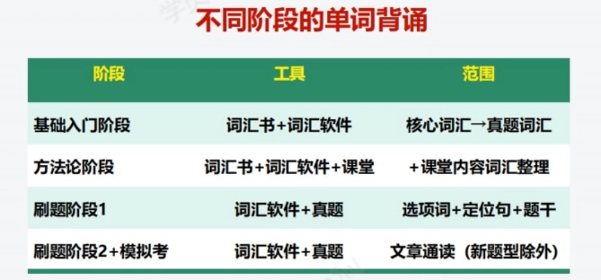
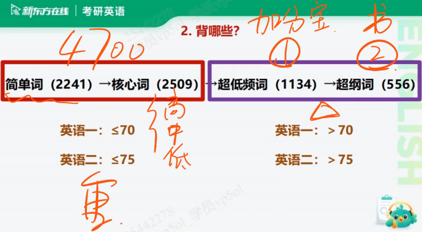
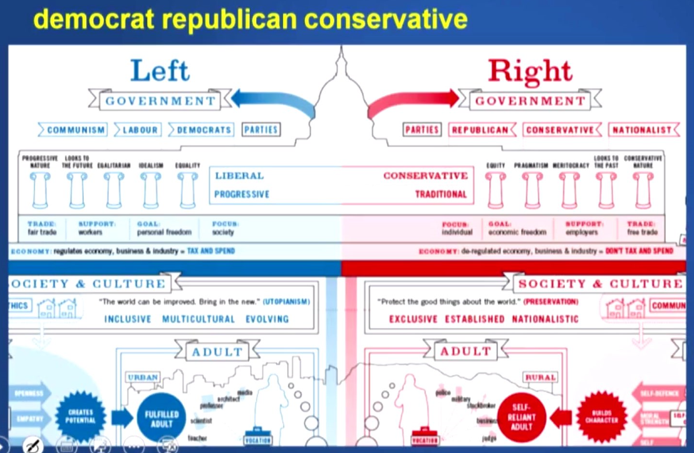

# 单词

!!! note "背单词"

    1. 怎么背 - 不同阶段

        
    
    2. 背哪些

        结合分数 与 频率

        
    
    3. 怎么背：方法

        单词：语义、拼写、例句、搭配、同/近义、引申词

        只背第一重要的： **语义**

        生词：只背第一个语义

        熟词：只背最后一个语义

        ==**原则：只背第一重要**==
    
    4. 词汇十大原则

        1. 单词发音最重要

        2. 英汉对比学有效

        3. 动词才是最核心

        4. 语境助你记得牢

        5. 阅读句式来写作

        6. 未知是由已知教

        7. 熟词辟义记根本

## Unit 1

1. vocational a.职业的  
    career n.事业  
    job - career - calling

2. state [前缀] st\sta: 停留 stop station star  
    n.国家，州，政府（注意美国的州=国的特殊性，理解情景）  
    a.州/国家的  
    overstate/overstatement 过于的说法  
    understate/understatement 保守的说法  
    estate: real estate 房地产  
    status 情况、地位 ==status quo== 现状  
    stake: at stake = in danger

3. change  
    alter v.改变  
    alternative n.  
    switch v.改变/交换

4. social  
    asocial 不social的  
    associate  
    association

5. take n.看法  
    **What's your take in this?** 你的看法是什么  
    intake v.摄入  
    takeaway n.要点 外卖  
    mistake = ==blunder== n.错误

    > take ... for granted 把...当作理所当然

6. company n.  
    accompany v.  
    companion n. 伴侣  
    companionship n. 友谊  

7. accord v.与...一致 n.协议  
    accordingly 相应地，因此(therefore)

    > accord with 与...一致  
    > according to 根据

8. own  
    ownership n.所有权  
    property n.财产  
    owe v.欠  

    > owe A to B 把A归因于B:  
    > attribute A to B  
    > ascribe A to B

9. mean n.平均值 a. 不友好的  
    means 方法  by means of 通过  
    intend intention intentional 意图  

    > A be meant to do sth A注定要做...

10. choose  
    select  
    selection  
    selective  
    **opt** v.选择  
    option  
    optional  

11. business  

    > It's business.  
    > Business is business. 公事公办  

    commerce n.商业  
    commercial n.**广告** a.商业的  
    E-commerce 电商  
    enterprise v.企业  
    entrepreneur n.企业家 开创者  
    entrepreneurship n.企业家精神 开创精神  
    transact transaction 交易  
    wholesale 批发  
    commodity n.商品（大宗商品）  
    bargain: such a bargain 划算的买卖  

12. question  
    inquire/enquire  
    inquiry/enquiry 调查\询问  
    issue v.发布  
    affair n.（政治，外交）事务 外遇  

13. human  
    humanity 人性  
    humanistic 人道的  
    humanitarian 人道主义者  
    anthropologist 人类学家  
    anthropology 人类学  
    archeologist 考古学  
    archeological 考古的  
    demographic 人口统计学的  

14. publication 公开 出版

15. marked 显著的

16. sector 部门  
    segment v.切分 n.切片  
    segmentation n.切分

17. governance n.管理  
    governor n.州长

## Unit 2

1. increase  
    soar v.增长，腾飞  
    spike v.陡增 n.尖状物  
    accelerate v.加速  
    decline v. **（委婉的）拒绝**；下降  
    diminish v.削弱

2. mortgage v.抵押 n.抵押贷款

3. lawyer n.法律从业者  
    lawsuit n.起诉  
    judge n.法官  
    legitimate=legal a.合法的，合理的  
    legitimacy n.合法性  
    constitution n.宪法  
    legislate v.立法  legislative 立法的 legislation 立法 legislator 立法者 legislature 立法机关  
    proceedings  
    enact v.通过  
    bar  
    法律相关单词：  

4. exhibit v.表现  
    manifest v.展示  
    demonstrate v.展示  
    = suggest/indicate

5. conscience n.良知

6. rule v.判决，统治  
    overrule v.驳回  
    regulatory a.管理的  
    constitution n.宪法  
    constitutional a.宪法的  
    unconstitutional a.违宪的  
    charter n.宪章

7. economist n.经济学人 经济学家  
    ecnomics n.经济学  
    economy n.经济，经济体  
    economical a.经济实惠的

8. decisiveness n.决定性  
    decisive a.决定性的  
    pre-determined a.内定的  
    resolution n.解决方案 决定

9. testify  v.当庭作证  
    contest n.v. 比赛 争论  
    protest v.抗议

10. infinite a.无限的

11. differentiate v.差异化 differentiation  
    distinguish v.区分

12. power plant 发电站

13. cultivate v.培育  
    civil a.文明的 内部的  
    civilise v.教化  
    civility n.礼貌  
    civilian n.公民

## Unit 3

1. consequence n.结果  
    aftermath n.结果  
    fallout n.后果

2. court v.渴望 n.法院  
    courtship n.渴望  
    prosecute v.  
    trial n.审判  
    appeal v.上诉  
    plead v.情愿

3. marketing n.营销  
    marketer n.做营销的人  
    budget n.预算  
    levy v.征税 n.税收

4. in the first place 最开始  
    placement n.放置  
    substitute v./n.替代 替补

5. set off/out  出发（准备好了）  
    setback n.挫折  
    setter n.安置者  
    unsettle v.使...不稳定

6. preserve v.保留 n.保护区  
    reserve v.预定，保留 n.保护区

7. view/viewpoint 观点  
    interview 采访，面试  
    **review v./n.评论**  
    prospect n.前景  
    landscape n.格局 global landscapes 全球格局

8. upkeep n.保养，维修

9. abide by  遵守

10. depart v.离开 departure  
    department n.局，系  
    detach - attach 脱离 - 连接

11. federal a.联邦的  
    democratic democracy democratize 民主  
    democrat 民主党员  
    conservative 保守的，保守党的  
    republic 共和国  
    republican 共和党人  
    chancellor premier 大臣

    一张图：
    

## Unit 4

1. effective 有效的  
    efficiency 高效的  
    impact 冲击  
    Interact 相互影响  
    interplay 相互影响

2. reasoning 推理  
    rational 理性的  
    rationlist 理性主义者  
    coherent 合乎逻辑的

3. inform v.影响

4. acquire v.获得

5. reinvent v.以新形象示人

6. led 铅

7. share n.股份，份额  
    shareholder 股东  
    stock n.股份 v.存储 a.老的

8. project v.投射  
    conceive v.设想，怀孕  
    scheme v./n.计谋  

9. exclude 排除  
    exclusive 独有的

10. patriotism 爱国  
    innovation 创新  
    inclusiveness 包容  
    virtue 美德

11. devalue v.贬低  
    devaluation 货币贬值  

12. productive 多产的  
    by-product 副产品  
    yield v.产生 n.产量  
    reap v.取得，收割

13. context 背景，语境

14. calling 使命感，事业

15. discern v.分辨

16. chronic a.长期的  
    chronicle n.编年史 v.计入编年史  
    acute a.急性的

17. arouse 引起

18. back v.支持  
    backdrop n.背景  
    backfire v.产生不良后果

## Unit 5

1. affirm v.确定属实  
    affirmative a.肯定的，积极的  
    confirm confirmation 确认

2. hold off 推迟  
    withhold v.（握在手上不给出去）拒绝给出去  
    uphold v.（向上握住）维持  
    grasp v.理解

3. providing 假如  
    provider 供应商  
    offer v.出价  
    supplement v.补充 n.补充物  
    render v.使变得  
    complementary a.补充的

4. turnaround n.彻底转变  
    turnover n.流动、周转（一种感觉）  
    downturn n.衰退
    overturn v.推翻

5. considerable a.相当大/多的  
    contemplate v.沉思

6. statesman 政客
    regime v.政权

7. emphasis n.重点  
    emphasise v.强调 stress  highlight  
    place emphasis on  = attach importance to = lay stress on 重视

8. industry 勤勉  
    industry 行业

9. procedure n.流程 = process

10. vital 重要的 crucial  
    foremost 最重要的  
    trivial 不重要的，琐碎的  
    watershed 分水岭

11. heighten 增加  
    enhance 提高  
    augment 增加，提高  
    elevate 提升

12. rate v.评价

13. scale v.测量  scale sth; scale down/scale up 缩减/扩大

14. burden n.负担 v.给负担  
    tension n.张力（绷紧的那种感觉）

15. support 儿子对父母的赡养/供养  
    foster 父母对孩子的培养 raise  
    feed 喂养  
    favor 赞成，偏袒  
    favorable 赞成的  
    favoritism 偏袒，偏爱  

16. benefit n.福利费，保险金  
    benefactor 赞助者  
    lucrative 利润丰厚的

17. distract v.分散注意力 distraction  

18. attentive 体贴的 注意的

19. virtual 接近现实的这种感觉 virtual reality 虚拟现实  
    virtually 几乎

20. interpersonal 人际关系的  
    individualism 个人主义

21. argue 论证  
    dispute n./v.争论  

22. assign 布置
