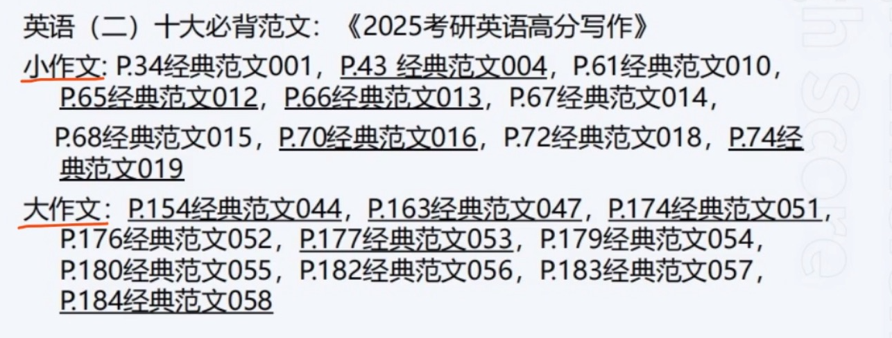

# 写作

## 方法论

1. 背诵：10大必背范文

    

    背文章比背段落好，背段落比背句子好，背句子比背词汇好。

    ==**注：背得不熟，等于没背！**==

2. 四大背诵方法：

    1. 搞清逻辑脉络

    2. 背熟中文译文！！

    3. 多听英文录音

    4. 进行中英互译

3. 默写：仔细对比原文，改正写作错误。

    大作文15分钟默写完

    小作文8分钟默写完，没有错误

4. 仿写

5. 印象原则

    书写工整，卷面整洁，字迹清晰

    ==**练字！！！**==

    写作用笔：0.7 或 1.0 黑色直液笔

    千万不要有任何修改

6. 高分作文三大特点：

    没有模板

    没有错误/很少

    没有跑题

7. 低分作文：

    模板太重

    卷面太差

    错误太多

    跑题太远

8. 考研四大话题，11小话题

    1. 教育文化：21考

        1. 传统文化：5考

            cultural exchange 文化交流  
            cultural blending/integration 文化融合  
            traditional Chinese culture

        2. 流行文化： 7考

            TV advertisements 电视广告  
            idol worship 偶像崇拜  
            web addiction 上网成瘾  
            text message 手机短信  
            mobile phone subscription 手机入网  
            smart phone cell phone addiction 手机成瘾  
            mobile reading 手机阅读

        3. 教育： 9考

            pursuing master's degree 考研  
            college entrance exam for adults 成人高考  
            graduate's choices 毕业选择  
            students working part-time  学生兼职  
            reading extensively 广泛读书  
            choosing difficult courses 选课  
            graduates's whereabouts 毕业去向  
            acquiring knowledge extensively 广泛学习知识  
            labor practice courses 劳动实践课  

    2. 社会热点： 32考

        政治、民族、宗教、军事、时事 不会考

        > 英语1：重点关注前三个热点

        1. 健康： 7考

            good health 良好的健康  
            smoking 吸烟  
            improve students's physical condition 改进学生身体状况  
            living habits 生活习惯  
            residents's exercising ways 居民锻炼方式  
            health literacy 健康素养  
            park 公园

        2. 两代关系： 5考

            generation gap 代沟  
            doting care 溺爱  
            maltreatment of parents 虐待父母  
            to respect the old and care for the young 尊老爱幼  
            setting an example 做榜样

        3. 爱心： 5考

            the "Project Hope" 希望工程  
            love 爱心  
            charity sale 慈善义卖  
            aiding rural primary school 帮助乡村小学

        4. 经济管理： 7考

            the telecommunication industry 电信产业  
            automobile industry 汽车产业  
            staff's job ==**satisfaction**== 员工工作满意度  
            urban/rural population 城乡人口  
            spending during the Spring Festival vacation 春节花销  
            choosing restaurants 选择餐厅  
            express delivery business 快递产业

        5. 旅游： 6考

            national day golden week 十一黄金周  
            tourism and environmental protection 旅游与环保  
            students's proposes for touring 大学生旅游目的  
            visiting museums 参观博物馆  
            recommending tourist attractions 推荐景点

        6. 交通： 2考

            traffic accidents 交通事故  
            debates on traffic 关于交通的辩论

    3. 环境保护： 7考

        city country 城乡  
        protecting wildlife 保护野生动物  
        ocean resources 海洋资源  
        limiting the use of plastic bags 限制使用塑料袋  

    4. 人生哲理： 14考

        > 英语1 最需要重视的话题

        friendship 友谊  
        honesty 诚信  
        independence 独立  
        persistence 坚持  
        confidence 信心  
        teamwork 合作  
        optimism 乐观  
        making right choices 做出正确选择  
        taking actions 行动  
        facing difficulties bravely 勇于面对困难  
        open-mindedness 思想开明

    > 话题关键词掌握拼写 

## 素材本

The best way to bond with someone isn't doing a favor, it's asking for one.

Individualism is what makes coorperation worth living. 个人与集体的关系-强调个体