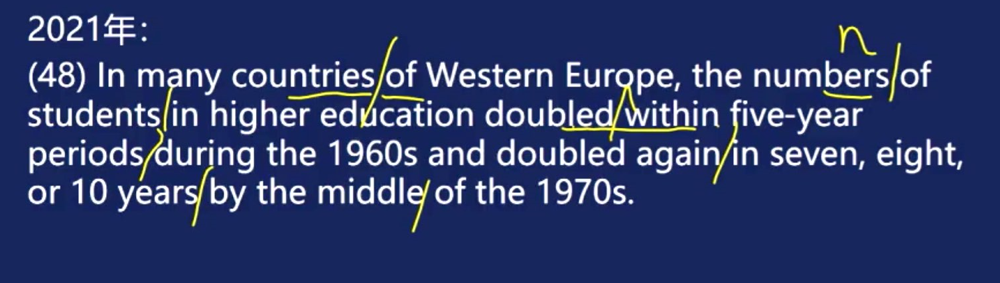

# 翻译

## 方法论：切 译 倒

### 1 切

切什么？

1. 介词

    of, for, in, by, with, at, behind, from, within, during, under, ...

    注意：

    1. 固定词组不动 (allow sb. to do sth, 这个to不切)  
    2. n. 与 介词之间，必切  
    3. v. 与 介词之间，选切

    

2. 从句

    > 这里就不给出各种从句的标志词了...

3. 其他修饰后置的情况

    1. 隐藏的从句引导词（that）

    2. 单纯不要脸的后置或者一些插入语

    3. 后置非谓语 （anyone finished the homework ...）

### 2 译

将切划出来的词组直译出来

### 3 倒

将定语前置，其他不变

## 方法论：5大原则

1. 出现“被”字必然错

    一定将英文的被动语态转化为汉语的常见表述

    1. 补主语（by前置）

    2. 直接去掉"被"

    3. 符合习惯添加一些小词（得以，由，受到，遭到）

2. 理解只求差不多

    不需要将直译过来的句子再转译为能看懂的人话。

3. 它他她等指代词，用本体代替

4. 修饰后置多用"这"

    将宾语提前，并用"这"来描述这个宾语

5. 中文连词补全说