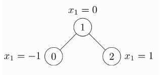

# 传统GNN方法

## GCN: 图卷积神经网络

[【GNN】万字长文带你入门 GCN](https://zhuanlan.zhihu.com/p/120311352)

## PYG: PyTorch Geometric Library

[图神经网络 PyG 入门介绍](https://blog.csdn.net/chumingqian/article/details/139416196)

官方文档：[PyG Documentation](https://pytorch-geometric.readthedocs.io/en/latest/index.html)

### 1 Data

节点和节点之间的边构成了图。所以在 PyG 中，如果你要构建图，那么需要两个要素：节点和边。PyG 提供了`torch_geometric.data.Data` (下面简称Data) 用于构建图，包括 5 个属性，每一个属性都不是必须的，可以为空。

- x: 用于存储每个节点的特征，形状是`[num_nodes, num_node_features]`。

- edge_index: 用于存储节点之间的边，形状是 `[2, num_edges]`。

- pos: 存储节点的坐标，形状是`[num_nodes, num_dimensions]`。

- y: 存储样本标签。如果是每个节点都有标签，那么形状是`[num_nodes, *]`；如果是整张图只有一个标签，那么形状是`[1, *]`。

- edge_attr: 存储边的特征。形状是`[num_edges, num_edge_features]`。

需要注意的的是，在`Data`里包含了样本的 label，这意味和 PyTorch 稍有不同。在PyTorch中，我们重写`Dataset`的`__getitem__()`，根据 index 返回对应的样本和 label。在 PyG 中，我们使用的不是这种写法，而是在`get()`函数中根据 index 返回`torch_geometric.data.Data`类型的数据，在`Data`里包含了数据和 label。

!!! note "Data 例子"
    一个数据创建的例子，一个未加权无向图 ( 未加权指边上没有权值 )，包括 3 个节点和 4 条边。

    

    由于是无向图，因此有 4 条边：(0 -> 1), (1 -> 0), (1 -> 2), (2 -> 1)。每个节点都有自己的特征。上面这个图可以使用`torch_geometric.data.Data`来表示如下：

    ```python linenums="1"
    import torch
    from torch_geometric.data import Data

    edge_index = torch.tensor([[0, 1, 1, 2],
                               [1, 0, 2, 1]], dtype=torch.long)
    x = torch.tensor([[-1], [0], [1]], dtype=torch.float)

    data = Data(x=x, edge_index=edge_index)
    ```

    注意`edge_index`中边的存储方式，有两个`list`，第 1 个`list`是边的起始点，第 2 个`list`是边的目标节点。注意与下面的存储方式的区别。

    ```python linenums="1"
    import torch
    from torch_geometric.data import Data

    edge_index = torch.tensor([[0, 1],
                               [1, 0],
                               [1, 2],
                               [2, 1]], dtype=torch.long)
    x = torch.tensor([[-1], [0], [1]], dtype=torch.float)

    data = Data(x=x, edge_index=edge_index.t().contiguous())
    ```
    这种情况edge_index需要先转置然后使用contiguous()方法。关于contiguous()函数的作用，查看 PyTorch中的[contiguous](https://zhuanlan.zhihu.com/p/64551412)。


!!! tip "Data 总结"
    Data中最基本的 4 个属性是x、edge_index、pos、y，我们一般都需要这 4 个参数。

!!!note "如何查看一个Data对象的属性: [Data](https://pytorch-geometric.readthedocs.io/en/latest/generated/torch_geometric.data.Data.html#torch_geometric.data.Data)"

    ```python linenums="1"
    print(data.keys())
    >>> ['x', 'edge_index']

    print(data['x'])
    >>> tensor([[-1.0],
                [0.0],
                [1.0]])

    for key, item in data:
        print(f'{key} found in data')
    >>> x found in data
    >>> edge_index found in data

    'edge_attr' in data
    >>> False

    data.num_nodes
    >>> 3

    data.num_edges
    >>> 4

    data.num_node_features
    >>> 1

    data.has_isolated_nodes()
    >>> False

    data.has_self_loops()
    >>> False

    data.is_directed()
    >>> False

    # Transfer data object to GPU.
    device = torch.device('cuda')
    data = data.to(device)
    ```


### 2 Dataset/DataLoader/transform

一个包含上述三个函数的例子：
```python linenums="1"
import torch_geometric.transforms as T
from torch_geometric.loader import DataLoader
from torch_geometric.datasets import ShapeNet

dataset = ShapeNet(root='/tmp/ShapeNet', categories=['Airplane'],
                    pre_transform=T.KNNGraph(k=6),
                    transform=T.RandomJitter(0.01))
loader = DataLoader(dataset, batch_size=32, shuffle=True)
```

#### 检查一个Dataset的参数

```python linenums="1"
from torch_geometric.datasets import TUDataset

dataset = TUDataset(root='/tmp/ENZYMES', name='ENZYMES')
>>> ENZYMES(600)

len(dataset)
>>> 600

dataset.num_classes
>>> 6

dataset.num_node_features
>>> 3

data = dataset[0]
>>> Data(edge_index=[2, 168], x=[37, 3], y=[1])  
# 有 168/2 = 84 条无向边，包含 37 个节点，每个节点有 3 个特征，图形只分配给一个类

data.is_undirected() # 是否为无向边
>>> True
```

#### 由`networkx.Graph`对象转换为`pyg.dataset`

