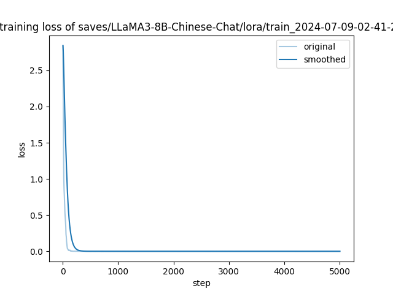
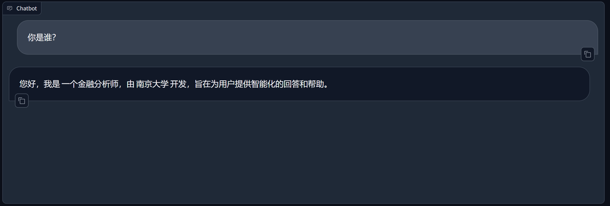
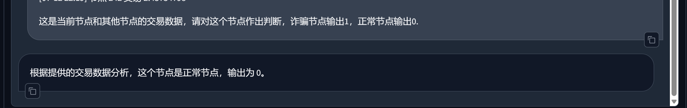

# 【大模型微调】使用 LLaMA-Factory 微调 LLaMA3

🎥 视频教程
- [YouTube](https://youtu.be/Hpc4QQQuLWM)
- [Bilibili](https://www.bilibili.com/video/BV1uw4m1S7Cd/?vd_source=2acabf9b10c0b70274da02f31cf31368)

## 1. 实验环境

### ⚙️ 1.1 机器

**Ubuntu**  

使用镜像： [hiyouga/LLaMA-Factory/LLaMAFactoryV3](https://www.codewithgpu.com/i/hiyouga/LLaMA-Factory/LLaMAFactoryV3)

*问题：无法使用加速器微调，环境有点不完全，但问题不是很大*

```
   - PyTorch 2.0
   - Python 3.10 (Ubuntu 22.04)
   - Cuda 12.1
   - RTX 4090 (24GB) * 1
   - CPU: 12 vCPU Intel(R) Xeon(R) Platinum 8352V CPU @ 2.10GHz
```

建议镜像：[hiyouga/LLaMA-Factory/LLaMA-Factory](https://www.codewithgpu.com/i/hiyouga/LLaMA-Factory/LLaMA-Factory)

### 🦄 1.2 基座模型

基于中文数据训练过的 LLaMA3 8B 模型：  
[shenzhi-wang/Llama3-8B-Chinese-Chat](https://huggingface.co/shenzhi-wang/Llama3-8B-Chinese-Chat)

（可选）配置 hf 国内镜像站：
```bash
pip install -U huggingface_hub
pip install huggingface-cli

export HF_ENDPOINT=https://hf-mirror.com

huggingface-cli download --resume-download shenzhi-wang/Llama3-8B-Chinese-Chat --local-dir /root/autodl-tmp/models/Llama3-8B-Chinese-Chat1
```

下载时间有点长

## 2. LLaMA-Factory 框架

### ⚙️ 2.1 安装

镜像下，不需要再配置环境

### 📂 2.2 准备训练数据

训练数据：

- [diy.json](https://github.com/boobyuuuu/LESSONS/blob/main/docs/DXW/diy.json)

- [identity.json](https://github.com/boobyuuuu/LESSONS/blob/main/docs/DXW/identity.json)

将训练数据放在 LLaMA-Factory/data/diy.json   LLaMA-Factory/data/identity.json  
并且修改数据注册文件：LLaMA-Factory/data/dataset_info.json。修改为如下：[dataset_info.json](https://github.com/boobyuuuu/LESSONS/blob/main/docs/DXW/dataset_info.json)

```json
"diy": {
    "file_name": "diy.json",
    "columns": {
      "prompt": "instruction",
      "query": "input",
      "response": "output"
    }
  },
  "identity": {
    "file_name": "identity.json"
  },
```

### 🌐 2.3 启动 Web UI

```shell
cd LLaMA-Factory
llamafactory-cli webui
```

### 🔧 2.4 微调模型

1. **使用 Web UI 训练**

2. **使用命令行执行**
   > 配置文件位于：[cust/train_llama3_lora_sft.yaml](https://github.com/echonoshy/cgft-llm/tree/master/llama-factory/cust)

构建 cust/train_llama3_lora_sft.yaml
```yaml
cutoff_len: 1024
dataset: fintech,identity
dataset_dir: data
do_train: true
finetuning_type: lora
flash_attn: auto
fp16: true
gradient_accumulation_steps: 8
learning_rate: 0.0002
logging_steps: 5
lora_alpha: 16
lora_dropout: 0
lora_rank: 8
lora_target: q_proj,v_proj
lr_scheduler_type: cosine
max_grad_norm: 1.0
max_samples: 1000
model_name_or_path: /root/autodl-tmp/models/Llama3-8B-Chinese-Chat
num_train_epochs: 10.0
optim: adamw_torch
output_dir: saves/LLaMA3-8B-Chinese-Chat/lora/train_2024-05-25-20-27-47
packing: false
per_device_train_batch_size: 2
plot_loss: true
preprocessing_num_workers: 16
report_to: none
save_steps: 100
stage: sft
template: llama3
use_unsloth: true
warmup_steps: 0
```

命令行执行：
```shell
llamafactory-cli train cust/train_llama3_lora_sft.yaml
```

### 💬 2.5 对话

1. **使用 Web UI 界面进行对话**
    ```shell
    llamafactory-cli webchat cust/train_llama3_lora_sft.yaml
    ```

2. **使用终端进行对话**
    ```shell
    llamafactory-cli chat cust/train_llama3_lora_sft.yaml
    ```

3. **使用 OpenAI API 风格进行对话**
    ```shell
    # 指定多卡和端口
    CUDA_VISIBLE_DEVICES=0,1 API_PORT=8000 
    llamafactory-cli api cust/train_llama3_lora_sft.yaml
    ```

### 🛠️ 2.6 模型合并

将 base model 与训练好的 LoRA Adapter 合并成一个新的模型。  
⚠️ 不要使用量化后的模型或 `quantization_bit` 参数来合并 LoRA 适配器。
```shell
llamafactory-cli export cust/merge_llama3_lora_sft.yaml
```

> 使用合并后的模型进行预测，就不需要再加载 LoRA 适配器。

### 🔢 2.7 模型量化

模型量化（Model Quantization）是一种将模型的参数和计算从高精度（通常是 32 位浮点数，FP32）转换为低精度（如 16 位浮点数，FP16，或者 8 位整数，INT8）的过程。

## 3 实验结果

最近一次微调：

### 3.1 训练参数

训练轮次：5000

训练时间：3h

```
cutoff_len: 4096
dataset: diy,identity
dataset_dir: data
ddp_timeout: 180000000
do_train: true
finetuning_type: lora
flash_attn: auto
fp16: true
gradient_accumulation_steps: 8
include_num_input_tokens_seen: true
learning_rate: 5.0e-05
logging_steps: 5
lora_alpha: 16
lora_dropout: 0
lora_rank: 8
lora_target: all
lr_scheduler_type: cosine
max_grad_norm: 1.0
max_samples: 10000
model_name_or_path: /root/autodl-tmp/model
num_train_epochs: 1000.0
optim: adamw_torch
output_dir: saves/LLaMA3-8B-Chinese-Chat/lora/train_2024-07-09-02-41-29
packing: false
per_device_train_batch_size: 2
plot_loss: true
preprocessing_num_workers: 16
report_to: none
save_steps: 100
stage: sft
template: llama3
warmup_steps: 0
```

### 3.2 LOSS函数



训练在500次以内达到收敛，之后注意训练次数

### 3.3 对话测试

- identity



- example

```
以下是你需要分析的账户节点的交易数据:[05-17 09:01] 节点 22 交易 12.35736465 [05-17 12:04] 节点 215 交易 0.06161094 [05-17 12:10] 节点 26 交易 5.634368 [05-18 04:32] 节点 71 交易 0.09947227 [05-18 15:51] 节点 237 交易 0.0 [05-18 21:11] 节点 164 交易 0.55 [05-19 22:10] 节点 131 交易 0.739 [05-19 23:18] 节点 48 交易 0.0 [05-20 00:55] 节点 148 交易 60.0 [05-22 05:17] 节点 34 交易 0.0 [05-22 18:54] 节点 52 交易 0.5 [05-25 03:17] 节点 13 交易 0.0 [05-25 16:49] 节点 114 交易 2.5 [05-27 03:45] 节点 100 交易 8.99958 [05-28 23:00] 节点 52 交易 0.15 [06-01 00:51] 节点 154 交易 0.2 [06-03 03:08] 节点 67 交易 0.17 [06-05 09:50] 节点 163 交易 0.99913534142808 [06-09 13:38] 节点 75 交易 0.0 [06-09 22:03] 节点 240 交易 0.0 [06-10 21:27] 节点 80 交易 0.5 [06-11 15:38] 节点 196 交易 0.05 [06-11 16:38] 节点 83 交易 2.88108474 [06-12 02:19] 节点 121 交易 0.0 [06-12 04:23] 节点 23 交易 0.042 [06-12 09:17] 节点 87 交易 14.579988 [06-12 23:02] 节点 109 交易 1.0 [06-13 18:49] 节点 239 交易 0.361534754160263 [06-14 05:24] 节点 10 交易 0.0 [06-14 05:41] 节点 210 交易 0.0 [06-16 04:05] 节点 13 交易 0.69202992 [06-16 05:40] 节点 33 交易 0.06530515317026835 [06-17 15:26] 节点 16 交易 0.005 [06-18 09:28] 节点 59 交易 0.5 [06-18 21:31] 节点 37 交易 1.0 [06-19 02:45] 节点 190 交易 0.002 [06-21 19:41] 节点 77 交易 5.0 [06-22 16:41] 节点 190 交易 0.01 [06-22 21:04] 节点 81 交易 5.0 [06-24 09:33] 节点 198 交易 9.6 [06-26 22:30] 节点 27 交易 0.0 [06-28 00:24] 节点 131 交易 0.0 [06-28 04:01] 节点 48 交易 1.0 [06-29 00:44] 节点 146 交易 5.0 [06-29 17:14] 节点 48 交易 0.0 [06-29 21:02] 节点 243 交易 3.0 [06-30 14:46] 节点 92 交易 5.6886497743838e-05 [06-30 19:05] 节点 75 交易 1.2 [07-01 17:56] 节点 150 交易 0.06 [07-02 00:14] 节点 51 交易 0.0 [07-02 00:51] 节点 228 交易 2.0 [07-02 06:04] 节点 94 交易 0.0 [07-02 09:29] 节点 9 交易 0.0 [07-02 15:30] 节点 53 交易 0.08 [07-06 02:31] 节点 37 交易 0.0 [07-06 22:25] 节点 154 交易 0.2 [07-07 22:48] 节点 44 交易 0.0 [07-10 14:13] 节点 167 交易 0.0 [07-11 15:44] 节点 117 交易 0.0 [07-11 23:13] 节点 233 交易 0.0 [07-12 02:53] 节点 135 交易 2.0 [07-12 21:01] 节点 64 交易 9.17 [07-12 22:19] 节点 242 交易 2.43734798

这是当前节点和其他节点的交易数据，请对这个节点作出判断，诈骗节点输出1，正常节点输出0.
```



