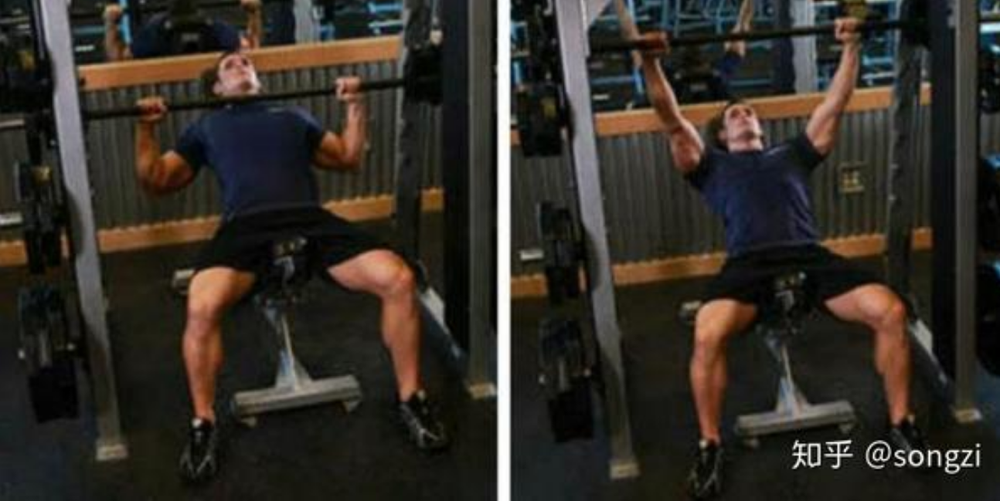
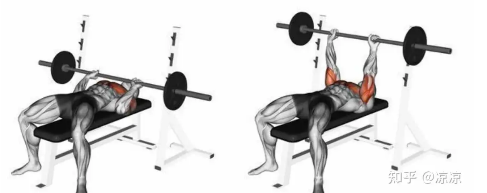
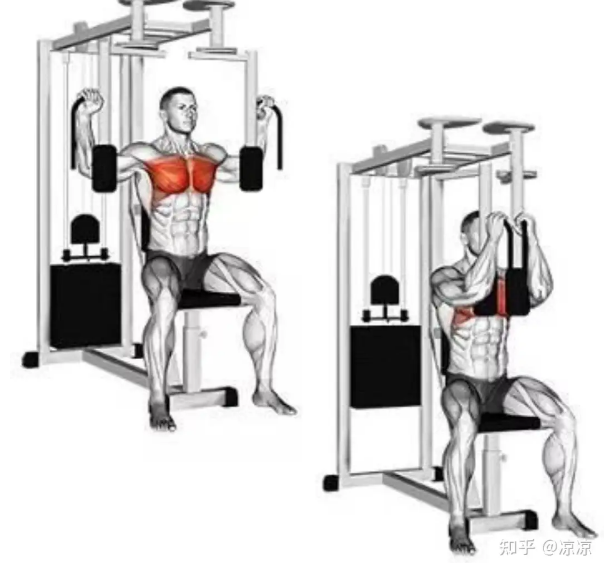
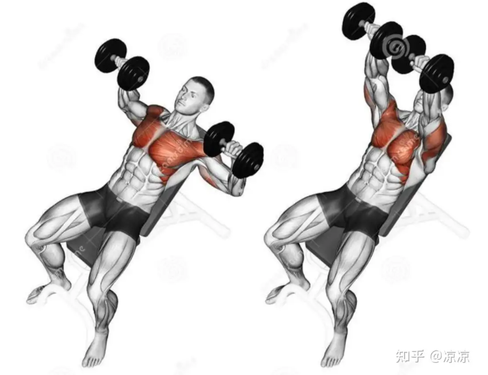
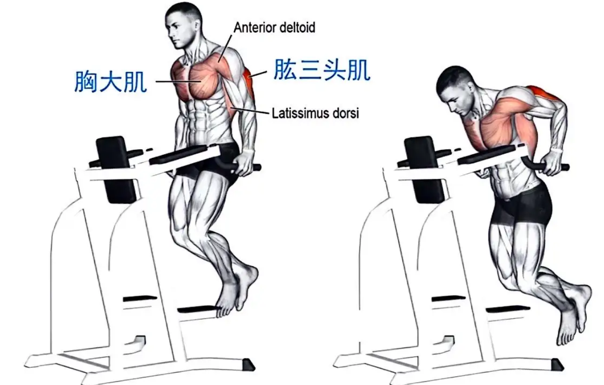
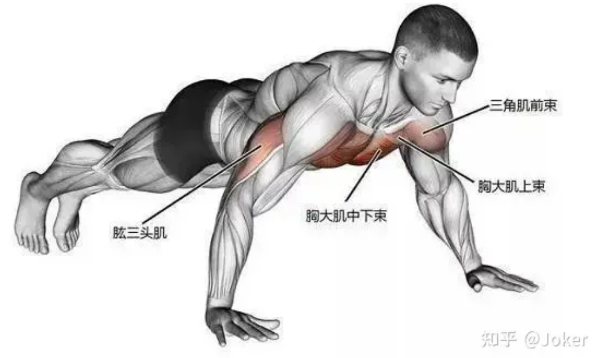
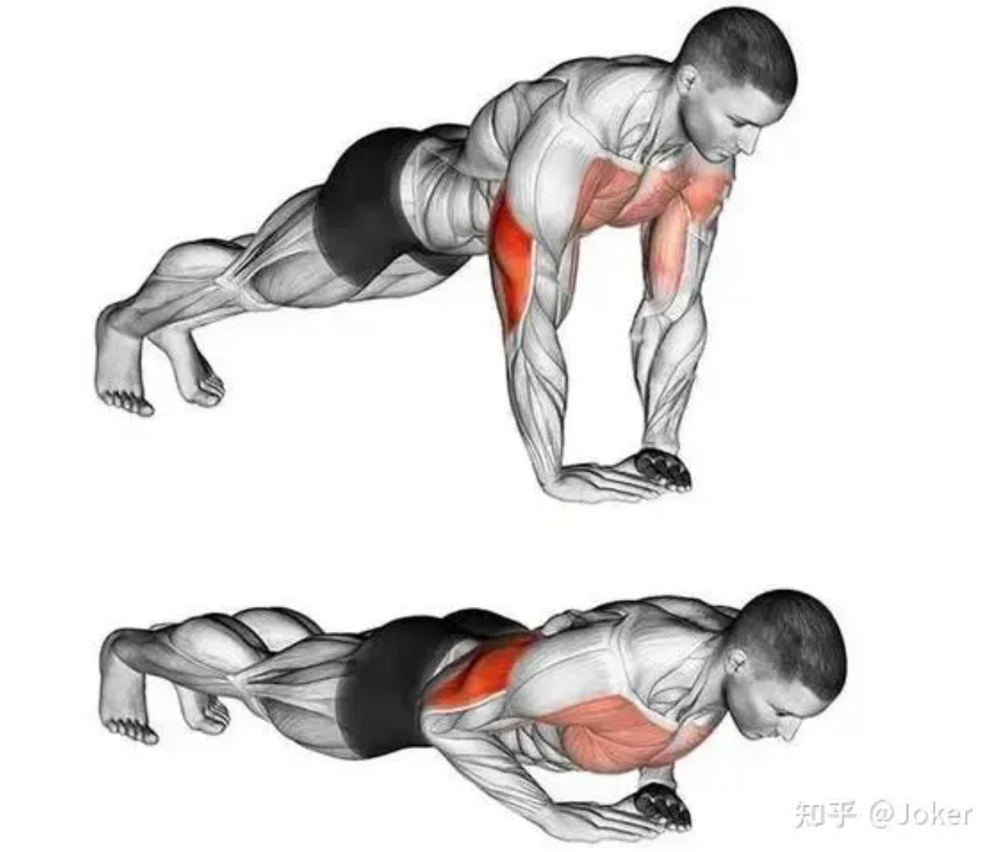

# 胸

拉伸动作：

胸大肌的上、中、下 束： [胸大肌拉伸](https://www.zhihu.com/question/30498661)

动作二，调整手的高度，对不同肌群进行拉伸

{:height="70%" width="70%"}

## 温和式复苏动作

首先是一个训练周期的起手式。也就是说，在你休息了2个星期以上，重启训练时，应该采用的温和复苏动作：

### 1 史密斯 斜坐式

- 效果：胸大肌

- 器械  
    1. 调凳：背部约45°，下座稍向上倾斜
    2. 调位：横杆与胸齐平

- 运动  
    1. 从 0 到 2.5 5.7.5 (kg)，一次加2.5 kg。一组10个，4-5组，两次间歇10s
    2. 横杠向下移动时挺胸，将胸腔完全打开，用胸够杠铃，向上移动时胸也尽量挺开。
    3. 横杠向下移动时挺腰挺胸。

### 2 史密斯 平躺推胸

- 效果：胸大肌

- 器械与动作：同上。

> 注：空杆时调整肩胛位置方向，不要有刺痛感

### 3 坐姿器械夹胸

- 效果：刺激胸肌外侧

- 动作  
    1. 背挺直
    2. 屁股稍微向前坐
    3. 开始夹胸，向前时胸挺出来，向后时胸部保持挺住
    4. 结束时手肘不要放松，保持发力感

### 4 哑铃上斜卧推

- 效果：上胸

- 动作：  
    首先，仰卧在一个斜板上，双手各持一个哑铃，手臂屈曲，将哑铃推至胸部上方。

    然后，慢慢降低哑铃至头部两侧，再将其推回起始位置。这个动作可以有效地锻炼胸肌上部，增加胸肌的轮廓和线条。

### 5 臂屈伸

- 效果：下胸 上肢

- 动作：分为半程与全程。半程要求大量、迅速，全程要求缓慢、延申。
 
### 6 俯卧撑 + 跪姿俯卧撑

注意，不要做成这种：（这是练肱二头肌的）

## 进阶动作

### 1 坐姿器械夹胸

- 效果：刺激胸肌外侧
