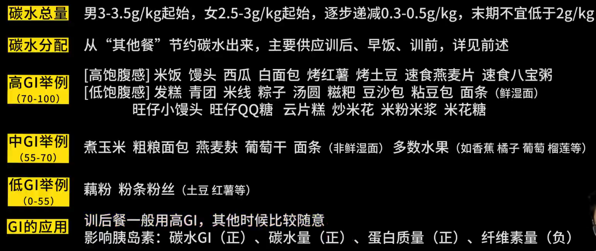

# 健身饮食营养学

参考用书：

[力量训练原理与实践,麦基·斯通](力量训练原理与实践 (麦基·斯通, 威廉姆·A·桑兹, 李山, 迈克·H·斯通) (Z-Library).pdf)

[健身营养全书,克里斯蒂安．冯](健身营养全书 关于力量与肌肉的营养策略 (克里斯蒂安．冯．勒费尔霍尔茨,Christian von Loeffelholz) (Z-Library).pdf)

## 饮食基本原理

1. 减脂需要且只需要有10%-20%的热量缺口；增肌需要且只需要有10%-20%的热量盈余

    

        

            
<strong>公式1 热量平衡公式</strong>

            
热量摄入 = 基础代谢 + 活动消耗

        

    

    对这一条原理的补充解释：

    - 基础代谢一般不会变化，体重增减导致的代谢变化可忽略不计

    - 只要有热量缺口/盈余，就会导致体重的变化

    - 对于减脂来说，若人为制造大于20%热量缺口，导致基础代谢破坏（如基础代谢大量下降），则会导致热量缺口不够，反而体重会不变/增长

2. 热量摄入由碳水、蛋白质、脂肪构成

    

        

            
<strong>公式2 热量摄入公式</strong>

            
热量摄入/kal = 碳*4/kal + 蛋*4/kal + 脂*9/kal

        

    

3. 特定的碳蛋脂比例

    - 对于不同目标：

        {:height="70%" width="70%"}

        我选用第一种碳蛋脂比例

    - 对于不同人群：

        

        

        
<strong>公式3 碳蛋脂比例公式</strong>

        
        

        

        我选用 健身男 方案

4. 碳水的日内分配会影响增肌、减脂效果，而其他两种没有太大影响

5. 结论：在减脂中，饮食比有氧更重要

## 饮食原理应用 - 以减脂为例

### 引起体重变化的因素

三大因素：

1. 体内食物

    迅速

2. 人体脱水吸水

    - **低糖低盐脱水【迅速】 - 导致减肥前期大量脱水减重，但并不是健身健康正确做法**

    - 高碳高盐吸水【迅速】

3. 肌肉量和脂肪量【关注】

    - 肌肉量、脂肪的增减是缓慢的

    - 建议以两周来看体重变化：

        体重变化 = 食物/水分变化 + 脂肪/肌肉变化

        

### 食物来源 + 热量摄入

1. 碳水食物

    - 碳水食物的两个属性：碳水率+分解速度（GI）

        

    - 碳水的食物来源

        

2. 脂肪食物

    {:height="70%" width="70%"}

    注意：
    
    （1）“零脂食物”没有意义，正常饮食便可得到正常的脂肪摄入

    （2）警惕固体脂肪（正确计入脂肪配额），不必追求优质脂肪

    

3. 蛋白质食物

    - 纯粹蛋白质：

        （1）生肉 20%，熟肉30%，卤肉40%，肉干50%

        （2）乳清蛋白粉 70-90%

    - 一般蛋白质食物会附赠更多的脂肪：

        

        鸡蛋白、蛋清液、脱脂牛奶为纯粹蛋白

    - 植物蛋白：相比非植物蛋白，有效蛋白成分会打7-8折

    - 一餐最重要的两个标准：解决蛋白质 + 正确配额碳水

4. 热量摄入计算

    （1）计算热量平衡点热量摄入

    （2）计算减脂期需要热量摄入

    （3）根据碳蛋脂比例计算调整摄入方案

### 日内分配

1. 碳蛋脂日内分配影响训练的理论基础：胰岛素

    - 胰岛素作为合成急速，既能增肌也能增脂

        无力量训练 + 高胰岛素 = 增脂

        有力量训练 + 高胰岛素 = 增肌增脂

    - 应用：力量训练后的训后餐：提高胰岛素；休息日和其他餐：保持胰岛素稳定

    - 不同营养元素（碳蛋脂）对胰岛素刺激能力比较

        {:height="70%" width="70%"}

    - 总结：碳水日内分配会显著影响训练效果

2. 碳水投放时机1：**【训后餐】**

    - 训后餐的营养构成：全天 50% 的碳水（high GI） + 30-50g 蛋白质 + 少脂肪

    - 目的：碳水 - 快速做高胰岛素以增肌；蛋白质 - 弥补训练带来的肌肉损失+增肌

    - 时间：练完半小时内

    - 方式：

        （1）吃正餐（米饭馒头 + 瘦肉 + 蛋白粉）

        （2）速配餐（便携快碳 + 蛋白粉）

    - 便携快碳

        {:height="70%" width="70%"}

3. 碳水投放时间2：早饭

    - 营养构成：全天 30% 的碳水（whatever GI） + 30 蛋白质 + 20g脂肪

    - 目的：提高血糖

    - 方式：

        （1）食堂方案（包子馒头面条 + 2鸡蛋 + 1牛奶）

        （2）冲调方案（燕麦片、玉米粉、藕粉、芝麻糊、米粉 + 蛋白粉）

    - 注意：碳水不能从 油条、煎饼 等 糖油混合物 获取【忌口】

4. 碳水投放时间3：训前餐

    - 营养构成：全天 20% 的碳水（medium/hign GI） + no/low 蛋白质 + no 脂肪

    - 目的：提高血糖支持，增加训练欲望，增加肌肉分解

    - 方式：面包、香蕉、葡萄干、蔗糖饮料（脉动、冰红茶）

        正式组前15-30分钟，到了健身房吃都来得及

    - 血糖 - 饮食 变化图

        {:height="70%" width="70%"}

5. 碳水抑制时间：其他餐

    - 早饭、训前、训后之外的进食，减少/停止碳水进食

    - 构成：蛋白质 + 脂肪 + 蔬菜

    - 目的：保持胰岛素稳定

    - 方式：瘦肉炒菜、足量蔬菜、不吃主食

6. 应用/总结：训练日的分餐方案

    - 午饭前训练

        {:height="70%" width="70%"}

    - 晚饭前后训练

        

    - 注意：蛋白质、脂肪总要要符合热量摄入总量内

7. 休息/有氧日的分餐方案

    {:height="70%" width="70%"}

### 训练计划

1. 力量训练：减脂、增肌都一样，怎么猛怎么练

2. 有氧训练：

    减脂前期，运用饮食调整热量缺口

    随减脂推进，逐渐趋于平衡，有氧训练+不变的饮食规律更为经济

3. 减脂期的有氧：建议休息日单独有氧

    {:height="70%" width="70%"}

### 训练、饮食计划的诞生

对于：175cm 80kg 的减脂计划

不正确：

碳321g 蛋95g 脂107g = 2827kal

修改为：

碳230g 蛋140ag 脂69g = 2117kal

【理论验证】

1. 热量缺口：19%

    完美符合！

2. 碳蛋脂比例：3:0.8878：1 -> 3：1.8261:0.9

    碳水：2.9 g/kg 蛋白质：1.75 g/kg 脂肪：0.8625 g/kg

    完美符合！

3. 碳水的摄取时机适配力量训练（符合分餐方案）

    完成！

