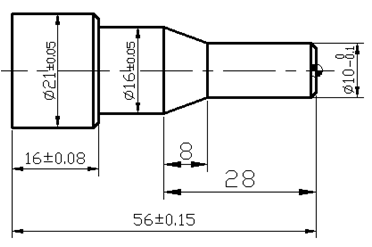

# 金工实习 数控程序

## 实例图



## 材料与刀具

模拟仿真：广州数控GSK928TC

**前置刀架**

    刀具：1号刀位：外圆车刀 (60°)

    2号刀位：外圆车刀 (30°)

    3号刀位：螺纹刀

    4号刀位：切断刀

    换刀点：X100 Z100

**毛胚**：铝 直径 25mm 长 80mm


**选刀**: T01 外圆车刀 T02 切断刀

## 程序

```
N10  M3  X500 T0101；                      设定坐标系（起刀点）
N20  G0 X22 Z1；                     
N30  G98 G01 X20.5 Z0 F100；               
N40  G71  X0 I2 K1 F100 P0050 Q130；       第一次循环          
N60  G01 Z-2 F60；
N80  X10  Z-3;                             
N90  Z-22;
N100  X16  Z-30;                           
N110  Z-42 ；
N120  X19；
N130  X21  Z-43；
N140  Z-60；
N150  G00  X100  Z100 ；                    
N152  G98 G01 Z-60 F100                    第二次循环
N154  G0 X100  
N156  Z100
N160  T0404;                              
N170  M3 S250;                      
N180  G00 X21 Z-60;                    
N190  G98 G01 X1.5 F20;                    切断
N200  G00 X50 Z-60；                       退刀
N210  G00  X100  Z100；          
N220  M05;              
N230  M30;                                 结束
```