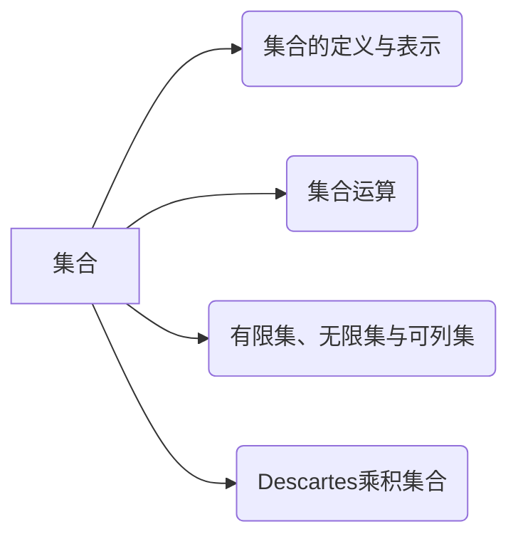
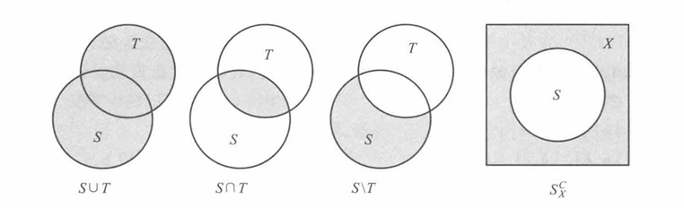
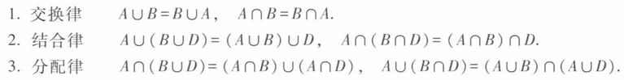
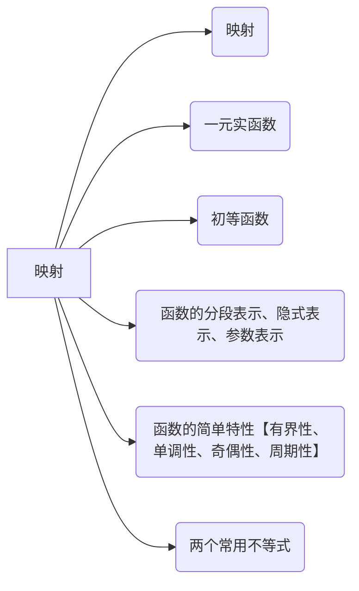

# 集合 映射 函数

## 集合

### 定义

1. 集合  
    集合是指具有某种特定性质的具体的或抽象的对象汇集成的总体

2. 元素  
    这些对象称为集合的元素

3. 空集  
    不包含任何元素的集合

4. 子集 真子集

5. 交，并，差，补

6. 有限集，无限集，可列集  
    若集合S由n个元素组成，n是确定的非负整数，则集合S为有限集。  
    不是有限集的集合成为无限集。  
    一个无限集中的元素可以按照某种规律排成一个序列，则为可列集

7. 笛卡尔(Descartes) 乘积集合  
    设$A$与$B$是两个集合.在集合$A$中任意取一个元素$x$,在集合$B$中任意取一个元素$y$,组成一个有序对$(x,y).$把这样的有序对作为新的元素，它们全体组成的集合称为集合$A$ 与集合 $B$ 的 Descartes 乘积集合，记为 $A\times B$,即

    $$
    A\times B=\mid(\:x\:,y\:)\mid x\in A\:\text{并且}\:y\in B\mid.$$

### 定理

定理 1.1.1 可列个可列集之并也是可列集

定理 1.1.2 有理数集Q是可列集

### 笔记

1. 全体正整数的集合，全体整数的集合，全体有理数的集合，全体实数的集合是我们常用的集合，习惯上分别用字母 $\mathcal{N}^{+},\mathcal{Z},\mathcal{Q}$ 和 $\mathcal{R}$ 来表示

2. 集合的表示：

    - 枚举法

    - 描述法

    $$
    S=\left\{x|x\text{ 具有性质 }P\right|
    $$

3. 两集合相等的判据

    $$
    S=T\quad\Longleftrightarrow\quad S\subset T\quad\text{并且}\quad T\subset S
    $$

4. 集合的运算

    交、并、差、补

    

5. 集合交并运算的性质

    

    > 证明上述性质（利用集合相等的判据）

6. De Morgan 公式

    $$
    ( A\cup B )^{ C}=A^{ C}\cap B^{ C} ,\quad( A\cap B )^{ C}=A^{ C}\cup B^{ C}
    $$

7. 每个无限集必包含可列子集，但是无限集并非就是可列集

    > 证明：整数Z是可列集

## 映射 函数

### 定义

1. 定义 1.2.1 映射 像 原像 定义域 值域  
    设 $X,Y$是两个给定的集合，若按照某种规则 $f$,使得对集合 $X$ 中的每一个元素 x,都可以找到集合$Y$中惟一确定的元素 y与之对应，则称这个对应规则$f$是集合$X$到集合$Y$的一个映射，记为

    $$
    \begin{aligned}f\colon X&\to Y\\x&\mapsto y=f(\:x\:)\:.\end{aligned}
    $$

    其中 y称为在映射$f$之下$x$的像$,x$称为在映射$f$之下 y的一个逆像(也称为原像).集合$X$ 称为映射$f$的定义域，记为$D_{f}$.而在映射$f$之下，$X$ 中元素$x$ 的像 y 的全体称为映射$f$的值域，记为$R_j$ ,即

    $$
    R_{f}=\{\:y\:|\:y\in Y\:\text{并且}\:y=f(\:x\:)\:,\:x\in X\:\}\:.
    $$

2. 定义 1.2.2 单射 满射 双射  
    设 $f$是集合 $X$ 到集合 $Y$的一个映射，若$f$的逆像也具有惟一性，即对$X$ 中的任意两个不同元素 $x_1\neq x_2$,它们的像 $y_1$与 $y_2$也满足 $y_1\neq y_2$,则称 $f$ 为单射；如果映射$f$满足$R_f=Y$,则称$f$为满射；如果映射$f$既是单射，又是满射，则称$f$是双射(又称一一对应).

3. 逆映射 复合映射

4. 一元实函数 自变量 因变量 函数关系  
    若在定义 1.2.1 中特殊地取集合 $X\subset\mathbf{R}$,集合 $Y=\mathbf{R}$,则映射

    $$
    \begin{aligned}
    f{:}X&{\longrightarrow}Y\\
    x&\mapsto y=f(x)
    \end{aligned}
    $$

    称为一元实函数，简称函数.由于函数表示的必是实数集合与实数集合之间的对应关
    系，所以在其映射表示中，第一行是不需要的，只要写成

    $$y=f(\:x\:)\:,x\in X(\:=D_{f})$$

5. 基本初等函数 初等函数  
    由基本初等函数经过有限次四则运算与复合运算所产生的函数称为初等函数。

6. 函数的分段表示 隐式表示 参数表示

7. 函数的有界性、单调性、奇偶性、周期性

8. 算数平均值，几何平均值，调和平均值

### 定理

定理 1.2.1(三角不等式) 对于任意实数$a$和$b$,都有

$$\mid\mid a\mid-\mid b\mid\mid\leqslant\mid a+b\mid\leqslant\mid a\mid+\mid b\mid.$$

定理1.2.2(平均值不等式) 对任意$n$个正数$a_1,a_2,\cdots,a_n$,有

$$\frac{a_1+a_2+\cdots+a_n}n\geqslant\sqrt[n]{a_1a_2\cdots a_n}\geqslant n\Big/\Big(\frac1{a_1}+\frac1{a_2}+\cdots+\frac1{a_n}\Big)\:,$$

等号当且仅当 $a_1,a_2,\cdots,a_n$全部相等时成立.  
这就是说，算术平均值不小于几何平均值，几何平均值不小于调和平均值.

### 笔记

1. 映射要求元素的像必须是唯一的。一个原像对应一个像。

2. 映射不要求原像也具有唯一性

3. 基本初等函数

    $$
    \begin{aligned}
    &常数函数:&& y=c ; \\
    &幂函数:&& y=x^{\alpha}( \alpha\in\mathbf{R} ) ; \\
    &指数函数:&& y=a^{x}( a{>}0 \text{且} a\neq1 ) ; \\
    &对数函数:&& y=\log_{a} x ( a>0 \text{且} a\neq1 ) ; \\
    &三角函数:&& \text{如 }y=\sin x , y=\cos x , y=\tan x , y=\cot x \text{等} ; \\
    &反三角函数:&& \text{如 }y=\arcsin x , y=\arccos x , y=\arctan x \text{等}. 
    \end{aligned}
    $$

4. Dirichlet 函数

    $$D\left(\:x\:\right)=\begin{cases}\:0\:,&\:x\:\text{为无理数}\:,\\\:1\:,&\:x\:\text{为有理数}.\end{cases}$$

    容易判断这是一个周期函数，任何正有理数都是它的周期.因为不存在最小正有
    理数，所以它不可能有最小周期，

5. 三角不等式

6. 均值不等式