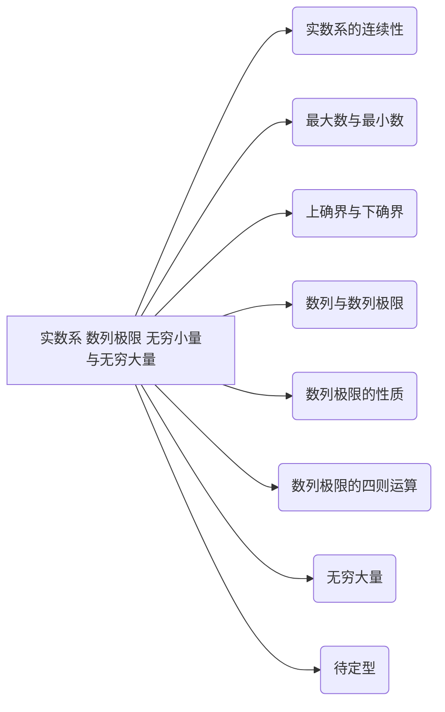

# 数列极限

极限的基础： 实数系的连续性

## 实数系 数列极限 无穷小量与无穷大量

实数系 最大数与最小数 上确界与下确界 数列与数列极限 数列极限的性质 数列极限的四则运算 无穷大量 待定型

### 定义

1. 实数系： 整数点 有理点 实数连续统 数轴  
    实数系/集的定义： 实数集合$R$。$R = \{x|x是有理数或无理数\}$  
    实数连续统： 每个实数都可以在坐标轴上找到自己的对应点，而坐标轴上的每个点又可以通过自己的坐标表示唯一一个实数  
    数轴： 表示实数全体的坐标轴称为数轴

2. 最大数 最小数

    $$
    \begin{gathered}
    \text{设 S 是一个数集}\\
    \exists\xi\in S,\text{使得 }\forall x\in S,\text{有 }x\leq\xi,\text{则称 }\xi\text{ 是数集 }S\text{ 的最大数,记}\xi=\max S;\\    
    {如果}\exists\eta\in S,\text{使得 }\forall x\in S,\text{有 }x\geq\eta,\text{则称 }\eta\text{ 是数集 S 的最小数},\text{记为 }\eta=min S
    \end{gathered}
    $$

3. 上确界 下确界  
    - 有界的定义： $S\text{ 为有界集 }\Leftrightarrow\exists X>0,\text{使得 }\forall x\in S,\text{有}|x|\leqslant X.$
    - 在$S$上界全体组成的集合中，有一个最小数$\beta$，即为其上确界。

4. 数列 数列的通项  
    数列是指按正整数编了号的一串数：

    $$x_1,x_2,\cdots,x_n,\cdots $$

    通常表示成$\{x_n\}$,其中 $x_n$称为该数列的通项.在这个数列中，第一项(即第一个数)是
    $x_1$,第二项是 $x_2,\cdots$,第 $n$ 项是 $x_n$,等等.

5. **_定义 2.2.1 逼近 收敛与发散 极限 邻域 无穷小量_**  
    - 逼近：要计算一个无法直接求得的数值，经常采用逼近的方法。即计算出一列较容易求得，同时精确程度越来越好的数作为它的近似值。
    - 收敛：
    !!! note "定义 2.2.1 收敛与发散"
        设$\{x_n\}$是一给定数列，$a$是一个实常数，如果对于任意给定的$\varepsilon>0$,可
        以找到正整数$N$,使得当$n>N$时，成立

        $$\mid x_n-a\mid<\varepsilon\:,$$

        则称数列$|x_n|$收敛于$a($或$a$是数列$|x_n|$的极限),记为

        $$\lim_{n\to\infty}x_n=a\:,$$

        有时也记为

        $$x_n\to a\:\left(\:n\to\infty\:\right).$$

        如果不存在实数 $a$,使$|x_n|$收敛于 $a$,则称数列$|x_n|$发散.

        ==邻域：$a的\varepsilon邻域 O(a,\varepsilon)=\{x|a-\varepsilon<x<a+\varepsilon\}$==
    !!! note "定义 极限"
        $$
        \lim_{n\to\infty}x_{n}=a \Leftrightarrow \forall \varepsilon>0 , \exists N , \forall n>N ; | x_{n}-a |<\varepsilon.
        $$

        ==极限为0的数列为无穷小量。==

7. 数列极限的四则运算：

    $$
    \begin{aligned}
    &\text{定理 2.2.5 设}\operatorname*{lim}_{n\to\infty}x_{n}=a ,\operatorname*{lim}_{n\to\infty}y_{n}=b , \text{则} \\
    &\left(\begin{array}{cc}1\end{array}\right) \operatorname*{lim}_{n\to\infty}\left(\begin{array}{c}\alpha x_{_n}+\beta y_{_n}\end{array}\right)=\alpha a+\beta b \left(\begin{array}{c}\alpha,\beta\text{ 是常数}\end{array}\right); \\
    &( 2 ) \operatorname*{lim}_{n\to\infty} ( x_{n} y_{n} )= a b ; \\
    &( 3 ) \operatorname*{lim}_{n\to\infty}\left(\frac{x_{n}}{y_{n}}\right)=\frac{a}{b} ( b\neq0 ) .
    \end{aligned}
    $$

8. 无穷大量  
    定义 2.3.1 若对于任意给定的 G>0,可以找到正整数 N,使得当 n>N 时成立

    $$\mid x_{_n}\mid>G\:,$$

    则称数列$\{x_n\}$是无穷大量，记为

    $$\lim_{n\to\infty}x_{n}=\infty\:.$$

    若采用符号表述法，“数列$|x_n|$是无穷大量”可表示为 $:\forall G>0,\exists N,\forall n>N:|x_n|>G.$

9. 待定型  
    若分别以$+\infty,-\infty,\infty,0$ 表示正无穷大量，负无穷大量，无穷大量与无穷小量，则很容易举出例子说明，如$\infty\pm\infty,(+\infty)-(+\infty),(+\infty)+$ $(-\infty),0\cdot\infty,\frac00,\frac\infty\infty$等极限，其结果可以是无穷小量，或非零极限，或无穷大量，也可以没有极限.我们称这种类型的极限为待定型

10. 单调数列  
    定义 2.3.2 如果数列$\left\{x_n\right\}$满足

    $$x_n\leqslant x_{n+1}\:,\quad n=1\:,2\:,3\:,\cdots\:,$$

    则称$\left\{x_n\right\}$为单调增加数列；若进一步满足

    $$x_n<x_{n+1}\:,\quad n=1\:,2\:,3\:,\cdots\:,$$

    则称为严格单调增加数列。

### 定理

!!! note "实数系"
    定理 2.1.1 （确界存在定理——实数系连续定理）非空有上界的数集必有上确界，非空有下界的数集必有下确界。

    定理 2.1.2 非空有界数集的上下确界是唯一的

!!! note "数列极限"
    数列极限的性质：

    - 极限的唯一性： 定理 2.2.1 收敛数列的极限必唯一

    - 数列的有界性： 定理 2.2.2 收敛数列必有界

    - 数列的保序性性： 定理 2.2.3 

    - 数据的夹逼性： 定理 2.2.4

!!! note "无穷大量"
    $$
    \text{定理 2.3.1}\quad\text{设 }x_n\neq0,\text{则}\mid x_n\mid\text{是无穷大量的充分必要条件是}\left\{\frac1{x_n}\right\}\text{是无穷小量}.
    $$

    $$
    \text{定理 2.3.2}\quad\text{设 }x_n是无穷大量,若当 n>N_0时，|y_n|\geqslant\delta>0成立，则\{x_n,y_n\}是无穷大量.
    $$

    $$
    推论\quad\{x_n\}是无穷大量，\lim_n\to\infty y_n=b\neq0,则\left\{x_ny_n\right\}与\{\frac{x_n}{y_n}\}都是无穷大量
    $$

    定理 2.3.3( Stolz 定理) $\quad$ 设$|y_n|$是严格单调增加的正无穷大量，且

    $$\lim_{n\to\infty}\frac{x_n-x_{n-1}}{y_n-y_{n-1}}=a\quad(\:a\:\text{可以为有限量}\:,+\infty\:\text{与}-\infty\:)\:,$$

    则

    $$\lim_{n\to\infty}\frac{x_n}{y_n}=a.$$

### 笔记

1. 证明某数集没有最大数、最小数，没有上确界、下确界的方法： 反证法

    !!! note "反证法 最大数"
        例 2.1.2 证明集合 $B=\{x|0\leqslant x<1\}$没有最大数

        证 用反证法.假设集合$B$有最大数，记为$\beta$.由$\beta\in[0,1)$,可知$\beta^\prime=\frac{1+\beta}2\in[0,1)$
        但是$\beta^\prime{>}\beta$,这就与 $\beta$ 是集合 $B$ 的最大数发生矛盾.所以集合 $B$ 没有最大数

2. 定义法求数列的极限

    !!! note "定义发求数列的极限 几个典型极限"

        证明：

        $$\lim_{n\to\infty}q^n(0<|q|<1)=0$$

        由极限的定义：对任意给定的 $\varepsilon>0$,要找正整数 $N$,便得当 $n>N$ 时 ,成立

        $$\mid q^n-0\mid=\mid q\mid^n<\varepsilon\:,$$

        对上式两边取对数，即得 $n>\frac{\lg\varepsilon}{\lg|q|}.$于是 $N$ 只要取大于$\frac{\lg\varepsilon}{\lg|q|}$的任意正整数即可.为保证$N$ 为正整数，可取 $N=\max\left\{\left[\frac{\lg\varepsilon}{\lg|q|}\right],1\right\}$,则当 $n>N$ 时，成立

        $$\mid q^{n}-0\mid=\mid q\mid^{n}<\mid q\mid^{\frac{1}{\mid q\mid q\mid}}=\varepsilon.$$

        因此$\lim_n\to\infty q^n=0$,即$|q^n|$是无穷小量.

        ---

        例 2.2.3 设 $a>1$,证明：$\lim_n\to\infty\sqrt[n]{a}=1.$

        证 令$\sqrt[n]{a}=1+y_n,y_n>0$ $(n=1,2,3,\cdots)$,应用二项式定理 ,

        $$a=\left(\begin{array}{c}1+y_n\end{array}\right)^n=1+ny_n+\frac{n\left(\begin{array}{c}n-1\end{array}\right)}{2}y_n^2+\cdots+y_n^n>1+ny_n\:,$$

        便得到

        $$\left|\sqrt[n]{a}-1\right|=|y_{_n}|<\frac{a-1}{n}.$$

        于是，对于任意给定的 $\varepsilon>0$,取 $N=\left[\frac{a-1}\varepsilon\right]$,当 $n>N$ 时，成立

        $$\left|\sqrt[n]{a}-1\right|<\frac{a-1}{n}<\varepsilon.$$

        因此$\lim_n\to\infty\sqrt[n]{a}=1.$

        ---

        例2.2.4 证明:$\lim_{n\to\infty}\sqrt[n]{n}=1$

        证 令$\sqrt [ n] {n}= 1+ y_n, y_n> 0$ $( n= 2, 3, \cdots )$ ,应用二项式定理得

        $$n=\left(\begin{array}{c}1+y_n\end{array}\right)^n=1+ny_n+\frac{n\left(\begin{array}{c}n-1\end{array}\right)}{2}y_n^2+\cdots+y_n^n>1+\frac{n\left(\begin{array}{c}n-1\end{array}\right)}{2}y_n^2\:,$$

        即得到

        $$\left|\sqrt[n]{n}-1\right|=|y_n|<\sqrt{\frac{2}{n}}.$$

        于是，对于任意给定的 $\varepsilon>0$,取 $N=\left[\frac2{\varepsilon^{2}}\right]$,当 $n>N$ 时，成立

        $$\left|\sqrt[n]{n}-1\right|<\sqrt{\frac{2}{n}}<\varepsilon.$$

        因此$\lim_n\to\infty\sqrt[n]{n}=1.$

        类似地可证：$\lim_{n\to\infty}\sqrt[n]{n^k}=1\quad( k\in\mathbf{N}^+ )$

3. 夹逼法求数列的极限

4. 求数列极限的方法（总结）

## 数列的收敛准则 实数系的5大基本定理

单调有界数列的收敛定理

### 定义

### 定理

### 笔记

