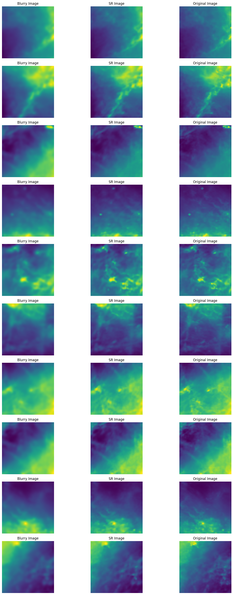
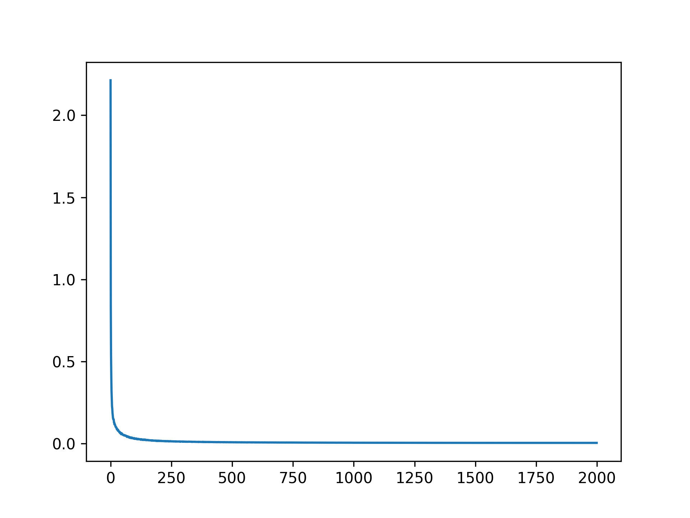
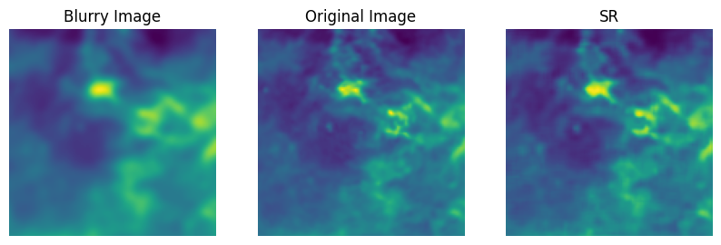
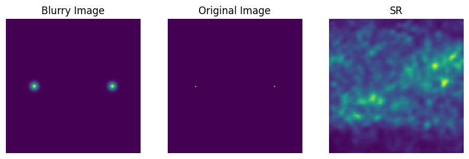

# VAE

## 网络结构

### 网络代码

```python linenums="1"
# 这个文件建立了VAE的结构
import torch; torch.manual_seed(0)
import torch.nn as nn
import torch.nn.functional as F

class Encoder(nn.Module):
    def __init__(self, latent_dim):
        super(Encoder, self).__init__()
        self.conv1 = nn.Conv2d(1, 4, kernel_size=3, stride=2, padding=1)
        self.conv2 = nn.Conv2d(4, 16, kernel_size=3, stride=2, padding=1)
        self.conv3 = nn.Conv2d(16, 64, kernel_size=3, stride=2, padding=1)
        self.fc_mu = nn.Linear(64 * 16 * 16, latent_dim) 
        self.fc_logvar = nn.Linear(64 * 16 * 16, latent_dim) 

    def forward(self, x):
        x = F.relu(self.conv1(x))
        x = F.relu(self.conv2(x))
        x = F.relu(self.conv3(x))
        x = x.view(x.size(0), -1)
        mu = self.fc_mu(x)
        logvar = self.fc_logvar(x)
        return mu, logvar

class Decoder(nn.Module):
    def __init__(self, latent_dim):
        super(Decoder, self).__init__()
        self.fc = nn.Linear(latent_dim, 64 * 16 * 16)
        self.conv3 = nn.ConvTranspose2d(64, 16, kernel_size=4, stride=2, padding=1, output_padding=0)
        self.conv2 = nn.ConvTranspose2d(16, 4, kernel_size=4, stride=2, padding=1, output_padding=0)
        self.conv1 = nn.ConvTranspose2d(4, 1, kernel_size=4, stride=2, padding=1, output_padding=0)

    def forward(self, x):
        x = self.fc(x)
        x = x.view(x.size(0), 64, 16, 16)
        x = F.relu(self.conv3(x))
        x = F.relu(self.conv2(x))
        x = torch.sigmoid(self.conv1(x))
        return x

class VAE(nn.Module):
    def __init__(self, latent_dim):
        super(VAE, self).__init__()
        self.encoder = Encoder(latent_dim)
        self.decoder = Decoder(latent_dim)
        
    def reparameterize(self, mu, logvar):
        std = torch.exp(0.5 * logvar)
        eps = torch.randn_like(std)
        z = mu + eps * std
        return z
    
    def forward(self, x):
        mu, logvar = self.encoder(x)
        z = self.reparameterize(mu, logvar)
        x_recon = self.decoder(z)
        return x_recon, mu, logvar
```

### 网络类型

该网络是一个变分自动编码器（VAE），包括一个编码器（Encoder）和一个解码器（Decoder）。编码器将输入数据编码为潜在空间中的分布参数（均值和方差），解码器将潜在空间的样本映射回原始数据空间。

### 输入尺寸

输入尺寸为 [batch_size, 1, 128, 128]，其中 batch_size 表示每个批次的样本数量，1 表示输入通道数，256 表示输入图像的高度和宽度。

### 节点变换

1.编码器（Encoder）部分：

- 3 个卷积层（conv1 到 conv3），每个卷积层之后都跟着 ReLU 激活函数。
- 在第 3 个卷积层之后，通过 view 操作将输出展平为一维张量。
- 最后通过两个全连接层（fc_mu 和 fc_logvar）将展平后的特征向量映射为潜在空间的均值和方差参数。

2.解码器（Decoder）部分：

- 一个全连接层将潜在变量映射回特征向量。
- 通过 view 操作将特征向量重塑为四维张量。
- 通过三个转置卷积层进行逐步上采样，每个转置卷积层之后都跟着 ReLU 激活函数。
- 最后一个转置卷积层之后使用 Sigmoid 激活函数将输出限制在 [0, 1] 范围内。

### 节点参数


1.编码器（Encoder）部分：

- conv1: 输入通道数为 1，输出通道数为 4，卷积核大小为 3x3。
- conv2: 输入通道数为 4，输出通道数为 16，卷积核大小为 3x3。
- conv3: 输入通道数为 16，输出通道数为 64，卷积核大小为 3x3。
- fc_mu 和 fc_logvar: 输入特征数量为 64 * 16 * 16（最后一层卷积的输出大小），输出特征数量为潜在变量维度 latent_dim。

2.解码器（Decoder）部分：

- fc: 输入特征数量为潜在变量维度 latent_dim，输出特征数量为 64 * 16 * 16。
- conv3 到 conv1: 转置卷积层的参数和编码器相对应，只是通道数相反，卷积核大小为 16x16。

### 激活函数

1. 编码器（Encoder）部分：使用 ReLU 激活函数。

2. 解码器（Decoder）部分：除了最后一层使用了 Sigmoid 激活函数外，其他层都使用 ReLU 激活函数。


## 实验结果

### 实验一

- 训练参数：

    ```python linenums="1"
    NUM_TO_LEARN = 4000 # 训练集放入图片对数量
    EPOCHS = 2000 # 参数1
    BATCH_SIZE = 128 # 参数2
    LATENTDIM = 64 # 参数3
    LR_MAX = 5e-4 # 学习率
    LR_MIN = 5e-6
    ```

    训练时间：08/22/2024 12:55:51 PM - 08/22/2024 14:18:19 AM

- 可视化结果

    实验结果：(测试集)

    

    <center>*EXP_2_1 实验结果（测试集）*</center>

    {:height="70%" width="70%"}

- 数值化测试

    1. 测试图片1（选自其他天区）

    

    ```
    SR 与 ORI
    SSIM: 0.9451709019980806
    MSE: 0.0002245419891551137


    BLU 与 ORI
    SSIM: 0.8823990758521709
    MSE: 0.004230735823512077
    ```

    2. 测试图片2（选自模拟数据）

    

    ```
    SR 与 ORI
    SSIM: 0.657674582640935
    MSE: 0.00018778764933813363


    BLU 与 ORI
    SSIM: 0.9659345911422037
    MSE: 0.0015007186448201537
    ```

    3. 测试结果

        对于其他天区的同类型图片，超分效果很好。但是对于其他类型图片，没有超分效果。 - 需要提高鲁棒性


## 改进方向

### 从复杂度

#### 方向1 单独增加更多的卷积层

### 从过拟合

LOSS函数

### 从神经网络多样性

引入残差块
