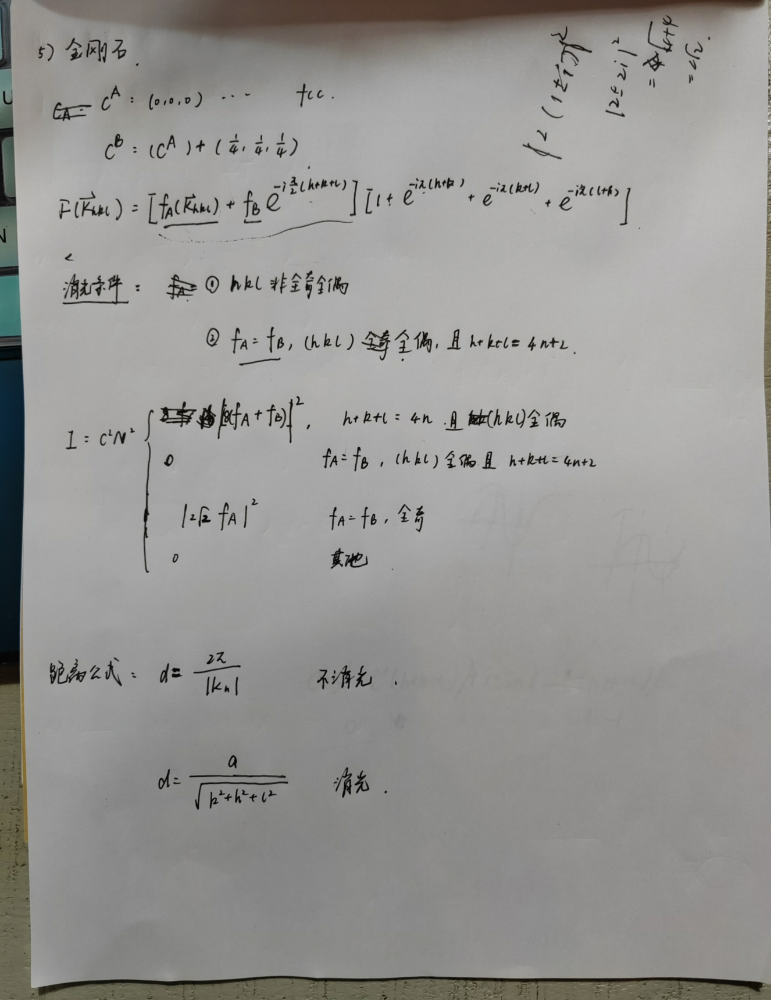
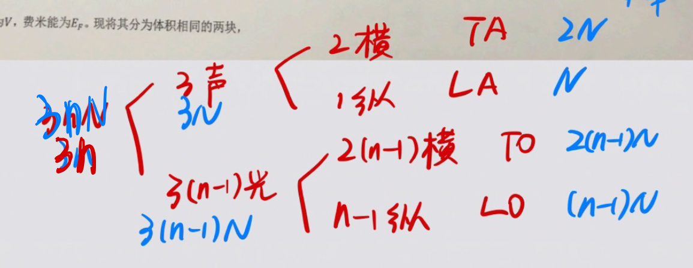
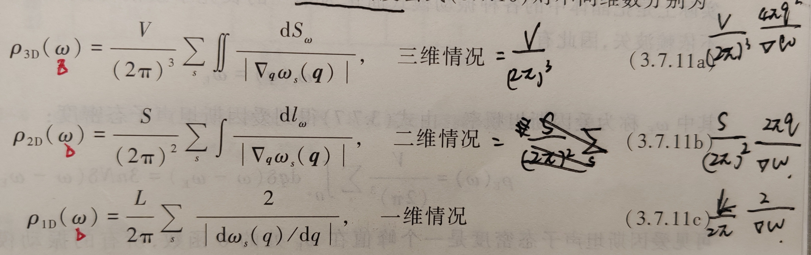
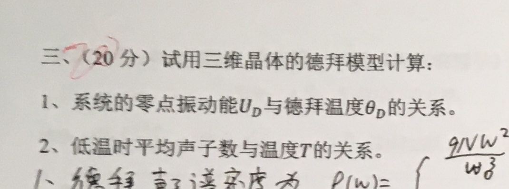
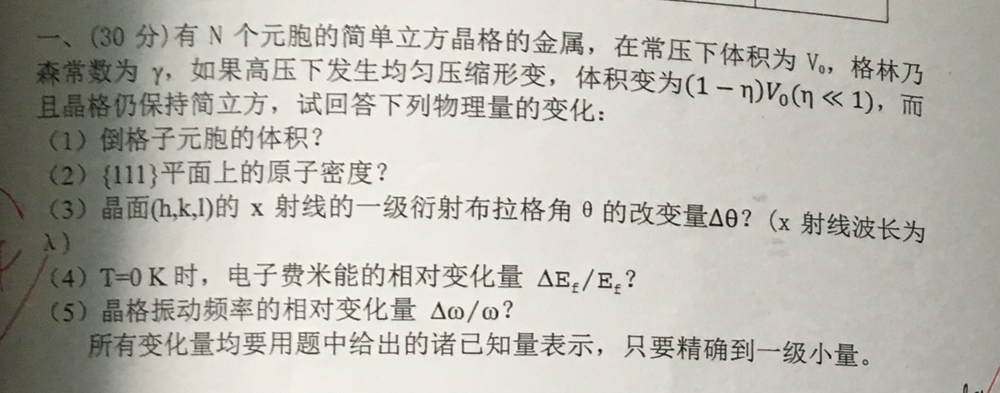
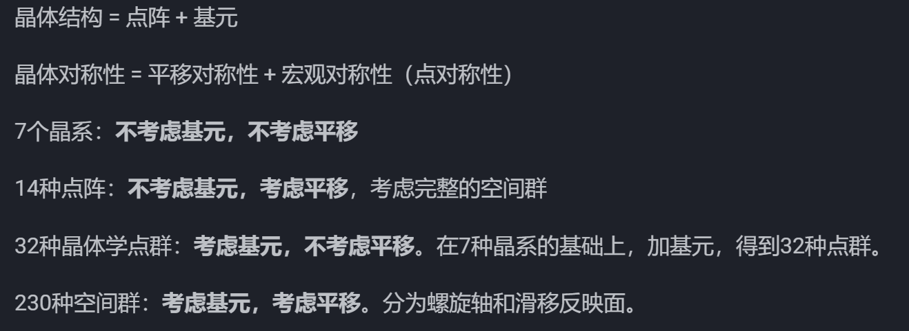
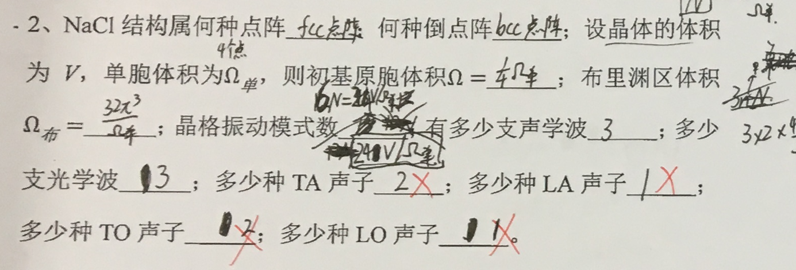
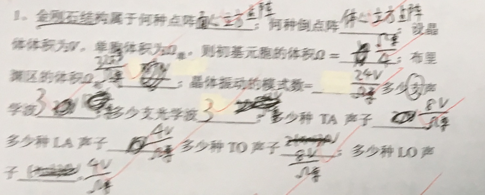
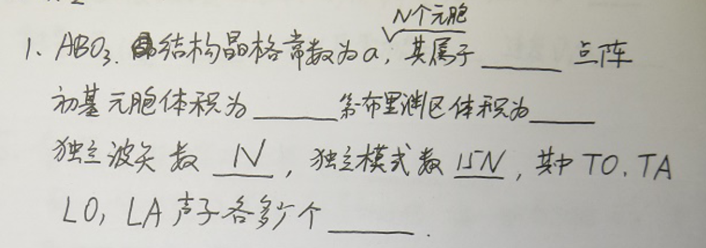

# 考试篇

## 第一章

### 基本知识点

1.基本概念

2.3大立方晶系的矩阵表示

3.证明：三个截距 $r_\mu, s_\mu, t_mu$ 必定为有理数

证明：$h_1 h_2 h_3$ 必定为互质的整数

4.倒点阵的倒基矢  
计算：   
sc/bcc/fcc的倒空间基矢  
证明：  
bcc的倒点阵是fcc点阵

5.倒点阵的性质

6.晶面指数和米勒指数的转换（fcc点阵）

7.沿[a b c]方向旋转 $\theta$并进行反演的变换矩阵是多少？

8.为什么没有5次对称轴？

9.对称性的组合限制  
（1）两个二次轴之间的夹角只能是 $30\degree,45\degree,60\degree,90\degree$  
（2）不可能多于两条六次轴，也不可能有一条六次轴和一条四次轴。  

10.立方晶体具有的对称素；正四边形具有的对称素

11.具有4次轴的晶体的介电常数张量满足的关系:四次轴沿x/y/z方向  
具有3次轴的晶体的介电常数张量满足的关系  
具有六角对称的晶体的介电常数张量

12.7大晶系与14大点阵。每个晶系的加点种类，由对称性/作图讲述不能加点的原因

13.Laue方程推导，Bragg方程推导

14.点扩散模型、单原子模型、多原子模型。  
散射波振幅  
衍射强度  
原子散射因子  
几何结构因子

最终：只记散射波振幅  衍射强度  几何结构因子，进行简化得到三个模型。

15.消光条件，距离公式的问题

### 题型

1 如何取初基元胞，作点阵

例题：习题1.1. 注意：1 初基元胞一定可以通过平移填满整个空间； 2 初基元胞内一定只有一个结点

2 点阵建系计算

金刚石建系：习题1.4

hcp结构建系

3 米勒指数和晶面指数的代换

例题1；fcc点阵晶面指数（h1h2h3）和米勒指数（hkl）的代换关系

例题2： 六角晶系米勒指数为（hkl）的晶面族间距

4 点阵的基矢和初基元胞矩阵表示

例题1：底心正交点阵的基矢和初基元胞

例题2：地心单斜、六角晶系、面心正交、体心四方

例题2：14种点阵

5 7种晶系对应的加点点阵

例题：4方晶系没有低心四方、面心四方

立方晶系没有低心立方

六角晶系只有简单六角

三角晶系只有P

6 立方晶系、四面体对称晶体、六角晶系、四方晶系的介电常数

立方晶体：由x\z轴的2次对称轴得到对角阵，由[1 1 1]的3次对称轴得到标量阵

四面体：同上

六角晶系：由x\z轴的2次对称轴得到对角阵，由z轴6次对称轴得到两个相等

四方晶系：由x\z轴的2次对称轴得到对角阵，由x轴的4次轴得到两个相等

7 由晶体结构(1)求原子几何结构因子，(2)写出衍射强度，(3)讨论消光条件

步骤1：确定有几种原子

步骤2：写出每种原子的晶格位置

步骤3：代入公式写出几何结构因子

接下来带公式讨论即可

sc

bcc

fcc

NaCl

金刚石

...

8 拓展问题

## 第二章

### 基本知识点

1.概念：电离能 亲合能 负电性 

金属件 共价键 离子键 范德华键 氢键

2.5个Na原子密堆量子效应排斥能

3.结合能的计算：离子晶体/范德华晶体

4.马德隆常数

### 题型

1 简答题：

为什么金属具有高导电性、导热性、延展性、金属光泽： 金属结合的电子共有化

为什么共价晶体多是绝缘体/半导体，为什么金刚石硬度高： 因为共价键是一种强键，成键电子很难被激发而游离。

石墨导电性、润滑性的原理： 每一层内的pz电子形成金属键，层与层之间靠范德瓦尔斯键。面内的电子可自由移动决定了导电性，范德瓦尔斯键弱易于解理决定润滑性。

2 题型1 求马格隆常数

- NACL

- 一维离子晶体

2 题型1：$r_0，B$ （宏观性质） 和 $n, b$  （微观性质） ，给出其中两个求另外两个

方法：

- 确定晶体结构求马格隆常数 
- 写出吸引势和排斥势 
- 写出内能函数
- 关系式1 得到排斥势具体表达式；  
关系式2 得到 B
- 写出结合能

方法：结合能定义式

## 第三章

### 一维晶格振动

### 三维晶格振动

### 比热容和热膨胀

题型： 德拜模型的计算

### *长光学波*

### *局域模*

### 离子晶体中的长光学波

### 题型

### 0 由晶体结构判断：模式数、光学支、声学支

各种模式数：

独立的波矢数： N（元胞数）

波矢密度：V/(2 PI)^k

色散关系数：kn(元胞自由度数)

### 1 求色散关系

### 2 已知色散关系（德拜模型，A模型，给定关系-考虑所有作用 + 考虑电子库伦势）求声子态密度

由色散关系求声子态密度：

### 3 根据声子态密度求热容、热振动能、熵

### 局域模，阻尼系数与频率关系

### G 常数 自由能

## 简答题

1.自然界的固体按照对称性可以分为几大类，其特点

65~W6D}8VU0I4M2.png>)

2.初基元胞的基矢主要描述的是正点阵的什么对称性

平移对称性

3.实验上为什么采用扩大的单胞而不是初基元胞来描述晶体的对称性

单胞体现的是晶体的宏观对称性，宏观对称性也体现在晶体的宏观物理性质上，会影响X射线衍射的图样，所以采用单胞更易于分析晶体结构。

4.晶体的倒点阵在实验上如何直接测定

X射线衍射。通过测量晶体衍射条纹的位置和强度，可以确定晶体的倒点阵结构和晶格常数。

补充：逆格子空间是描述晶体在动量空间中的周期性结构的一种方法，而倒点阵则是逆格子空间中的晶格结构。

5.晶体的7种晶系和14种点阵是通过什么对称性进行分类得到的

6.9种晶体结构与基本概念

