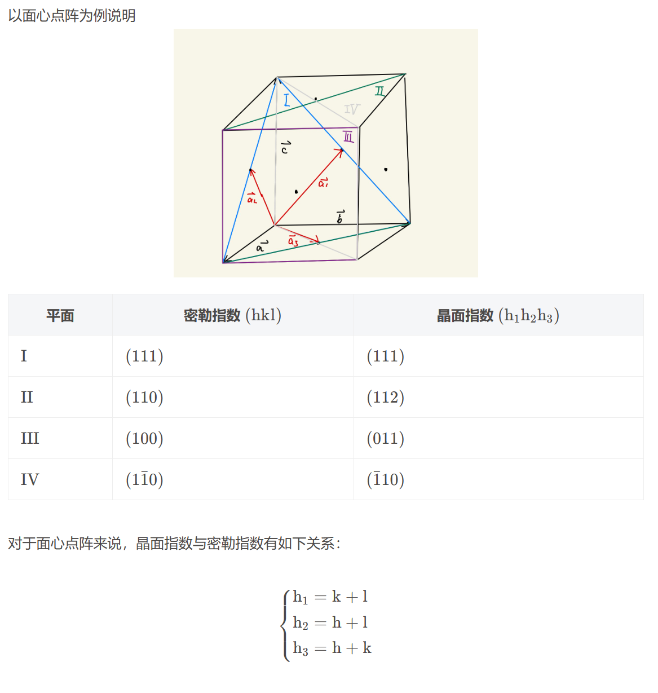

# 第一章：晶体的结构及其对称性

凝聚态物质：液体、固体、软物质

固体：晶体、非晶体、准晶体

晶体：组成粒子周期性排列，**对称性破缺**

非晶体：具有高度对称性，物理性质各向同性

准晶体：拥有晶体不允许的部分旋转对称性（5次旋转对称）

## 1.1 晶格及其平移对称性

### 1 晶体结构与基元

- 8大晶体结构

关注：

>每个原子是否等价？  
>配位数：晶格中一个原子最近邻原子的个数。  
>密堆度：假设原子是紧密接触的，计算填充的体积和晶胞体积的比值，记为密堆度 $f$。  
>在自然界中的实例

（1）简单立方

>等价；  
>配位数 6；  
>密堆度 $f=\frac{\pi}{6}$;  
>自然界中极少。钋 的 $\alpha$ 相，对切变不稳定;

（2）体心立方 **bcc**

>等价；  
>配位数 8；  
>密堆度 $f=\frac{\sqrt{3}\pi}{8}$;  
>很多，例如：碱金属，难熔金属

（3）密堆：面心立方 **fcc**

第二层和第一层中心重合

>等价；  
>配位数 12；  
>密堆度 $f=\frac{\sqrt{2}\pi}{6}$  
>贵金属;  

（4）密堆：六角密堆 **hcp**

第二层和第一层中心错开

>不等价；  
>配位数 12；  
>密堆度 $f=\frac{\sqrt{2}\pi}{6}$  
>二价金属，碱土金属

（5）金刚石结构

注意：原子1和2不等价，连线朝向不一样

>不等价；两个面心立方嵌套；  
>配位数 4；  
>密堆度 $f=\frac{\sqrt{3}\pi}{16}$  
>$\mathrm{C},\mathrm{Si}$

（6）化合物：NaCl 结构

>不等价；两个面心立方嵌套；  
>配位数 6;  
>碱金属卤化物；

（7）化合物：CsCl 结构

>不等价；两个简单立方嵌套；  
>配位数 8；
>TiBr;TiI;NH4Cl

（8）化合物：ZnS 结构

金刚石结构立方中间换一种原子

>不等价；两个面心立方嵌套；
>配位数 4

（9）化合物：$ABO_3$

>不等价；存在氧八面体，由五个简单立方嵌套；
>铁电晶体，高温超导体稀土铜氧化物

*问题*  
> 如何测量晶体结构？

- 简单晶格和复式晶格

简单晶格：所有原子都等价

> sc,bcc,fcc

复式晶格：存在多类等价原子

> hcp，金刚石，$\mathrm{NaCl}$，$\mathrm{CsCl}$，$\mathrm{ZnS}$，$\mathrm{ABO_3}$

- 基元

基元 指晶体中最小的重复结构。简单晶格的基元为1个原子。复式晶格的基元为多个原子。**对基元不断进行平移操作可以得到整个晶体。**

### 2 结点和点阵

结点：将基元抽象成一个几何点。

点阵：基元抽象成一个几何点，那么晶体结构抽象为一个几何结构。

晶体结构：抽象为点阵+基元

$$
\langle\text{点阵}\rangle+\langle\text{基元}\rangle=\langle\text{晶体结构}\rangle 
$$

### 3 基矢和元胞

为了数学化，建立坐标系，引入基矢；元胞：表示一个空间体积

- 基矢

一些后面用到的数学表达式:

表示结点位置：

$$
\boldsymbol{R}_{l}=\mathrm{l}_{1}\vec{\mathrm{a}}_{1}+\mathrm{l}_{2}\vec{\mathrm{a}}_{2}+\mathrm{l}_{3}\vec{\mathrm{a}}_{3}=\sum_{1}^{3}\mathrm{l}_{\mathrm{i}}\boldsymbol{a}_{\mathrm{i}}
$$

点阵密度：

$$
\rho(\boldsymbol{r})=\sum_l \delta(\boldsymbol{r}-\boldsymbol{R}_l)
$$

平移对称性：

$$
\rho(\boldsymbol{r}+\boldsymbol{R}_l)=\rho(\boldsymbol{r})
$$

- 元胞：初基元胞 单胞 W-S元胞

（1）初基元胞

初基元胞是空间中的一个能够通过 $R_l$ 平移无交叠的填充整个空间的体积。

**保证初基元胞的这个空间体积里面只有一个结点**

可以取三个基矢构成的平行六面体作为初基元胞(有无穷多个)

对三个简单立方/简单晶格的基矢/初基元胞选择的一般 **约定** :

将基矢用直角坐标基底表示，并写成矩阵形式，有：

$$
\begin{pmatrix}
\boldsymbol{a}_1 \\ \boldsymbol{a}_2 \\ \boldsymbol{a}_3
\end{pmatrix}
= \boldsymbol{A} \begin{pmatrix}
\boldsymbol{i} \\ \boldsymbol{j} \\ \boldsymbol{k}
\end{pmatrix}
$$

于是可以用矩阵 $\boldsymbol{A}$ 来表示一个元胞。

sc

$$
\boldsymbol{A} = a \begin{pmatrix} 1 & 0 & 0\\ 0 & 1 & 0 \\ 0 & 0 & 1 \end{pmatrix}
$$

$$
\Omega = \vec{a}_1\cdot(\vec{a}_2\times\vec{a}_3)=\det A = a^3
$$

bcc

$$
A = \frac{a}{2} \begin{pmatrix} -1 & 1 & 1\\ 1 & -1 & 1 \\ 1 & 1 & -1 \end{pmatrix}
$$

$$
\Omega = \frac{1}{2}a^3
$$

fcc

$$
A = \frac{a}{2} \begin{pmatrix} 0 & 1 & 1\\ 1 & 0 & 1 \\ 1 & 1 & 0 \end{pmatrix}
$$

$$
\Omega = \frac{1}{4}a^3
$$

（2）单胞

sc/bcc/fcc的相同立方体就是单胞。能反映对称性

做X射线时运用（需要旋转对称性）

>易错点  
>**sc /bcc /fcc 单胞里面有 1 /2 /4 个结点。**

（3）W-S元胞

中心结点与最近邻和次近邻原子连线的中垂面构成了W-S元胞的边界。这是一种唯一的初基元胞，也能反映体系旋转对称性。

做能带计算的理论时运用

## 1.2 晶列和晶面

### 1 晶列

点阵的节点分布在一组平行直线上，这组平行直线构成一族 **晶列**，并且指向唯一方向：**晶向**。

### 2 晶相

用这样一组互质的晶向指标 $[ l_1l_2l_3 ]$来表示方向：

$$
\boldsymbol{R}_{l}=\mathrm{l}_{1}\vec{\mathrm{a}}_{1}+\mathrm{l}_{2}\vec{\mathrm{a}}_{2}+\mathrm{l}_{3}\vec{\mathrm{a}}_{3}=\sum_{1}^{3}\mathrm{l}_{\mathrm{i}}\boldsymbol{a}_{\mathrm{i}}
$$

$\langle l_1l_2l_3 \rangle$ 表示一组对称的方向（8个）

### 3 晶面

同一晶面系的诸平面平行且等间距，包含所有结点无遗

选取原点、基矢，建立空间直角坐标系后，可以表示这个晶面。选取三个截距的倒数作为晶面指数：

$$
(h_1 h_2 h_3) = \left(\frac{1}{r_{\mu}},\frac{1}{s_{\mu}},\frac{1}{t_{\mu}}\right)
$$

>证明：三个截距 $r_\mu, s_\mu, t_mu$ 必定为有理数

>证明：$h_1 h_2 h_3$ 必定为互质的整数

### 4 晶面指数和米勒指数

晶面指数

选取初基元胞基矢 $\boldsymbol{a}_1,\boldsymbol{a}_2,\boldsymbol{a}_3$ 得到的指数 $(h_1h_2h_3)$

密勒指数（Miller index）

选取单胞基矢 $\boldsymbol{a},\boldsymbol{b},\boldsymbol{c}$ 得到的指数 $(hkl)$

>计算：晶面指数和米勒指数的代换关系

## 1.3 倒点阵

### 0 守恒问题

空间平移不变 - 动量守恒

时间平移不变 - 能量守恒

空间旋转不变 - 角动量守恒

空间反演不变 - 宇称守恒

时间反演不变 - 电荷守恒

粒子置换不变 - 玻色子/费米子问题

### 1 倒点阵与正点阵转换关系

相对于正晶格描述的坐标空间，倒晶格描述的是动量空间（波矢空间）；  
正空间具有晶格周期性，倒空间具有波矢k的周期性；  
正晶格具有空间平移不变性，倒空间具有动量守恒。

（1）正空间基矢：$\boldsymbol{a}_1$ $\boldsymbol{a}_2$ $\boldsymbol{a}_3$ 

倒空间基矢：

$$
b_{1}=2\pi\frac{a_{2}\times a_{3}}{a_{1}\cdot(a_{2}\times a_{3})}
$$

$$
b_{2}=2\pi\frac{a_{3}\times a_{1}}{a_{1}\cdot(a_{2}\times a_{3})}
$$

$$
b_{3}=2\pi\frac{a_{1}\times a_{2}}{a_{1}\cdot(a_{2}\times a_{3})}
$$

（2）正空间格子结点：

$$
\boldsymbol{R}_{l}=\mathrm{l}_{1}\vec{\mathrm{a}}_{1}+\mathrm{l}_{2}\vec{\mathrm{a}}_{2}+\mathrm{l}_{3}\vec{\mathrm{a}}_{3}=\sum_{1}^{3}\mathrm{l}_{\mathrm{i}}\boldsymbol{a}_{\mathrm{i}}
$$

倒空间倒格子结点：

$$
\boldsymbol{k}_h = h_1\boldsymbol{b}_1 + h_2\boldsymbol{b}_2+ h_3\boldsymbol{b}_3
$$

（3）正点阵格子密度：

$$
\rho(r)=\sum_{l}\delta(r-R_{l})
$$

倒点阵格子密度为：

$$
\rho(\boldsymbol{k})  = \sum_{h} \delta(\boldsymbol{k}-\boldsymbol{k}_h)
$$

（4）$\boldsymbol{b}_1,\boldsymbol{b}_2,\boldsymbol{b}_3$ 围成的平行六面体称为倒空间中的初基元胞。

>>计算：  
sc/bcc/fcc的倒空间基矢  
证明：  
bcc的倒点阵是fcc点阵

### 2 倒点阵的性质

- 正交: $a_i\cdot b_j=2\pi\delta_{ij}$ , $K_h\cdot R_l=2\pi(h_1l_1+h_2l_2+h_3l_3)=2\pi n$

- 体积：$\Omega^{*}=\frac{\left(2\pi\right)^{3}}{\Omega}$

- 正点阵是它本身倒点阵的倒点阵

- 倒点阵的W-S元胞被称为第一布里渊区

- 倒点阵保留正点阵的所有宏观对称性

- 对于晶面族 $(h_1h_2h_3)$，则倒格矢 $\boldsymbol{K}_h = h_1\boldsymbol{b}_1 + h_2\boldsymbol{b}_2 + h_3\boldsymbol{b}_3$ 与该晶面正交

- 晶面间距 $d_{h_1h_2h_3}=e_n\cdot\frac1{h_1}a_1=\frac{K_h\cdot a_1}{h_1\mid K_h\mid}=\frac{2\pi}{\mid K_h\mid}$

- 正点阵周期函数变换：

$$
\begin{aligned}V( r )&=V( r + R_{_l} )\\V( r )&=\sum_{h}V( K_{_h} ) \mathrm{e}^{\mathrm{i}K_{_h}\cdot r}\end{aligned}
$$

$$
V(\boldsymbol{K}_h)=\frac{1}{\Omega}\int_{\Omega}V(\boldsymbol{r}) \mathrm{e}^{-\mathrm{i}\boldsymbol{K}_h\cdot\boldsymbol{r}}\mathrm{d}\boldsymbol{r}
$$

>>问题：  
bcc点阵的第一布里渊区是什么？ - fcc的W-S元胞，是一个正12面体
fcc点阵的第一布里渊区是什么？ - bcc的W-S元胞，是一个14面体

>>易错：  
晶体当中一个高指数的面，和一个低指数的面，谁的结点数目密度大？  
指数越低，晶面间距越大，但是空间点的密度是一样的，所以结点数目越多，结点密度越大。 - 密排面是低指数面 （1_3 1:19:00）

>>易错：**若采用单胞基矢，倒点阵的格点数目会怎么变化？**   
不能从体积说明倒格点变小了。  

选取单胞基矢计算得到的倒点阵是扩大了的。因为扩大了的晶胞的周期性条件改变了。以体心立方为例：

平移整数个初基元胞基矢，所有原子都能相互重合。  
平移整数个单胞基矢，$A,B$ 类原子不能相互重合。

因此选取单胞作为基矢对周期性的要求降低了，对应的倒点阵会扩大。需要从单胞倒格点中筛选出初基元胞倒格点。

## 1.4 晶体的宏观对称性

(1:40:00)

如果根据宏观对称性再加上平移对称性对晶体进行分类：

只从点阵来分类，不考虑平移，只考虑旋转对称性 - 7类晶体·

再考虑平移对称性 - 14类

考虑晶体结构，加上基元的对称性 - 32种

把平移加上去 - 230种

### 1 概念描述

- 对称操作

- 对称素

### 2 平移限制

### 3 sc\bcc\fcc的对称素和对称操作

### 4 物理性质

## 1.5 晶体点阵和结构的分类

### 1 7个晶系和14种点阵

### 2 32种点群和230种空间群

## 1.6 晶体X射线衍射

### 1 Bragg公式

Bragg公式：

$$
2d\sin\theta=n\lambda
$$

1. 反射角受限制
2. n表示衍射级数
3. $\lambda >> d$ 不能应用（可见光）

### 2 Laue 方程

X射线衍射是X射线与晶体原子核外电子的相互作用。

物理假设：

- 1.给出散射势：散射势正比于晶体电子密度 \(V(r)=cn(r)\)
- 2.给出光子态：入射和散射光子都是平面波态 \(\psi_k(r)=\mathrm{e}^{\mathrm{i}k\cdot r}\)
- 3.给出电子密度：假设电子分布有周期性

\[
n\left(\boldsymbol{r}\right)=\frac1V\sum_hn\left(\boldsymbol{K}_h\right)\mathrm{e}^{\mathrm{i}\boldsymbol{K}_h\cdot\boldsymbol{r}}\\n\left(\boldsymbol{K}_h\right)=\int_Vn\left(\boldsymbol{r}\right)\mathrm{e}^{-\mathrm{i}\boldsymbol{K}_h\cdot\boldsymbol{r}}\mathrm{d}\boldsymbol{r}
\]

- 4.化简：晶体体积足够大

结果：

- 0.电子密度傅里叶展开

$$
n\left(\boldsymbol{r}\right)=\frac{1}{V}\sum_{h}n\left(\boldsymbol{K}_{h}\right)\mathrm{e}^{\mathrm{i}\boldsymbol{K}_{h}\cdot\boldsymbol{r}}
$$

$$
n\left(\boldsymbol{K}_{h}\right)=\int_{V}n\left(\boldsymbol{r}\right)\mathrm{e}^{-\mathrm{i}\boldsymbol{K}_{h}\cdot\boldsymbol{r}}\mathrm{d}\boldsymbol{r}
$$

- 1.由散射势和光子态，散射波振幅：

$$
u_{k\to k^{\prime}}=c\int n\left(r\right)\mathrm{e}^{\mathrm{i}\left(k-k^{\prime}\right)\cdot r}\mathrm{d}r
$$

- 2.带入电子密度,晶体体积足够大：

散射波振幅

$$
u_{k\to k^{\prime}}=c\sum_hn\left(\boldsymbol{K}_h\right)\boldsymbol{\delta}_{\boldsymbol{k}^{\prime}-\boldsymbol{k},\boldsymbol{K}_h}
$$

衍射强度

$$
\boldsymbol{I}_{k\to k^{\prime}}=\left|\begin{array}{c}u_{k\to k^{\prime}}\end{array}\right|^2=c^2\left|\begin{array}{c}n\left(\boldsymbol{K}_h\right)\end{array}\right|^2
$$

衍射条件

$$
k^{\prime}-k=K_h
$$

**由Laue方程推导Bragg方程**

几个容易忘记的关系：

$$
\begin{cases}k^{\prime}=k^2+K_h\\\\k^{\prime2}=k^2&\end{cases}
$$

$$
K_h=nK_{h^{\prime}},d=\frac{2\pi}{\mid K_{h^{\prime}}\mid},\frac{2\pi}{\mid k\mid}=\lambda 
$$

### 3 原子散射因子

衍射强度的决定式：

$$
n\left(\boldsymbol{K}_h\right)=\int_Vn\left(\boldsymbol{r}\right)\mathrm{e}^{-\mathrm{i}\boldsymbol{K}_h\cdot\boldsymbol{r}}\mathrm{d}\boldsymbol{r}
$$

#### 方法1：点散射模型

假设：求 $n(r)$ :设每一个结点上有一个电子 

$$
n\left(r\right)=\sum_l\delta\left(r-R_l\right)
$$

结果：（运用结论 $K_h\cdot R_l=2\pi n$ ）

$$
u_{k\to k^{\prime}}=\sum_hcN\delta_{k^{\prime}-k,K_h}=\begin{cases}cN,&\text{当 }k^{\prime}-k=K_h\text{ 时}\\0,&\text{其他情况}\end{cases}
$$

讨论：N为晶体中的元胞数。

#### 方法2：原子散射银子

假设：求 $n(r)$ :设每一个结点上有一个原子

$$
n\left(r\right)=\sum_l\rho\left(r-R_l\right)
$$

结果：

$$
\begin{aligned}u_{\boldsymbol{k}\to\boldsymbol{k}^{\prime}}=\sum_hcNf(\boldsymbol{K}_h)\delta_{\boldsymbol{k}^{\prime}-\boldsymbol{k},\boldsymbol{K}_h}=\begin{cases}cNf(\boldsymbol{K}_h),&\text{当 }\boldsymbol{k}^{\prime}-\boldsymbol{k}=\boldsymbol{K}_h\\\\0,&\text{其他情况}\end{cases}\end{aligned}
$$

讨论：

- 1.原子散射因子

$$
f(\boldsymbol{K}_h)=\int\rho(\boldsymbol{r})\operatorname{e}^{-\mathrm{i}\boldsymbol{K}_h\cdot\boldsymbol{r}}\mathrm{d}\boldsymbol{r}
$$

物理意义：用一个原子代替电子，所有电子都进行散射。散射银子就是原子内所有散射幅和一个电子散射辐之比

- 2.求氢原子的原子散射因子： $\rho(r)=(\pi a_\mathrm{B}^3)^{-1}\exp(-2r/a_\mathrm{B})$

### 4 结合结构因子

最一般的情况，每一个元胞不止一个原子（复式晶格）

电子密度:

$$
n(r)=\sum_l\sum_i\rho_i(r-R_l-r_i)
$$

结果：

$$
n(K_{h})= NF(K_{h})
$$

几何结构因子：

$$
F( K_h ) = \sum_if_i( K_h ) \mathrm{e}^{-\mathrm{i}\boldsymbol{K}_h\cdot\boldsymbol{r}_i}
$$

散射辐：

$$
u_{k\to k^{\prime}}=\sum_hcNF(K_h)\delta_{k^{\prime}-k,K_h}=\begin{cases}cNF(K_h),&\text{当}k^{\prime}-k=K_h\text{时}\\0,&\text{其他情况}\end{cases}
$$

应用-几何结构因子：

$$
F( K_{h} ) = \sum_{i}f_{i}( K_{h} ) \mathrm{e}^{-2\pi\mathrm{i}( h_{1}x_{i1}+h_{2}x_{i2}+h_{3}x_{i3})}
$$

### 5 消光条件

消光：几何结构因子为0导致衍射消失

**CsCl的例子**

**Na的例子**

**遗留问题：满足消光条件时，晶面间距计算不能用间距公式**

### 6 三种重要的X射线晶体学分析方法

由Laue方程： $k^{\prime}-k=K_{h}$， 需要得到足够多的衍射斑

1 Laue劳厄 法

非单色光，固定入射方向，改变波长。单晶样品（不破坏晶体）

应用：单晶定向

2 旋转晶体法

单色光，固定入射方向，旋转晶体。单晶样品

应用：结构分析

3 粉末法

粉碎晶体。单色光

**讨论：**

1.假设-射入射出的波都是平面波，但其实射出的波是混合波。（会有更复杂的理论）

2.假设-衍射势为严格散射势，但是原子会有震动。

3.采用光子衍射-其实可以用电子、中子做

**问题：fcc两套晶格表示方式(h1,h2,h3)和(l,j,k)的转换关系，以及距离公式和消光条件讨论。（什么时候距离公式不对，正确的是什么）**

