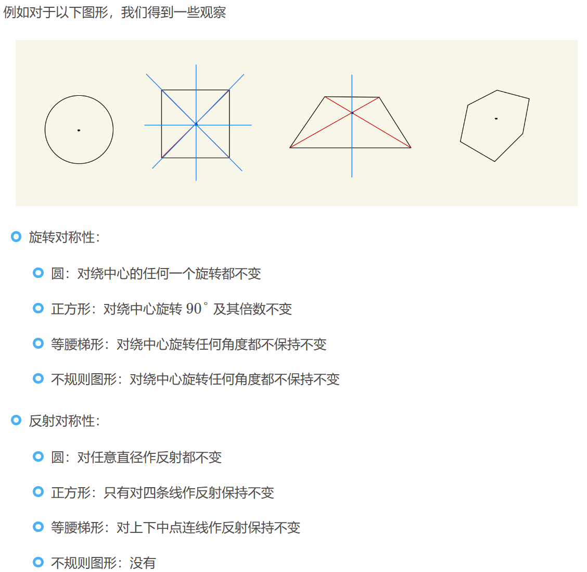
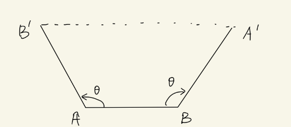
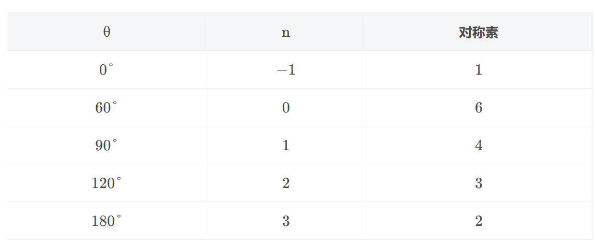
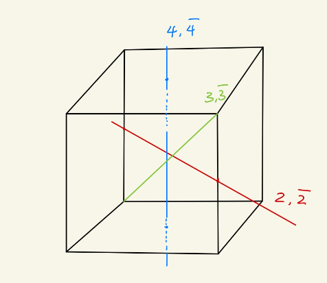
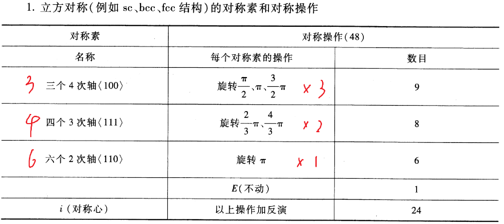
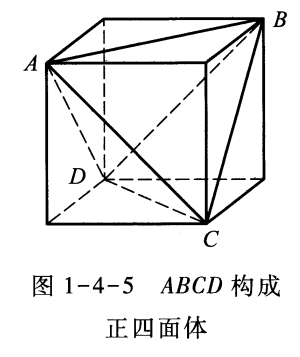
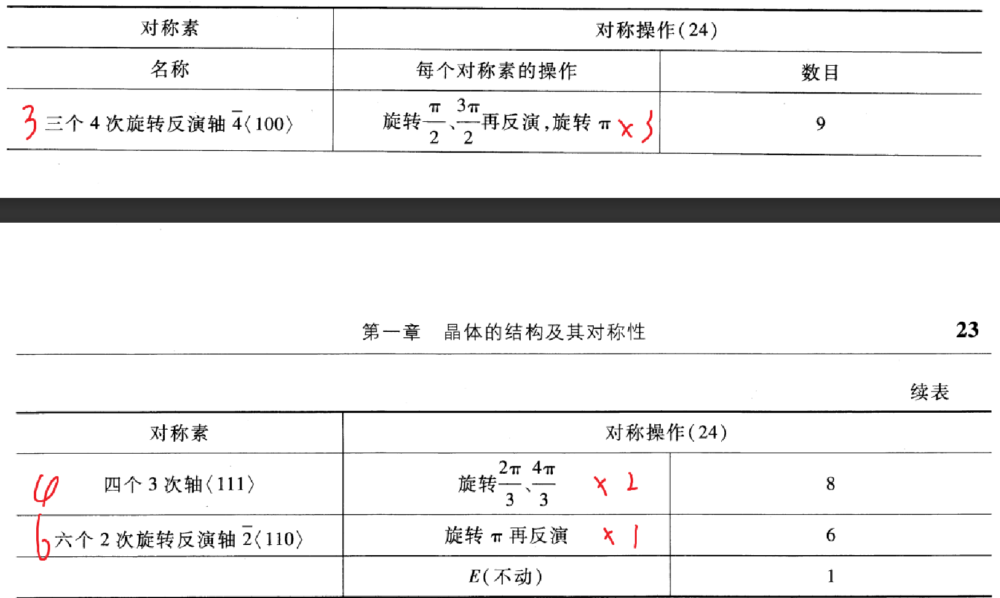
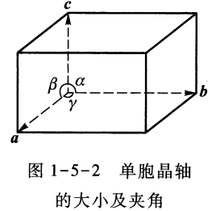
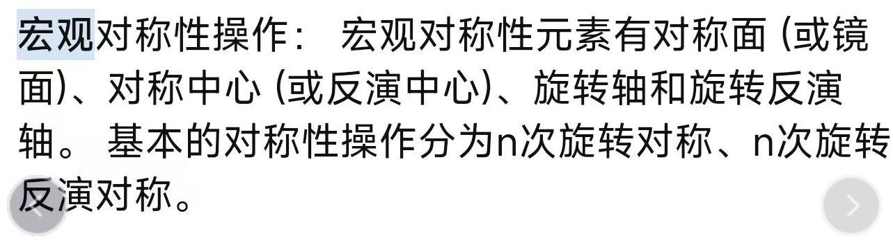
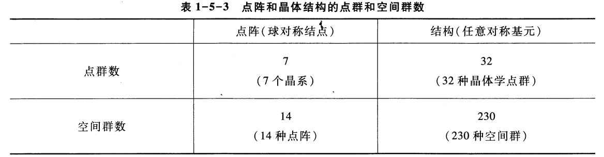

# 第一章（2）：晶体的对称性

晶体的对称性：

- 平移对称性 - 所有的点都发生了移动

- 点对称性（旋转对称性，中心反演对称性） - 至少有一个点没有移动

晶体的宏观对称性不仅体现在结构的几何外观上，也体现在**宏观物理性质**上。比如方解石的折射率在平行和垂直方向上的区别，产生双折射，是因为晶体各向异性导致介电张量的异性。

## 1.4 晶体的宏观对称性

(1:40:00)

如果根据宏观对称性再加上平移对称性对晶体进行分类：

只从点阵来分类，不考虑平移，只考虑旋转对称性 - 7类晶体·

再考虑平移对称性 - 14类

考虑晶体结构，加上基元的对称性 - 32种

把平移加上去 - 230种

### 1 宏观对称性/点对称性 的描述

#### 对称操作

晶体在某个正交变换下保持不变，则这个操作就是 **对称操作**。

*理解旋转对称和反演（反射）对称*

#### 对称操作的数学表述

（1）点对称变换

对于一个任意点 $(x,y,z)$ 有：

$$
\begin{pmatrix}
x \\ y \\ z
\end{pmatrix}
\longrightarrow
\begin{pmatrix}
x' \\ y' \\ z'
\end{pmatrix}
=(a_{ij})_{3\times3}
\begin{pmatrix}
x \\ y \\ z
\end{pmatrix}
$$

记做：

$$
x' =Ax
$$

A为变换矩阵

（2）A是正交矩阵，点对称变换是正交变换： $A^TA = 1$

>证明: $A^TA = 1$

（3）基本点对称操作的对称矩阵

旋转

>> 例如绕 $x$ 轴旋转 $\theta$。

$$
A =
\begin{pmatrix}
1 & 0 & 0\\
0 & \cos\theta & -\sin\theta\\
0 & \sin\theta & \cos\theta\\
\end{pmatrix}
$$

>> 沿[1 1 1]方向旋转 $2 \pi /3$

$$
A =
\begin{pmatrix}
0 & 1 & 0\\
0 & 0 & 1\\
1 & 0 & 0\\
\end{pmatrix}
$$

> 绕y/z轴旋转$\theta$的变换矩阵

> 沿[a b c]方向旋转 $\theta$

反演

>> 对原点进行反演。

$$
A =
\begin{pmatrix}
-1 & 0 & 0\\
0 & -1 & 0\\
0 & 0 & -1\\
\end{pmatrix}
$$

> 对任意一点反演的变换矩阵

旋转反演（对平面的镜像对称）

>> 例如绕 $x$ 轴旋转 $\theta$，再对原点进行反演。

$$
A =
\begin{pmatrix}
-1 & 0 & 0\\
0 & -\cos\theta & \sin\theta\\
0 & -\sin\theta & -\cos\theta\\
\end{pmatrix}
$$

#### 对称素

指的是一个物体借以进行对称操作的一根轴、一个点或一个平面。

如果一个物体绕某轴旋转 $\frac{2\pi}{n}$ 及其倍数保持不变，则称这个轴为 $n$ 次（重）轴，记为 $n$。

如果一个物体对某点反演不变，称为这点为 反演中心，记为 $i$。

如果一个物体绕某轴旋转 $\frac{2\pi}{n}$后，再反演，最终不变。称为 $n$ 重（次）旋转反演轴（象转轴），记为 $\bar{n}$。

>> 对于 $\bar{2}$，可以得到其等价于对一个 平面 的镜面操作 $m$。

### 2 平移对称性对点对称性的限制

晶体的平移对称性的影响下，只能具有特定的宏观对称性（点对称），不然无法填满空间

#### 晶体能拥有的对称素

考虑对结点 $A,B$ 做如图旋转操作，得到 $A',B'$。容易得到：$AB//A'B'$。这两个晶列代表同一晶向，具有相同周期，有：

$$
\overline{B'A'} = n \overline{AB}
$$

根据几何关系：

> 解释：为什么没有5次对称性

#### 独立对称素

$1,2,3,4,6,\bar{1}(i),\bar{2},\bar{3},\bar{4},\bar{6}$ ，共10种

$\bar{1}=i​$

$\bar{2} = m$

$\bar{3} = 3+i$

$\bar{4}$ 是独立的。

$\bar{6}=3+m$

独立的对称素： $1,2,3,4,6,i,m,\bar{4}$

#### 对称性的组合限制

（1）两个二次轴之间的夹角只能是 $30\degree,45\degree,60\degree,90\degree$ 。

（2）不可能多于两条六次轴，也不可能有一条六次轴和一条四次轴。

### 3 数一个几何体的对称素和对称操作数

#### 立方对称晶体：

#### 正四面体（看作正方体内切割）

### 4 对晶体宏观物理性质的影响

晶体的宏观对称性与晶胞的对称性有关联。其宏观对称性不仅反映在规则的几何外观上，更体现在晶体的 宏观物理性质 上。

以介电常数为例：

各向同性材料的电磁性质方程为：

$$
\boldsymbol{D} = \varepsilon_0\varepsilon_r\boldsymbol{E}
$$

各向异性材料的电磁性质方程：

$$
D_\alpha = \sum_{\beta} \varepsilon_{\alpha\beta} E_{\beta}
$$

其中 $(\varepsilon_{\alpha\beta})$ 为介电张量。

对于晶体原本的对称操作A，介电张量在操作前后应该不变：

$$
\varepsilon^{\prime}=A\varepsilon A^{\mathrm{T}}=\varepsilon 
$$

[题型]

> 具有4次轴的晶体的介电常数张量满足的关系:四次轴沿x/y/z方向

> 具有3次轴的晶体的介电常数张量满足的关系

> 具有六角对称的晶体的介电常数张量

## 1.5 晶体点阵和结构的分类

### 1 群

在数学上，定义一组元素的集合为群：

$$
\mathcal{A} = \{E,A_1,A_2,\cdots,A_n\}
$$

赋予这些元素一定的乘法规则，使其满足：

1. 若 $A_i,A_j \in \mathcal{A}$，则 $A_iA_j \in \mathcal{A}$。（群对乘法的封闭性）

2. 存在单位元素，使得：$\forall A_i\in \mathcal{A},A_iE=EA_i =A_i$

3. 存在逆元，$\forall A_i\in \mathcal{A},\ \exists A_i^{-1} \in \mathcal{A},\ s.t.\ A_iA_i^{-1}=A_i^{-1}A_i = E$

4. 元素间的乘法满足结合律：$A_i(A_jA_k)=(A_iA_j)A_k$

### 2 对称操作群

一个物体的全部对称操作满足上述群的定义，称其构成一个 **操作群**。

>> 例：立方体48个对称操作构成一个操作群，记为 $O_h$

晶体所有对称操作构成了一个 **对称操作群**。平移对称操作和点群对称操作（旋转），以及他们的组合，组成了一个 **空间群**：

1. 平移 + 旋转 = **空间群**

2. 0平移 + 旋转 = 点群

3. 平移 + 0旋转 = 平移群

### 3 晶体分类

晶体分类： 按照晶体含有的共同的对称群元素来分类

晶体结构 = 点阵 + 基元

晶体对称性 = 平移对称性 + 宏观对称性（点对称性）

（1）7个晶系

**不考虑基元，不考虑平移**

晶体单胞反应晶体的所有宏观对称性：

| 晶系       | 单胞基矢的特性                           | 特征对称素     | Bravais 格子                | 所属点群         | 含有群元素（对称素） |
|------------|----------------------------------------|---------------|-------------------------------------|----------------------|--------|
| 三斜晶系   | \(a_1 \neq a_2 \neq a_3\)，夹角不等   | 无           | 简单三斜（P）               | \(C_1, C_i\)         | 2 |
| 单斜晶系   | \(a_1 \neq a_2 \neq a_3\)，\(a_2 \perp a_1, a_3\) | 1条2次轴 | 简单单斜（P），底心单斜（B） | \(C_{2h}\) | 4 |
| 正交晶系   | \(a_1 \neq a_2 \neq a_3\)，\(a_1, a_2, a_3\)相互正交 | 2条2次轴-*3条2次轴*| 简单正交（P），底心正交（I），体心正交（B），面心正交（F） | \(D_{2h}\) | 8 |
| 三方晶系   | \(a_1 = a_2 = a_3\)，\(\alpha = \beta = \gamma < 120^\circ, \neq 90^\circ\) | 在一个方向上有3次轴 | 简单三方（P） | \(D_{3d}\) | 12 |
| 四方晶系   | \(a_1 = a_2 \neq a_3\)，\(\alpha = \beta = \gamma = 90^\circ\) | 在一个方向上有4次轴-*1个4次轴，4个2次轴* | 简单四方（P），体心四方（B） | \(D_{4h}\) | 16 |
| 六方晶系   | \(a_1 = a_2 \neq a_3\)，\(a_3 \perp a_1, a_2\)，\(\angle a_1a_2 = 120^\circ\) | 在一个方向上有6次轴-*1个6次轴，6个2次轴* | 简单六角（P） | \(D_{6h}\) | 24 |
| 立方晶系   | \(a_1 = a_2 \neq a_3\)，\(\alpha = \beta = \gamma = 90^\circ\) | 2条4次轴-*3个4次轴，4个3次轴，6个2次轴* | 简单立方（P），体心立方（B），面心立方（F） | \(O_h\) | 48 |

（2）14种点阵

**不考虑基元，考虑平移**，考虑完整的空间群

方法：加心

0. 不加心（P）

1. 加体心（I）

在单胞的中心 $\left(\frac{a^2}2+\frac{b^2}2+\frac{b^2}2\right)$ 加心，记为 $I$ ,由此构成的新点阵称 $I$ 点阵。

2. 加面心（F）

在单胞的每个面的中心加心

3. 加低心（A B C）

在单胞的一对平行面上加心

（3）32种晶体学点群

**考虑基元，不考虑平移**。在7种晶系的基础上，加基元，得到32种点群。

（4）230种空间群

**考虑基元，考虑平移**。分为螺旋轴和滑移反映面。

### 4 总结

1 对于宏观对称性，考虑到：

- 一种点阵的结构对应的点阵的宏观对称性显然高于本身的对称性  
- 不同对称性的结构可以有相同的点阵

因此 **点阵** 的对称类型应该少于 **结构** 的对称类型。结构的点群为 **晶体点群** ，共有 32 种；点阵的点群对应 7 个 晶系；另外同时考虑到宏观对称性与平移对称性，晶系可分为 14 种 **Bravais 格子（空间点阵）**；晶体点群拓展为 230 种 **空间群**。

2 逻辑总结

晶体结构 = 点阵 + 基元

晶体对称性 = 平移对称性 + 宏观对称性（点对称性）

平移对称性：平移对称性决定了晶体中的晶格常数和晶体学参数，从而影响晶体的整体结构。平移对称性决定了晶体中各向异性的程度和方向性。

宏观对称性：晶体的宏观对称性不仅体现在结构的几何外观上，也体现在**宏观物理性质**上。

7个晶系：**不考虑基元，不考虑平移**

14种点阵：**不考虑基元，考虑平移**，考虑完整的空间群

32种晶体学点群：**考虑基元，不考虑平移**。在7种晶系的基础上，加基元，得到32种点群。

230种空间群：**考虑基元，考虑平移**。分为螺旋轴和滑移反映面。

## 1.6 晶体X射线衍射

晶体学一切的基础都是：原子是规则排列的。以下是这个基础的实验证明。

### 1 Bragg公式

Bragg公式：

$$
2d\sin\theta=n\lambda
$$

1. 反射角受限制
2. n表示衍射级数
3. $\lambda >> d$ 不能应用（可见光）

### 2 Laue 方程

X射线衍射是X射线与晶体原子核外电子的相互作用。

物理假设：

- 1.给出散射势：散射势正比于晶体电子密度 \(V(r)=cn(r)\)
- 2.给出光子态：入射和散射光子都是平面波态 \(\psi_k(r)=\mathrm{e}^{\mathrm{i}k\cdot r}\)
- 3.给出电子密度：假设电子分布有周期性

\[
n\left(\boldsymbol{r}\right)=\frac1V\sum_hn\left(\boldsymbol{K}_h\right)\mathrm{e}^{\mathrm{i}\boldsymbol{K}_h\cdot\boldsymbol{r}}\\n\left(\boldsymbol{K}_h\right)=\int_Vn\left(\boldsymbol{r}\right)\mathrm{e}^{-\mathrm{i}\boldsymbol{K}_h\cdot\boldsymbol{r}}\mathrm{d}\boldsymbol{r}
\]

- 4.化简：晶体体积足够大

结果：

- 0.电子密度傅里叶展开

$$
n\left(\boldsymbol{r}\right)=\frac{1}{V}\sum_{h}n\left(\boldsymbol{K}_{h}\right)\mathrm{e}^{\mathrm{i}\boldsymbol{K}_{h}\cdot\boldsymbol{r}}
$$

$$
n\left(\boldsymbol{K}_{h}\right)=\int_{V}n\left(\boldsymbol{r}\right)\mathrm{e}^{-\mathrm{i}\boldsymbol{K}_{h}\cdot\boldsymbol{r}}\mathrm{d}\boldsymbol{r}
$$

- 1.由散射势和光子态，散射波振幅：

$$
u_{k\to k^{\prime}}=\langle k^{\prime}\mid V(r)\mid k\rangle\equiv\int\psi_{k^{\prime}}^*cn(r)\psi_k\mathrm{d}r=c\int n\left(r\right)\mathrm{e}^{\mathrm{i}\left(k-k^{\prime}\right)\cdot r}\mathrm{d}r
$$

- 2.带入电子密度,晶体体积足够大：

散射波振幅

$$
u_{k\to k^{\prime}}=c\sum_hn\left(\boldsymbol{K}_h\right)\boldsymbol{\delta}_{\boldsymbol{k}^{\prime}-\boldsymbol{k},\boldsymbol{K}_h}
$$

衍射强度

$$
\boldsymbol{I}_{k\to k^{\prime}}=\left|\begin{array}{c}u_{k\to k^{\prime}}\end{array}\right|^2=c^2\left|\begin{array}{c}n\left(\boldsymbol{K}_h\right)\end{array}\right|^2
$$

衍射条件

$$
k^{\prime}-k=K_h
$$

**由Laue方程推导Bragg方程**

几个容易忘记的关系：

$$
\begin{cases}k^{\prime}=k^2+K_h\\\\k^{\prime2}=k^2&\end{cases}
$$

$$
K_h=nK_{h^{\prime}},d=\frac{2\pi}{\mid K_{h^{\prime}}\mid},\frac{2\pi}{\mid k\mid}=\lambda 
$$

### 3 原子散射因子

衍射强度的决定式：

$$
n\left(\boldsymbol{K}_h\right)=\int_Vn\left(\boldsymbol{r}\right)\mathrm{e}^{-\mathrm{i}\boldsymbol{K}_h\cdot\boldsymbol{r}}\mathrm{d}\boldsymbol{r}
$$

#### 方法1：点散射模型

假设：求 $n(r)$ :设每一个结点上有一个电子 

$$
n\left(r\right)=\sum_l\delta\left(r-R_l\right)
$$

结果：（运用结论 $K_h\cdot R_l=2\pi n$ ）

$$
u_{k\to k^{\prime}}=\sum_hcN\delta_{k^{\prime}-k,K_h}=\begin{cases}cN,&\text{当 }k^{\prime}-k=K_h\text{ 时}\\0,&\text{其他情况}\end{cases}
$$

讨论：N为晶体中的元胞数。

#### 方法2：原子散射因子

假设：求 $n(r)$ :设每一个结点上有一个原子

$$
n\left(r\right)=\sum_l\rho\left(r-R_l\right)
$$

结果：

$$
\begin{aligned}u_{\boldsymbol{k}\to\boldsymbol{k}^{\prime}}=\sum_hcNf(\boldsymbol{K}_h)\delta_{\boldsymbol{k}^{\prime}-\boldsymbol{k},\boldsymbol{K}_h}=\begin{cases}cNf(\boldsymbol{K}_h),&\text{当 }\boldsymbol{k}^{\prime}-\boldsymbol{k}=\boldsymbol{K}_h\\\\0,&\text{其他情况}\end{cases}\end{aligned}
$$

讨论：

- 1.原子散射因子

$$
f(\boldsymbol{K}_h)=\int\rho(\boldsymbol{r})\operatorname{e}^{-\mathrm{i}\boldsymbol{K}_h\cdot\boldsymbol{r}}\mathrm{d}\boldsymbol{r}
$$

物理意义：用一个原子代替电子，所有电子都进行散射。散射银子就是原子内所有散射幅和一个电子散射辐之比

- 2.求氢原子的原子散射因子： $\rho(r)=(\pi a_\mathrm{B}^3)^{-1}\exp(-2r/a_\mathrm{B})$

### 4 几何结构因子

最一般的情况，每一个元胞不止一个原子（复式晶格）

电子密度:

$$
n(r)=\sum_l\sum_i\rho_i(r-R_l-r_i)
$$

结果：

$$
n(K_{h})= NF(K_{h})
$$

几何结构因子：

$$
F( K_h ) = \sum_if_i( K_h ) \mathrm{e}^{-\mathrm{i}\boldsymbol{K}_h\cdot\boldsymbol{r}_i}
$$

散射辐：

$$
u_{k\to k^{\prime}}=\sum_hcNF(K_h)\delta_{k^{\prime}-k,K_h}=\begin{cases}cNF(K_h),&\text{当}k^{\prime}-k=K_h\text{时}\\0,&\text{其他情况}\end{cases}
$$

应用-几何结构因子：

$$
F( K_{h} ) = \sum_{i}f_{i}( K_{h} ) \mathrm{e}^{-2\pi\mathrm{i}( h_{1}x_{i1}+h_{2}x_{i2}+h_{3}x_{i3})}
$$

### 5 消光条件

消光：几何结构因子为0导致衍射消失

**CsCl的例子**

**Na的例子**

**遗留问题：满足消光条件时，晶面间距计算不能用间距公式**

### 6 三种重要的X射线晶体学分析方法

由Laue方程： $k^{\prime}-k=K_{h}$， 需要得到足够多的衍射斑

1 Laue劳厄 法

非单色光，固定入射方向，改变波长。单晶样品（不破坏晶体）

应用：单晶定向

2 旋转晶体法

单色光，固定入射方向，旋转晶体。单晶样品

应用：结构分析

3 粉末法

粉碎晶体。单色光

**讨论：**

1.假设-射入射出的波都是平面波，但其实射出的波是混合波。（会有更复杂的理论）

2.假设-衍射势为严格散射势，但是原子会有震动。

3.采用光子衍射-其实可以用电子、中子做

**问题：fcc两套晶格表示方式(h1,h2,h3)和(l,j,k)的转换关系，以及距离公式和消光条件讨论。（什么时候距离公式不对，正确的是什么）**

