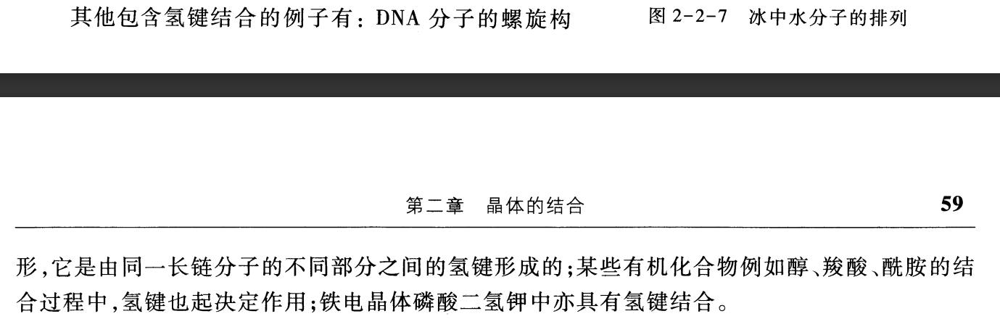
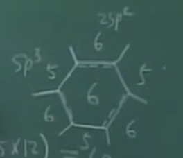

# 第二章：晶体的结合

讨论：

- 什么力使晶体中的原子维系在一起
- 晶体处在基态的能量（结合能）
- 价电子，绝热近似（原子逼近）

## 2.1 原子的负电性

### 1 电离能

基态原子失去一个价电子所需要的能量（对电子的束缚能力）

变化趋势：左下到右上增大

### 2 亲合能

基态中性原子得到一个电子成为负离子释放的的能量（俘获外来电子的能力）

变化趋势：左到右增大，上到下变小。cl最强，Hg最弱。

### 3 负电性

原子组成分子的难弱强度

变化趋势：和亲合能相同。

**三性变化趋势都相同。**

## 2.2 晶体结合的类型

### 1 金属键

- 负电性最小，IA族元素。喜欢密堆fcc/hcc

- 金属内聚力的主要来源：电子退局域（**量子效应**）

- 例子：5个Na原子密堆体现量子效应

**为什么金属具有高导电性、导热性、延展性、金属光泽：** 金属结合的电子共有化

### 2 共价键

负电性较强的元素

- 共价键

**例子：氢分子的基态能量**

$$
\boldsymbol{\Phi}_{\mathrm{I}}(\boldsymbol{r}_{1},\boldsymbol{r}_{2})=c_{1}[ \varphi_{a}(\boldsymbol{r}_{1})\varphi_{b}(\boldsymbol{r}_{2}) + \varphi_{a}(\boldsymbol{r}_{2})\varphi_{b}(\boldsymbol{r}_{1}) ]X_{\mathrm{A}}
$$

$$
\boldsymbol{\Phi}_{\mathrm{II}}(\boldsymbol{r}_{1},\boldsymbol{r}_{2})=c_{2}[ \varphi_{a}(\boldsymbol{r}_{1})\varphi_{b}(\boldsymbol{r}_{2}) -\varphi_{a}(\boldsymbol{r}_{2})\varphi_{b}(\boldsymbol{r}_{1}) ]X_{\mathrm{S}}
$$

实质上是库伦静电作用，是量子效应

饱和性和方向性

- $sp^3$ 杂化

C原子基态电子组：$1s^22s^22p^2$, 一个$2s$被激发到$2p$

$$
\begin{gathered}
\psi_{1} =\frac{1}{2}( \varphi_{_{2s}} + \varphi_{_{2p_{x}}} + \varphi_{_{2p_{y}}} + \varphi_{_{2p_{z}}}) \\
\psi_{2} =\frac{1}{2}( \varphi_{2s} + \varphi_{2p_{x}} - \varphi_{2p_{y}} - \varphi_{2p_{z}}) \\
\psi_{3} =\frac{1}{2}( \varphi_{2s} - \varphi_{2p_{x}} + \varphi_{2p_{y}} - \varphi_{2p_{z}}) \\
\boldsymbol{\psi}_{4} =\frac{1}{2}( \varphi_{_{2s}} - \varphi_{_{2p_{x}}} - \varphi_{_{2p_{y}}} + \varphi_{_{2p_{z}}}) 
\end{gathered}
$$

**为什么共价晶体多是绝缘体/半导体，为什么金刚石硬度高：** 因为共价键是一种强键，成键电子很难被激发而游离。

- 极性共价键

负电性不同的原子结合，电子将靠近负电性大的原子

### 3 离子键

- 两个负电性相差很大的元素结合（如I A和VII A），以经典库伦相互作用结合，排斥能来源于泡利不相容

- 结构一定是NaCl或CsCl结构

### 4.范德瓦尔斯键结合

- 很弱的相互作用（相比前三个）

- 饱和电子结构的原子形成（惰性气体）

- 产生原因：电子的零点运动产生瞬时电偶极矩，邻近原子感生电偶极矩，两极矩关联。

- **模型：谐振子偶极矩关联模拟。**

无关联H：

\[H_0=\frac1{2m}p_1^2+\frac12\beta x_1^2+\frac1{2m}p_2^2+\frac12\beta x_2^2\]

库仑相互作用势：

\[H_1=\frac{e^2}r+\frac{e^2}{r-x_1+x_2}-\frac{e^2}{r+x_2}-\frac{e^2}{r-x_1}=-\frac{2e^2x_1x_2}{r^3}\]

系统总H：

\[H=H_0+H_1\]

简正坐标对角化H，求振动频率

$$
\begin{cases}&x_s = \frac{1}{\sqrt{2}}( x_1 + x_2 ) ,x_a = \frac{1}{\sqrt{2}}( x_1 - x_2 )\\\\&p_s = \frac{1}{\sqrt{2}}( p_1 + p_2 ) ,p_a = \frac{1}{\sqrt{2}}( p_1 - p_2 )\end{cases}
$$

$$
H=\left[\frac{1}{2m}p_s^2+\frac{1}{2}\Big(\beta-\frac{2e^2}{r^3}\Big) x_s^2\right] + \left[\frac{1}{2m}p_a^2 + \frac{1}{2}\Big(\beta + \frac{2e^2}{r^3}\Big) x_a^2\right]
$$

$$
\omega_{s,a}=\left[\left(\beta\mp\frac{2e^2}{r^3}\right)/m\right]^{1/2}\approx\omega_0\left[1\mp\frac12\left(\frac{2e^2}{\beta r^3}\right)-\frac18\left(\frac{2e^2}{\beta r^3}\right)^2+\cdots\right]
$$

结果：

$$
\Delta E(r)=\frac12\hbar(\omega_s+\omega_a)-2\cdot\frac12\hbar\omega_0=-\hbar\omega_0\cdot\frac18{\left(\frac{2e^2}{\beta r^3}\right)}^2=-\frac A{r^6}
$$

讨论：由 $\hbar$ 看出来是一种量子效应

### 5.氢键结合

- 属于弱键

- 存在于冰和有机材料，DNA分子螺旋结构

- **例子：水分子结构**

氧原子 $2s^22p^4$ 构成4个 $sp^3$ 杂化轨道，其中2个与H形成极性共价键，另外两个被O原子的电子占据。

### 6.混合键结合

- C的 $SP^2$ 杂化(这个夹角怎么画？)

$$
\begin{gathered}
\psi_{1} =\frac{1}{\sqrt{3}}( \varphi_{2s} + \sqrt{2} \varphi_{2p_{x}} ) \\
\psi_{2} =\frac1{\sqrt{6}}(\sqrt{2} \varphi_{2s} + \sqrt{3} \varphi_{2p_{y}} - \varphi_{2p_{x}}) \\
\psi_{3} =\frac1{\sqrt{6}}(\sqrt{2}\varphi_{2s}-\sqrt{3}\varphi_{2p_{y}}-\varphi_{2p_{x}}) 
\end{gathered}
$$

**石墨导电性、润滑性的原理：** 每一层内的$p_z$电子形成金属键，层与层之间靠范德瓦尔斯键。面内的电子可自由移动决定了导电性，范德瓦尔斯键弱易于解理决定润滑性。

- $C_{60}$ 分子：20个六边形和12个五边形。

C原子数计算：$N = \frac{1}{3}*(20*6+12*5)$

4个键分配：

- 纳米碳管：由 $sp^2$ 杂化轨道形成的单层石墨卷形成

- 石墨烯：单层石墨

## 2.3 结合能

### 1 定义

- 结合能：原子结合成晶体后释放的能量 $W$
- 内能函数：$U=\text{吸引势能}+\text{排斥势能}$，采用晶体平衡体积和体弹模量作为自变量
- 结合能与内能函数关系： $W=-U(r_0)$

$V_0$关系式：

\[\left.\frac{\mathrm{d}U}{\mathrm{d}V}\right|_{V_0}=0\]

$B$定义式与计算式：

\[B =- V \frac{\mathrm{d}p}{\mathrm{d}V}\]

\[B=V\frac{\mathrm{d}^2U}{\mathrm{d}V^2}\]

- 马德隆常数

### 2 离子晶体 - 以NaCl为例

- 静电吸引势

马德隆常数：

$$
\alpha=-\sum'\frac{(-1)^{n_1+n_2+n_3}}{(n_1^2+n_2^2+n_3^2)^{1/2}}
$$

吸引势：

$$
- \frac1{4\pi\varepsilon_0}\frac{\alpha e^2}r
$$

- 重叠排斥能

量子效应

$$
\frac{6b}{r^n}
$$

b、n由B、r0测量值决定。

- 结合能表达式

内能函数：

$$
U=N\bigg(-\frac1{4\pi\varepsilon_0}\frac{\alpha e^2}r+\frac{6b}{r^n}\bigg) =N\bigg(-\frac{A_1}r +\frac{A_n}{r^n}\bigg)
$$

NaCl关系：

\[V=2Nr^3(2r^3\text{为元胞体积})， dV=6Nr^2\mathrm{d}r\]

关系式1：

$$
\frac{\mathrm{d}U}{\mathrm{d}V}\Bigg|_{V_0}=\frac{\mathrm{d}U}{\mathrm{d}r}\frac{\mathrm{d}r}{\mathrm{d}V}\Bigg|_{r_0}=\frac{1}{6Nr_0^2}\frac{\mathrm{d}U}{\mathrm{d}r}\Bigg|_{r_0}=\frac{N}{6Nr_0^2}\Bigg(\frac{A_1}{r_0^2}-\frac{nA_n}{r_0^{n+1}}\Bigg)=0
$$

$$
\frac{A_n}{A_1}=\frac1nr_0^{n-1}
$$

关系式2：

$$
B = V \frac{\mathrm{d}^2U}{\mathrm{d}V^2}\Bigg|_{V_0}=\frac{1}{18Nr_0} \frac{\mathrm{d}^2U}{\mathrm{d}r^2}\Bigg|_{r_0}=\frac{( n - 1 ) \alpha e^2}{4 \pi\varepsilon_0 18r_0^4}
$$

结合能：

$$
\begin{aligned}
\text{W}& =- U( r_{0} )=\frac{NA_{1}}{r_{0}}\Bigg( 1 - \frac{1}{r_{0}^{n-1}}\frac{A_{n}}{A_{1}}\Bigg) \\
&=\frac1{4\pi\varepsilon_0}\frac{N\alpha e^2}{r_0}\biggl(1-\frac1n\biggr)
\end{aligned}
$$

讨论：结合能主要来自库伦经典能

$r_0，B$ （宏观性质） 和 $n, b$  （微观性质） ，由两个关系式相互确定。

- **例：NaCl结构马德隆常数计算**

### 3 惰性气体晶体

假设：绝对零度 零压力

- 1个原子

经验势：

$$
V(r)=-\frac{A_6}{r^6}+\frac{A_{12}}{r^{12}}
$$

L-J 势：$4\varepsilon\sigma^6=A_6,4\varepsilon\sigma^{12}=A_{12}$

$$
V(r)=4\varepsilon\left[\left(\frac\sigma r\right)^{12}-\left(\frac\sigma r\right)^6\right]
$$

- N个原子

$$
U(r)=\frac12N(4\varepsilon)\left[\sum_j^{\prime}\left(\frac\sigma{P_{0j}r}\right)^{12}-\sum_j^{\prime}\left(\frac\sigma{P_{0j}r}\right)^6\right]
$$

利用关系式1求 $\sigma$：

$$
\frac{\mathrm{d}U}{\mathrm{d}r}\Bigg|_{r_0}=-2N\boldsymbol{\varepsilon}\Big(12\times12.13\frac{\boldsymbol{\sigma}^{12}}{\boldsymbol{r}_0^{13}}-6\times14.45\frac{\boldsymbol{\sigma}^6}{\boldsymbol{r}_0^7}\Big)=0
$$

$$
\frac{r_0}\sigma=1.09
$$

误差：零点振动的排斥能，越轻的原子振动越厉害

- 结合能：

$$
\begin{aligned}W=- U( r_0 )=- 2N\boldsymbol{\varepsilon}\bigg[ 12.13\bigg(\frac{\sigma}{r_0}\bigg)^{ 12} - 14.45\bigg(\frac{\sigma}{r_0}\bigg)^6\bigg]=2.15( 4N\boldsymbol{\varepsilon} )\end{aligned}
$$

$$
B=V\frac{\mathrm{d}^2U}{\mathrm{d}V^2}\Bigg|_{V_0}=\frac{75}{\sigma^3}\varepsilon 
$$

